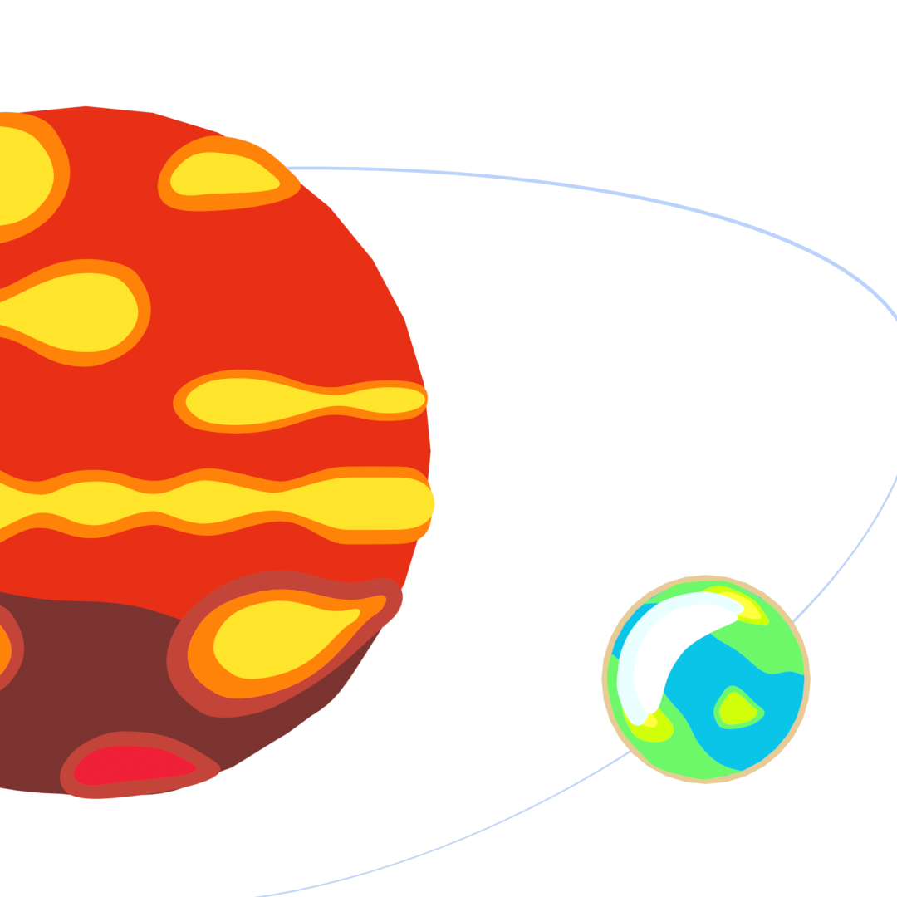
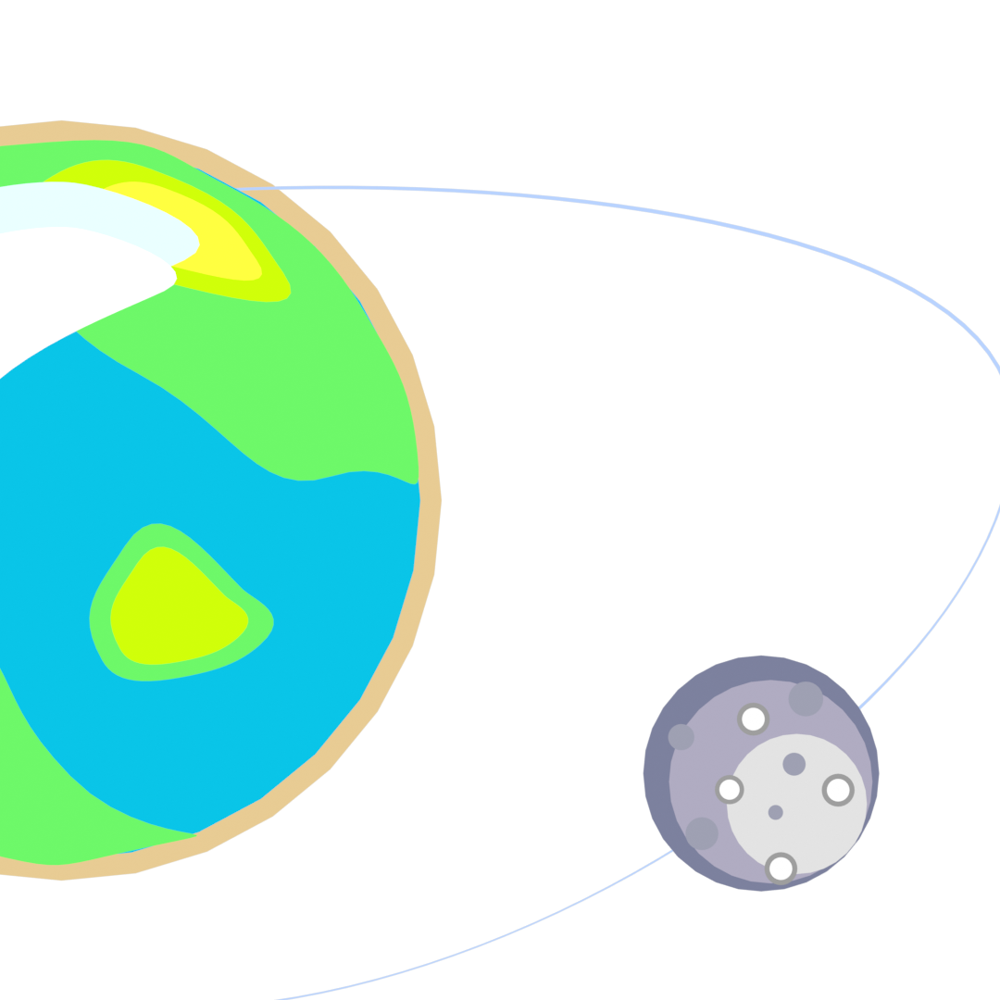

<!-- Resize width here (e.g., 60%, 80%, or fixed pixel width like 500px) -->
<video width="60%" autoplay muted playsinline style="max-width: 600px; height: auto;">
<source src="../assets/orbit/orbit_system.webm" type="video/webm">
Your browser does not support the video tag.
</video>

# Orbital dynamics

This page describes the orbital dynamics included within PROTEUS, how
its config options combine, and how the physics is validated. For the
config field tables themselves, see
[Star and orbit configuration](../Reference/config/star_orbit.md). For the
one-paragraph summaries of each tidal module, see
[Tidal evolution: Obliqua, Lovepy](model.md#tidal-evolution-obliqua-lovepy)
and [Orbital evolution: PROTEUS (internal)](model.md#orbital-evolution-proteus-internal).

## Two independent evolution families

PROTEUS evolves an orbit around exactly one body at a time:

-   

    **Star-planet** 

    Evolve the planet's own orbit around its host star.

    [Star-planet models](#star-planet-models-orbitstar_planet_model){ .md-button .md-button--primary }

-   

    **Planet-satellite**

    Evolve a satellite's orbit around the planet.

    [Planet-satellite models](#planet-satellite-models-orbitplanet_satellite_model){ .md-button .md-button--primary }

These are mutually exclusive (a config error is raised if both are set).
A satellite can still be *tracked* (`orbit.satellite.include_satellite`)
without its own evolution model, in which case its semi-major axis and
eccentricity stay fixed at their configured initial values while the
planet's orbit around the star evolves independently. The reverse also
works: `planet_satellite_model` can evolve the satellite while the
planet-star orbit stays fixed at its initial `semimajoraxis`/`eccentricity`.

## Tidal response modules (`orbit.module`)

The tidal module supplies two things every evolution model needs: a
heating profile to add to the interior's energy equation, and a Love-number 
description of the dissipation (`hf_row['Imk2']` and/or the full mode 
spectrum in `tides_o`).

| Module | What it computes | Assumptions |
|---|---|---|
| `dummy` | A fixed heating rate `H_tide` applied where the local melt fraction satisfies an inequality (`Phi_tide`, e.g. `"<0.3"`); returns a fixed `Imk2`. | No physical rheology; a parameterised heat source for testing the interior's response. |
| `lovepy` | Solid-only viscoelastic (Maxwell) Love number from the topmost region above a viscosity threshold. | Degree-2 only, small eccentricity, spin-orbit synchronisation. |
| `obliqua` | Multi-phase (solid/mushy/fluid) Love-number spectrum from the full interior profile, for arbitrary tidal degree/mode (`orbit.obliqua.n`/`m`) and eccentricity. | The only module that can compute a satellite-side response (see [Satellite Love-number lookup](#satellite-love-number-lookup-obliqua-only) below); requires `orbit.perturber` set explicitly. |

## Star-planet models (`orbit.star_planet_model`)

| Model | Evolves | Reference | Notes |
|---|---|---|---|
| `sp0d` | `semimajorax`, `eccentricity` | Driscoll & Barnes (2015)[^cite-driscoll2015], Eq. 15-16 | Closed-form two-ODE system in `(a, e)` only; no spin dynamics, so it is **not** angular-momentum-conserving by construction. |
| `sp1d` | `axial_period`, `semimajorax`, `eccentricity`, `plan_star_am` | Correia & Valente (2022)[^cite-correia2022] | Vectorial, Hansen-coefficient formulation restricted to planetary tides (star assumed non-dissipative). Genuinely angular-momentum-conserving; verified by dedicated tests. |

Both integrate with `scipy.solve_ivp` (`orbit.solver.*` controls method 
and tolerances). 

## Planet-satellite models (`orbit.planet_satellite_model`)

| Model | Evolves | Reference | Notes |
|---|---|---|---|
| `ps0d` | `semimajorax_sat`, `axial_period` | Korenaga (2023)[^cite-korenaga2023], Eq. 58-60 | No eccentricity evolution, no satellite-side tide. Uses the `M_sat << M_planet` limit of the orbital angular-momentum term (~1.2% error for Earth-Moon). |
| `ps1d` | `axial_period`, `axial_period_sat`, `semimajorax_sat`, `eccentricity_sat`, `plan_sat_am` | Correia & Valente (2022)[^cite-correia2022] | Same vectorial approach as `sp1d`, extended to track both planet-raised and satellite-raised tidal contributions separately. Requires satellite-side Love-numbers (see below). |
| `ps1d_evec` | Everything `ps1d` evolves, plus `evection_angle` | `ps1d` physics plus Rufu & Canup (2020)[^cite-rufu2020] evection-resonance terms | Adds a J2-driven apsidal-precession term and a resonant forcing term. See [Evection resonance](#evection-resonance-ps1d_evec) below. |

!!! warning "Satellite Love-number lookup"
    Both `ps1d` and `ps1d_evec` need the satellite's own Love-number spectrum as a
    function of forcing frequency, which only `orbit.module='obliqua'` can
    supply (via [`LN_from_lookup`](#satellite-love-number-lookup-obliqua-only)).
    Using `ps1d`/`ps1d_evec` unconditionally populates the satellite's tidal
    parameters in `tides_o` through Obliqua's `lookup_from_interior` at the 
    start of the run.

## Compatibility between orbit models and tidal modules

A tidal module makes up to two things available: the scalar
`hf_row['Imk2']`, and/or the full per-mode spectrum in `tides_o`. Which one
an orbit model reads is exactly what its `0d`/`1d` suffix tracks -- a `0d`
model reads the scalar path, a `1d` model reads `tides_o` directly.

**What each tidal module provides:**

| `orbit.module` | `Imk2` | `tides_o` | `hf_row['F_tidal']` |
|---|---|---|---|
| `dummy` | Yes | No | Yes |
| `lovepy` | Yes | Yes | yes |
| `obliqua` | Yes, only when `orbit.obliqua.n == [2]` (`0.0` otherwise) | Yes, planet always, satellite too when `orbit.perturber='satellite'` | yes |

**What each orbit model reads:**

| Model | Reads | Compatible `orbit.module` |
|---|---|---|
| `sp0d` | `hf_row['Imk2']` | `dummy`, `lovepy`, `obliqua` (requires `orbit.obliqua.n == [2]`) |
| `sp1d` | `tides_o`, (`primary='planet', perturber='star'`) | `lovepy`, `obliqua` |
| `ps0d` | `hf_row['F_tidal']` | `dummy`, `lovepy`, `obliqua` |
| `ps1d` | `tides_o`, (both `primary='planet', perturber='satellite'` and `primary='satellite', perturber='planet'`) | `lovepy`, `obliqua` |
| `ps1d_evec` | Same as `ps1d`, plus `evection_angle` | `lovepy`, `obliqua` (Note that `lovepy` breaks down at high eccentricities, so it is not recommended for this case) |

!!! warning "Note on `*1d` models"
    `sp1d`, `ps1d`, and `ps1d_evec` are rejected at config load when
    `orbit.module` is not `'obliqua'` or `'lovepy'`. Prefer
    `orbit.module='obliqua'` for any `*1d` orbit model.

---

### Satellite Love-number lookup (Obliqua only)

Unlike the planet, whose interior structure evolves and is re-queried
every coupling step, the satellite's interior is treated as static for
the lifetime of a run. `orbit.obliqua.lookup_from_interior` builds a full
frequency-spectrum Love-number table once, from a fixed satellite
interior description (`orbit.satellite.love_number_sat`, a JSON initial
condition read by a simplified 0-D solid/fluid Obliqua configuration),
and writes it to a NetCDF file (`sat_tides.nc`). Alternatively, the user
can provide their own pre-computed table (`orbit.satellite.love_number_sat`, 
a NetCDF file), which will be used instead of the one generated by 
`lookup_from_interior`. Every subsequent coupling step, `LN_from_lookup` 
computes the satellite's own forcing frequencies from its current spin and
orbital state and interpolates the satellite's Love numbers from that fixed 
table (linear in frequency, per tidal degree). 

### Evection resonance (`ps1d_evec`)

Evection resonance happens when a moon’s elongated orbit rotates at the 
exact same speed that the central planet orbits its star.; capture into 
it can pump the satellite's eccentricity well above
what tides alone would produce. `ps1d_evec` detects proximity to the
resonance location `a'_res` (Rufu & Canup 2020, Eq. 12) with a debounced,
hysteretic band detector (separate entry/exit margins,
`orbit.solver.resonance_margin_enter`/`resonance_margin_exit`, avoid
chattering at the band edge) and gates only the *oscillating* resonant
forcing term on that detector. The secular apsidal-precession term and
the evection angle's own evolution are always active regardless of
band status. Setting the gate to zero decouples the resonant forcing
term, reducing `ps1d_evec` to plain `ps1d` dynamics.

<!-- Resize width here (e.g., 60%, 80%, or fixed pixel width like 500px) -->
<video width="100%" autoplay loop muted playsinline style="max-width: auto;">
<source src="../assets/orbit/evection_animation.webm" type="video/webm">
Your browser does not support the video tag.
</video>

<b>Example evection-resonance episode.</b> The satellite starts outside
the resonance band, evolving freely; capture into the band locks the
evection angle to the resonant condition and pumps up the eccentricity;
escape from the band later returns the system to free, non-resonant
precession.

While in or near the band, two additional controls apply:

- **Rate cap** (`params.dt.evection_*`): bounds the next PROTEUS coupling
  step so the fractional change in `eccentricity_sat` stays near
  `evection_target_rel_de`, since Obliqua's own adaptive spectrum window
  is chosen once per step from the eccentricity at that step's start.
- **Growth limiter**: caps how fast the step size can grow relative to
  the previous step while inside the band, or for `evection_cooldown_iters`
  iterations after leaving it, so the coupling step does not snap back to
  its ordinary size the instant the band is exited.

Both are folded into the single exported column `evection_dt_cap_yr`,
which `interior_energetics.timestep.next_step` applies as one of several
caps on the next main-loop step.

**Reproducing capture and peak eccentricity** against Rufu & Canup (2020)
Figure 3 is validated in
[`tests/integration/test_slow_orbit_evection_ctl.py`](../../tests/integration/test_slow_orbit_evection_ctl.py)
(`@pytest.mark.slow`): the real `ps1d_evec` model, driven by a Mignard
constant-time-lag tidal spectrum, reproduces the paper's resonance-capture
timing window and peak-eccentricity location to better than 0.1% in
semi-major axis.

### The "three clocks"

Fine-grained diagnostics for `ps1d_evec` (`fine_evection_data.csv`)
distinguish three different notions of "step":

1. **PROTEUS main-loop clock**: one `evolve_orbit_satellite` call per
   coupling iteration, spanning `interior_o.dt` years.
2. **Solver clock**: the adaptive-substep controller's own internal
   `dt_yr` steps within one main-loop call (see below), and, within a
   single substep, `solve_ivp`'s own internal integration points.
3. **Storage clock**: how densely those solver-clock samples are written
   to disk. Every solver-clock sample is kept while inside the evection
   band; outside the band, samples are thinned to a target spacing
   (`orbit.solver.fine_csv_target_rel_dt`, a fraction of the current
   main-loop step) so the file does not grow unbounded over a long,
   quiescent run.

## Hansen coefficients

The `sp1d`/`ps1d`/`ps1d_evec` vectorial tidal models expand the tide-raising
potential in Hansen coefficients `X_k^{n,m}(e)`, evaluated at every ODE
substep. A direct FFT evaluation is too slow for that (implicit solvers
probe many micro-varying eccentricities per step), and nearest-neighbor
caching would introduce discontinuities that break implicit solvers.
[`orbit.hansen`](../../src/proteus/orbit/hansen.py) instead pre-tabulates,
once per run, the eccentricity-dependent mode window `[k_min, k_max]`
(since the number of significant modes grows from ~10 near `e=0` to
several hundred above `e=0.8`) and then the coefficient values themselves
on that window, both linearly interpolated in `e` thereafter. The tables
are warmed up once by `orbit.wrapper.run_orbit` at `Time<=1`; a hot-path
call lazily builds them if warm-up was skipped. 

!!! warning "High eccentricity"
    The underlying Kepler solver does not converge beyond `e~0.90`, hence 
    a warning is issued.

## Adaptive substep controller

`sp1d`, `ps1d`, and `ps1d_evec` all integrate through the same
accept/reject controller,
[`orbit.common.run_adaptive_orbit_substeps`](../../src/proteus/orbit/common.py).
For each attempted internal step it stages the tentative result, checks it 
for unphysical values (negative semi-major axis, eccentricity outside `[0, 1)`, 
non-finite spin) and for excessive relative change in tracked quantities 
(`orbit.solver.max_rel_*`), then either merges it in and grows the step, 
or discards it and shrinks the step (`orbit.solver.growth`/`shrink`). `ps0d` 
bypasses this controller entirely, since it has no tidal stiffness to resolve.

The same call also keeps the planet's moment of inertia (`C_int`, from
[`interior_energetics.common.get_C_planet`](../../src/proteus/interior_energetics/common.py))
consistent with the live interior structure: rather than jumping to the
freshly computed value once per call (which would put a discontinuity in
any quantity that depends on the planet's spin rate, such as `ps1d_evec`'s
oblateness-driven precession), the controller ramps `C_int` linearly
across the call's accepted substeps, rescaling `axial_period` at each one
to conserve `C_int * Omega_p` (angular momentum).

## Termination criteria

Orbital and rotational state feed three physical stopping conditions
(`params.stop.*`, checked in `utils.terminate`):

- **Disintegration** (`params.stop.disint`/`disint_sat`): the planet or
  satellite orbiting within its partner's Roche limit, or spinning faster
  than its breakup rate.
- **Satellite escape** (`params.stop.satellite`): the satellite's
  semi-major axis exceeding `sma_max`.

## Model selection guide

- Want a cheap, non-physical heat source for testing the interior's
  response to tides? `orbit.module = 'dummy'`, no evolution model.
- Want a self-consistent solid-body tidal response with minimal setup,
  spin-orbit synchronised, low eccentricity? `orbit.module = 'lovepy'`.
- Want the planet's orbit and spin to evolve self-consistently with its
  own interior structure, at arbitrary eccentricity? `orbit.module =
  'obliqua'`, `orbit.perturber = 'star'`, `orbit.star_planet_model =
  'sp1d'`.
- Want a fast, closed-form estimate of star-planet tidal circularisation 
  without resolving spin? `orbit.module.dummy` supplying `Imk2` plus 
  `orbit.star_planet_model = 'sp0d'`.
- Want a satellite's orbit (e.g. a moon) to evolve, including its own
  tidal response? `orbit.module = 'obliqua'`, `orbit.perturber =
  'satellite'`, `orbit.planet_satellite_model = 'ps1d'` (or `'ps0d'` for a
  cheaper, eccentricity-frozen estimate).
- Want to also study capture into, and eccentricity pumping by, the 
  evection resonance? `orbit.module = 'obliqua'`, `orbit.perturber =
  'satellite'`, `orbit.planet_satellite_model = 'ps1d_evec'`.

## Testing

- **Unit tests** (`tests/orbit/*.py`, `@pytest.mark.unit`) mock Julia
  calls for `lovepy`/`obliqua` and pin closed-form results for `sp0d`,
  `sp1d`, `ps0d`, `ps1d` against their source papers, each with a
  discrimination guard against the nearest plausible wrong formula (wrong
  exponent, wrong sign, or the wrong mass in a prefactor). Angular
  momentum conservation for `sp1d`/`ps1d` is checked directly, both as a
  raw total and as a targeted spin-vs-orbital exchange test sized to
  catch a bug the raw total alone would miss.
- **Slow/integration tests** (`tests/integration/test_slow_orbit_evection_ctl.py`,
  `@pytest.mark.slow`) drive the real `ps1d_evec` model end-to-end and
  compare against the published Rufu & Canup (2020) evection trajectory.
- Per-source-file test inventories, references, and re-derivations are
  tracked under
  [`docs/Validation/orbit/`](../Validation/orbit/orbit.md): `orbit.py`,
  `satellite.py`, `wrapper.py`, `obliqua.py`.

---

**See also:** [Model description](model.md) | [Star and orbit configuration](../Reference/config/star_orbit.md) | [Execution and output configuration](../Reference/config/params.md) | [Validation: orbit](../Validation/orbit/orbit.md)

 [^cite-driscoll2015]: Driscoll, P. & Barnes, R., *[Tidal Heating of Earth-like Exoplanets around M Stars: Thermal, Magnetic, and Orbital Evolutions](https://doi.org/10.1089/ast.2015.1325)*, Astrobiology, 15, 739, 2015.

 [^cite-correia2022]: Correia, A.C.M. & Valente, E.F.S., *[A simple model to study tides in moons](https://doi.org/10.1007/s10569-022-10079-3)*, Celestial Mechanics and Dynamical Astronomy, 134, 27, 2022.

 [^cite-korenaga2023]: Korenaga, J., *[Rapid tidal dissipation explains the extended lunar magma ocean](https://doi.org/10.1016/j.icarus.2023.115564)*, Icarus, 400, 115564, 2023.

 [^cite-rufu2020]: Rufu, R. & Canup, R.M., *[Evection resonance as a possible cause for lunar inclination](https://doi.org/10.1029/2019JE006312)*, Journal of Geophysical Research: Planets, 125, e2019JE006312, 2020.
