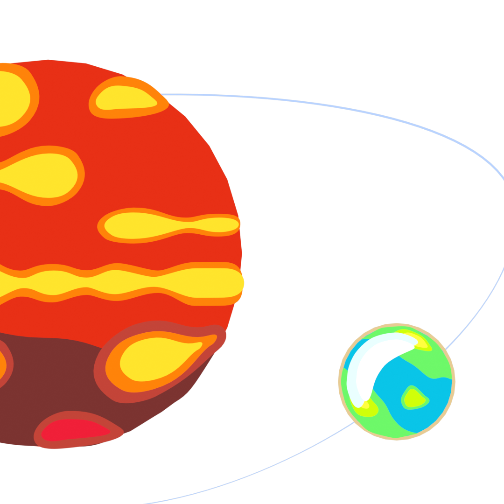
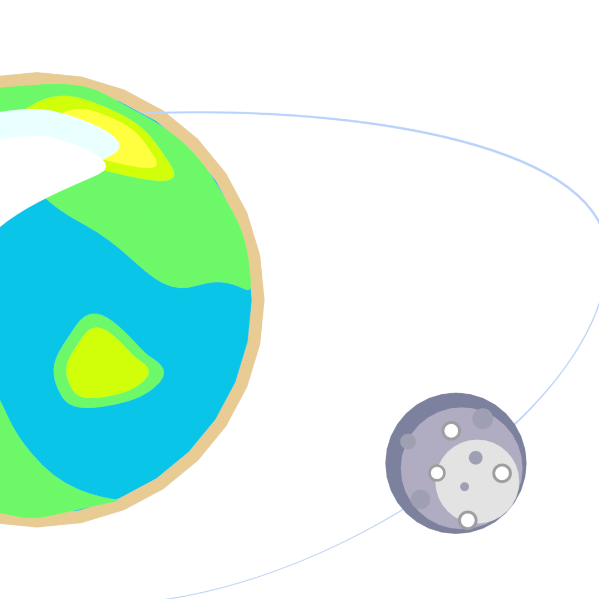

<!-- Resize width here (e.g., 60%, 80%, or fixed pixel width like 500px) -->
<video width="60%" autoplay muted playsinline style="max-width: 600px; height: auto;">
<source src="../assets/orbit/orbit_system.webm" type="video/webm">
Your browser does not support the video tag.
</video>

# Orbital dynamics

This page describes the orbital dynamics included within PROTEUS, how
its config options combine, and how the physics is validated. For the
config field tables themselves, see
[Star and orbit configuration](../Reference/config/star_orbit.md). For the
one-paragraph summaries of each tidal module, see
[Tidal evolution: Obliqua, Lovepy](model.md#tidal-evolution-obliqua-lovepy)
and [Orbital evolution: PROTEUS (internal)](model.md#orbital-evolution-proteus-internal).

## Two independent evolution families

PROTEUS evolves an orbit around exactly one body at a time:

-   

    **Star-planet** 

    Evolve the planet's own orbit around its host star.

    [Star-planet models](#star-planet-models-orbitstar_planet_model){ .md-button .md-button--primary }

-   

    **Planet-satellite**

    Evolve a satellite's orbit around the planet.

    [Planet-satellite models](#planet-satellite-models-orbitplanet_satellite_model){ .md-button .md-button--primary }

These are mutually exclusive (a config error is raised if both are set).
A satellite can still be *tracked* (`orbit.satellite.include_satellite`)
without its own evolution model, in which case its semi-major axis and
eccentricity stay fixed at their configured initial values while the
planet's orbit around the star evolves independently. The reverse also
works: `planet_satellite_model` can evolve the satellite while the
planet-star orbit stays fixed at its initial `semimajoraxis`/`eccentricity`.

## Tidal response modules (`orbit.module`)

The tidal module supplies two things every evolution model needs: a
heating profile to add to the interior's energy equation, and a Love-number 
description of the dissipation (`hf_row['Imk2']` and/or the full mode 
spectrum in `tides_o`).

| Module | What it computes | Assumptions |
|---|---|---|
| `dummy` | A fixed heating rate `H_tide` applied where the local melt fraction satisfies an inequality (`Phi_tide`, e.g. `"<0.3"`); returns a fixed `Imk2`. | No physical rheology; a parameterised heat source for testing the interior's response. |
| `lovepy` | Solid-only viscoelastic (Maxwell) Love number from the topmost region above a viscosity threshold. | Degree-2 only, small eccentricity, spin-orbit synchronisation. |
| `obliqua` | Multi-phase (solid/mushy/fluid) Love-number spectrum from the full interior profile, for arbitrary tidal degree/mode (`orbit.obliqua.n`/`m`) and eccentricity. | The only module that can compute a satellite-side response (see [Satellite Love-number lookup](#satellite-love-number-lookup-obliqua-only) below); requires `orbit.perturber` set explicitly. |

??? note "dummy in a nutshell - van Dijk et al. (2026)[^cite-vandijk2026]"
    Grew out of a study of the Hadean Earth-Moon system, asking how long
    tidal heating could keep a magma ocean from fully solidifying without
    modelling the rheology in detail: heating is simply switched on below
    a melt-fraction threshold and scaled linearly with the remaining
    solid fraction. Sweeping that heating rate reveals quasi-steady
    "global radiative equilibrium" epochs, where interior heating and
    atmospheric cooling balance.

??? note "lovepy in a nutshell - Nicholls et al. (2025)[^cite-nicholls2025lovepy]"
    Solves for the planet's actual viscoelastic (Maxwell) response by
    propagating the tidal deformation through radial layers, rather than
    prescribing a heating rate. Applied to the L 98-59 system, it revealed
    a self-limiting "radiation-tide-rheology" feedback: as tidal heating
    softens the mantle, dissipation efficiency drops too, capping heating
    at levels up to two orders of magnitude below earlier estimates -
    while still being enough to sustain magma oceans for billions of
    years.

??? note "obliqua in a nutshell"
    Obliqua generalises the same viscoelastic idea beyond `lovepy`'s
    single solid layer and low-eccentricity limit: it resolves solid,
    mushy, and fluid regions together, at arbitrary tidal degree, mode,
    and eccentricity. The dummy-module study above hinted at how much
    tidal heating can matter for early evolution, but only for one
    fixed, simplified regime; Obliqua exists to track the tidal response
    self-consistently across the much wider range of thermal and
    orbital states real exoplanets occupy.

!!! warning "Dynamic-tide resonances (Obliqua)"
    Setting `orbit.obliqua.solid.inertial_terms` to `true` solves the full 
    finite-frequency problem instead of the quasi-static ($\omega \to 0$) approximation. 
    When tidal forcing matches a normal-mode frequency of the body, it produces a 
    physically real, bounded peak in the Love number—not a numerical grid artifact.

    * **When they occur:** Only when parts of the mantle are molten or mushy.
    * **Control knob:** Use `params.dt.mushy_maximum` to tighten timesteps during solidification.
    This forces PROTEUS to re-sample Obliqua frequently enough to resolve resonance crossings.
    * **Safety cap:** `orbit.obliqua.cap_LN` clamps each mode's Love number to a fixed multiple 
    of the classical fluid limit for its degree n. This prevents extreme heating spikes while 
    macro-steps are too large to fully resolve the resonance timescale.

## Star-planet models (`orbit.star_planet_model`)

| Model | Evolves | Reference | Notes |
|---|---|---|---|
| `sp0d` | `semimajorax`, `eccentricity`, `axial_period` (locked to the orbital period) | Driscoll & Barnes (2015)[^cite-driscoll2015], Eq. 15-16 | Closed-form two-ODE system in `(a, e)` only; no spin dynamics, so it is **not** angular-momentum-conserving by construction. The spin stays synchronous, so `orbit.axial_period` must be unset. |
| `sp1d` | `axial_period`, `semimajorax`, `eccentricity`, `plan_star_am` | Correia & Valente (2022)[^cite-correia2022] | Vectorial, Hansen-coefficient formulation restricted to planetary tides (star assumed non-dissipative). Genuinely angular-momentum-conserving; verified by dedicated tests. |
| `parameterized` | `semimajorax`, `eccentricity`, `axial_period` (locked to the orbital period), `dEdt_orb` | `high_ecc`: Postolec et al. (2026)[^cite-postolec2026], Eq. 1-4 | Prescribed migration track, not a tidal model: the orbit is a closed-form function of time, no tidal force is computed, and no angular momentum is exchanged with the interior (no tidal heating). Use it to impose a migration history, not to derive one. Giant impacts are rejected (`accretion.module = 'none'` is required). |

??? note "sp0d in a nutshell - Driscoll & Barnes (2015)"
    Written for rocky planets around M dwarfs, where the habitable zone
    sits close enough in that tides matter. Treats the planet as a
    passive, non-rotating "equilibrium tide" bulge dragged slightly
    behind (or ahead of) the star: that lag drains eccentricity and
    trades orbital energy for heat inside the planet. No spin, no
    resonances -- just a slow circularisation clock coupled to whatever
    the interior does with the heat.

??? note "sp1d in a nutshell - Correia & Valente (2022)"
    Instead of one lumped tidal bulge, the tidal potential is decomposed
    into its individual Fourier harmonics (Hansen coefficients), each
    oscillating at its own forcing frequency and dissipating
    independently. This removes the low-eccentricity assumption baked
    into classical tidal theory, and it means spin and orbit are evolved
    together as one system, exchanging angular momentum internally.

`sp0d` and `sp1d` integrate with `scipy.solve_ivp` (`orbit.solver.*` controls
method and tolerances). `parameterized` solves nothing: it updates the semi-major 
axis and eccentricity throughout the simulation based on input parameters chosen
by the user.

??? note "parameterized in a nutshell"
    The other two star-planet models derive the orbit from a tidal
    torque. This parameterized one imposes one instead, and does not compute 
    any physics. The user chooses where the planet starts, where it ends up, 
    when the migration happens and how long it takes. The orbit is evaluated 
    at each time step from that closed form. It is the right tool to use when 
    testing the influence of a migration history in a simulation without 
    computing any tidal forces, for instance when asking how an atmosphere 
    responds to a prescribed change in instellation.

Configured under `[orbit.parameterized]`:

| Key | Meaning | Unit |
|---|---|---|
| `migration` | `none`, `instant`, `sigmoid` or `high_ecc` | -- |
| `sma_final` | semi-major axis approached after it | au |
| `time_migration` | epoch at which migration begins | yr |
| `tau_migration` | length of the migration window for `sigmoid`, decay constant for `high_ecc` | yr |

The track starts from `a_0 = orbit.semimajoraxis` and `orbit.eccentricity`,
which seed the orbit at the initial condition as for every other star-planet
model; the track is evaluated from the first step after it. Setting the orbit
from a target flux (`orbit.instellation_method = 'inst'`) is rejected at
config load, since it would give the run a second starting orbit.

A law writes only the orbital elements it sets: `instant` and `sigmoid` the
semi-major axis, `high_ecc` both elements. `none`, and every law before
`time_migration`, leave the orbit as the previous step left it. Only
`high_ecc` evolves the eccentricity, so under the other laws it keeps the
value seeded from `orbit.eccentricity`.

`sigmoid` holds the orbit until `time_migration`, carries it to `sma_final`
over the following `tau_migration` along the cubic `3u^2 - 2u^3`, and holds
it there afterwards.

`high_ecc` circularises at constant orbital angular momentum (Postolec et al. 2026)[^cite-postolec2026]: it excites the
eccentricity to `sqrt(1 - sma_final / a_0)` at the migration epoch and
then decays it, until the orbit reaches `sma_final`. The eccentricity jumps discontinuously at
`time_migration` from `orbit.eccentricity` to its excited value. That step is
physical, since a scattering or Kozai event is fast compared with the orbital
evolution that follows.

The migration window must also be resolved by the timestep. `sigmoid` and
`high_ecc` are sampled wherever the coupled loop happens to step, and nothing
aligns a step to `time_migration`. If `tau_migration` spans fewer than three
timesteps the track is sampled at little more than its endpoints and silently
degenerates to `instant`; the orbit module logs a warning when that happens.

### Spin, stellar flux and impacts on a prescribed track

No torque acts on the spin, so the planet stays synchronous: `axial_period`
is set to the current orbital period at every step, and AGNI and the breakup
check read that value. `orbit.axial_period` must be unset, for `sp0d` as well,
which evolves no spin either.

On an eccentric orbit the stellar flux is averaged over the orbit as
`<1/r^2> = 1 / (a^2 sqrt(1 - e^2))`, which is the flux at the distance
`a (1 - e^2)^(1/4)`. Every module that scales a flux by distance uses that
distance: the bolometric and XUV instellation, the stored stellar spectrum,
the eclipse depth, VULCAN's `star.dat` and `orbit_radius`, and the
stellar-surface flux petitRADTRANS recovers from the stored spectrum.
F_ins is refreshed every `params.dt.starinst` and the stored spectrum every
`params.dt.starspec`. While the orbit evolves, petitRADTRANS and VULCAN undo
the latest stored spectrum at the current distance, so their stellar flux is
off by the square of the ratio of the current distance to the one the file
was written at. AGNI is not affected: it takes only the spectral shape from
the file and its heating from F_ins.
The time-averaged separation `a (1 + e^2 / 2)` stays in use for geometry
only (the Roche-limit checks and the orbit plots). This applies to every
eccentric run, not only to `parameterized`.

Giant impacts are rejected at config load (`accretion.module = 'none'` is
required): after `time_migration` the track sets the semi-major axis from
its own parameters every step, so an impact's new semi-major axis would be
overwritten while its change in eccentricity persisted.

### Where the orbital energy goes

The track changes the orbital energy `E = -G M_star M_planet / (2 a)` but
deposits that energy nowhere: no tidal heating reaches the interior and the
energy balance of the planet does not include it. The helpfile column
`dEdt_orb` \[W\] records the rate the track implies,
`dE/dt = G M_star M_planet (da/dt) / (2 a^2)`, negative while the orbit
shrinks. It is zero for `none`, outside the migration window and for
`instant`, whose step releases its energy at a single time.

For `high_ecc` the rate is largest in magnitude at `time_migration`, where
it equals `2 dE / tau_migration`, with `dE = E(sma_final) - E(a_0) =
-(G M_star M_planet / 2) (1/sma_final - 1/a_0)` the whole energy change
(negative for inward migration), and it then decays as
`exp(-2 (t - time_migration) / tau_migration)`. The eccentricity step at
`time_migration` changes the orbital angular momentum instantly while
leaving the energy unchanged, since `a` is still `a_0` there.

For the TOI-561 b setup in `input/planets/toi561b.toml` (0.806 M_sun,
2.24 M_earth, 0.029 to 0.0106 au) the orbit loses 2.9e35 J (`dE = -2.9e35 J`).
With `tau_migration = 1e7` yr the rate at onset is `-1.8e21 W`. At that epoch the
star (age 0.101 Gyr, about 0.28 L_sun) delivers about `1.7e20 W` to the
planet's cross-section at the flux-weighted distance of 0.0226 au, so the
dropped power is about ten times the instellation in magnitude, and it scales as
`1 / tau_migration`: comparable to the instellation at `tau_migration = 1e8`
yr, a hundred times it at `1e6` yr. A tidal model following the same track
would have to dissipate this power in the planet. Results that depend on
the interior temperature during circularisation should be read with that in
mind.

### Visualizing the four parameterized regimes

Each regime was run as a dummy PROTEUS simulation and compared against the
closed form in `src/proteus/orbit/parameterized.py`:

{ width="100%" }
{ width="100%" }

Semi-major axis (top) and eccentricity (bottom) for the four regimes, with
`orbit.semimajoraxis = 2.0` au, `sma_final = 0.8` au, `time_migration = 1e3` yr and
`tau_migration = 1e4` yr. The dashed vertical line marks the migration epoch
and the shaded band spans one `tau_migration` after it. The dotted horizontal
lines in the top panel mark the starting and final orbits, `a_0 = orbit.semimajoraxis`
and `a_f = sma_final`.

## Planet-satellite models (`orbit.planet_satellite_model`)

| Model | Evolves | Reference | Notes |
|---|---|---|---|
| `ps0d` | `semimajorax_sat`, `axial_period` | Korenaga (2023)[^cite-korenaga2023], Eq. 58-60 | No eccentricity evolution, no satellite-side tide. Uses the `M_sat << M_planet` limit of the orbital angular-momentum term (~1.2% error for Earth-Moon). |
| `ps1d` | `axial_period`, `axial_period_sat`, `semimajorax_sat`, `eccentricity_sat`, `plan_sat_am` | Correia & Valente (2022)[^cite-correia2022] | Same vectorial approach as `sp1d`, extended to track both planet-raised and satellite-raised tidal contributions separately. Requires satellite-side Love-numbers (see below). |
| `ps1d_evec` | Everything `ps1d` evolves, plus `evection_angle` | `ps1d` physics plus Rufu & Canup (2020)[^cite-rufu2020] evection-resonance terms | Adds a J2-driven apsidal-precession term and a resonant forcing term. See [Evection resonance](#evection-resonance-ps1d_evec) below. |

??? note "ps0d in a nutshell - Korenaga (2023)"
    Built to explain why the Moon's magma ocean stayed molten for so
    long: rather than solving the tidal potential in detail, it tracks
    one number, the system's total (spin + orbital) angular momentum,
    and lets the planet's tidal dissipation rate spend it. As the
    planet's spin winds down, the satellite's orbit must expand to keep
    the ledger balanced - a bookkeeping model, not a torque model, so
    it is cheap and exactly momentum-conserving, at the cost of no
    eccentricity evolution.

??? note "ps1d in a nutshell - Correia & Valente (2022)"
    The same Hansen-coefficient decomposition as `sp1d`, but with two
    dissipating bodies instead of one: both the planet's and the
    satellite's tidal responses pull on the shared orbit, so each of
    their spins, the semi-major axis, and the eccentricity all evolve
    together, coupled through one exchange of angular momentum.

??? note "ps1d_evec in a nutshell - Rufu & Canup (2020)"
    As a tidally-receding moon's orbit expands, its slow apsidal
    precession can fall into step with the star's apparent yearly
    motion - a secular resonance. Falling into that resonance is like
    pushing a swing at just the right moment: it pumps up the moon's
    eccentricity long after ordinary tides alone would have damped it
    flat, which is the paper's proposed route to the Moon's present-day
    orbital tilt.

!!! warning "Satellite Love-number lookup"
    Both `ps1d` and `ps1d_evec` need the satellite's own Love-number spectrum as a
    function of forcing frequency, which only `orbit.module='obliqua'` can
    supply (via [`LN_from_lookup`](#satellite-love-number-lookup-obliqua-only)).
    Using `ps1d`/`ps1d_evec` unconditionally populates the satellite's tidal
    parameters in `tides_o` through Obliqua's `lookup_from_interior` at the 
    start of the run.

## Compatibility between orbit models and tidal modules

A tidal module makes up to two things available: the scalar
`hf_row['Imk2']`, and/or the full per-mode spectrum in `tides_o`. Which one
an orbit model reads is exactly what its `0d`/`1d` suffix tracks -- a `0d`
model reads the scalar path, a `1d` model reads `tides_o` directly.

**What each tidal module provides:**

| `orbit.module` | `Imk2` | `tides_o` | `hf_row['F_tidal']` |
|---|---|---|---|
| `dummy` | Yes | No | Yes |
| `lovepy` | Yes | Yes | yes |
| `obliqua` | Yes, only when `orbit.obliqua.n == [2]` (`0.0` otherwise) | Yes, planet always, satellite too when `orbit.perturber='satellite'` | yes |

**What each orbit model reads:**

| Model | Reads | Compatible `orbit.module` |
|---|---|---|
| `sp0d` | `hf_row['Imk2']` | `dummy`, `lovepy`, `obliqua` (requires `orbit.obliqua.n == [2]`) |
| `sp1d` | `tides_o`, (`primary='planet', perturber='star'`) | `lovepy`, `obliqua` |
| `parameterized` | -- | none (`orbit.module = 'none'` is required) |
| `ps0d` | `hf_row['F_tidal']` | `dummy`, `lovepy`, `obliqua` |
| `ps1d` | `tides_o`, (both `primary='planet', perturber='satellite'` and `primary='satellite', perturber='planet'`) | `lovepy`, `obliqua` |
| `ps1d_evec` | Same as `ps1d`, plus `evection_angle` | `lovepy`, `obliqua` (Note that `lovepy` breaks down at high eccentricities, so it is not recommended for this case) |

!!! warning "Note on `*1d` models"
    `sp1d`, `ps1d`, and `ps1d_evec` are rejected at config load when
    `orbit.module` is not `'obliqua'` or `'lovepy'`. Prefer
    `orbit.module='obliqua'` for any `*1d` orbit model.

---

### Satellite Love-number lookup (Obliqua only)

Unlike the planet, whose interior structure evolves and is re-queried
every coupling step, the satellite's interior is treated as static for
the lifetime of a run. `orbit.obliqua.lookup_from_interior` builds a full
frequency-spectrum Love-number table once, from a fixed satellite
interior description (`orbit.satellite.love_number_sat`, a JSON initial
condition read by a simplified 0-D solid/fluid Obliqua configuration),
and writes it to a NetCDF file (`sat_tides.nc`). Alternatively, the user
can provide their own pre-computed table (`orbit.satellite.love_number_sat`, 
a NetCDF file), which will be used instead of the one generated by 
`lookup_from_interior`. Every subsequent coupling step, `LN_from_lookup` 
computes the satellite's own forcing frequencies from its current spin and
orbital state and interpolates the satellite's Love numbers from that fixed 
table (linear in frequency, per tidal degree). 

### Evection resonance (`ps1d_evec`)

Evection resonance happens when a moon’s elongated orbit rotates at the 
exact same speed that the central planet orbits its star.; capture into 
it can pump the satellite's eccentricity well above
what tides alone would produce. `ps1d_evec` detects proximity to the
resonance location `a'_res` (Rufu & Canup 2020, Eq. 12) with a debounced,
hysteretic band detector (separate entry/exit margins,
`orbit.solver.resonance_margin_enter`/`resonance_margin_exit`, avoid
chattering at the band edge) and gates only the *oscillating* resonant
forcing term on that detector. The secular apsidal-precession term and
the evection angle's own evolution are always active regardless of
band status. Setting the gate to zero decouples the resonant forcing
term, reducing `ps1d_evec` to plain `ps1d` dynamics.

<!-- Resize width here (e.g., 60%, 80%, or fixed pixel width like 500px) -->
<video width="100%" autoplay loop muted playsinline style="max-width: auto;">
<source src="../assets/orbit/evection_animation.webm" type="video/webm">
Your browser does not support the video tag.
</video>

<b>Example evection-resonance episode.</b> The satellite starts outside
the resonance band, evolving freely; capture into the band locks the
evection angle to the resonant condition and pumps up the eccentricity;
escape from the band later returns the system to free, non-resonant
precession.

While in or near the band, two additional controls apply:

- **Rate cap** (`params.dt.evection_*`): bounds the next PROTEUS coupling
  step so the fractional change in `eccentricity_sat` stays near
  `evection_target_rel_de`, since Obliqua's own adaptive spectrum window
  is chosen once per step from the eccentricity at that step's start.
- **Growth limiter**: caps how fast the step size can grow relative to
  the previous step while inside the band, or for `evection_cooldown_iters`
  iterations after leaving it, so the coupling step does not snap back to
  its ordinary size the instant the band is exited.

Both are folded into the single exported column `evection_dt_cap_yr`,
which `interior_energetics.timestep.next_step` applies as one of several
caps on the next main-loop step.

**Reproducing capture and peak eccentricity** against Rufu & Canup (2020)
Figure 3 is validated in
[`tests/integration/test_slow_orbit_evection_ctl.py`](../../tests/integration/test_slow_orbit_evection_ctl.py)
(`@pytest.mark.slow`): the real `ps1d_evec` model, driven by a Mignard
constant-time-lag tidal spectrum, reproduces the paper's resonance-capture
timing window and peak-eccentricity location to better than 0.1% in
semi-major axis.

### The "three clocks"

Fine-grained diagnostics for `ps1d_evec` (`fine_evection_data.csv`)
distinguish three different notions of "step":

1. **PROTEUS main-loop clock**: one `evolve_orbit_satellite` call per
   coupling iteration, spanning `interior_o.dt` years.
2. **Solver clock**: the adaptive-substep controller's own internal
   `dt_yr` steps within one main-loop call (see below), and, within a
   single substep, `solve_ivp`'s own internal integration points.
3. **Storage clock**: how densely those solver-clock samples are written
   to disk. Every solver-clock sample is kept while inside the evection
   band; outside the band, samples are thinned to a target spacing
   (`orbit.solver.fine_csv_target_rel_dt`, a fraction of the current
   main-loop step) so the file does not grow unbounded over a long,
   quiescent run.

## Hansen coefficients

The `sp1d`/`ps1d`/`ps1d_evec` vectorial tidal models expand the tide-raising
potential in Hansen coefficients `X_k^{n,m}(e)`, evaluated at every ODE
substep. A direct FFT evaluation is too slow for that (implicit solvers
probe many micro-varying eccentricities per step), and nearest-neighbor
caching would introduce discontinuities that break implicit solvers.
[`orbit.hansen`](../../src/proteus/orbit/hansen.py) instead pre-tabulates,
once per run, the eccentricity-dependent mode window `[k_min, k_max]`
(since the number of significant modes grows from ~10 near `e=0` to
several hundred above `e=0.8`) and then the coefficient values themselves
on that window, both linearly interpolated in `e` thereafter. The tables
are warmed up once by `orbit.wrapper.run_orbit` at `Time<=1`; a hot-path
call lazily builds them if warm-up was skipped. 

!!! warning "High eccentricity"
    The underlying Kepler solver does not converge beyond `e~0.90`, hence 
    a warning is issued.

## Adaptive substep controller

`sp1d`, `ps0d`, `ps1d`, and `ps1d_evec` all integrate through the same
accept/reject controller,
[`orbit.common.run_adaptive_orbit_substeps`](../../src/proteus/orbit/common.py).
For each attempted internal step it stages the tentative result, checks it 
for unphysical values (negative semi-major axis, eccentricity outside `[0, 1)`, 
non-finite spin) and for excessive relative change in tracked quantities 
(`orbit.solver.max_rel_*`), then either merges it in and grows the step, 
or discards it and shrinks the step (`orbit.solver.growth`/`shrink`).

The same call also keeps the planet's moment of inertia (`C_int`, from
[`interior_energetics.common.get_C_planet`](../../src/proteus/interior_energetics/common.py))
consistent with the live interior structure: rather than jumping to the
freshly computed value once per call (which would put a discontinuity in
any quantity that depends on the planet's spin rate, such as `ps1d_evec`'s
oblateness-driven precession), the controller ramps `C_int` linearly
across the call's accepted substeps, rescaling `axial_period` at each one
to conserve `C_int * Omega_p` (angular momentum).

`ps0d` additionally gets a **cumulative drift cap**: `ps0d` has no
eccentricity or spin feedback of its own, so many small, individually-legal
substeps can compound into a large silent migration within a single call.

## Termination criteria

Orbital and rotational state feed three physical stopping conditions
(`params.stop.*`, checked in `utils.terminate`):

- **Disintegration** (`params.stop.disint`/`disint_sat`): the planet or
  satellite orbiting within its partner's Roche limit, or spinning faster
  than its breakup rate.
- **Satellite escape** (`params.stop.satellite`): the satellite's
  semi-major axis exceeding `sma_max`.

## Model selection guide

- Want a cheap, non-physical heat source for testing the interior's
  response to tides? `orbit.module = 'dummy'`, no evolution model.
- Want a self-consistent solid-body tidal response with minimal setup,
  spin-orbit synchronised, low eccentricity? `orbit.module = 'lovepy'`.
- Want the planet's orbit and spin to evolve self-consistently with its
  own interior structure, at arbitrary eccentricity? `orbit.module =
  'obliqua'`, `orbit.perturber = 'star'`, `orbit.star_planet_model =
  'sp1d'`.
- Want a fast, closed-form estimate of star-planet tidal circularisation 
  without resolving spin? `orbit.module.dummy` supplying `Imk2` plus 
  `orbit.star_planet_model = 'sp0d'`.
- Want a satellite's orbit (e.g. a moon) to evolve, including its own
  tidal response? `orbit.module = 'obliqua'`, `orbit.perturber =
  'satellite'`, `orbit.planet_satellite_model = 'ps1d'` (or `'ps0d'` for a
  cheaper, eccentricity-frozen estimate).
- Want to also study capture into, and eccentricity pumping by, the 
  evection resonance? `orbit.module = 'obliqua'`, `orbit.perturber =
  'satellite'`, `orbit.planet_satellite_model = 'ps1d_evec'`.

## Testing

- **Unit tests** (`tests/orbit/*.py`, `@pytest.mark.unit`) mock Julia
  calls for `lovepy`/`obliqua` and pin closed-form results for `sp0d`,
  `sp1d`, `ps0d`, `ps1d` against their source papers, each with a
  discrimination guard against the nearest plausible wrong formula (wrong
  exponent, wrong sign, or the wrong mass in a prefactor). Angular
  momentum conservation for `sp1d`/`ps1d` is checked directly, both as a
  raw total and as a targeted spin-vs-orbital exchange test sized to
  catch a bug the raw total alone would miss.
- **Slow/integration tests** (`tests/integration/test_slow_orbit_evection_ctl.py`,
  `@pytest.mark.slow`) drive the real `ps1d_evec` model end-to-end and
  compare against the published Rufu & Canup (2020) evection trajectory.
- Per-source-file test inventories, references, and re-derivations are
  tracked under
  [`docs/Validation/orbit/`](../Validation/orbit/orbit.md): `orbit.py`,
  `satellite.py`, `wrapper.py`, `obliqua.py`.

---

**See also:** [Model description](model.md) | [Star and orbit configuration](../Reference/config/star_orbit.md) | [Execution and output configuration](../Reference/config/params.md) | [Validation: orbit](../Validation/orbit/orbit.md)

 [^cite-vandijk2026]: van Dijk, M.R., Nicholls, H. & Lichtenberg, T., *[Onset of Habitable Conditions on the Hadean Earth Set by Feedback between Tides and Greenhouse Forcing](https://doi.org/10.3847/PSJ/ae5928)*, The Planetary Science Journal, 7, 94, 2026.

 [^cite-nicholls2025lovepy]: Nicholls, H., Guimond, C.M., Hay, H.C.F.C., Chatterjee, R.D., Lichtenberg, T. & Pierrehumbert, R.T., *[Self-limited tidal heating and prolonged magma oceans in the L 98-59 system](https://doi.org/10.1093/mnras/staf1167)*, Monthly Notices of the Royal Astronomical Society, 541, 2566-2584, 2025.

 [^cite-driscoll2015]: Driscoll, P. & Barnes, R., *[Tidal Heating of Earth-like Exoplanets around M Stars: Thermal, Magnetic, and Orbital Evolutions](https://doi.org/10.1089/ast.2015.1325)*, Astrobiology, 15, 739, 2015.

 [^cite-correia2022]: Correia, A.C.M. & Valente, E.F.S., *[A simple model to study tides in moons](https://doi.org/10.1007/s10569-022-10079-3)*, Celestial Mechanics and Dynamical Astronomy, 134, 27, 2022.

 [^cite-korenaga2023]: Korenaga, J., *[Rapid tidal dissipation explains the extended lunar magma ocean](https://doi.org/10.1016/j.icarus.2023.115564)*, Icarus, 400, 115564, 2023.

 [^cite-rufu2020]: Rufu, R. & Canup, R.M., *[Evection resonance as a possible cause for lunar inclination](https://doi.org/10.1029/2019JE006312)*, Journal of Geophysical Research: Planets, 125, e2019JE006312, 2020.

[^cite-postolec2026]: Postolec, E., Lichtenberg, T., Teske, J.K., Nicholls, H., Attia, M., Piette, A., Dang, L., Wallack, N.L., Plotnykov, M., McGinty, A., Boucher, S., Peng, B. & Valencia, D., *[Evolutionary pathways toward survival of a thick CO2- or SO2-rich atmosphere on the lava world TOI-561 b](https://doi.org/10.48550/arXiv.2609.03144)*, submitted to The Astrophysical Journal, arXiv:2609.03144, 2026.
