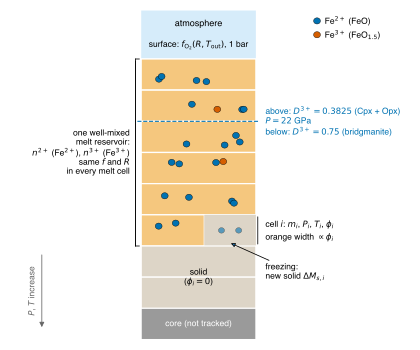
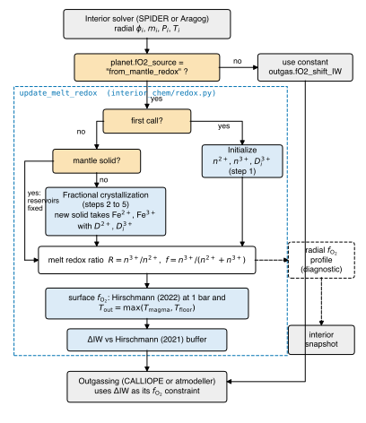
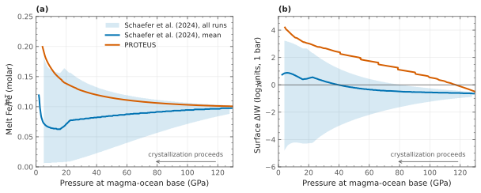

# Mantle redox evolution

This page describes how PROTEUS tracks the redox state of a crystallizing magma ocean and uses it to set the oxygen fugacity ($f_{\rm O_2}$) of outgassing.

The implementation is in `src/proteus/interior_chem/redox.py`.

See [Planet configuration](../Reference/config/planet.md) for configuration fields and [Output reference](../Reference/output.md) for output columns.

## Why track the redox state

With the default `planet.fO2_source = "user_constant"`, outgassing uses a fixed oxygen-fugacity offset from the iron-wüstite (IW) buffer:

`outgas.fO2_shift_IW`.

In a crystallizing magma ocean, this offset can evolve. Fe$^{3+}$ and Fe$^{2+}$ partition differently between the melt and newly formed crystals, changing the Fe$^{3+}$/Fe$^{2+}$ ratio of the remaining melt and therefore its $f_{\rm O_2}$.

Setting `planet.fO2_source = "from_mantle_redox"` enables this calculation. PROTEUS then derives the outgassing $f_{\rm O_2}$ from the tracked Fe$^{3+}$/Fe$^{2+}$ ratio at every coupling step.

!!! info "Physical picture"

    As the magma ocean freezes, each new crystal removes some iron from the melt. Crystals take up Fe$^{2+}$ more readily than Fe$^{3+}$, so the shrinking melt is left progressively richer in ferric iron.

    The tracker follows this in two steps:

    1. **In the interior,** it follows how crystallization changes the melt Fe$^{3+}$/Fe$^{2+}$ ratio.
    2. **At the surface,** it converts that ratio into an oxygen fugacity through the equilibrium FeO + ¼O$_2$ ⇌ FeO$_{1.5}$.

    The result is a single number for the outgassing code: the offset $\Delta$IW of the surface $f_{\rm O_2}$ from the iron-wüstite buffer.

<figure markdown="span">
  { width="640" }
  <figcaption>Model domain as seen by the redox tracker (schematic; cell count and the depth of the 22 GPa line are illustrative). The interior module supplies the mass, pressure, temperature and melt fraction of each cell. The iron in the melt is held in two global reservoirs, shared by all melt cells in proportion to their melt mass. Solid formed in a cell removes iron with the partition coefficient of that cell's depth. The surface oxygen fugacity is computed from the melt redox ratio.</figcaption>
</figure>

!!! note "Approach based on Schaefer et al. (2024)[^cite-schaefer2024]"

    Schaefer, Pahlevan and Elkins-Tanton track Fe$^{3+}$ and Fe$^{2+}$ during fractional crystallization using mineral/melt partition coefficients. They then convert the melt ferric/ferrous ratio to surface $f_{\rm O_2}$ using Hirschmann (2022)[^cite-hirschmann2022].

    Because Fe$^{2+}$ is generally more compatible than Fe$^{3+}$, crystallization preferentially removes Fe$^{2+}$ and the remaining melt becomes more oxidized. The magnitude of this effect depends strongly on the poorly constrained Fe$^{3+}$ partitioning into lower-mantle minerals, especially bridgmanite.

    PROTEUS follows this approach with the simplifications listed in [Assumptions and limitations](#assumptions-and-limitations).

## Configuration

| Key | Meaning | Default |
|---|---|---|
| `planet.fO2_source` | Set to `"from_mantle_redox"` to enable the tracker. Other values disable it. | `"user_constant"` |
| `planet.ferric_fraction_initial` | Initial melt Fe$^{3+}$/Fe$_{\rm T}$, $f_0$, in the interval $(0,1)$. | `0.1` |
| `planet.metal_saturation` | Must be `false` for this model. | `false` |

The tracker needs a melt fraction for every radial cell, so `interior_energetics.module` must be `spider` or `aragog`.

The default $f_0=0.1$ is the nominal Earth value from Schaefer et al. (2024). Hirschmann (2022) estimates Fe$^{3+}$/Fe$_{\rm T}=0.034$-$0.10$ for the Earth's magma ocean at core formation.

## Model workflow

The tracker runs once per coupling step inside `run_interior`, after the interior module provides the radial profiles:

- melt fraction $\phi_i$,
- cell mass $m_i$,
- pressure $P_i$,
- temperature $T_i$.

It carries three pieces of state between steps:

- total melt Fe$^{2+}$, $n^{2+}$,
- total melt Fe$^{3+}$, $n^{3+}$,
- previous-step melt fraction in each cell, $\phi_i^{\rm prev}$.

!!! abstract "Algorithm: one call of `update_melt_redox`"

    1. If `planet.fO2_source` is not `"from_mantle_redox"`, return.
    2. Read $\phi_i$, $m_i$, $P_i$ and $T_i$ from the interior module.
    3. **First call:** initialize $n^{2+}$, $n^{3+}$, $f=f_0$ and the per-cell $D_i^{3+}$ ([step 1](#1-initialize-the-iron-inventory)). Go to 6.
    4. **Later calls, if the mantle is not yet flagged solid:**
        1. Compute the newly formed solid $\Delta M_{s,i}$ from the decrease in $\phi_i$ ([step 2](#2-determine-newly-formed-solid)).
        2. If $M_{\rm melt}^{\rm prev}=0$, flag the mantle as solid and keep $f$ fixed. Otherwise:
            1. Compute the uniform melt concentrations $C^{2+}$ and $C^{3+}$ ([step 3](#3-assume-a-homogeneous-melt)).
            2. Remove $\Delta n^{2+}$ and $\Delta n^{3+}$ into the new solid ([step 4](#4-partition-iron-into-the-new-solid)).
            3. Update $n^{2+}$, $n^{3+}$, $f$ and $R$ ([step 5](#5-update-the-reservoirs-and-redox-ratio)).
    5. **Every later call:** set $\phi_i^{\rm prev}\leftarrow\phi_i$.
    6. Evaluate the radial $\log_{10}f_{\rm O_2}$ profile at each melt cell's $T_i$ and 1 bar, and store the index of the uppermost melt cell (diagnostic only).
    7. Set $T_{\rm out}=\max(T_{\rm magma},T_{\rm floor})$. Evaluate the surface $f_{\rm O_2}$ from $R$ at $T_{\rm out}$ and 1 bar, then $\Delta{\rm IW}$ relative to the Hirschmann (2021) buffer.
    8. Write `ferric_frac_mantle` and `fO2_shift_IW_mantle` to the helpfile. CALLIOPE or atmodeller then uses $\Delta{\rm IW}$ as the outgassing $f_{\rm O_2}$ constraint.

<figure markdown="span">
  { width="560" }
  <figcaption>Position of update_melt_redox in one PROTEUS coupling step. Orange boxes are tests on the tracker state; blue boxes are the computational steps described below. The radial profile (dashed) is a diagnostic: it is stored in the interior snapshot and does not feed the outgassing.</figcaption>
</figure>

### 1. Initialize the iron inventory

At the first call, the whole melt gets a uniform composition: a fixed mass fraction of FeO, plus enough FeO$_{1.5}$ that a fraction $f_0$ of the iron is ferric. These two numbers become the global iron reservoirs that every later step modifies.

On the first call, the total melt mass is

$$
M_{\rm melt}=\sum_i \phi_i m_i.
$$

The iron reservoirs are initialized as

$$
n^{2+}=\frac{w_{\rm FeO}M_{\rm melt}}{\mu_{\rm FeO}},
\qquad
n^{3+}=n^{2+}\frac{f_0}{1-f_0},
$$

where

- $w_{\rm FeO}=0.08$ is the FeO mass fraction,
- $\mu_{\rm FeO}=71.84$ g mol$^{-1}$,
- $f_0$ is `planet.ferric_fraction_initial`.

Fe$^{3+}$ is added on top of the ferrous inventory, so

$$
\frac{n^{3+}}{n^{2+}+n^{3+}}=f_0.
$$

The adopted $w_{\rm FeO}$ is the rounded bulk-silicate-Earth value from Schaefer et al. (2024) Table 1 (7.82 wt%).

On a single-cation basis, one mole of Fe$^{2+}$ is one mole of FeO units and one mole of Fe$^{3+}$ is one mole of FeO$_{1.5}$ units. So $n^{2+}$ and $n^{3+}$ count both iron ions and oxide units.

The per-cell Fe$^{3+}$ partition coefficient $D_i^{3+}$ (step 4) is also fixed at this call, from the pressure profile of the first step.

### 2. Determine newly formed solid

Steps 2 to 5 run on every later call until the mantle has fully solidified. They are an explicit, step-by-step form of fractional crystallization: crystals that form are removed from contact with the melt and never re-equilibrate with it.

The interior grid keeps each cell's mass $m_i$ fixed in time. The melt mass in a cell was therefore $\phi_i^{\rm prev}m_i$ at the previous call and is $\phi_i m_i$ now. Any decrease is solid formed during this step.

If a cell's melt fraction decreases between two steps, the corresponding solid mass is

$$
\Delta M_{s,i}
=
m_i\max\left(\phi_i^{\rm prev}-\phi_i,0\right).
$$

The tracker uses the melt fraction returned by the interior module directly. A cell is fully solid only when $\phi_i=0$.

If a cell remelts, its increasing melt fraction does not create new solid.

### 3. Assume a homogeneous melt

The melt is assumed to be well mixed by convection, following Schaefer et al. (2024, Section 3.1).

The Fe$^{3+}$ and Fe$^{2+}$ concentrations are therefore uniform throughout the melt:

$$
C^{3+}=\frac{n^{3+}}{M_{\rm melt}^{\rm prev}},
\qquad
C^{2+}=\frac{n^{2+}}{M_{\rm melt}^{\rm prev}},
$$

with

$$
M_{\rm melt}^{\rm prev}=\sum_i\phi_i^{\rm prev}m_i.
$$

Therefore, Fe$^{3+}$/Fe$^{2+}$ ratio is the same everywhere.

In practice, the global reservoirs from the previous step are shared among the cells that contained melt, in proportion to their melt mass $\phi_i^{\rm prev}m_i$. The melt mass of each cell cancels when its iron is divided by its melt mass, which is why every melt cell has the same concentration.

The previous step's melt is used because the new solid crystallized from that melt.

### 4. Partition iron into the new solid

A partition coefficient is the ratio of a species' concentration in the crystallizing solid to its concentration in the melt, $D=C_{\rm solid}/C_{\rm melt}$. The moles of iron entering the new solid of cell $i$ are therefore $D\,C\,\Delta M_{s,i}$. Following Schaefer et al. (2024), mass and mole ratios are treated as proportional.

Newly formed solid takes up iron according to a solid/melt partition coefficient $D$:

$$
\Delta n^{3+}
=
\sum_i D_i^{3+}C^{3+}\Delta M_{s,i},
$$

$$
\Delta n^{2+}
=
D^{2+}C^{2+}\sum_i\Delta M_{s,i}.
$$

The Fe$^{3+}$ coefficient depends on the mineral assemblage, selected from the cell pressure at the first step:

| Assemblage | Pressure | $D^{3+}$ | $D^{2+}$ | Source |
|---|---:|---:|---:|---|
| Bridgmanite | $P\geq22$ GPa | 0.75 | 0.85 | Schaefer et al. (2024), Table 3 |
| Clinopyroxene + orthopyroxene | $P<22$ GPa | 0.3825 | 0.85 | Mean of Cpx and Opx values |

The shallow-mantle value is

$$
D^{3+}=0.3825
=
\frac{0.45+0.315}{2},
$$

where $D^{3+}_{\rm cpx}=0.45$ from Mallmann & O'Neill (2009)[^cite-mallmann2009] and

$$
D^{3+}_{\rm opx}=0.70D^{3+}_{\rm cpx}=0.315
$$

from Schaefer et al. (2024, Eq. 6).

PROTEUS does not use modal proportions of the two pyroxenes.

For Fe$^{2+}$, PROTEUS uses $D^{2+}=0.85$ at all depths. This is the bulk mantle/melt FeO partition coefficient quoted by Schaefer et al. for fertile upper-mantle mineralogy.

Because $D^{3+}<D^{2+}$ in both assemblages, Fe$^{3+}$ is less compatible and preferentially remains in the melt.

### 5. Update the reservoirs and redox ratio

The iron removed into the new solid is subtracted from the melt reservoirs:

$$
n^{3+}\leftarrow n^{3+}-\Delta n^{3+},
\qquad
n^{2+}\leftarrow n^{2+}-\Delta n^{2+}.
$$

The melt ferric fraction is

$$
f=\frac{n^{3+}}{n^{2+}+n^{3+}},
$$

and the ferric/ferrous ratio is

$$
R
=
\frac{X_{\rm FeO_{1.5}}}{X_{\rm FeO}}
=
\frac{f}{1-f}
=
\frac{n^{3+}}{n^{2+}}.
$$

`f` is written to the helpfile as `ferric_frac_mantle`.

Iron that has entered the solid is never returned to the melt. If a cell remelts, the added melt mass dilutes the existing iron but does not change $R$.

When no melt remains ($M_{\rm melt}^{\rm prev}=0$), the tracker records that the mantle has solidified and keeps the final $f$ for the rest of the run.

## From melt redox to surface $f_{\rm O_2}$

At the surface, the melt exchanges oxygen with the atmosphere through the ferric-ferrous equilibrium

$$
{\rm FeO}+\tfrac14{\rm O_2}\rightleftharpoons{\rm FeO_{1.5}}.
$$

For a given redox ratio $R$ of the well-mixed melt and a given temperature, this equilibrium fixes the oxygen fugacity. More ferric iron (larger $R$) gives a higher $f_{\rm O_2}$.

### Hirschmann (2022) relation

Hirschmann (2022), Eq. 21, relates the ferric/ferrous ratio of the melt to its oxygen fugacity:

$$
\log_{10}R
=
a\log_{10}f_{\rm O_2}
+b+\frac{c}{T}
-\frac{\Delta C_p}{R_g\ln10}
\left[
1-\frac{T_0}{T}-\ln\frac{T}{T_0}
\right]
-\frac{\int_{P_0}^{P}\Delta V\,dP}{R_gT\ln10}
+\frac{1}{T}
\left[
\sum_{k=1}^{7}Y_kX_k
+Y_8X_{\rm SiO_2}X_{\rm AlO_{1.5}}
+Y_9X_{\rm SiO_2}X_{\rm MgO}
\right].
$$

Here, $R_g$ is the gas constant and the $X_k$ are oxide mole fractions on a single-cation basis:

$X_{\rm SiO_2}$, $X_{\rm TiO_2}$, $X_{\rm MgO}$, $X_{\rm CaO}$, $X_{\rm NaO_{0.5}}$, $X_{\rm KO_{0.5}}$, and $X_{\rm PO_{2.5}}$.

PROTEUS inverts this equation to obtain $\log_{10}f_{\rm O_2}$.

The coefficients are the unrounded values from Schaefer et al. (2024) Table 4:

- $a=0.19317$,
- $b=-4.51412/2.303$,
- $c=9574.293/2.303$ K,
- $\Delta C_p=33.25$ J K$^{-1}$ mol$^{-1}$,
- $T_0=1673.15$ K.

The $Y_k$ coefficients are those implemented in `redox.py`.

The oxide mole fractions are fixed to the bulk-silicate-Earth composition from Schaefer et al. (2024) Table 1.

### Surface $\Delta$IW used by outgassing

Outgassing exchanges oxygen with the melt at the surface. PROTEUS evaluates the Hirschmann (2022) relation at 1 bar, so the pressure integral is zero.

The temperature is

$$
T_{\rm out}
=
\max(T_{\rm magma},T_{\rm floor}),
$$

where `T_floor` is `outgas.T_floor`.

The resulting $f_{\rm O_2}$ is converted to an offset from the Hirschmann (2021)[^cite-hirschmann2021] IW buffer at the same temperature and 1 bar:

$$
\Delta{\rm IW}
=
\log_{10}f_{\rm O_2}(R,T_{\rm out},1\,{\rm bar})
-
\log_{10}f_{\rm O_2}^{\rm IW,H21}(T_{\rm out},1\,{\rm bar}).
$$

This value is written as `fO2_shift_IW_mantle`.

CALLIOPE or atmodeller uses this value instead of `outgas.fO2_shift_IW` for that coupling step. Because the interior calculation runs before outgassing, the outgassing offset always reflects the current mantle redox state.

CALLIOPE and atmodeller themselves raise $T_{\rm magma}$ to `outgas.T_floor` before solving. Evaluating both the melt $f_{\rm O_2}$ and the buffer at $T_{\rm out}$ therefore keeps $\Delta$IW consistent with the temperature actually used downstream. When $T_{\rm out}>T_{\rm magma}$, a warning is logged.

At fixed $f$, $\Delta$IW decreases with temperature, because the IW buffer rises with $T$ faster than the melt $f_{\rm O_2}$ does. The same melt can therefore lie above IW in a cool magma ocean and below it in a hot one.

!!! warning "Temperature range of the IW buffer"

    The Hirschmann (2021) IW buffer is calibrated from 1000 to 3000 K and up to 100 GPa.

### Radial $f_{\rm O_2}$ profile

The tracker also evaluates the same relation in every melt cell at the cell temperature and 1 bar.

It then computes the offset from the Hirschmann (2021) IW buffer at that temperature.

Because the melt composition and $R$ are assumed uniform, the radial profile varies with depth only through temperature.

This profile is diagnostic only: it is written to the interior output but does not feed back into the model.

## Outputs

| Output | Where | Meaning |
|---|---|---|
| `ferric_frac_mantle` | Helpfile | Melt Fe$^{3+}$/Fe$_{\rm T}$ after the current crystallization step |
| `fO2_shift_IW_mantle` | Helpfile | Surface $\Delta$IW passed to outgassing [log$_{10}$ units] |
| `log10_fO2_s` | Interior snapshot | Per-cell $\log_{10}f_{\rm O_2}$ [log$_{10}$ bar]; NaN in solid cells |
| `dIW_H21_s` | Interior snapshot | Same profile expressed relative to the Hirschmann (2021) IW buffer |
| `fO2_top_index` | Interior snapshot | Staggered-grid index of the uppermost melt cell |
| `redox_*` | Interior snapshot | Tracker state used when resuming a run |

With Aragog, the profile and state are appended to `data/<time>_int.nc`.

With SPIDER, which writes JSON output, they are stored in `data/<time>_redox.nc`, written every step.

Both profile variables have a `pressure_term` attribute, which is `0` because the profiles are evaluated at 1 bar.

## Resuming a run

The tracker stores its Fe$^{2+}$ and Fe$^{3+}$ reservoirs in memory, so resumed runs must restore this state.

Each snapshot stores the full tracker state, including:

- Fe$^{2+}$ and Fe$^{3+}$ reservoirs,
- $f$,
- previous melt fractions $\phi^{\rm prev}$,
- $D^{3+}$,
- remaining bookkeeping variables.

`proteus start -r` restores this state from the snapshot corresponding to the resumed helpfile row. The run then continues as if it had not been stopped.

Snapshots created before redox state storage was implemented cannot restore the tracker. In that case, the resume logs a warning and reinitializes the tracker from `planet.ferric_fraction_initial`, causing $f$ to reset to $f_0$.

## Assumptions and limitations

- **Fixed composition in the $f_{\rm O_2}$ relation.**  
  The Hirschmann (2022) oxide mole fractions remain fixed at bulk-silicate-Earth values. Schaefer et al. (2024) instead evolve the melt composition during fractional crystallization; PROTEUS evolves only the iron redox state.

- **Two mineral assemblages.**  
  Schaefer et al. track a full mineral sequence, including olivine, pyroxenes, garnet, majorite, wadsleyite, ringwoodite, and bridgmanite. PROTEUS uses only two $D^{3+}$ values, selected above or below 22 GPa from each cell's initial pressure.

- **Single $D^{2+}$.**  
  Fe$^{2+}$ uses $D^{2+}=0.85$ at all depths rather than mineral-specific Fe/Mg exchange.

- **Uncertain partition coefficients.**  
  Schaefer et al. report $D^{3+}_{\rm bg}=0.75\pm0.65$ and $D^{3+}_{\rm cpx}=0.45\pm0.20$. Their Monte Carlo calculations therefore produce a wide range of Fe$^{3+}$/Fe$_{\rm T}$ and $f_{\rm O_2}$. PROTEUS uses only the central values.

- **Surface temperature.**  
  Schaefer et al. derive the surface temperature from an adiabat anchored at the magma-ocean base. PROTEUS instead uses the coupled $T_{\rm magma}$, with a lower bound set by `outgas.T_floor`.

- **No atmospheric back-reaction.**  
  Oxygen exchanged with the atmosphere does not modify the melt reservoirs. The coupling is one-way: melt redox $\rightarrow$ outgassing.

- **No remelting of iron.**  
  Iron that entered the solid does not return to the melt if the cell later remelts, for example after a giant impact.

- **Finite time-step effects.**  
  The reservoir update is explicit and first-order in the change in melt fraction. Coarse steps late in solidification can therefore make the melt slightly too oxidized. For a single shallow-regime cell frozen to 2% melt in 10 equal steps, $f$ is 0.419 instead of the converged 0.409.

## Validation

The unit tests in `tests/interior_chem/test_redox.py` check that:

- the initial iron split reproduces $f_0$ exactly and rejects values outside $(0,1)$;
- $D^{3+}$ switches between the two assemblages at 22 GPa;
- increasing $f_0$ increases surface $\Delta$IW at fixed temperature;
- surface $\Delta$IW uses the Hirschmann (2022) relation at 1 bar and $T_{\rm out}$ minus the Hirschmann (2021) IW buffer;
- the real melt-fraction change determines how much iron crystallizes;
- the Hirschmann (2021) buffer agrees with an independent 1-bar IW calibration near 1500 K and has the expected pressure dependence;
- a run resumed from a snapshot reaches the same final reservoirs as an uninterrupted run.

### Comparison with Schaefer et al. (2024)

The figure compares a coupled Earth run (Aragog, `ferric_fraction_initial = 0.1`, `metal_saturation = false`) with the whole-mantle fractional crystallization of Schaefer et al. (2024)[^cite-schaefer2024] for the same initial ferric fraction. Schaefer et al. do not model time; they plot the melt state against the pressure at the base of the magma ocean. Each PROTEUS interior snapshot is therefore placed at the Schaefer base pressure with the same remaining melt mass, which does not depend on a melt-fraction threshold for the base of the mushy PROTEUS magma ocean.

<figure markdown="span">
  { width="760" }
  <figcaption>Whole-mantle fractional crystallization without metal saturation, f₀ = 0.1. (a) Melt ferric fraction and (b) surface ΔIW at 1 bar against the pressure at the base of the magma ocean. Blue: Schaefer et al. (2024), mean of 1000 Monte Carlo runs (their Fig. 3) and range of all runs (their Fig. 2) their mass ratio FeO₁.₅/(FeO₁.₅+FeO) is converted to the molar ferric fraction. Vermillion: PROTEUS, the interior snapshots placed at equal remaining melt mass. The PROTEUS ΔIW is taken at the uppermost melt cell and its temperature; Schaefer et al. evaluate it on an adiabat anchored at the solidus of the base.</figcaption>
</figure>

Both models start from the same state. The PROTEUS ferric fraction stays within the range of the Schaefer et al. runs down to a base pressure of about 15 GPa, near the upper edge of that range, and lies slightly above it at shallower bases. With $D^{2+}=0.85$ above $D^{3+}=0.75$ in the bridgmanite regime, Fe$^{3+}$ stays in the melt as the lower mantle crystallizes, whereas the mean Schaefer et al. run removes it there. The surface $\Delta$IW lies above all of their runs by 0.3 to 1.2 log units. It adds to the ferric-fraction difference the different temperature convention and the fixed bulk-silicate-Earth composition used in the activity terms of the Hirschmann (2022) relation; Schaefer et al. evolve the melt composition during crystallization.

---

**See also:** [Model description](model.md) | [Planet configuration](../Reference/config/planet.md) | [Output reference](../Reference/output.md) | [Coupling loop](coupling_loop.md)

[^cite-schaefer2024]: Schaefer, L., Pahlevan, K. & Elkins-Tanton, L.T., *Ferric Iron Evolution During Crystallization of the Earth and Mars*, Journal of Geophysical Research: Planets, 129, e2023JE008262, 2024.

[^cite-hirschmann2022]: Hirschmann, M.M., *Magma oceans, iron and chromium redox, and the origin of comparatively oxidized planetary mantles*, Geochimica et Cosmochimica Acta, 328, 221-241, 2022.

[^cite-hirschmann2021]: Hirschmann, M.M., *Iron-wüstite revisited: A revised calibration accounting for variable stoichiometry and the effects of pressure*, Geochimica et Cosmochimica Acta, 313, 74-84, 2021.

[^cite-mallmann2009]: Mallmann, G. & O'Neill, H.St.C., *The crystal/melt partitioning of V during mantle melting as a function of oxygen fugacity compared with some other elements (Al, P, Ca, Sc, Ti, Cr, Fe, Ga, Y, Zr and Nb)*, Journal of Petrology, 50, 1765-1794, 2009.
