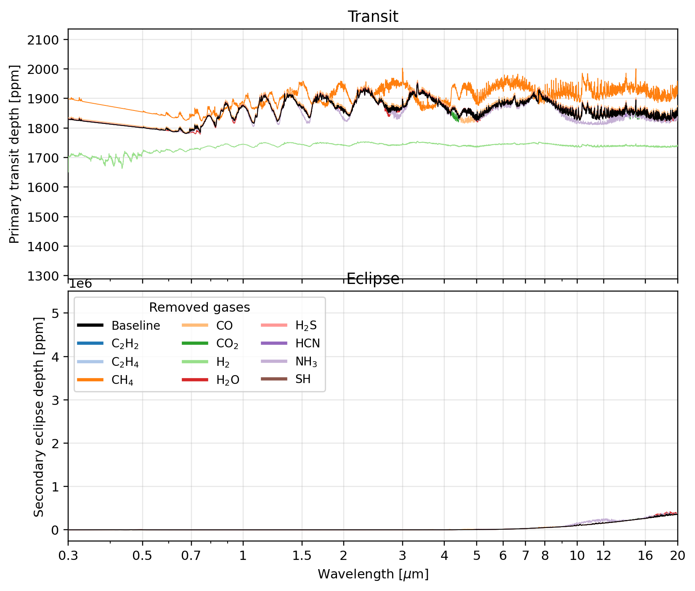

# Postprocessing and chemistry

After a PROTEUS simulation has run, its atmospheric state can be postprocessed to compute detailed chemistry, synthetic observations, and multi-angle thermal profiles. Atmospheric chemistry can also be coupled live during a run. This page covers all three workflows.

## Atmospheric chemistry with VULCAN

PROTEUS can couple to the [VULCAN](https://github.com/FormingWorlds/VULCAN) chemical kinetics model to compute atmospheric composition. The `atmos_chem.when` configuration variable controls **when** chemistry is calculated. There are three modes:

| Mode | `atmos_chem.when` | Description |
|------|-------------------|-------------|
| Manually | `"manually"` | Chemistry is skipped during simulation. Run it yourself afterwards via the CLI. |
| Offline | `"offline"` | Chemistry runs once automatically after the simulation finishes, on the final atmospheric state. |
| Online | `"online"` | Chemistry runs at every output snapshot during the simulation, coupled to the evolving atmosphere. |

All three modes require `atmos_chem.module = "vulcan"` and the AGNI atmosphere module (`atmos_clim.module = "agni"`).

### Manually mode (default)

When `atmos_chem.when = "manually"` (the default), no chemistry is calculated during or after the simulation. You can run it yourself at any time using the CLI:

```console
proteus offchem -c [cfgfile]
```

This is useful when you want to experiment with different chemistry settings (for example network or photochemistry) without re-running the full simulation.

### Offline mode

When `atmos_chem.when = "offline"`, PROTEUS automatically runs VULCAN once after the main simulation loop completes. It uses the final atmospheric temperature-pressure profile and composition as input. Results are written to `offchem/vulcan.csv` in the output directory.

This is the recommended mode for most use cases: it adds chemistry as a post-processing step with minimal overhead.

### Online mode

When `atmos_chem.when = "online"`, PROTEUS runs VULCAN at every output snapshot (controlled by `params.out.write_mod` and `params.out.dt_write_rel`) during the main simulation loop. This couples the chemistry to the evolving thermal state of the atmosphere.

Key differences from offline mode:

- **Per-snapshot output**: Each snapshot produces its own output file (`vulcan_{year}.csv`) rather than a single `vulcan.csv`.
- **One-time network compilation**: The chemical reaction network is compiled only once on the first snapshot, then reused for subsequent snapshots.
- **Skipped when desiccated**: If the planet loses its entire volatile inventory, online chemistry is skipped for subsequent snapshots.

Online mode is more expensive but captures the time evolution of atmospheric chemistry alongside the thermal evolution.

### Chemistry configuration

The chemistry behaviour is further controlled by settings under `[atmos_chem]` and `[atmos_chem.vulcan]` in the configuration file. Key options include:

- `atmos_chem.vulcan.network`: Chemical network to use (`"CHO"`, `"NCHO"`, or `"SNCHO"`)
- `atmos_chem.photo_on`: Enable photochemistry
- `atmos_chem.Kzz_on`: Enable eddy diffusion mixing

See the [atmosphere and chemistry reference](../Reference/config/atmosphere.md) for the full list of options.

## Synthetic observations

PROTEUS can generate synthetic transit and eclipse depth spectra from the
simulated atmospheric state using [petitRADTRANS](https://petitradtrans.readthedocs.io/).
Spectra are produced as "perfect" observations — no telescope noise model is
applied — so they represent the intrinsic planetary signal.

Access the synthetic-observation functionality via the CLI:

```console
proteus observe -c [cfgfile]
```

PROTEUS also runs this step automatically at the end of a simulation when
`observe.module = "petitRADTRANS"` is set in the configuration file.

### Composition sources

Spectra are computed from composition sources controlled by `observe.source`:

- `all` (default): run all available sources below
- `outgas`, `profile`, or `offchem`: run only that source

Available sources:

| Source | Description | Skipped when |
|--------|-------------|--------------|
| `outgas` | Constant-with-height VMR from the outgassing module | Never |
| `profile` | Full T(p) + VMR profile from the atmosphere NetCDF | `atmos_clim.module = "dummy"` |
| `offchem` | Photochemical mixing ratios from VULCAN | `atmos_chem.module` is `none` |

### Output files

For each source, two CSV files are written to `observe/` inside the run
directory:

- `transit_<source>_synthesis.csv` — primary transit depth
- `eclipse_<source>_synthesis.csv` — secondary eclipse depth

Use `observe.spectrum_type` to choose which products are written:

- `both` (default): writes both files above
- `transit`: writes only `transit_<source>_synthesis.csv`
- `eclipse`: writes only `eclipse_<source>_synthesis.csv`

Both files are tab-separated with the following column layout:

| Column | Description |
|--------|-------------|
| `Wavelength/um` | Wavelength \[μm\] |
| `None/ppm` | Baseline depth \[ppm\] with all species present |
| `<SPECIES>_removed/ppm` | Depth \[ppm\] with that species removed (one column per line species in the mix) |

Set `observe.remove_one_gas = false` to disable the
`<SPECIES>_removed/ppm` columns and write baseline-only spectra.

The baseline column uses the full set of line species found in the
petitRADTRANS opacity table directory (`$FWL_DATA/prt/input_data`). Species
below the `clip_vmr` threshold are excluded.

### Plotting

The `plot_spectra` diagnostic produces a two-panel PDF figure:

- **Upper panel**: primary transit depth as a function of wavelength.
- **Lower panel**: secondary eclipse depth as a function of wavelength.

Both panels overlay the baseline spectrum (black) with all per-species
removed spectra (coloured by species). The figure is saved to
`plots/plot_spectra.pdf` (or `.png` depending on `params.out.plot_fmt`).

<figure markdown="span">
  
  <figcaption><b>Example <code>plot_spectra</code> output.</b>
  Upper panel: primary transit depth \[ppm\]. Lower panel: secondary eclipse depth \[ppm\].
  The black line is the baseline (all species present); coloured lines show the spectrum
  with each gas removed in turn.</figcaption>
</figure>

See the [Observations configuration reference](../Reference/config/observe.md)
for all available options.


## Multiprofile analysis with AGNI

PROTEUS can postprocess the planet's atmosphere for a number of zenith angles. This yields localised thermal profiles based on the angle of irradiation on the atmosphere, which is particularly useful for tidally locked planets.

Access this functionality via the CLI, from within the PROTEUS directory:

```console
julia tools/multiprofile_postprocess.jl output/[outputdir] 0,36,45,89
```

This example computes results for four zenith angles (`0, 36, 45, 89`), but the script works for any number of zenith angles and creates a new `..._atm_z{angle}.nc` file in the `data/` directory of the output folder for each angle.

---

**See also:** [Usage overview](usage.md) | [Running and output](usage_running.md) | [Atmosphere and chemistry reference](../Reference/config/atmosphere.md) | [Observations reference](../Reference/config/observe.md) | [VULCAN submodule](https://proteus-framework.org/VULCAN/)
