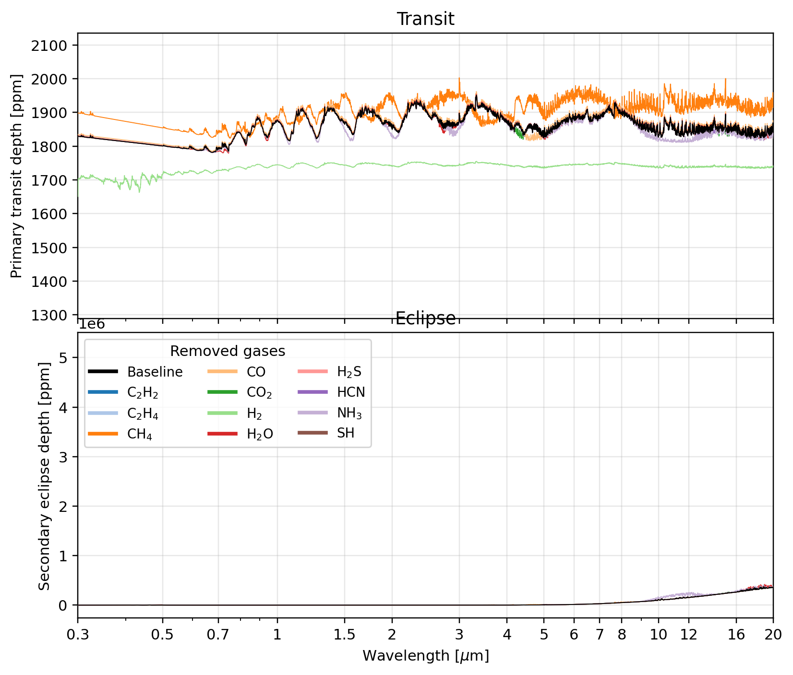

# Output format

PROTEUS writes simulation output to a directory inside `output/`. This page
documents the structure of that directory and the contents of the main output
files.

## Directory structure

A completed PROTEUS run produces:

```
output/<run_name>/
    runtime_helpfile.csv    # Main time-series output (tab-separated)
    init_coupler.toml       # Copy of the configuration used
    status                  # Exit status code and description
    proteus_00.log          # Log file (subsequent resumes: proteus_01.log, ...)
    plots/                  # Generated diagnostic plots
        plot_global.png
        plot_escape.png
        plot_interior.png
        ...
    data/                   # Module-specific output files
        <iter>_atm.nc       # Atmosphere profiles (NetCDF, per snapshot)
        <iter>_int.nc       # Interior profiles (NetCDF, per snapshot)
        zalmoxis_output.dat # Zalmoxis structure profile (latest)
        spider_eos/         # Cached EOS lookup tables (if Aragog/SPIDER)
        ...
    observe/                # Synthetic observations (if enabled)
        transit_<source>_synthesis.csv   # Transit depth spectra
        eclipse_<source>_synthesis.csv   # Eclipse depth spectra
```

`<source>` is `outgas`, `profile`, or `offchem`, depending on
`observe.source`. With `observe.source = "all"` (default), PROTEUS writes one
pair of files per available source.

## Status codes

The `status` file contains a single integer followed by a human-readable
description. The codes are:

| Code | Meaning |
|------|---------|
| 0 | Started |
| 1 | Running |
| 10 | Completed: mantle solidified |
| 11 | Completed: maximum clock runtime |
| 12 | Completed: maximum iterations reached |
| 13 | Completed: target time reached |
| 14 | Completed: net flux is small (radiative equilibrium) |
| 15 | Completed: atmosphere escaped |
| 16 | Completed: planet disintegrated |
| 20 | Error: configuration |
| 21 | Error: interior module |
| 22 | Error: atmosphere module |
| 23 | Error: stellar module |
| 24 | Error: chemistry module |
| 25 | Error: killed or crashed |
| 26 | Error: tidal module |
| 27 | Error: outgassing module |
| 28 | Error: escape module |

## Helpfile columns

The `runtime_helpfile.csv` is a tab-separated file with one row per coupling
iteration. All quantities use SI units unless noted otherwise. The columns
are grouped by category below.

<!-- BEGIN GENERATED: helpfile-matrix -->
<!-- Generated by tools/generate_output_reference.py; edit src/proteus/, not these tables -->
Each iteration carries the previous row forward and overwrites only the columns the active modules produce, so a column whose producer is not part of the current configuration keeps its previous value (initially zero) for the whole run. The "written when" column names the configuration that actually writes each column.

### Model tracking

| Column | Unit | Description | Producer | Written when | Read by |
|---|---|---|---|---|---|
| `Time` | `yr` |  | `proteus.py` | always | atmos_chem, atmos_clim, interior_energetics, main loop, observe, orbit, outgas, plot, star, utils |

### Orbital and spin parameters of planet

| Column | Unit | Description | Producer | Written when | Read by |
|---|---|---|---|---|---|
| `semimajorax` | `m` | semi-major axis | `orbit/orbit.py`<br>`orbit/wrapper.py` | always; orbit.evolve = true | escape, orbit, plot |
| `separation` | `m` | time-averaged separation | `orbit/wrapper.py` | always | atmos_chem, atmos_clim, main loop, observe, orbit, plot, star, utils |
| `perihelion` | `m` | lowest point in orbit | `orbit/wrapper.py` | always | orbit |
| `orbital_period` | `s` | orbital duration | `orbit/wrapper.py` | always | orbit |
| `eccentricity` | `1` | orbital eccentricity | `orbit/orbit.py`<br>`orbit/wrapper.py` | always; orbit.evolve = true | escape, orbit, plot |
| `Imk2` | `1` | Imaginary part of k2 Love Number | `orbit/wrapper.py` | always | orbit |
| `axial_period` | `s` | day length of planet around its axis | `orbit/satellite.py`<br>`orbit/wrapper.py` | always; orbit.satellite = true | atmos_clim, orbit, plot, utils |

### Satellite system

| Column | Unit | Description | Producer | Written when | Read by |
|---|---|---|---|---|---|
| `perigee` | `m` | lowest point in orbit | `orbit/wrapper.py` | always |   |
| `semimajorax_sat` | `m` | semi-major axis | `orbit/satellite.py`<br>`orbit/wrapper.py` | always; orbit.satellite = true | orbit, plot |
| `M_sat` | `kg` | mass of satellite | `orbit/satellite.py` | orbit.satellite = true | orbit |
| `plan_sat_am` | `kg m2 s-1` | angular momentum of sat+pla | `orbit/satellite.py` | orbit.satellite = true | orbit |

### Planet structure

| Column | Unit | Description | Producer | Written when | Read by |
|---|---|---|---|---|---|
| `R_int` | `m` | interior radius | `interior_energetics/wrapper.py`<br>`interior_struct/dummy.py`<br>`interior_struct/zalmoxis.py`<br>`proteus.py` | always; interior_struct.module = "dummy"; interior_struct.module = "zalmoxis" | atmos_chem, atmos_clim, escape, interior_energetics, interior_struct, main loop, observe, orbit, outgas, plot |
| `M_int` | `kg` | interior mass | `interior_energetics/wrapper.py`<br>`interior_struct/dummy.py`<br>`interior_struct/zalmoxis.py` | always; interior_struct.module = "dummy"; interior_struct.module = "zalmoxis" | atmos_clim, interior_energetics, interior_struct, orbit, outgas |
| `M_planet` | `kg` | total planet wet+dry mass | `interior_energetics/wrapper.py` | always | atmos_clim, escape, interior_energetics, orbit, outgas, plot, utils |
| `M_vaps` | `kg` | vapourised rock mass, including the vapourised oxygen | `outgas/calliope.py`<br>`outgas/dummy.py`<br>`outgas/lavatmos.py`<br>`outgas/wrapper.py` | always; outgas.module = "calliope"; outgas.module = "dummy"; outgas.vapourise = true | outgas, utils |
| `R_core` | `m` | core radius | `interior_struct/dummy.py`<br>`interior_struct/zalmoxis.py` | interior_struct.module = "dummy"; interior_struct.module = "zalmoxis" | interior_energetics |
| `R_solvus` | `m` | solvus radius for global_miscibility mode | `interior_struct/zalmoxis.py` | interior_struct.module = "zalmoxis" | interior_energetics, interior_struct, main loop |
| `P_solvus` | `Pa` | solvus pressure for global_miscibility mode | `interior_struct/zalmoxis.py` | interior_struct.module = "zalmoxis" | interior_struct, main loop |
| `T_solvus` | `K` | solvus temperature for global_miscibility mode | `interior_struct/zalmoxis.py` | interior_struct.module = "zalmoxis" | interior_struct, main loop |
| `P_center` | `Pa` | central pressure from Zalmoxis structure | `interior_struct/zalmoxis.py` | interior_struct.module = "zalmoxis" | interior_struct |
| `P_cmb` | `Pa` | core-mantle boundary pressure from Zalmoxis structure | `interior_struct/zalmoxis.py` | interior_struct.module = "zalmoxis" | interior_energetics, interior_struct |
| `core_density` | `kg m-3` | core density from structure solver | `interior_energetics/aragog.py`<br>`interior_struct/dummy.py`<br>`interior_struct/zalmoxis.py` | interior_energetics.module = "aragog"; interior_struct.module = "dummy"; interior_struct.module = "zalmoxis" | interior_energetics |
| `core_heatcap` | `J kg-1 K-1` | core heat capacity | `interior_struct/dummy.py`<br>`interior_struct/zalmoxis.py` | interior_struct.module = "dummy"; interior_struct.module = "zalmoxis" | interior_energetics |
| `X_H2_int` | `1` | H2 mass fraction in interior (sub-Neptune mode) | `interior_struct/zalmoxis.py` | interior_struct.module = "zalmoxis" | interior_struct |
| `struct_mass_desync_frac` | `1` | \|trapezoid - ODE accumulator\| / accumulator structure mass self-consistency | `interior_struct/zalmoxis.py` | interior_struct.module = "zalmoxis" | interior_struct |

### Temperatures

| Column | Unit | Description | Producer | Written when | Read by |
|---|---|---|---|---|---|
| `T_surf` | `K` | global surface temperature | `atmos_clim/agni.py`<br>`atmos_clim/dummy.py`<br>`atmos_clim/janus.py`<br>`atmos_clim/wrapper.py`<br>`interior_energetics/boundary.py`<br>`interior_energetics/wrapper.py`<br>`interior_struct/zalmoxis.py`<br>`proteus.py` | always; atmos_clim.module = "agni"; atmos_clim.module = "dummy"; atmos_clim.module = "janus"; interior_energetics.module = "boundary"; interior_struct.module = "zalmoxis" | atmos_chem, atmos_clim, interior_energetics, main loop, plot, utils |
| `T_magma` | `K` | global outgassing temperature | `interior_energetics/aragog.py`<br>`interior_energetics/aragog_jax.py`<br>`interior_energetics/boundary.py`<br>`interior_energetics/dummy.py`<br>`interior_energetics/spider.py`<br>`interior_energetics/wrapper.py`<br>`interior_struct/zalmoxis.py`<br>`proteus.py` | always; interior_energetics.module = "aragog"; interior_energetics.module = "boundary"; interior_energetics.module = "dummy"; interior_energetics.module = "spider"; interior_struct.module = "zalmoxis" | atmos_clim, interior_energetics, main loop, outgas, plot, utils |
| `T_cmb` | `K` | core temperature | `interior_energetics/aragog.py`<br>`interior_energetics/aragog_jax.py`<br>`interior_energetics/spider.py` | interior_energetics.module = "aragog"; interior_energetics.module = "spider" | interior_energetics |
| `T_eqm` | `K` | grey radiative equilibrium temperature | `proteus.py`<br>`star/wrapper.py` | always | interior_energetics, interior_struct, star |
| `T_skin` | `K` | grey radiative skin temperature | `star/wrapper.py` | always | atmos_clim |
| `T_surface_initial` | `K` | self-consistent T_surf from accretion mode | `interior_struct/zalmoxis.py` | interior_struct.module = "zalmoxis" | interior_energetics |
| `T_surf_accr` | `K` | surface temperature from accretion energy balance | `interior_struct/zalmoxis.py` | interior_struct.module = "zalmoxis" |   |
| `T_cmb_initial` | `K` | initial CMB temperature from White+Li thermal state | `interior_struct/zalmoxis.py` | interior_struct.module = "zalmoxis" |   |
| `DeltaT_accretion` | `K` | accretion-energy DeltaT contribution | `interior_struct/zalmoxis.py` | interior_struct.module = "zalmoxis" |   |
| `DeltaT_adiabat` | `K` | adiabatic DeltaT contribution | `interior_struct/zalmoxis.py` | interior_struct.module = "zalmoxis" |   |
| `DeltaT_differentiation` | `K` | core-mantle differentiation DeltaT contribution | `interior_struct/zalmoxis.py` | interior_struct.module = "zalmoxis" |   |
| `U_grav_diff` | `J` | gravitational binding energy (differentiated) | `interior_struct/zalmoxis.py` | interior_struct.module = "zalmoxis" |   |
| `U_grav_undiff` | `J` | gravitational binding energy (undifferentiated) | `interior_struct/zalmoxis.py` | interior_struct.module = "zalmoxis" |   |

### Planet energy fluxes

| Column | Unit | Description | Producer | Written when | Read by |
|---|---|---|---|---|---|
| `F_int` | `W m-2` | flux from top of interior | `interior_energetics/aragog.py`<br>`interior_energetics/aragog_jax.py`<br>`interior_energetics/boundary.py`<br>`interior_energetics/dummy.py`<br>`interior_energetics/spider.py`<br>`interior_energetics/wrapper.py`<br>`proteus.py` | always; interior_energetics.module = "aragog"; interior_energetics.module = "boundary"; interior_energetics.module = "dummy"; interior_energetics.module = "spider" | atmos_clim, interior_energetics, plot, utils |
| `F_atm` | `W m-2` | flux from top of atmosphere | `atmos_clim/agni.py`<br>`atmos_clim/dummy.py`<br>`atmos_clim/janus.py`<br>`proteus.py` | always; atmos_clim.module = "agni"; atmos_clim.module = "dummy"; atmos_clim.module = "janus" | atmos_clim, interior_energetics, main loop, plot, utils |
| `F_net` | `W m-2` | flux difference F_int-F_atm | `atmos_clim/wrapper.py` | always |   |
| `F_olr` | `W m-2` | outgoing longwave radiation | `atmos_clim/agni.py`<br>`atmos_clim/dummy.py`<br>`atmos_clim/janus.py` | atmos_clim.module = "agni"; atmos_clim.module = "dummy"; atmos_clim.module = "janus" | atmos_clim, plot |
| `F_sct` | `W m-2` | outgoing shortwave radiation | `atmos_clim/agni.py`<br>`atmos_clim/dummy.py`<br>`atmos_clim/janus.py` | atmos_clim.module = "agni"; atmos_clim.module = "dummy"; atmos_clim.module = "janus" | atmos_clim, plot |
| `F_ins` | `W m-2` | incoming instellation flux | `star/wrapper.py` | always | atmos_clim, plot, star |
| `F_xuv` | `W m-2` | incoming XUV radiation flux | `star/wrapper.py` | always | escape, star |
| `bol_scale` | `1` | bolometric scaling factor | `star/wrapper.py` | always | star |
| `tau_atm_TOA` | `1` | optical depth at TOA, at ref wavelength | `atmos_clim/agni.py` | atmos_clim.module = "agni" |   |
| `tau_atm_surface` | `1` | optical depth at surface, at ref wavelength | `atmos_clim/agni.py` | atmos_clim.module = "agni" |   |
| `atm_Ra_max` | `1` | maximum Rayleigh number across levels | `atmos_clim/agni.py` | atmos_clim.module = "agni" |   |
| `atm_t_conv_over_t_rad` | `1` | convective vs radiative timescale ratio | `atmos_clim/agni.py` | atmos_clim.module = "agni" |   |
| `atm_converged` | `1` | atmosphere solve outcome: +1 converged, -1 rejected, 0 no solve | `atmos_clim/wrapper.py` | always |   |
| `atm_levels_stale` | `1` | consecutive iterations without a converged solve of this run | `atmos_clim/wrapper.py` | always | main loop |
| `F_tidal` | `W m-2` | tidal heat flux arising at surface | `interior_energetics/aragog.py`<br>`interior_energetics/aragog_jax.py`<br>`interior_energetics/boundary.py`<br>`interior_energetics/dummy.py`<br>`interior_energetics/spider.py` | interior_energetics.module = "aragog"; interior_energetics.module = "boundary"; interior_energetics.module = "dummy"; interior_energetics.module = "spider" | interior_energetics, orbit, plot, utils |
| `F_radio` | `W m-2` | radiogenic heat flux arising at surface | `interior_energetics/aragog.py`<br>`interior_energetics/aragog_jax.py`<br>`interior_energetics/boundary.py`<br>`interior_energetics/dummy.py`<br>`interior_energetics/spider.py` | interior_energetics.module = "aragog"; interior_energetics.module = "boundary"; interior_energetics.module = "dummy"; interior_energetics.module = "spider" | interior_energetics, plot, utils |
| `F_cmb` | `W m-2` | heat flux at the CMB (signed, +out-of-core) | `interior_energetics/aragog.py` | interior_energetics.module = "aragog" |   |

### Planet interior properties

| Column | Unit | Description | Producer | Written when | Read by |
|---|---|---|---|---|---|
| `gravity` | `m s-2` | surface gravity | `interior_energetics/wrapper.py`<br>`interior_struct/dummy.py`<br>`interior_struct/zalmoxis.py` | always; interior_struct.module = "dummy"; interior_struct.module = "zalmoxis" | atmos_chem, atmos_clim, interior_energetics, interior_struct, outgas |
| `Phi_global` | `1` | mantle melt mass-fraction | `interior_energetics/aragog.py`<br>`interior_energetics/aragog_jax.py`<br>`interior_energetics/boundary.py`<br>`interior_energetics/dummy.py`<br>`interior_energetics/spider.py`<br>`interior_energetics/wrapper.py` | always; interior_energetics.module = "aragog"; interior_energetics.module = "boundary"; interior_energetics.module = "dummy"; interior_energetics.module = "spider" | interior_energetics, interior_struct, main loop, outgas, plot, utils |
| `Phi_global_vol` | `1` | mantle melt volume-fraction | `interior_energetics/aragog.py`<br>`interior_energetics/aragog_jax.py`<br>`interior_energetics/boundary.py`<br>`interior_energetics/dummy.py`<br>`interior_energetics/spider.py` | interior_energetics.module = "aragog"; interior_energetics.module = "boundary"; interior_energetics.module = "dummy"; interior_energetics.module = "spider" |   |
| `RF_depth` | `1` | depth of rheological front | `interior_energetics/aragog.py`<br>`interior_energetics/aragog_jax.py`<br>`interior_energetics/boundary.py`<br>`interior_energetics/dummy.py`<br>`interior_energetics/spider.py` | interior_energetics.module = "aragog"; interior_energetics.module = "boundary"; interior_energetics.module = "dummy"; interior_energetics.module = "spider" | interior_energetics, plot |
| `M_core` | `kg` | dry mass of core | `interior_energetics/aragog.py`<br>`interior_energetics/spider.py`<br>`interior_energetics/wrapper.py`<br>`interior_struct/dummy.py`<br>`interior_struct/zalmoxis.py` | always; interior_energetics.module = "aragog"; interior_energetics.module = "spider"; interior_struct.module = "dummy"; interior_struct.module = "zalmoxis" | interior_energetics, interior_struct |
| `M_mantle` | `kg` | dry mass of mantle | `interior_energetics/aragog.py`<br>`interior_energetics/aragog_jax.py`<br>`interior_energetics/boundary.py`<br>`interior_energetics/dummy.py`<br>`interior_energetics/spider.py`<br>`interior_energetics/wrapper.py` | always; interior_energetics.module = "aragog"; interior_energetics.module = "boundary"; interior_energetics.module = "dummy"; interior_energetics.module = "spider" | interior_energetics, interior_struct, outgas |
| `M_mantle_solid` | `kg` | dry mass of solid-phase mantle | `interior_energetics/aragog.py`<br>`interior_energetics/aragog_jax.py`<br>`interior_energetics/boundary.py`<br>`interior_energetics/dummy.py`<br>`interior_energetics/spider.py`<br>`interior_energetics/wrapper.py` | always; interior_energetics.module = "aragog"; interior_energetics.module = "boundary"; interior_energetics.module = "dummy"; interior_energetics.module = "spider" | interior_energetics, interior_struct |
| `M_mantle_liquid` | `kg` | dry mass of liquid-phase mantle | `interior_energetics/aragog.py`<br>`interior_energetics/aragog_jax.py`<br>`interior_energetics/boundary.py`<br>`interior_energetics/dummy.py`<br>`interior_energetics/spider.py`<br>`interior_energetics/wrapper.py` | always; interior_energetics.module = "aragog"; interior_energetics.module = "boundary"; interior_energetics.module = "dummy"; interior_energetics.module = "spider" | interior_energetics, interior_struct |
| `T_pot` | `K` | characteristic mantle potential temperature | `interior_energetics/aragog.py`<br>`interior_energetics/aragog_jax.py`<br>`interior_energetics/boundary.py`<br>`interior_energetics/dummy.py`<br>`interior_energetics/spider.py` | interior_energetics.module = "aragog"; interior_energetics.module = "boundary"; interior_energetics.module = "dummy"; interior_energetics.module = "spider" |   |
| `boundary_layer_thickness` | `m` | thermal boundary layer thickness | `interior_energetics/aragog.py`<br>`interior_energetics/boundary.py`<br>`interior_energetics/dummy.py`<br>`interior_energetics/spider.py` | interior_energetics.module = "aragog"; interior_energetics.module = "boundary"; interior_energetics.module = "dummy"; interior_energetics.module = "spider" |   |

### Energy-conservation columns

| Column | Unit | Description | Producer | Written when | Read by |
|---|---|---|---|---|---|
| `E_th_mantle` | `J` | thermal-energy proxy (do not use for conservation) | `interior_energetics/aragog.py`<br>`interior_energetics/aragog_jax.py`<br>`interior_energetics/spider.py` | interior_energetics.module = "aragog"; interior_energetics.module = "spider" |   |
| `E_state_J` | `J` | state-mass integrated mantle enthalpy (diagnostic only) | `interior_energetics/aragog.py` | interior_energetics.module = "aragog" |   |
| `E_state_cons_J` | `J` | frozen-mass integrated mantle enthalpy (diagnostic only) | `interior_energetics/aragog.py` | interior_energetics.module = "aragog" | utils |
| `Q_radio_W` | `W` | instantaneous mantle-integrated radiogenic power | `interior_energetics/aragog.py` | interior_energetics.module = "aragog" |   |
| `Q_tidal_W` | `W` | instantaneous mantle-integrated tidal power | `interior_energetics/aragog.py` | interior_energetics.module = "aragog" |   |
| `step_dE_F_int_J` | `J` | per-call ∫ -F_int*A_int dt | `interior_energetics/aragog.py` | interior_energetics.module = "aragog" | utils |
| `step_dE_F_cmb_J` | `J` | per-call ∫ +F_cmb*A_cmb dt | `interior_energetics/aragog.py` | interior_energetics.module = "aragog" | utils |
| `step_dE_Q_radio_J` | `J` | per-call ∫ +Q_radio dt (live-density, predicted side) | `interior_energetics/aragog.py` | interior_energetics.module = "aragog" | utils |
| `step_dE_Q_tidal_J` | `J` | per-call ∫ +Q_tidal dt (live-density, predicted side) | `interior_energetics/aragog.py` | interior_energetics.module = "aragog" | utils |
| `step_dE_Q_radio_cons_J` | `J` | per-call ∫ +Q_radio dt (frozen-mass, diagnostic) | `interior_energetics/aragog.py` | interior_energetics.module = "aragog" |   |
| `step_dE_Q_tidal_cons_J` | `J` | per-call ∫ +Q_tidal dt (frozen-mass, diagnostic) | `interior_energetics/aragog.py` | interior_energetics.module = "aragog" |   |
| `step_solver_residual_J` | `J` | per-call entropy-ODE LHS-RHS | `interior_energetics/aragog.py` | interior_energetics.module = "aragog" | utils |
| `step_dE_compression_J` | `J` | per-call structure-re-solve compression work (diagnostic) | `interior_energetics/aragog.py` | interior_energetics.module = "aragog" |   |
| `step_dE_state_heat_J` | `J` | per-call entropy-transported heat content change | `interior_energetics/aragog.py` | interior_energetics.module = "aragog" | utils |
| `E_state_heat_cons_J` | `J` | cumulative sum of step_dE_state_heat_J across rows | `utils/coupler.py` | always |   |
| `dE_predicted_cons_J` | `J` | cumulative sum of boundary fluxes + live-density step_dE_Q_*_J | `utils/coupler.py` | always |   |
| `E_residual_cons_J` | `J` | E_state_heat_cons_J - dE_predicted_cons_J | `utils/coupler.py` | always |   |
| `E_residual_cons_frac` | `1` | E_residual_cons_J / max(\|E_state_heat_cons_J\|, 1 J) | `utils/coupler.py` | always |   |
| `solver_residual_J` | `J` | cumulative entropy-ODE LHS-RHS residual | `utils/coupler.py` | always |   |
| `Cp_eff` | `J kg-1 K-1` | effective mantle heat capacity | `interior_energetics/aragog.py`<br>`interior_energetics/aragog_jax.py`<br>`interior_energetics/spider.py` | interior_energetics.module = "aragog"; interior_energetics.module = "spider" |   |

### Host star properties

| Column | Unit | Description | Producer | Written when | Read by |
|---|---|---|---|---|---|
| `M_star` | `kg` | mass of star | `star/wrapper.py` | always | orbit |
| `R_star` | `m` | photospheric radius | `star/wrapper.py` | always | atmos_chem, atmos_clim, observe, plot, star |
| `age_star` | `yr` | age relative to deuterium fusion 'stellar birthline' | `proteus.py` | always | main loop, star |
| `T_star` | `K` | photospheric temperature | `star/wrapper.py` | always | observe, star |

### Planet observational properties

| Column | Unit | Description | Producer | Written when | Read by |
|---|---|---|---|---|---|
| `p_obs` | `bar` | transit pressure level | `atmos_clim/agni.py`<br>`atmos_clim/dummy.py`<br>`atmos_clim/janus.py` | atmos_clim.module = "agni"; atmos_clim.module = "dummy"; atmos_clim.module = "janus" |   |
| `R_obs` | `m` | transit radius | `atmos_clim/agni.py`<br>`atmos_clim/dummy.py`<br>`atmos_clim/janus.py` | atmos_clim.module = "agni"; atmos_clim.module = "dummy"; atmos_clim.module = "janus" | atmos_clim, escape, orbit, plot |
| `T_obs` | `K` | transit temperature | `atmos_clim/agni.py`<br>`atmos_clim/dummy.py`<br>`atmos_clim/janus.py` | atmos_clim.module = "agni"; atmos_clim.module = "dummy"; atmos_clim.module = "janus" | escape |
| `g_obs` | `m s-2` | transit gravity | `atmos_clim/agni.py`<br>`atmos_clim/dummy.py`<br>`atmos_clim/janus.py` | atmos_clim.module = "agni"; atmos_clim.module = "dummy"; atmos_clim.module = "janus" |   |
| `rho_obs` | `kg m-3` | transit bulk density | `atmos_clim/wrapper.py` | always |   |
| `transit_depth` | `1` | primary transit light curve depth | `atmos_clim/wrapper.py` | always | plot |
| `eclipse_depth` | `1` | secondary eclipse light curve depth | `atmos_clim/wrapper.py` | always | plot |
| `albedo_pl` | `1` | INPUT bond albedo from config: constant value (0 to 1) | `atmos_clim/wrapper.py` | always | atmos_clim, plot, star |
| `bond_albedo` | `1` | OUTPUT calculated bond albedo from radtrans: SW_UP/SW_DN, zero if no scattering | `atmos_clim/agni.py`<br>`atmos_clim/dummy.py`<br>`atmos_clim/janus.py`<br>`atmos_clim/wrapper.py` | always; atmos_clim.module = "agni"; atmos_clim.module = "dummy"; atmos_clim.module = "janus" | plot |

### Atmospheric composition from outgassing

| Column | Unit | Description | Producer | Written when | Read by |
|---|---|---|---|---|---|
| `M_ele` | `kg` | total mass of volatile and noble elements; rock vapour excluded | `interior_energetics/wrapper.py`<br>`outgas/wrapper.py` | always | interior_energetics |
| `M_atm` | `kg` | total mass of atmosphere | `outgas/calliope.py`<br>`outgas/dummy.py`<br>`outgas/lavatmos.py`<br>`outgas/wrapper.py` | always; outgas.module = "calliope"; outgas.module = "dummy"; outgas.vapourise = true | interior_energetics, outgas, plot, utils |
| `P_surf` | `bar` | total surface pressure | `outgas/atmodeller.py`<br>`outgas/binodal.py`<br>`outgas/calliope.py`<br>`outgas/dummy.py`<br>`outgas/lavatmos.py`<br>`outgas/wrapper.py`<br>`proteus.py` | always; outgas.module = "atmodeller"; h2 binodal enabled; outgas.module = "calliope"; outgas.module = "dummy"; outgas.vapourise = true | atmos_chem, atmos_clim, escape, interior_energetics, interior_struct, main loop, outgas, plot, utils |
| `P_vap` | `bar` | rock vapour surface pressure | `outgas/calliope.py`<br>`outgas/dummy.py`<br>`outgas/lavatmos.py`<br>`outgas/wrapper.py` | always; outgas.module = "calliope"; outgas.module = "dummy"; outgas.vapourise = true | outgas, utils |
| `P_vol` | `bar` | volatiles surface pressure | `outgas/calliope.py`<br>`outgas/dummy.py`<br>`outgas/lavatmos.py`<br>`outgas/wrapper.py` | always; outgas.module = "calliope"; outgas.module = "dummy"; outgas.vapourise = true | outgas, utils |
| `atm_kg_per_mol` | `kg mol-1` | outgassed atmosphere MMW | `outgas/atmodeller.py`<br>`outgas/binodal.py`<br>`outgas/calliope.py`<br>`outgas/dummy.py`<br>`outgas/lavatmos.py`<br>`outgas/wrapper.py` | always; outgas.module = "atmodeller"; h2 binodal enabled; outgas.module = "calliope"; outgas.module = "dummy"; outgas.vapourise = true | atmos_chem, atmos_clim, outgas |
| `M_vol_atm` | `kg` | atmospheric mass of volatiles and noble gases; rock vapour excluded | `outgas/calliope.py`<br>`outgas/dummy.py`<br>`outgas/lavatmos.py`<br>`outgas/wrapper.py` | always; outgas.module = "calliope"; outgas.module = "dummy"; outgas.vapourise = true | utils |
| `fO2_shift_IW_derived` | `log10 bar` | equilibrated IW-buffer offset | `outgas/atmodeller.py`<br>`outgas/calliope.py`<br>`outgas/dummy.py`<br>`outgas/wrapper.py` | always; outgas.module = "atmodeller"; outgas.module = "calliope"; outgas.module = "dummy" | outgas |
| `fO2_vapourise_derived` | `log10 bar` | rock-vapour fO2 | `outgas/lavatmos.py` | outgas.vapourise = true | outgas |
| `fO2_vapourise_shift_IW_derived` | `log10 bar` | rock-vapour IW offset | `outgas/lavatmos.py` | outgas.vapourise = true | outgas |
| `O_res` | `kg` | O mass-balance residual | `outgas/atmodeller.py`<br>`outgas/calliope.py`<br>`outgas/dummy.py`<br>`outgas/wrapper.py` | always; outgas.module = "atmodeller"; outgas.module = "calliope"; outgas.module = "dummy" |   |
| `O_vapourised_kg` | `kg` | oxygen released by rock vapourisation (LavAtmos) | `outgas/lavatmos.py` | outgas.vapourise = true |   |

### Desiccation escape balance

| Column | Unit | Description | Producer | Written when | Read by |
|---|---|---|---|---|---|
| `M_vol_initial` | `kg` | bulk volatile inventory baseline | `escape/wrapper.py` | always | escape, outgas |
| `esc_kg_cumulative` | `kg` | cumulative escaped mass | `escape/wrapper.py` | always | escape, outgas |
| `esc_clamp_frac` | `1` | requested per-step loss / escapable reservoir | `escape/wrapper.py`<br>`proteus.py` | always | escape |
| `esc_step_kg` | `kg` | loss applied on this step, after the cap | `escape/wrapper.py`<br>`proteus.py` | always | outgas |

### Gases from outgassing

| Column | Unit | Description | Producer | Written when | Read by |
|---|---|---|---|---|---|
| `H2O_mol_atm` | `mol` | number outgassed to atmosphere | `outgas/calliope.py`<br>`outgas/dummy.py`<br>`outgas/lavatmos.py`<br>`outgas/wrapper.py` | always; outgas.module = "calliope"; outgas.module = "dummy"; outgas.vapourise = true | outgas, plot |
| `H2O_mol_solid` | `mol` | number in solid mantle | `outgas/calliope.py`<br>`outgas/dummy.py`<br>`outgas/wrapper.py` | always; outgas.module = "calliope"; outgas.module = "dummy" | outgas |
| `H2O_mol_liquid` | `mol` | number in liquid mantle | `outgas/calliope.py`<br>`outgas/dummy.py`<br>`outgas/wrapper.py` | always; outgas.module = "calliope"; outgas.module = "dummy" | outgas |
| `H2O_mol_total` | `mol` | number in whole planet | `outgas/calliope.py`<br>`outgas/dummy.py`<br>`outgas/lavatmos.py`<br>`outgas/wrapper.py` | always; outgas.module = "calliope"; outgas.module = "dummy"; outgas.vapourise = true | plot |
| `H2O_kg_atm` | `kg` | mass outgassed to atmosphere | `outgas/atmodeller.py`<br>`outgas/calliope.py`<br>`outgas/dummy.py`<br>`outgas/lavatmos.py`<br>`outgas/wrapper.py` | always; outgas.module = "atmodeller"; outgas.module = "calliope"; outgas.module = "dummy"; outgas.vapourise = true | outgas |
| `H2O_kg_solid` | `kg` | mass in solid mantle | `outgas/atmodeller.py`<br>`outgas/calliope.py`<br>`outgas/dummy.py`<br>`outgas/wrapper.py` | always; outgas.module = "atmodeller"; outgas.module = "calliope"; outgas.module = "dummy" | outgas |
| `H2O_kg_liquid` | `kg` | mass in liquid mantle | `outgas/atmodeller.py`<br>`outgas/calliope.py`<br>`outgas/dummy.py`<br>`outgas/wrapper.py` | always; outgas.module = "atmodeller"; outgas.module = "calliope"; outgas.module = "dummy" | interior_struct, outgas |
| `H2O_kg_total` | `kg` | mass in whole planet | `outgas/atmodeller.py`<br>`outgas/calliope.py`<br>`outgas/dummy.py`<br>`outgas/lavatmos.py`<br>`outgas/wrapper.py` | always; outgas.module = "atmodeller"; outgas.module = "calliope"; outgas.module = "dummy"; outgas.vapourise = true | outgas |
| `H2O_vmr` | `1` | outgassed volume mixing ratio | `outgas/atmodeller.py`<br>`outgas/binodal.py`<br>`outgas/calliope.py`<br>`outgas/dummy.py`<br>`outgas/lavatmos.py`<br>`outgas/wrapper.py` | always; outgas.module = "atmodeller"; h2 binodal enabled; outgas.module = "calliope"; outgas.module = "dummy"; outgas.vapourise = true | atmos_chem, atmos_clim, outgas |
| `H2O_bar` | `bar` | partial surface pressure | `outgas/atmodeller.py`<br>`outgas/calliope.py`<br>`outgas/dummy.py`<br>`outgas/lavatmos.py`<br>`outgas/wrapper.py`<br>`proteus.py` | always; outgas.module = "atmodeller"; outgas.module = "calliope"; outgas.module = "dummy"; outgas.vapourise = true | outgas, plot |
| `H2O_vmr_xuv` | `1` | volume mixing ratio at XUV level | `atmos_clim/agni.py`<br>`atmos_clim/dummy.py`<br>`atmos_clim/janus.py` | atmos_clim.module = "agni"; atmos_clim.module = "dummy"; atmos_clim.module = "janus" |   |
| `CO2_mol_atm` | `mol` | number outgassed to atmosphere | `outgas/calliope.py`<br>`outgas/dummy.py`<br>`outgas/lavatmos.py`<br>`outgas/wrapper.py` | always; outgas.module = "calliope"; outgas.module = "dummy"; outgas.vapourise = true | outgas, plot |
| `CO2_mol_solid` | `mol` | number in solid mantle | `outgas/calliope.py`<br>`outgas/dummy.py`<br>`outgas/wrapper.py` | always; outgas.module = "calliope"; outgas.module = "dummy" | outgas |
| `CO2_mol_liquid` | `mol` | number in liquid mantle | `outgas/calliope.py`<br>`outgas/dummy.py`<br>`outgas/wrapper.py` | always; outgas.module = "calliope"; outgas.module = "dummy" | outgas |
| `CO2_mol_total` | `mol` | number in whole planet | `outgas/calliope.py`<br>`outgas/dummy.py`<br>`outgas/lavatmos.py`<br>`outgas/wrapper.py` | always; outgas.module = "calliope"; outgas.module = "dummy"; outgas.vapourise = true | plot |
| `CO2_kg_atm` | `kg` | mass outgassed to atmosphere | `outgas/atmodeller.py`<br>`outgas/calliope.py`<br>`outgas/dummy.py`<br>`outgas/lavatmos.py`<br>`outgas/wrapper.py` | always; outgas.module = "atmodeller"; outgas.module = "calliope"; outgas.module = "dummy"; outgas.vapourise = true | outgas |
| `CO2_kg_solid` | `kg` | mass in solid mantle | `outgas/atmodeller.py`<br>`outgas/calliope.py`<br>`outgas/dummy.py`<br>`outgas/wrapper.py` | always; outgas.module = "atmodeller"; outgas.module = "calliope"; outgas.module = "dummy" | outgas |
| `CO2_kg_liquid` | `kg` | mass in liquid mantle | `outgas/atmodeller.py`<br>`outgas/calliope.py`<br>`outgas/dummy.py`<br>`outgas/wrapper.py` | always; outgas.module = "atmodeller"; outgas.module = "calliope"; outgas.module = "dummy" | outgas |
| `CO2_kg_total` | `kg` | mass in whole planet | `outgas/atmodeller.py`<br>`outgas/calliope.py`<br>`outgas/dummy.py`<br>`outgas/lavatmos.py`<br>`outgas/wrapper.py` | always; outgas.module = "atmodeller"; outgas.module = "calliope"; outgas.module = "dummy"; outgas.vapourise = true | outgas |
| `CO2_vmr` | `1` | outgassed volume mixing ratio | `outgas/atmodeller.py`<br>`outgas/binodal.py`<br>`outgas/calliope.py`<br>`outgas/dummy.py`<br>`outgas/lavatmos.py`<br>`outgas/wrapper.py` | always; outgas.module = "atmodeller"; h2 binodal enabled; outgas.module = "calliope"; outgas.module = "dummy"; outgas.vapourise = true | atmos_chem, atmos_clim, outgas |
| `CO2_bar` | `bar` | partial surface pressure | `outgas/atmodeller.py`<br>`outgas/calliope.py`<br>`outgas/dummy.py`<br>`outgas/lavatmos.py`<br>`outgas/wrapper.py`<br>`proteus.py` | always; outgas.module = "atmodeller"; outgas.module = "calliope"; outgas.module = "dummy"; outgas.vapourise = true | outgas, plot |
| `CO2_vmr_xuv` | `1` | volume mixing ratio at XUV level | `atmos_clim/agni.py`<br>`atmos_clim/dummy.py`<br>`atmos_clim/janus.py` | atmos_clim.module = "agni"; atmos_clim.module = "dummy"; atmos_clim.module = "janus" |   |
| `O2_mol_atm` | `mol` | number outgassed to atmosphere | `outgas/calliope.py`<br>`outgas/dummy.py`<br>`outgas/lavatmos.py`<br>`outgas/wrapper.py` | always; outgas.module = "calliope"; outgas.module = "dummy"; outgas.vapourise = true | outgas, plot |
| `O2_mol_solid` | `mol` | number in solid mantle | `outgas/calliope.py`<br>`outgas/dummy.py`<br>`outgas/wrapper.py` | always; outgas.module = "calliope"; outgas.module = "dummy" | outgas |
| `O2_mol_liquid` | `mol` | number in liquid mantle | `outgas/calliope.py`<br>`outgas/dummy.py`<br>`outgas/wrapper.py` | always; outgas.module = "calliope"; outgas.module = "dummy" | outgas |
| `O2_mol_total` | `mol` | number in whole planet | `outgas/calliope.py`<br>`outgas/dummy.py`<br>`outgas/lavatmos.py`<br>`outgas/wrapper.py` | always; outgas.module = "calliope"; outgas.module = "dummy"; outgas.vapourise = true | plot |
| `O2_kg_atm` | `kg` | mass outgassed to atmosphere | `outgas/atmodeller.py`<br>`outgas/calliope.py`<br>`outgas/dummy.py`<br>`outgas/lavatmos.py`<br>`outgas/wrapper.py` | always; outgas.module = "atmodeller"; outgas.module = "calliope"; outgas.module = "dummy"; outgas.vapourise = true | outgas |
| `O2_kg_solid` | `kg` | mass in solid mantle | `outgas/atmodeller.py`<br>`outgas/calliope.py`<br>`outgas/dummy.py`<br>`outgas/wrapper.py` | always; outgas.module = "atmodeller"; outgas.module = "calliope"; outgas.module = "dummy" | outgas |
| `O2_kg_liquid` | `kg` | mass in liquid mantle | `outgas/atmodeller.py`<br>`outgas/calliope.py`<br>`outgas/dummy.py`<br>`outgas/wrapper.py` | always; outgas.module = "atmodeller"; outgas.module = "calliope"; outgas.module = "dummy" | outgas |
| `O2_kg_total` | `kg` | mass in whole planet | `outgas/atmodeller.py`<br>`outgas/calliope.py`<br>`outgas/dummy.py`<br>`outgas/lavatmos.py`<br>`outgas/wrapper.py` | always; outgas.module = "atmodeller"; outgas.module = "calliope"; outgas.module = "dummy"; outgas.vapourise = true | outgas |
| `O2_vmr` | `1` | outgassed volume mixing ratio | `outgas/atmodeller.py`<br>`outgas/binodal.py`<br>`outgas/calliope.py`<br>`outgas/dummy.py`<br>`outgas/lavatmos.py`<br>`outgas/wrapper.py` | always; outgas.module = "atmodeller"; h2 binodal enabled; outgas.module = "calliope"; outgas.module = "dummy"; outgas.vapourise = true | atmos_chem, atmos_clim, outgas |
| `O2_bar` | `bar` | partial surface pressure | `outgas/atmodeller.py`<br>`outgas/calliope.py`<br>`outgas/dummy.py`<br>`outgas/lavatmos.py`<br>`outgas/wrapper.py`<br>`proteus.py` | always; outgas.module = "atmodeller"; outgas.module = "calliope"; outgas.module = "dummy"; outgas.vapourise = true | outgas, plot |
| `O2_vmr_xuv` | `1` | volume mixing ratio at XUV level | `atmos_clim/agni.py`<br>`atmos_clim/dummy.py`<br>`atmos_clim/janus.py` | atmos_clim.module = "agni"; atmos_clim.module = "dummy"; atmos_clim.module = "janus" |   |
| `H2_mol_atm` | `mol` | number outgassed to atmosphere | `outgas/binodal.py`<br>`outgas/calliope.py`<br>`outgas/dummy.py`<br>`outgas/lavatmos.py`<br>`outgas/wrapper.py` | always; h2 binodal enabled; outgas.module = "calliope"; outgas.module = "dummy"; outgas.vapourise = true | outgas, plot |
| `H2_mol_solid` | `mol` | number in solid mantle | `outgas/binodal.py`<br>`outgas/calliope.py`<br>`outgas/dummy.py`<br>`outgas/wrapper.py` | always; h2 binodal enabled; outgas.module = "calliope"; outgas.module = "dummy" | outgas |
| `H2_mol_liquid` | `mol` | number in liquid mantle | `outgas/binodal.py`<br>`outgas/calliope.py`<br>`outgas/dummy.py`<br>`outgas/wrapper.py` | always; h2 binodal enabled; outgas.module = "calliope"; outgas.module = "dummy" | outgas |
| `H2_mol_total` | `mol` | number in whole planet | `outgas/binodal.py`<br>`outgas/calliope.py`<br>`outgas/dummy.py`<br>`outgas/lavatmos.py`<br>`outgas/wrapper.py` | always; h2 binodal enabled; outgas.module = "calliope"; outgas.module = "dummy"; outgas.vapourise = true | plot |
| `H2_kg_atm` | `kg` | mass outgassed to atmosphere | `outgas/atmodeller.py`<br>`outgas/binodal.py`<br>`outgas/calliope.py`<br>`outgas/dummy.py`<br>`outgas/lavatmos.py`<br>`outgas/wrapper.py` | always; outgas.module = "atmodeller"; h2 binodal enabled; outgas.module = "calliope"; outgas.module = "dummy"; outgas.vapourise = true | interior_struct, outgas |
| `H2_kg_solid` | `kg` | mass in solid mantle | `outgas/atmodeller.py`<br>`outgas/binodal.py`<br>`outgas/calliope.py`<br>`outgas/dummy.py`<br>`outgas/wrapper.py` | always; outgas.module = "atmodeller"; h2 binodal enabled; outgas.module = "calliope"; outgas.module = "dummy" | outgas |
| `H2_kg_liquid` | `kg` | mass in liquid mantle | `outgas/atmodeller.py`<br>`outgas/binodal.py`<br>`outgas/calliope.py`<br>`outgas/dummy.py`<br>`outgas/wrapper.py` | always; outgas.module = "atmodeller"; h2 binodal enabled; outgas.module = "calliope"; outgas.module = "dummy" | interior_struct, outgas |
| `H2_kg_total` | `kg` | mass in whole planet | `outgas/atmodeller.py`<br>`outgas/calliope.py`<br>`outgas/dummy.py`<br>`outgas/lavatmos.py`<br>`outgas/wrapper.py` | always; outgas.module = "atmodeller"; outgas.module = "calliope"; outgas.module = "dummy"; outgas.vapourise = true | interior_struct, outgas |
| `H2_vmr` | `1` | outgassed volume mixing ratio | `outgas/atmodeller.py`<br>`outgas/binodal.py`<br>`outgas/calliope.py`<br>`outgas/dummy.py`<br>`outgas/lavatmos.py`<br>`outgas/wrapper.py` | always; outgas.module = "atmodeller"; h2 binodal enabled; outgas.module = "calliope"; outgas.module = "dummy"; outgas.vapourise = true | atmos_chem, atmos_clim, outgas |
| `H2_bar` | `bar` | partial surface pressure | `outgas/atmodeller.py`<br>`outgas/binodal.py`<br>`outgas/calliope.py`<br>`outgas/dummy.py`<br>`outgas/lavatmos.py`<br>`outgas/wrapper.py`<br>`proteus.py` | always; outgas.module = "atmodeller"; h2 binodal enabled; outgas.module = "calliope"; outgas.module = "dummy"; outgas.vapourise = true | outgas, plot |
| `H2_vmr_xuv` | `1` | volume mixing ratio at XUV level | `atmos_clim/agni.py`<br>`atmos_clim/dummy.py`<br>`atmos_clim/janus.py` | atmos_clim.module = "agni"; atmos_clim.module = "dummy"; atmos_clim.module = "janus" |   |
| `CH4_mol_atm` | `mol` | number outgassed to atmosphere | `outgas/calliope.py`<br>`outgas/dummy.py`<br>`outgas/lavatmos.py`<br>`outgas/wrapper.py` | always; outgas.module = "calliope"; outgas.module = "dummy"; outgas.vapourise = true | outgas, plot |
| `CH4_mol_solid` | `mol` | number in solid mantle | `outgas/calliope.py`<br>`outgas/dummy.py`<br>`outgas/wrapper.py` | always; outgas.module = "calliope"; outgas.module = "dummy" | outgas |
| `CH4_mol_liquid` | `mol` | number in liquid mantle | `outgas/calliope.py`<br>`outgas/dummy.py`<br>`outgas/wrapper.py` | always; outgas.module = "calliope"; outgas.module = "dummy" | outgas |
| `CH4_mol_total` | `mol` | number in whole planet | `outgas/calliope.py`<br>`outgas/dummy.py`<br>`outgas/lavatmos.py`<br>`outgas/wrapper.py` | always; outgas.module = "calliope"; outgas.module = "dummy"; outgas.vapourise = true | plot |
| `CH4_kg_atm` | `kg` | mass outgassed to atmosphere | `outgas/atmodeller.py`<br>`outgas/calliope.py`<br>`outgas/dummy.py`<br>`outgas/lavatmos.py`<br>`outgas/wrapper.py` | always; outgas.module = "atmodeller"; outgas.module = "calliope"; outgas.module = "dummy"; outgas.vapourise = true | outgas |
| `CH4_kg_solid` | `kg` | mass in solid mantle | `outgas/atmodeller.py`<br>`outgas/calliope.py`<br>`outgas/dummy.py`<br>`outgas/wrapper.py` | always; outgas.module = "atmodeller"; outgas.module = "calliope"; outgas.module = "dummy" | outgas |
| `CH4_kg_liquid` | `kg` | mass in liquid mantle | `outgas/atmodeller.py`<br>`outgas/calliope.py`<br>`outgas/dummy.py`<br>`outgas/wrapper.py` | always; outgas.module = "atmodeller"; outgas.module = "calliope"; outgas.module = "dummy" | outgas |
| `CH4_kg_total` | `kg` | mass in whole planet | `outgas/atmodeller.py`<br>`outgas/calliope.py`<br>`outgas/dummy.py`<br>`outgas/lavatmos.py`<br>`outgas/wrapper.py` | always; outgas.module = "atmodeller"; outgas.module = "calliope"; outgas.module = "dummy"; outgas.vapourise = true | outgas |
| `CH4_vmr` | `1` | outgassed volume mixing ratio | `outgas/atmodeller.py`<br>`outgas/binodal.py`<br>`outgas/calliope.py`<br>`outgas/dummy.py`<br>`outgas/lavatmos.py`<br>`outgas/wrapper.py` | always; outgas.module = "atmodeller"; h2 binodal enabled; outgas.module = "calliope"; outgas.module = "dummy"; outgas.vapourise = true | atmos_chem, atmos_clim, outgas |
| `CH4_bar` | `bar` | partial surface pressure | `outgas/atmodeller.py`<br>`outgas/calliope.py`<br>`outgas/dummy.py`<br>`outgas/lavatmos.py`<br>`outgas/wrapper.py`<br>`proteus.py` | always; outgas.module = "atmodeller"; outgas.module = "calliope"; outgas.module = "dummy"; outgas.vapourise = true | outgas, plot |
| `CH4_vmr_xuv` | `1` | volume mixing ratio at XUV level | `atmos_clim/agni.py`<br>`atmos_clim/dummy.py`<br>`atmos_clim/janus.py` | atmos_clim.module = "agni"; atmos_clim.module = "dummy"; atmos_clim.module = "janus" |   |
| `CO_mol_atm` | `mol` | number outgassed to atmosphere | `outgas/calliope.py`<br>`outgas/dummy.py`<br>`outgas/lavatmos.py`<br>`outgas/wrapper.py` | always; outgas.module = "calliope"; outgas.module = "dummy"; outgas.vapourise = true | outgas, plot |
| `CO_mol_solid` | `mol` | number in solid mantle | `outgas/calliope.py`<br>`outgas/dummy.py`<br>`outgas/wrapper.py` | always; outgas.module = "calliope"; outgas.module = "dummy" | outgas |
| `CO_mol_liquid` | `mol` | number in liquid mantle | `outgas/calliope.py`<br>`outgas/dummy.py`<br>`outgas/wrapper.py` | always; outgas.module = "calliope"; outgas.module = "dummy" | outgas |
| `CO_mol_total` | `mol` | number in whole planet | `outgas/calliope.py`<br>`outgas/dummy.py`<br>`outgas/lavatmos.py`<br>`outgas/wrapper.py` | always; outgas.module = "calliope"; outgas.module = "dummy"; outgas.vapourise = true | plot |
| `CO_kg_atm` | `kg` | mass outgassed to atmosphere | `outgas/atmodeller.py`<br>`outgas/calliope.py`<br>`outgas/dummy.py`<br>`outgas/lavatmos.py`<br>`outgas/wrapper.py` | always; outgas.module = "atmodeller"; outgas.module = "calliope"; outgas.module = "dummy"; outgas.vapourise = true | outgas |
| `CO_kg_solid` | `kg` | mass in solid mantle | `outgas/atmodeller.py`<br>`outgas/calliope.py`<br>`outgas/dummy.py`<br>`outgas/wrapper.py` | always; outgas.module = "atmodeller"; outgas.module = "calliope"; outgas.module = "dummy" | outgas |
| `CO_kg_liquid` | `kg` | mass in liquid mantle | `outgas/atmodeller.py`<br>`outgas/calliope.py`<br>`outgas/dummy.py`<br>`outgas/wrapper.py` | always; outgas.module = "atmodeller"; outgas.module = "calliope"; outgas.module = "dummy" | outgas |
| `CO_kg_total` | `kg` | mass in whole planet | `outgas/atmodeller.py`<br>`outgas/calliope.py`<br>`outgas/dummy.py`<br>`outgas/lavatmos.py`<br>`outgas/wrapper.py` | always; outgas.module = "atmodeller"; outgas.module = "calliope"; outgas.module = "dummy"; outgas.vapourise = true | outgas |
| `CO_vmr` | `1` | outgassed volume mixing ratio | `outgas/atmodeller.py`<br>`outgas/binodal.py`<br>`outgas/calliope.py`<br>`outgas/dummy.py`<br>`outgas/lavatmos.py`<br>`outgas/wrapper.py` | always; outgas.module = "atmodeller"; h2 binodal enabled; outgas.module = "calliope"; outgas.module = "dummy"; outgas.vapourise = true | atmos_chem, atmos_clim, outgas |
| `CO_bar` | `bar` | partial surface pressure | `outgas/atmodeller.py`<br>`outgas/calliope.py`<br>`outgas/dummy.py`<br>`outgas/lavatmos.py`<br>`outgas/wrapper.py`<br>`proteus.py` | always; outgas.module = "atmodeller"; outgas.module = "calliope"; outgas.module = "dummy"; outgas.vapourise = true | outgas, plot |
| `CO_vmr_xuv` | `1` | volume mixing ratio at XUV level | `atmos_clim/agni.py`<br>`atmos_clim/dummy.py`<br>`atmos_clim/janus.py` | atmos_clim.module = "agni"; atmos_clim.module = "dummy"; atmos_clim.module = "janus" |   |
| `N2_mol_atm` | `mol` | number outgassed to atmosphere | `outgas/calliope.py`<br>`outgas/dummy.py`<br>`outgas/lavatmos.py`<br>`outgas/wrapper.py` | always; outgas.module = "calliope"; outgas.module = "dummy"; outgas.vapourise = true | outgas, plot |
| `N2_mol_solid` | `mol` | number in solid mantle | `outgas/calliope.py`<br>`outgas/dummy.py`<br>`outgas/wrapper.py` | always; outgas.module = "calliope"; outgas.module = "dummy" | outgas |
| `N2_mol_liquid` | `mol` | number in liquid mantle | `outgas/calliope.py`<br>`outgas/dummy.py`<br>`outgas/wrapper.py` | always; outgas.module = "calliope"; outgas.module = "dummy" | outgas |
| `N2_mol_total` | `mol` | number in whole planet | `outgas/calliope.py`<br>`outgas/dummy.py`<br>`outgas/lavatmos.py`<br>`outgas/wrapper.py` | always; outgas.module = "calliope"; outgas.module = "dummy"; outgas.vapourise = true | plot |
| `N2_kg_atm` | `kg` | mass outgassed to atmosphere | `outgas/atmodeller.py`<br>`outgas/calliope.py`<br>`outgas/dummy.py`<br>`outgas/lavatmos.py`<br>`outgas/wrapper.py` | always; outgas.module = "atmodeller"; outgas.module = "calliope"; outgas.module = "dummy"; outgas.vapourise = true | outgas |
| `N2_kg_solid` | `kg` | mass in solid mantle | `outgas/atmodeller.py`<br>`outgas/calliope.py`<br>`outgas/dummy.py`<br>`outgas/wrapper.py` | always; outgas.module = "atmodeller"; outgas.module = "calliope"; outgas.module = "dummy" | outgas |
| `N2_kg_liquid` | `kg` | mass in liquid mantle | `outgas/atmodeller.py`<br>`outgas/calliope.py`<br>`outgas/dummy.py`<br>`outgas/wrapper.py` | always; outgas.module = "atmodeller"; outgas.module = "calliope"; outgas.module = "dummy" | outgas |
| `N2_kg_total` | `kg` | mass in whole planet | `outgas/atmodeller.py`<br>`outgas/calliope.py`<br>`outgas/dummy.py`<br>`outgas/lavatmos.py`<br>`outgas/wrapper.py` | always; outgas.module = "atmodeller"; outgas.module = "calliope"; outgas.module = "dummy"; outgas.vapourise = true | outgas |
| `N2_vmr` | `1` | outgassed volume mixing ratio | `outgas/atmodeller.py`<br>`outgas/binodal.py`<br>`outgas/calliope.py`<br>`outgas/dummy.py`<br>`outgas/lavatmos.py`<br>`outgas/wrapper.py` | always; outgas.module = "atmodeller"; h2 binodal enabled; outgas.module = "calliope"; outgas.module = "dummy"; outgas.vapourise = true | atmos_chem, atmos_clim, outgas |
| `N2_bar` | `bar` | partial surface pressure | `outgas/atmodeller.py`<br>`outgas/calliope.py`<br>`outgas/dummy.py`<br>`outgas/lavatmos.py`<br>`outgas/wrapper.py`<br>`proteus.py` | always; outgas.module = "atmodeller"; outgas.module = "calliope"; outgas.module = "dummy"; outgas.vapourise = true | outgas, plot |
| `N2_vmr_xuv` | `1` | volume mixing ratio at XUV level | `atmos_clim/agni.py`<br>`atmos_clim/dummy.py`<br>`atmos_clim/janus.py` | atmos_clim.module = "agni"; atmos_clim.module = "dummy"; atmos_clim.module = "janus" |   |
| `NH3_mol_atm` | `mol` | number outgassed to atmosphere | `outgas/calliope.py`<br>`outgas/dummy.py`<br>`outgas/lavatmos.py`<br>`outgas/wrapper.py` | always; outgas.module = "calliope"; outgas.module = "dummy"; outgas.vapourise = true | outgas, plot |
| `NH3_mol_solid` | `mol` | number in solid mantle | `outgas/calliope.py`<br>`outgas/dummy.py`<br>`outgas/wrapper.py` | always; outgas.module = "calliope"; outgas.module = "dummy" | outgas |
| `NH3_mol_liquid` | `mol` | number in liquid mantle | `outgas/calliope.py`<br>`outgas/dummy.py`<br>`outgas/wrapper.py` | always; outgas.module = "calliope"; outgas.module = "dummy" | outgas |
| `NH3_mol_total` | `mol` | number in whole planet | `outgas/calliope.py`<br>`outgas/dummy.py`<br>`outgas/lavatmos.py`<br>`outgas/wrapper.py` | always; outgas.module = "calliope"; outgas.module = "dummy"; outgas.vapourise = true | plot |
| `NH3_kg_atm` | `kg` | mass outgassed to atmosphere | `outgas/atmodeller.py`<br>`outgas/calliope.py`<br>`outgas/dummy.py`<br>`outgas/lavatmos.py`<br>`outgas/wrapper.py` | always; outgas.module = "atmodeller"; outgas.module = "calliope"; outgas.module = "dummy"; outgas.vapourise = true | outgas |
| `NH3_kg_solid` | `kg` | mass in solid mantle | `outgas/atmodeller.py`<br>`outgas/calliope.py`<br>`outgas/dummy.py`<br>`outgas/wrapper.py` | always; outgas.module = "atmodeller"; outgas.module = "calliope"; outgas.module = "dummy" | outgas |
| `NH3_kg_liquid` | `kg` | mass in liquid mantle | `outgas/atmodeller.py`<br>`outgas/calliope.py`<br>`outgas/dummy.py`<br>`outgas/wrapper.py` | always; outgas.module = "atmodeller"; outgas.module = "calliope"; outgas.module = "dummy" | outgas |
| `NH3_kg_total` | `kg` | mass in whole planet | `outgas/atmodeller.py`<br>`outgas/calliope.py`<br>`outgas/dummy.py`<br>`outgas/lavatmos.py`<br>`outgas/wrapper.py` | always; outgas.module = "atmodeller"; outgas.module = "calliope"; outgas.module = "dummy"; outgas.vapourise = true | outgas |
| `NH3_vmr` | `1` | outgassed volume mixing ratio | `outgas/atmodeller.py`<br>`outgas/binodal.py`<br>`outgas/calliope.py`<br>`outgas/dummy.py`<br>`outgas/lavatmos.py`<br>`outgas/wrapper.py` | always; outgas.module = "atmodeller"; h2 binodal enabled; outgas.module = "calliope"; outgas.module = "dummy"; outgas.vapourise = true | atmos_chem, atmos_clim, outgas |
| `NH3_bar` | `bar` | partial surface pressure | `outgas/atmodeller.py`<br>`outgas/calliope.py`<br>`outgas/dummy.py`<br>`outgas/lavatmos.py`<br>`outgas/wrapper.py`<br>`proteus.py` | always; outgas.module = "atmodeller"; outgas.module = "calliope"; outgas.module = "dummy"; outgas.vapourise = true | outgas, plot |
| `NH3_vmr_xuv` | `1` | volume mixing ratio at XUV level | `atmos_clim/agni.py`<br>`atmos_clim/dummy.py`<br>`atmos_clim/janus.py` | atmos_clim.module = "agni"; atmos_clim.module = "dummy"; atmos_clim.module = "janus" |   |
| `S2_mol_atm` | `mol` | number outgassed to atmosphere | `outgas/calliope.py`<br>`outgas/dummy.py`<br>`outgas/lavatmos.py`<br>`outgas/wrapper.py` | always; outgas.module = "calliope"; outgas.module = "dummy"; outgas.vapourise = true | outgas, plot |
| `S2_mol_solid` | `mol` | number in solid mantle | `outgas/calliope.py`<br>`outgas/dummy.py`<br>`outgas/wrapper.py` | always; outgas.module = "calliope"; outgas.module = "dummy" | outgas |
| `S2_mol_liquid` | `mol` | number in liquid mantle | `outgas/calliope.py`<br>`outgas/dummy.py`<br>`outgas/wrapper.py` | always; outgas.module = "calliope"; outgas.module = "dummy" | outgas |
| `S2_mol_total` | `mol` | number in whole planet | `outgas/calliope.py`<br>`outgas/dummy.py`<br>`outgas/lavatmos.py`<br>`outgas/wrapper.py` | always; outgas.module = "calliope"; outgas.module = "dummy"; outgas.vapourise = true | plot |
| `S2_kg_atm` | `kg` | mass outgassed to atmosphere | `outgas/atmodeller.py`<br>`outgas/calliope.py`<br>`outgas/dummy.py`<br>`outgas/lavatmos.py`<br>`outgas/wrapper.py` | always; outgas.module = "atmodeller"; outgas.module = "calliope"; outgas.module = "dummy"; outgas.vapourise = true | outgas |
| `S2_kg_solid` | `kg` | mass in solid mantle | `outgas/atmodeller.py`<br>`outgas/calliope.py`<br>`outgas/dummy.py`<br>`outgas/wrapper.py` | always; outgas.module = "atmodeller"; outgas.module = "calliope"; outgas.module = "dummy" | outgas |
| `S2_kg_liquid` | `kg` | mass in liquid mantle | `outgas/atmodeller.py`<br>`outgas/calliope.py`<br>`outgas/dummy.py`<br>`outgas/wrapper.py` | always; outgas.module = "atmodeller"; outgas.module = "calliope"; outgas.module = "dummy" | outgas |
| `S2_kg_total` | `kg` | mass in whole planet | `outgas/atmodeller.py`<br>`outgas/calliope.py`<br>`outgas/dummy.py`<br>`outgas/lavatmos.py`<br>`outgas/wrapper.py` | always; outgas.module = "atmodeller"; outgas.module = "calliope"; outgas.module = "dummy"; outgas.vapourise = true | outgas |
| `S2_vmr` | `1` | outgassed volume mixing ratio | `outgas/atmodeller.py`<br>`outgas/binodal.py`<br>`outgas/calliope.py`<br>`outgas/dummy.py`<br>`outgas/lavatmos.py`<br>`outgas/wrapper.py` | always; outgas.module = "atmodeller"; h2 binodal enabled; outgas.module = "calliope"; outgas.module = "dummy"; outgas.vapourise = true | atmos_chem, atmos_clim, outgas |
| `S2_bar` | `bar` | partial surface pressure | `outgas/atmodeller.py`<br>`outgas/calliope.py`<br>`outgas/dummy.py`<br>`outgas/lavatmos.py`<br>`outgas/wrapper.py`<br>`proteus.py` | always; outgas.module = "atmodeller"; outgas.module = "calliope"; outgas.module = "dummy"; outgas.vapourise = true | outgas, plot |
| `S2_vmr_xuv` | `1` | volume mixing ratio at XUV level | `atmos_clim/agni.py`<br>`atmos_clim/dummy.py`<br>`atmos_clim/janus.py` | atmos_clim.module = "agni"; atmos_clim.module = "dummy"; atmos_clim.module = "janus" |   |
| `SO2_mol_atm` | `mol` | number outgassed to atmosphere | `outgas/calliope.py`<br>`outgas/dummy.py`<br>`outgas/lavatmos.py`<br>`outgas/wrapper.py` | always; outgas.module = "calliope"; outgas.module = "dummy"; outgas.vapourise = true | outgas, plot |
| `SO2_mol_solid` | `mol` | number in solid mantle | `outgas/calliope.py`<br>`outgas/dummy.py`<br>`outgas/wrapper.py` | always; outgas.module = "calliope"; outgas.module = "dummy" | outgas |
| `SO2_mol_liquid` | `mol` | number in liquid mantle | `outgas/calliope.py`<br>`outgas/dummy.py`<br>`outgas/wrapper.py` | always; outgas.module = "calliope"; outgas.module = "dummy" | outgas |
| `SO2_mol_total` | `mol` | number in whole planet | `outgas/calliope.py`<br>`outgas/dummy.py`<br>`outgas/lavatmos.py`<br>`outgas/wrapper.py` | always; outgas.module = "calliope"; outgas.module = "dummy"; outgas.vapourise = true | plot |
| `SO2_kg_atm` | `kg` | mass outgassed to atmosphere | `outgas/atmodeller.py`<br>`outgas/calliope.py`<br>`outgas/dummy.py`<br>`outgas/lavatmos.py`<br>`outgas/wrapper.py` | always; outgas.module = "atmodeller"; outgas.module = "calliope"; outgas.module = "dummy"; outgas.vapourise = true | outgas |
| `SO2_kg_solid` | `kg` | mass in solid mantle | `outgas/atmodeller.py`<br>`outgas/calliope.py`<br>`outgas/dummy.py`<br>`outgas/wrapper.py` | always; outgas.module = "atmodeller"; outgas.module = "calliope"; outgas.module = "dummy" | outgas |
| `SO2_kg_liquid` | `kg` | mass in liquid mantle | `outgas/atmodeller.py`<br>`outgas/calliope.py`<br>`outgas/dummy.py`<br>`outgas/wrapper.py` | always; outgas.module = "atmodeller"; outgas.module = "calliope"; outgas.module = "dummy" | outgas |
| `SO2_kg_total` | `kg` | mass in whole planet | `outgas/atmodeller.py`<br>`outgas/calliope.py`<br>`outgas/dummy.py`<br>`outgas/lavatmos.py`<br>`outgas/wrapper.py` | always; outgas.module = "atmodeller"; outgas.module = "calliope"; outgas.module = "dummy"; outgas.vapourise = true | outgas |
| `SO2_vmr` | `1` | outgassed volume mixing ratio | `outgas/atmodeller.py`<br>`outgas/binodal.py`<br>`outgas/calliope.py`<br>`outgas/dummy.py`<br>`outgas/lavatmos.py`<br>`outgas/wrapper.py` | always; outgas.module = "atmodeller"; h2 binodal enabled; outgas.module = "calliope"; outgas.module = "dummy"; outgas.vapourise = true | atmos_chem, atmos_clim, outgas |
| `SO2_bar` | `bar` | partial surface pressure | `outgas/atmodeller.py`<br>`outgas/calliope.py`<br>`outgas/dummy.py`<br>`outgas/lavatmos.py`<br>`outgas/wrapper.py`<br>`proteus.py` | always; outgas.module = "atmodeller"; outgas.module = "calliope"; outgas.module = "dummy"; outgas.vapourise = true | outgas, plot |
| `SO2_vmr_xuv` | `1` | volume mixing ratio at XUV level | `atmos_clim/agni.py`<br>`atmos_clim/dummy.py`<br>`atmos_clim/janus.py` | atmos_clim.module = "agni"; atmos_clim.module = "dummy"; atmos_clim.module = "janus" |   |
| `H2S_mol_atm` | `mol` | number outgassed to atmosphere | `outgas/calliope.py`<br>`outgas/dummy.py`<br>`outgas/lavatmos.py`<br>`outgas/wrapper.py` | always; outgas.module = "calliope"; outgas.module = "dummy"; outgas.vapourise = true | outgas, plot |
| `H2S_mol_solid` | `mol` | number in solid mantle | `outgas/calliope.py`<br>`outgas/dummy.py`<br>`outgas/wrapper.py` | always; outgas.module = "calliope"; outgas.module = "dummy" | outgas |
| `H2S_mol_liquid` | `mol` | number in liquid mantle | `outgas/calliope.py`<br>`outgas/dummy.py`<br>`outgas/wrapper.py` | always; outgas.module = "calliope"; outgas.module = "dummy" | outgas |
| `H2S_mol_total` | `mol` | number in whole planet | `outgas/calliope.py`<br>`outgas/dummy.py`<br>`outgas/lavatmos.py`<br>`outgas/wrapper.py` | always; outgas.module = "calliope"; outgas.module = "dummy"; outgas.vapourise = true | plot |
| `H2S_kg_atm` | `kg` | mass outgassed to atmosphere | `outgas/atmodeller.py`<br>`outgas/calliope.py`<br>`outgas/dummy.py`<br>`outgas/lavatmos.py`<br>`outgas/wrapper.py` | always; outgas.module = "atmodeller"; outgas.module = "calliope"; outgas.module = "dummy"; outgas.vapourise = true | outgas |
| `H2S_kg_solid` | `kg` | mass in solid mantle | `outgas/atmodeller.py`<br>`outgas/calliope.py`<br>`outgas/dummy.py`<br>`outgas/wrapper.py` | always; outgas.module = "atmodeller"; outgas.module = "calliope"; outgas.module = "dummy" | outgas |
| `H2S_kg_liquid` | `kg` | mass in liquid mantle | `outgas/atmodeller.py`<br>`outgas/calliope.py`<br>`outgas/dummy.py`<br>`outgas/wrapper.py` | always; outgas.module = "atmodeller"; outgas.module = "calliope"; outgas.module = "dummy" | outgas |
| `H2S_kg_total` | `kg` | mass in whole planet | `outgas/atmodeller.py`<br>`outgas/calliope.py`<br>`outgas/dummy.py`<br>`outgas/lavatmos.py`<br>`outgas/wrapper.py` | always; outgas.module = "atmodeller"; outgas.module = "calliope"; outgas.module = "dummy"; outgas.vapourise = true | outgas |
| `H2S_vmr` | `1` | outgassed volume mixing ratio | `outgas/atmodeller.py`<br>`outgas/binodal.py`<br>`outgas/calliope.py`<br>`outgas/dummy.py`<br>`outgas/lavatmos.py`<br>`outgas/wrapper.py` | always; outgas.module = "atmodeller"; h2 binodal enabled; outgas.module = "calliope"; outgas.module = "dummy"; outgas.vapourise = true | atmos_chem, atmos_clim, outgas |
| `H2S_bar` | `bar` | partial surface pressure | `outgas/atmodeller.py`<br>`outgas/calliope.py`<br>`outgas/dummy.py`<br>`outgas/lavatmos.py`<br>`outgas/wrapper.py`<br>`proteus.py` | always; outgas.module = "atmodeller"; outgas.module = "calliope"; outgas.module = "dummy"; outgas.vapourise = true | outgas, plot |
| `H2S_vmr_xuv` | `1` | volume mixing ratio at XUV level | `atmos_clim/agni.py`<br>`atmos_clim/dummy.py`<br>`atmos_clim/janus.py` | atmos_clim.module = "agni"; atmos_clim.module = "dummy"; atmos_clim.module = "janus" |   |
| `He_mol_atm` | `mol` | number outgassed to atmosphere | `outgas/calliope.py`<br>`outgas/dummy.py`<br>`outgas/lavatmos.py`<br>`outgas/wrapper.py` | always; outgas.module = "calliope"; outgas.module = "dummy"; outgas.vapourise = true | outgas, plot |
| `He_mol_solid` | `mol` | number in solid mantle | `outgas/calliope.py`<br>`outgas/dummy.py`<br>`outgas/wrapper.py` | always; outgas.module = "calliope"; outgas.module = "dummy" | outgas |
| `He_mol_liquid` | `mol` | number in liquid mantle | `outgas/calliope.py`<br>`outgas/dummy.py`<br>`outgas/wrapper.py` | always; outgas.module = "calliope"; outgas.module = "dummy" | outgas |
| `He_mol_total` | `mol` | number in whole planet | `outgas/calliope.py`<br>`outgas/dummy.py`<br>`outgas/lavatmos.py`<br>`outgas/wrapper.py` | always; outgas.module = "calliope"; outgas.module = "dummy"; outgas.vapourise = true | plot |
| `He_kg_atm` | `kg` | mass outgassed to atmosphere | `outgas/atmodeller.py`<br>`outgas/calliope.py`<br>`outgas/dummy.py`<br>`outgas/lavatmos.py`<br>`outgas/wrapper.py` | always; outgas.module = "atmodeller"; outgas.module = "calliope"; outgas.module = "dummy"; outgas.vapourise = true | atmos_chem, interior_struct, outgas, plot |
| `He_kg_solid` | `kg` | mass in solid mantle | `outgas/atmodeller.py`<br>`outgas/calliope.py`<br>`outgas/dummy.py`<br>`outgas/wrapper.py` | always; outgas.module = "atmodeller"; outgas.module = "calliope"; outgas.module = "dummy" | outgas |
| `He_kg_liquid` | `kg` | mass in liquid mantle | `outgas/atmodeller.py`<br>`outgas/calliope.py`<br>`outgas/dummy.py`<br>`outgas/wrapper.py` | always; outgas.module = "atmodeller"; outgas.module = "calliope"; outgas.module = "dummy" | outgas |
| `He_kg_total` | `kg` | mass in whole planet | `escape/wrapper.py`<br>`outgas/atmodeller.py`<br>`outgas/calliope.py`<br>`outgas/dummy.py`<br>`outgas/lavatmos.py`<br>`outgas/wrapper.py` | always; outgas.module = "atmodeller"; outgas.module = "calliope"; outgas.module = "dummy"; outgas.vapourise = true | escape, interior_struct, outgas, plot |
| `He_vmr` | `1` | outgassed volume mixing ratio | `outgas/atmodeller.py`<br>`outgas/binodal.py`<br>`outgas/calliope.py`<br>`outgas/dummy.py`<br>`outgas/lavatmos.py`<br>`outgas/wrapper.py` | always; outgas.module = "atmodeller"; h2 binodal enabled; outgas.module = "calliope"; outgas.module = "dummy"; outgas.vapourise = true | atmos_clim, outgas |
| `He_bar` | `bar` | partial surface pressure | `outgas/atmodeller.py`<br>`outgas/calliope.py`<br>`outgas/dummy.py`<br>`outgas/lavatmos.py`<br>`outgas/wrapper.py`<br>`proteus.py` | always; outgas.module = "atmodeller"; outgas.module = "calliope"; outgas.module = "dummy"; outgas.vapourise = true | outgas, plot |
| `He_vmr_xuv` | `1` | volume mixing ratio at XUV level | `atmos_clim/agni.py`<br>`atmos_clim/dummy.py`<br>`atmos_clim/janus.py` | atmos_clim.module = "agni"; atmos_clim.module = "dummy"; atmos_clim.module = "janus" |   |
| `Ne_mol_atm` | `mol` | number outgassed to atmosphere | `outgas/calliope.py`<br>`outgas/dummy.py`<br>`outgas/lavatmos.py`<br>`outgas/wrapper.py` | always; outgas.module = "calliope"; outgas.module = "dummy"; outgas.vapourise = true | outgas, plot |
| `Ne_mol_solid` | `mol` | number in solid mantle | `outgas/calliope.py`<br>`outgas/dummy.py`<br>`outgas/wrapper.py` | always; outgas.module = "calliope"; outgas.module = "dummy" | outgas |
| `Ne_mol_liquid` | `mol` | number in liquid mantle | `outgas/calliope.py`<br>`outgas/dummy.py`<br>`outgas/wrapper.py` | always; outgas.module = "calliope"; outgas.module = "dummy" | outgas |
| `Ne_mol_total` | `mol` | number in whole planet | `outgas/calliope.py`<br>`outgas/dummy.py`<br>`outgas/lavatmos.py`<br>`outgas/wrapper.py` | always; outgas.module = "calliope"; outgas.module = "dummy"; outgas.vapourise = true | plot |
| `Ne_kg_atm` | `kg` | mass outgassed to atmosphere | `outgas/atmodeller.py`<br>`outgas/calliope.py`<br>`outgas/dummy.py`<br>`outgas/lavatmos.py`<br>`outgas/wrapper.py` | always; outgas.module = "atmodeller"; outgas.module = "calliope"; outgas.module = "dummy"; outgas.vapourise = true | atmos_chem, interior_struct, outgas, plot |
| `Ne_kg_solid` | `kg` | mass in solid mantle | `outgas/atmodeller.py`<br>`outgas/calliope.py`<br>`outgas/dummy.py`<br>`outgas/wrapper.py` | always; outgas.module = "atmodeller"; outgas.module = "calliope"; outgas.module = "dummy" | outgas |
| `Ne_kg_liquid` | `kg` | mass in liquid mantle | `outgas/atmodeller.py`<br>`outgas/calliope.py`<br>`outgas/dummy.py`<br>`outgas/wrapper.py` | always; outgas.module = "atmodeller"; outgas.module = "calliope"; outgas.module = "dummy" | outgas |
| `Ne_kg_total` | `kg` | mass in whole planet | `escape/wrapper.py`<br>`outgas/atmodeller.py`<br>`outgas/calliope.py`<br>`outgas/dummy.py`<br>`outgas/lavatmos.py`<br>`outgas/wrapper.py` | always; outgas.module = "atmodeller"; outgas.module = "calliope"; outgas.module = "dummy"; outgas.vapourise = true | escape, interior_struct, outgas, plot |
| `Ne_vmr` | `1` | outgassed volume mixing ratio | `outgas/atmodeller.py`<br>`outgas/binodal.py`<br>`outgas/calliope.py`<br>`outgas/dummy.py`<br>`outgas/lavatmos.py`<br>`outgas/wrapper.py` | always; outgas.module = "atmodeller"; h2 binodal enabled; outgas.module = "calliope"; outgas.module = "dummy"; outgas.vapourise = true | atmos_clim, outgas |
| `Ne_bar` | `bar` | partial surface pressure | `outgas/atmodeller.py`<br>`outgas/calliope.py`<br>`outgas/dummy.py`<br>`outgas/lavatmos.py`<br>`outgas/wrapper.py`<br>`proteus.py` | always; outgas.module = "atmodeller"; outgas.module = "calliope"; outgas.module = "dummy"; outgas.vapourise = true | outgas, plot |
| `Ne_vmr_xuv` | `1` | volume mixing ratio at XUV level | `atmos_clim/agni.py`<br>`atmos_clim/dummy.py`<br>`atmos_clim/janus.py` | atmos_clim.module = "agni"; atmos_clim.module = "dummy"; atmos_clim.module = "janus" |   |
| `Ar_mol_atm` | `mol` | number outgassed to atmosphere | `outgas/calliope.py`<br>`outgas/dummy.py`<br>`outgas/lavatmos.py`<br>`outgas/wrapper.py` | always; outgas.module = "calliope"; outgas.module = "dummy"; outgas.vapourise = true | outgas, plot |
| `Ar_mol_solid` | `mol` | number in solid mantle | `outgas/calliope.py`<br>`outgas/dummy.py`<br>`outgas/wrapper.py` | always; outgas.module = "calliope"; outgas.module = "dummy" | outgas |
| `Ar_mol_liquid` | `mol` | number in liquid mantle | `outgas/calliope.py`<br>`outgas/dummy.py`<br>`outgas/wrapper.py` | always; outgas.module = "calliope"; outgas.module = "dummy" | outgas |
| `Ar_mol_total` | `mol` | number in whole planet | `outgas/calliope.py`<br>`outgas/dummy.py`<br>`outgas/lavatmos.py`<br>`outgas/wrapper.py` | always; outgas.module = "calliope"; outgas.module = "dummy"; outgas.vapourise = true | plot |
| `Ar_kg_atm` | `kg` | mass outgassed to atmosphere | `outgas/atmodeller.py`<br>`outgas/calliope.py`<br>`outgas/dummy.py`<br>`outgas/lavatmos.py`<br>`outgas/wrapper.py` | always; outgas.module = "atmodeller"; outgas.module = "calliope"; outgas.module = "dummy"; outgas.vapourise = true | atmos_chem, interior_struct, outgas, plot |
| `Ar_kg_solid` | `kg` | mass in solid mantle | `outgas/atmodeller.py`<br>`outgas/calliope.py`<br>`outgas/dummy.py`<br>`outgas/wrapper.py` | always; outgas.module = "atmodeller"; outgas.module = "calliope"; outgas.module = "dummy" | outgas |
| `Ar_kg_liquid` | `kg` | mass in liquid mantle | `outgas/atmodeller.py`<br>`outgas/calliope.py`<br>`outgas/dummy.py`<br>`outgas/wrapper.py` | always; outgas.module = "atmodeller"; outgas.module = "calliope"; outgas.module = "dummy" | outgas |
| `Ar_kg_total` | `kg` | mass in whole planet | `escape/wrapper.py`<br>`outgas/atmodeller.py`<br>`outgas/calliope.py`<br>`outgas/dummy.py`<br>`outgas/lavatmos.py`<br>`outgas/wrapper.py` | always; outgas.module = "atmodeller"; outgas.module = "calliope"; outgas.module = "dummy"; outgas.vapourise = true | escape, interior_struct, outgas, plot |
| `Ar_vmr` | `1` | outgassed volume mixing ratio | `outgas/atmodeller.py`<br>`outgas/binodal.py`<br>`outgas/calliope.py`<br>`outgas/dummy.py`<br>`outgas/lavatmos.py`<br>`outgas/wrapper.py` | always; outgas.module = "atmodeller"; h2 binodal enabled; outgas.module = "calliope"; outgas.module = "dummy"; outgas.vapourise = true | atmos_clim, outgas |
| `Ar_bar` | `bar` | partial surface pressure | `outgas/atmodeller.py`<br>`outgas/calliope.py`<br>`outgas/dummy.py`<br>`outgas/lavatmos.py`<br>`outgas/wrapper.py`<br>`proteus.py` | always; outgas.module = "atmodeller"; outgas.module = "calliope"; outgas.module = "dummy"; outgas.vapourise = true | outgas, plot |
| `Ar_vmr_xuv` | `1` | volume mixing ratio at XUV level | `atmos_clim/agni.py`<br>`atmos_clim/dummy.py`<br>`atmos_clim/janus.py` | atmos_clim.module = "agni"; atmos_clim.module = "dummy"; atmos_clim.module = "janus" |   |
| `Kr_mol_atm` | `mol` | number outgassed to atmosphere | `outgas/calliope.py`<br>`outgas/dummy.py`<br>`outgas/lavatmos.py`<br>`outgas/wrapper.py` | always; outgas.module = "calliope"; outgas.module = "dummy"; outgas.vapourise = true | outgas, plot |
| `Kr_mol_solid` | `mol` | number in solid mantle | `outgas/calliope.py`<br>`outgas/dummy.py`<br>`outgas/wrapper.py` | always; outgas.module = "calliope"; outgas.module = "dummy" | outgas |
| `Kr_mol_liquid` | `mol` | number in liquid mantle | `outgas/calliope.py`<br>`outgas/dummy.py`<br>`outgas/wrapper.py` | always; outgas.module = "calliope"; outgas.module = "dummy" | outgas |
| `Kr_mol_total` | `mol` | number in whole planet | `outgas/calliope.py`<br>`outgas/dummy.py`<br>`outgas/lavatmos.py`<br>`outgas/wrapper.py` | always; outgas.module = "calliope"; outgas.module = "dummy"; outgas.vapourise = true | plot |
| `Kr_kg_atm` | `kg` | mass outgassed to atmosphere | `outgas/atmodeller.py`<br>`outgas/calliope.py`<br>`outgas/dummy.py`<br>`outgas/lavatmos.py`<br>`outgas/wrapper.py` | always; outgas.module = "atmodeller"; outgas.module = "calliope"; outgas.module = "dummy"; outgas.vapourise = true | atmos_chem, interior_struct, outgas, plot |
| `Kr_kg_solid` | `kg` | mass in solid mantle | `outgas/atmodeller.py`<br>`outgas/calliope.py`<br>`outgas/dummy.py`<br>`outgas/wrapper.py` | always; outgas.module = "atmodeller"; outgas.module = "calliope"; outgas.module = "dummy" | outgas |
| `Kr_kg_liquid` | `kg` | mass in liquid mantle | `outgas/atmodeller.py`<br>`outgas/calliope.py`<br>`outgas/dummy.py`<br>`outgas/wrapper.py` | always; outgas.module = "atmodeller"; outgas.module = "calliope"; outgas.module = "dummy" | outgas |
| `Kr_kg_total` | `kg` | mass in whole planet | `escape/wrapper.py`<br>`outgas/atmodeller.py`<br>`outgas/calliope.py`<br>`outgas/dummy.py`<br>`outgas/lavatmos.py`<br>`outgas/wrapper.py` | always; outgas.module = "atmodeller"; outgas.module = "calliope"; outgas.module = "dummy"; outgas.vapourise = true | escape, interior_struct, outgas, plot |
| `Kr_vmr` | `1` | outgassed volume mixing ratio | `outgas/atmodeller.py`<br>`outgas/binodal.py`<br>`outgas/calliope.py`<br>`outgas/dummy.py`<br>`outgas/lavatmos.py`<br>`outgas/wrapper.py` | always; outgas.module = "atmodeller"; h2 binodal enabled; outgas.module = "calliope"; outgas.module = "dummy"; outgas.vapourise = true | atmos_clim, outgas |
| `Kr_bar` | `bar` | partial surface pressure | `outgas/atmodeller.py`<br>`outgas/calliope.py`<br>`outgas/dummy.py`<br>`outgas/lavatmos.py`<br>`outgas/wrapper.py`<br>`proteus.py` | always; outgas.module = "atmodeller"; outgas.module = "calliope"; outgas.module = "dummy"; outgas.vapourise = true | outgas, plot |
| `Kr_vmr_xuv` | `1` | volume mixing ratio at XUV level | `atmos_clim/agni.py`<br>`atmos_clim/dummy.py`<br>`atmos_clim/janus.py` | atmos_clim.module = "agni"; atmos_clim.module = "dummy"; atmos_clim.module = "janus" |   |
| `Xe_mol_atm` | `mol` | number outgassed to atmosphere | `outgas/calliope.py`<br>`outgas/dummy.py`<br>`outgas/lavatmos.py`<br>`outgas/wrapper.py` | always; outgas.module = "calliope"; outgas.module = "dummy"; outgas.vapourise = true | outgas, plot |
| `Xe_mol_solid` | `mol` | number in solid mantle | `outgas/calliope.py`<br>`outgas/dummy.py`<br>`outgas/wrapper.py` | always; outgas.module = "calliope"; outgas.module = "dummy" | outgas |
| `Xe_mol_liquid` | `mol` | number in liquid mantle | `outgas/calliope.py`<br>`outgas/dummy.py`<br>`outgas/wrapper.py` | always; outgas.module = "calliope"; outgas.module = "dummy" | outgas |
| `Xe_mol_total` | `mol` | number in whole planet | `outgas/calliope.py`<br>`outgas/dummy.py`<br>`outgas/lavatmos.py`<br>`outgas/wrapper.py` | always; outgas.module = "calliope"; outgas.module = "dummy"; outgas.vapourise = true | plot |
| `Xe_kg_atm` | `kg` | mass outgassed to atmosphere | `outgas/atmodeller.py`<br>`outgas/calliope.py`<br>`outgas/dummy.py`<br>`outgas/lavatmos.py`<br>`outgas/wrapper.py` | always; outgas.module = "atmodeller"; outgas.module = "calliope"; outgas.module = "dummy"; outgas.vapourise = true | atmos_chem, interior_struct, outgas, plot |
| `Xe_kg_solid` | `kg` | mass in solid mantle | `outgas/atmodeller.py`<br>`outgas/calliope.py`<br>`outgas/dummy.py`<br>`outgas/wrapper.py` | always; outgas.module = "atmodeller"; outgas.module = "calliope"; outgas.module = "dummy" | outgas |
| `Xe_kg_liquid` | `kg` | mass in liquid mantle | `outgas/atmodeller.py`<br>`outgas/calliope.py`<br>`outgas/dummy.py`<br>`outgas/wrapper.py` | always; outgas.module = "atmodeller"; outgas.module = "calliope"; outgas.module = "dummy" | outgas |
| `Xe_kg_total` | `kg` | mass in whole planet | `escape/wrapper.py`<br>`outgas/atmodeller.py`<br>`outgas/calliope.py`<br>`outgas/dummy.py`<br>`outgas/lavatmos.py`<br>`outgas/wrapper.py` | always; outgas.module = "atmodeller"; outgas.module = "calliope"; outgas.module = "dummy"; outgas.vapourise = true | escape, interior_struct, outgas, plot |
| `Xe_vmr` | `1` | outgassed volume mixing ratio | `outgas/atmodeller.py`<br>`outgas/binodal.py`<br>`outgas/calliope.py`<br>`outgas/dummy.py`<br>`outgas/lavatmos.py`<br>`outgas/wrapper.py` | always; outgas.module = "atmodeller"; h2 binodal enabled; outgas.module = "calliope"; outgas.module = "dummy"; outgas.vapourise = true | atmos_clim, outgas |
| `Xe_bar` | `bar` | partial surface pressure | `outgas/atmodeller.py`<br>`outgas/calliope.py`<br>`outgas/dummy.py`<br>`outgas/lavatmos.py`<br>`outgas/wrapper.py`<br>`proteus.py` | always; outgas.module = "atmodeller"; outgas.module = "calliope"; outgas.module = "dummy"; outgas.vapourise = true | outgas, plot |
| `Xe_vmr_xuv` | `1` | volume mixing ratio at XUV level | `atmos_clim/agni.py`<br>`atmos_clim/dummy.py`<br>`atmos_clim/janus.py` | atmos_clim.module = "agni"; atmos_clim.module = "dummy"; atmos_clim.module = "janus" |   |
| `SiO_mol_atm` | `mol` | number outgassed to atmosphere | `outgas/calliope.py`<br>`outgas/dummy.py`<br>`outgas/lavatmos.py`<br>`outgas/wrapper.py` | always; outgas.module = "calliope"; outgas.module = "dummy"; outgas.vapourise = true | outgas, plot |
| `SiO_mol_solid` | `mol` | number in solid mantle | `outgas/calliope.py`<br>`outgas/dummy.py`<br>`outgas/wrapper.py` | always; outgas.module = "calliope"; outgas.module = "dummy" | outgas |
| `SiO_mol_liquid` | `mol` | number in liquid mantle | `outgas/calliope.py`<br>`outgas/dummy.py`<br>`outgas/wrapper.py` | always; outgas.module = "calliope"; outgas.module = "dummy" | outgas |
| `SiO_mol_total` | `mol` | number in whole planet | `outgas/calliope.py`<br>`outgas/dummy.py`<br>`outgas/lavatmos.py`<br>`outgas/wrapper.py` | always; outgas.module = "calliope"; outgas.module = "dummy"; outgas.vapourise = true | plot |
| `SiO_kg_atm` | `kg` | mass outgassed to atmosphere | `outgas/atmodeller.py`<br>`outgas/calliope.py`<br>`outgas/dummy.py`<br>`outgas/lavatmos.py`<br>`outgas/wrapper.py` | always; outgas.module = "atmodeller"; outgas.module = "calliope"; outgas.module = "dummy"; outgas.vapourise = true | outgas |
| `SiO_kg_solid` | `kg` | mass in solid mantle | `outgas/atmodeller.py`<br>`outgas/calliope.py`<br>`outgas/dummy.py`<br>`outgas/wrapper.py` | always; outgas.module = "atmodeller"; outgas.module = "calliope"; outgas.module = "dummy" | outgas |
| `SiO_kg_liquid` | `kg` | mass in liquid mantle | `outgas/atmodeller.py`<br>`outgas/calliope.py`<br>`outgas/dummy.py`<br>`outgas/wrapper.py` | always; outgas.module = "atmodeller"; outgas.module = "calliope"; outgas.module = "dummy" | outgas |
| `SiO_kg_total` | `kg` | mass in whole planet | `outgas/atmodeller.py`<br>`outgas/calliope.py`<br>`outgas/dummy.py`<br>`outgas/lavatmos.py`<br>`outgas/wrapper.py` | always; outgas.module = "atmodeller"; outgas.module = "calliope"; outgas.module = "dummy"; outgas.vapourise = true | outgas |
| `SiO_vmr` | `1` | outgassed volume mixing ratio | `outgas/atmodeller.py`<br>`outgas/binodal.py`<br>`outgas/calliope.py`<br>`outgas/dummy.py`<br>`outgas/lavatmos.py`<br>`outgas/wrapper.py` | always; outgas.module = "atmodeller"; h2 binodal enabled; outgas.module = "calliope"; outgas.module = "dummy"; outgas.vapourise = true | atmos_clim, outgas |
| `SiO_bar` | `bar` | partial surface pressure | `outgas/atmodeller.py`<br>`outgas/calliope.py`<br>`outgas/dummy.py`<br>`outgas/lavatmos.py`<br>`outgas/wrapper.py`<br>`proteus.py` | always; outgas.module = "atmodeller"; outgas.module = "calliope"; outgas.module = "dummy"; outgas.vapourise = true | outgas, plot |
| `SiO_vmr_xuv` | `1` | volume mixing ratio at XUV level | `atmos_clim/agni.py`<br>`atmos_clim/dummy.py`<br>`atmos_clim/janus.py` | atmos_clim.module = "agni"; atmos_clim.module = "dummy"; atmos_clim.module = "janus" |   |
| `SiO2_mol_atm` | `mol` | number outgassed to atmosphere | `outgas/calliope.py`<br>`outgas/dummy.py`<br>`outgas/lavatmos.py`<br>`outgas/wrapper.py` | always; outgas.module = "calliope"; outgas.module = "dummy"; outgas.vapourise = true | outgas, plot |
| `SiO2_mol_solid` | `mol` | number in solid mantle | `outgas/calliope.py`<br>`outgas/dummy.py`<br>`outgas/wrapper.py` | always; outgas.module = "calliope"; outgas.module = "dummy" | outgas |
| `SiO2_mol_liquid` | `mol` | number in liquid mantle | `outgas/calliope.py`<br>`outgas/dummy.py`<br>`outgas/wrapper.py` | always; outgas.module = "calliope"; outgas.module = "dummy" | outgas |
| `SiO2_mol_total` | `mol` | number in whole planet | `outgas/calliope.py`<br>`outgas/dummy.py`<br>`outgas/lavatmos.py`<br>`outgas/wrapper.py` | always; outgas.module = "calliope"; outgas.module = "dummy"; outgas.vapourise = true | plot |
| `SiO2_kg_atm` | `kg` | mass outgassed to atmosphere | `outgas/atmodeller.py`<br>`outgas/calliope.py`<br>`outgas/dummy.py`<br>`outgas/lavatmos.py`<br>`outgas/wrapper.py` | always; outgas.module = "atmodeller"; outgas.module = "calliope"; outgas.module = "dummy"; outgas.vapourise = true | outgas |
| `SiO2_kg_solid` | `kg` | mass in solid mantle | `outgas/atmodeller.py`<br>`outgas/calliope.py`<br>`outgas/dummy.py`<br>`outgas/wrapper.py` | always; outgas.module = "atmodeller"; outgas.module = "calliope"; outgas.module = "dummy" | outgas |
| `SiO2_kg_liquid` | `kg` | mass in liquid mantle | `outgas/atmodeller.py`<br>`outgas/calliope.py`<br>`outgas/dummy.py`<br>`outgas/wrapper.py` | always; outgas.module = "atmodeller"; outgas.module = "calliope"; outgas.module = "dummy" | outgas |
| `SiO2_kg_total` | `kg` | mass in whole planet | `outgas/atmodeller.py`<br>`outgas/calliope.py`<br>`outgas/dummy.py`<br>`outgas/lavatmos.py`<br>`outgas/wrapper.py` | always; outgas.module = "atmodeller"; outgas.module = "calliope"; outgas.module = "dummy"; outgas.vapourise = true | outgas |
| `SiO2_vmr` | `1` | outgassed volume mixing ratio | `outgas/atmodeller.py`<br>`outgas/binodal.py`<br>`outgas/calliope.py`<br>`outgas/dummy.py`<br>`outgas/lavatmos.py`<br>`outgas/wrapper.py` | always; outgas.module = "atmodeller"; h2 binodal enabled; outgas.module = "calliope"; outgas.module = "dummy"; outgas.vapourise = true | atmos_clim, outgas |
| `SiO2_bar` | `bar` | partial surface pressure | `outgas/atmodeller.py`<br>`outgas/calliope.py`<br>`outgas/dummy.py`<br>`outgas/lavatmos.py`<br>`outgas/wrapper.py`<br>`proteus.py` | always; outgas.module = "atmodeller"; outgas.module = "calliope"; outgas.module = "dummy"; outgas.vapourise = true | outgas, plot |
| `SiO2_vmr_xuv` | `1` | volume mixing ratio at XUV level | `atmos_clim/agni.py`<br>`atmos_clim/dummy.py`<br>`atmos_clim/janus.py` | atmos_clim.module = "agni"; atmos_clim.module = "dummy"; atmos_clim.module = "janus" |   |
| `Si_mol_atm` | `mol` | number outgassed to atmosphere | `outgas/calliope.py`<br>`outgas/dummy.py`<br>`outgas/lavatmos.py`<br>`outgas/wrapper.py` | always; outgas.module = "calliope"; outgas.module = "dummy"; outgas.vapourise = true | outgas, plot |
| `Si_mol_solid` | `mol` | number in solid mantle | `outgas/calliope.py`<br>`outgas/dummy.py`<br>`outgas/wrapper.py` | always; outgas.module = "calliope"; outgas.module = "dummy" | outgas |
| `Si_mol_liquid` | `mol` | number in liquid mantle | `outgas/calliope.py`<br>`outgas/dummy.py`<br>`outgas/wrapper.py` | always; outgas.module = "calliope"; outgas.module = "dummy" | outgas |
| `Si_mol_total` | `mol` | number in whole planet | `outgas/calliope.py`<br>`outgas/dummy.py`<br>`outgas/lavatmos.py`<br>`outgas/wrapper.py` | always; outgas.module = "calliope"; outgas.module = "dummy"; outgas.vapourise = true | plot |
| `Si_kg_atm` | `kg` | mass outgassed to atmosphere | `outgas/atmodeller.py`<br>`outgas/calliope.py`<br>`outgas/dummy.py`<br>`outgas/lavatmos.py`<br>`outgas/wrapper.py` | always; outgas.module = "atmodeller"; outgas.module = "calliope"; outgas.module = "dummy"; outgas.vapourise = true | atmos_chem, interior_struct, outgas, plot |
| `Si_kg_solid` | `kg` | mass in solid mantle | `outgas/atmodeller.py`<br>`outgas/calliope.py`<br>`outgas/dummy.py`<br>`outgas/wrapper.py` | always; outgas.module = "atmodeller"; outgas.module = "calliope"; outgas.module = "dummy" | outgas |
| `Si_kg_liquid` | `kg` | mass in liquid mantle | `outgas/atmodeller.py`<br>`outgas/calliope.py`<br>`outgas/dummy.py`<br>`outgas/wrapper.py` | always; outgas.module = "atmodeller"; outgas.module = "calliope"; outgas.module = "dummy" | outgas |
| `Si_kg_total` | `kg` | mass in whole planet | `escape/wrapper.py`<br>`outgas/atmodeller.py`<br>`outgas/calliope.py`<br>`outgas/dummy.py`<br>`outgas/lavatmos.py`<br>`outgas/wrapper.py` | always; outgas.module = "atmodeller"; outgas.module = "calliope"; outgas.module = "dummy"; outgas.vapourise = true | escape, interior_struct, outgas, plot |
| `Si_vmr` | `1` | outgassed volume mixing ratio | `outgas/atmodeller.py`<br>`outgas/binodal.py`<br>`outgas/calliope.py`<br>`outgas/dummy.py`<br>`outgas/lavatmos.py`<br>`outgas/wrapper.py` | always; outgas.module = "atmodeller"; h2 binodal enabled; outgas.module = "calliope"; outgas.module = "dummy"; outgas.vapourise = true | atmos_clim, outgas |
| `Si_bar` | `bar` | partial surface pressure | `outgas/atmodeller.py`<br>`outgas/calliope.py`<br>`outgas/dummy.py`<br>`outgas/lavatmos.py`<br>`outgas/wrapper.py`<br>`proteus.py` | always; outgas.module = "atmodeller"; outgas.module = "calliope"; outgas.module = "dummy"; outgas.vapourise = true | outgas, plot |
| `Si_vmr_xuv` | `1` | volume mixing ratio at XUV level | `atmos_clim/agni.py`<br>`atmos_clim/dummy.py`<br>`atmos_clim/janus.py` | atmos_clim.module = "agni"; atmos_clim.module = "dummy"; atmos_clim.module = "janus" |   |
| `Na_mol_atm` | `mol` | number outgassed to atmosphere | `outgas/calliope.py`<br>`outgas/dummy.py`<br>`outgas/lavatmos.py`<br>`outgas/wrapper.py` | always; outgas.module = "calliope"; outgas.module = "dummy"; outgas.vapourise = true | outgas, plot |
| `Na_mol_solid` | `mol` | number in solid mantle | `outgas/calliope.py`<br>`outgas/dummy.py`<br>`outgas/wrapper.py` | always; outgas.module = "calliope"; outgas.module = "dummy" | outgas |
| `Na_mol_liquid` | `mol` | number in liquid mantle | `outgas/calliope.py`<br>`outgas/dummy.py`<br>`outgas/wrapper.py` | always; outgas.module = "calliope"; outgas.module = "dummy" | outgas |
| `Na_mol_total` | `mol` | number in whole planet | `outgas/calliope.py`<br>`outgas/dummy.py`<br>`outgas/lavatmos.py`<br>`outgas/wrapper.py` | always; outgas.module = "calliope"; outgas.module = "dummy"; outgas.vapourise = true | plot |
| `Na_kg_atm` | `kg` | mass outgassed to atmosphere | `outgas/atmodeller.py`<br>`outgas/calliope.py`<br>`outgas/dummy.py`<br>`outgas/lavatmos.py`<br>`outgas/wrapper.py` | always; outgas.module = "atmodeller"; outgas.module = "calliope"; outgas.module = "dummy"; outgas.vapourise = true | atmos_chem, interior_struct, outgas, plot |
| `Na_kg_solid` | `kg` | mass in solid mantle | `outgas/atmodeller.py`<br>`outgas/calliope.py`<br>`outgas/dummy.py`<br>`outgas/wrapper.py` | always; outgas.module = "atmodeller"; outgas.module = "calliope"; outgas.module = "dummy" | outgas |
| `Na_kg_liquid` | `kg` | mass in liquid mantle | `outgas/atmodeller.py`<br>`outgas/calliope.py`<br>`outgas/dummy.py`<br>`outgas/wrapper.py` | always; outgas.module = "atmodeller"; outgas.module = "calliope"; outgas.module = "dummy" | outgas |
| `Na_kg_total` | `kg` | mass in whole planet | `escape/wrapper.py`<br>`outgas/atmodeller.py`<br>`outgas/calliope.py`<br>`outgas/dummy.py`<br>`outgas/lavatmos.py`<br>`outgas/wrapper.py` | always; outgas.module = "atmodeller"; outgas.module = "calliope"; outgas.module = "dummy"; outgas.vapourise = true | escape, interior_struct, outgas, plot |
| `Na_vmr` | `1` | outgassed volume mixing ratio | `outgas/atmodeller.py`<br>`outgas/binodal.py`<br>`outgas/calliope.py`<br>`outgas/dummy.py`<br>`outgas/lavatmos.py`<br>`outgas/wrapper.py` | always; outgas.module = "atmodeller"; h2 binodal enabled; outgas.module = "calliope"; outgas.module = "dummy"; outgas.vapourise = true | atmos_clim, outgas |
| `Na_bar` | `bar` | partial surface pressure | `outgas/atmodeller.py`<br>`outgas/calliope.py`<br>`outgas/dummy.py`<br>`outgas/lavatmos.py`<br>`outgas/wrapper.py`<br>`proteus.py` | always; outgas.module = "atmodeller"; outgas.module = "calliope"; outgas.module = "dummy"; outgas.vapourise = true | outgas, plot |
| `Na_vmr_xuv` | `1` | volume mixing ratio at XUV level | `atmos_clim/agni.py`<br>`atmos_clim/dummy.py`<br>`atmos_clim/janus.py` | atmos_clim.module = "agni"; atmos_clim.module = "dummy"; atmos_clim.module = "janus" |   |
| `K_mol_atm` | `mol` | number outgassed to atmosphere | `outgas/calliope.py`<br>`outgas/dummy.py`<br>`outgas/lavatmos.py`<br>`outgas/wrapper.py` | always; outgas.module = "calliope"; outgas.module = "dummy"; outgas.vapourise = true | outgas, plot |
| `K_mol_solid` | `mol` | number in solid mantle | `outgas/calliope.py`<br>`outgas/dummy.py`<br>`outgas/wrapper.py` | always; outgas.module = "calliope"; outgas.module = "dummy" | outgas |
| `K_mol_liquid` | `mol` | number in liquid mantle | `outgas/calliope.py`<br>`outgas/dummy.py`<br>`outgas/wrapper.py` | always; outgas.module = "calliope"; outgas.module = "dummy" | outgas |
| `K_mol_total` | `mol` | number in whole planet | `outgas/calliope.py`<br>`outgas/dummy.py`<br>`outgas/lavatmos.py`<br>`outgas/wrapper.py` | always; outgas.module = "calliope"; outgas.module = "dummy"; outgas.vapourise = true | plot |
| `K_kg_atm` | `kg` | mass outgassed to atmosphere | `outgas/atmodeller.py`<br>`outgas/calliope.py`<br>`outgas/dummy.py`<br>`outgas/lavatmos.py`<br>`outgas/wrapper.py` | always; outgas.module = "atmodeller"; outgas.module = "calliope"; outgas.module = "dummy"; outgas.vapourise = true | atmos_chem, interior_struct, outgas, plot |
| `K_kg_solid` | `kg` | mass in solid mantle | `outgas/atmodeller.py`<br>`outgas/calliope.py`<br>`outgas/dummy.py`<br>`outgas/wrapper.py` | always; outgas.module = "atmodeller"; outgas.module = "calliope"; outgas.module = "dummy" | outgas |
| `K_kg_liquid` | `kg` | mass in liquid mantle | `outgas/atmodeller.py`<br>`outgas/calliope.py`<br>`outgas/dummy.py`<br>`outgas/wrapper.py` | always; outgas.module = "atmodeller"; outgas.module = "calliope"; outgas.module = "dummy" | outgas |
| `K_kg_total` | `kg` | mass in whole planet | `escape/wrapper.py`<br>`outgas/atmodeller.py`<br>`outgas/calliope.py`<br>`outgas/dummy.py`<br>`outgas/lavatmos.py`<br>`outgas/wrapper.py` | always; outgas.module = "atmodeller"; outgas.module = "calliope"; outgas.module = "dummy"; outgas.vapourise = true | escape, interior_struct, outgas, plot |
| `K_vmr` | `1` | outgassed volume mixing ratio | `outgas/atmodeller.py`<br>`outgas/binodal.py`<br>`outgas/calliope.py`<br>`outgas/dummy.py`<br>`outgas/lavatmos.py`<br>`outgas/wrapper.py` | always; outgas.module = "atmodeller"; h2 binodal enabled; outgas.module = "calliope"; outgas.module = "dummy"; outgas.vapourise = true | atmos_clim, outgas |
| `K_bar` | `bar` | partial surface pressure | `outgas/atmodeller.py`<br>`outgas/calliope.py`<br>`outgas/dummy.py`<br>`outgas/lavatmos.py`<br>`outgas/wrapper.py`<br>`proteus.py` | always; outgas.module = "atmodeller"; outgas.module = "calliope"; outgas.module = "dummy"; outgas.vapourise = true | outgas, plot |
| `K_vmr_xuv` | `1` | volume mixing ratio at XUV level | `atmos_clim/agni.py`<br>`atmos_clim/dummy.py`<br>`atmos_clim/janus.py` | atmos_clim.module = "agni"; atmos_clim.module = "dummy"; atmos_clim.module = "janus" |   |
| `Ti_mol_atm` | `mol` | number outgassed to atmosphere | `outgas/calliope.py`<br>`outgas/dummy.py`<br>`outgas/lavatmos.py`<br>`outgas/wrapper.py` | always; outgas.module = "calliope"; outgas.module = "dummy"; outgas.vapourise = true | outgas, plot |
| `Ti_mol_solid` | `mol` | number in solid mantle | `outgas/calliope.py`<br>`outgas/dummy.py`<br>`outgas/wrapper.py` | always; outgas.module = "calliope"; outgas.module = "dummy" | outgas |
| `Ti_mol_liquid` | `mol` | number in liquid mantle | `outgas/calliope.py`<br>`outgas/dummy.py`<br>`outgas/wrapper.py` | always; outgas.module = "calliope"; outgas.module = "dummy" | outgas |
| `Ti_mol_total` | `mol` | number in whole planet | `outgas/calliope.py`<br>`outgas/dummy.py`<br>`outgas/lavatmos.py`<br>`outgas/wrapper.py` | always; outgas.module = "calliope"; outgas.module = "dummy"; outgas.vapourise = true | plot |
| `Ti_kg_atm` | `kg` | mass outgassed to atmosphere | `outgas/atmodeller.py`<br>`outgas/calliope.py`<br>`outgas/dummy.py`<br>`outgas/lavatmos.py`<br>`outgas/wrapper.py` | always; outgas.module = "atmodeller"; outgas.module = "calliope"; outgas.module = "dummy"; outgas.vapourise = true | atmos_chem, interior_struct, outgas, plot |
| `Ti_kg_solid` | `kg` | mass in solid mantle | `outgas/atmodeller.py`<br>`outgas/calliope.py`<br>`outgas/dummy.py`<br>`outgas/wrapper.py` | always; outgas.module = "atmodeller"; outgas.module = "calliope"; outgas.module = "dummy" | outgas |
| `Ti_kg_liquid` | `kg` | mass in liquid mantle | `outgas/atmodeller.py`<br>`outgas/calliope.py`<br>`outgas/dummy.py`<br>`outgas/wrapper.py` | always; outgas.module = "atmodeller"; outgas.module = "calliope"; outgas.module = "dummy" | outgas |
| `Ti_kg_total` | `kg` | mass in whole planet | `escape/wrapper.py`<br>`outgas/atmodeller.py`<br>`outgas/calliope.py`<br>`outgas/dummy.py`<br>`outgas/lavatmos.py`<br>`outgas/wrapper.py` | always; outgas.module = "atmodeller"; outgas.module = "calliope"; outgas.module = "dummy"; outgas.vapourise = true | escape, interior_struct, outgas, plot |
| `Ti_vmr` | `1` | outgassed volume mixing ratio | `outgas/atmodeller.py`<br>`outgas/binodal.py`<br>`outgas/calliope.py`<br>`outgas/dummy.py`<br>`outgas/lavatmos.py`<br>`outgas/wrapper.py` | always; outgas.module = "atmodeller"; h2 binodal enabled; outgas.module = "calliope"; outgas.module = "dummy"; outgas.vapourise = true | atmos_clim, outgas |
| `Ti_bar` | `bar` | partial surface pressure | `outgas/atmodeller.py`<br>`outgas/calliope.py`<br>`outgas/dummy.py`<br>`outgas/lavatmos.py`<br>`outgas/wrapper.py`<br>`proteus.py` | always; outgas.module = "atmodeller"; outgas.module = "calliope"; outgas.module = "dummy"; outgas.vapourise = true | outgas, plot |
| `Ti_vmr_xuv` | `1` | volume mixing ratio at XUV level | `atmos_clim/agni.py`<br>`atmos_clim/dummy.py`<br>`atmos_clim/janus.py` | atmos_clim.module = "agni"; atmos_clim.module = "dummy"; atmos_clim.module = "janus" |   |
| `TiO_mol_atm` | `mol` | number outgassed to atmosphere | `outgas/calliope.py`<br>`outgas/dummy.py`<br>`outgas/lavatmos.py`<br>`outgas/wrapper.py` | always; outgas.module = "calliope"; outgas.module = "dummy"; outgas.vapourise = true | outgas, plot |
| `TiO_mol_solid` | `mol` | number in solid mantle | `outgas/calliope.py`<br>`outgas/dummy.py`<br>`outgas/wrapper.py` | always; outgas.module = "calliope"; outgas.module = "dummy" | outgas |
| `TiO_mol_liquid` | `mol` | number in liquid mantle | `outgas/calliope.py`<br>`outgas/dummy.py`<br>`outgas/wrapper.py` | always; outgas.module = "calliope"; outgas.module = "dummy" | outgas |
| `TiO_mol_total` | `mol` | number in whole planet | `outgas/calliope.py`<br>`outgas/dummy.py`<br>`outgas/lavatmos.py`<br>`outgas/wrapper.py` | always; outgas.module = "calliope"; outgas.module = "dummy"; outgas.vapourise = true | plot |
| `TiO_kg_atm` | `kg` | mass outgassed to atmosphere | `outgas/atmodeller.py`<br>`outgas/calliope.py`<br>`outgas/dummy.py`<br>`outgas/lavatmos.py`<br>`outgas/wrapper.py` | always; outgas.module = "atmodeller"; outgas.module = "calliope"; outgas.module = "dummy"; outgas.vapourise = true | outgas |
| `TiO_kg_solid` | `kg` | mass in solid mantle | `outgas/atmodeller.py`<br>`outgas/calliope.py`<br>`outgas/dummy.py`<br>`outgas/wrapper.py` | always; outgas.module = "atmodeller"; outgas.module = "calliope"; outgas.module = "dummy" | outgas |
| `TiO_kg_liquid` | `kg` | mass in liquid mantle | `outgas/atmodeller.py`<br>`outgas/calliope.py`<br>`outgas/dummy.py`<br>`outgas/wrapper.py` | always; outgas.module = "atmodeller"; outgas.module = "calliope"; outgas.module = "dummy" | outgas |
| `TiO_kg_total` | `kg` | mass in whole planet | `outgas/atmodeller.py`<br>`outgas/calliope.py`<br>`outgas/dummy.py`<br>`outgas/lavatmos.py`<br>`outgas/wrapper.py` | always; outgas.module = "atmodeller"; outgas.module = "calliope"; outgas.module = "dummy"; outgas.vapourise = true | outgas |
| `TiO_vmr` | `1` | outgassed volume mixing ratio | `outgas/atmodeller.py`<br>`outgas/binodal.py`<br>`outgas/calliope.py`<br>`outgas/dummy.py`<br>`outgas/lavatmos.py`<br>`outgas/wrapper.py` | always; outgas.module = "atmodeller"; h2 binodal enabled; outgas.module = "calliope"; outgas.module = "dummy"; outgas.vapourise = true | atmos_clim, outgas |
| `TiO_bar` | `bar` | partial surface pressure | `outgas/atmodeller.py`<br>`outgas/calliope.py`<br>`outgas/dummy.py`<br>`outgas/lavatmos.py`<br>`outgas/wrapper.py`<br>`proteus.py` | always; outgas.module = "atmodeller"; outgas.module = "calliope"; outgas.module = "dummy"; outgas.vapourise = true | outgas, plot |
| `TiO_vmr_xuv` | `1` | volume mixing ratio at XUV level | `atmos_clim/agni.py`<br>`atmos_clim/dummy.py`<br>`atmos_clim/janus.py` | atmos_clim.module = "agni"; atmos_clim.module = "dummy"; atmos_clim.module = "janus" |   |
| `TiO2_mol_atm` | `mol` | number outgassed to atmosphere | `outgas/calliope.py`<br>`outgas/dummy.py`<br>`outgas/lavatmos.py`<br>`outgas/wrapper.py` | always; outgas.module = "calliope"; outgas.module = "dummy"; outgas.vapourise = true | outgas, plot |
| `TiO2_mol_solid` | `mol` | number in solid mantle | `outgas/calliope.py`<br>`outgas/dummy.py`<br>`outgas/wrapper.py` | always; outgas.module = "calliope"; outgas.module = "dummy" | outgas |
| `TiO2_mol_liquid` | `mol` | number in liquid mantle | `outgas/calliope.py`<br>`outgas/dummy.py`<br>`outgas/wrapper.py` | always; outgas.module = "calliope"; outgas.module = "dummy" | outgas |
| `TiO2_mol_total` | `mol` | number in whole planet | `outgas/calliope.py`<br>`outgas/dummy.py`<br>`outgas/lavatmos.py`<br>`outgas/wrapper.py` | always; outgas.module = "calliope"; outgas.module = "dummy"; outgas.vapourise = true | plot |
| `TiO2_kg_atm` | `kg` | mass outgassed to atmosphere | `outgas/atmodeller.py`<br>`outgas/calliope.py`<br>`outgas/dummy.py`<br>`outgas/lavatmos.py`<br>`outgas/wrapper.py` | always; outgas.module = "atmodeller"; outgas.module = "calliope"; outgas.module = "dummy"; outgas.vapourise = true | outgas |
| `TiO2_kg_solid` | `kg` | mass in solid mantle | `outgas/atmodeller.py`<br>`outgas/calliope.py`<br>`outgas/dummy.py`<br>`outgas/wrapper.py` | always; outgas.module = "atmodeller"; outgas.module = "calliope"; outgas.module = "dummy" | outgas |
| `TiO2_kg_liquid` | `kg` | mass in liquid mantle | `outgas/atmodeller.py`<br>`outgas/calliope.py`<br>`outgas/dummy.py`<br>`outgas/wrapper.py` | always; outgas.module = "atmodeller"; outgas.module = "calliope"; outgas.module = "dummy" | outgas |
| `TiO2_kg_total` | `kg` | mass in whole planet | `outgas/atmodeller.py`<br>`outgas/calliope.py`<br>`outgas/dummy.py`<br>`outgas/lavatmos.py`<br>`outgas/wrapper.py` | always; outgas.module = "atmodeller"; outgas.module = "calliope"; outgas.module = "dummy"; outgas.vapourise = true | outgas |
| `TiO2_vmr` | `1` | outgassed volume mixing ratio | `outgas/atmodeller.py`<br>`outgas/binodal.py`<br>`outgas/calliope.py`<br>`outgas/dummy.py`<br>`outgas/lavatmos.py`<br>`outgas/wrapper.py` | always; outgas.module = "atmodeller"; h2 binodal enabled; outgas.module = "calliope"; outgas.module = "dummy"; outgas.vapourise = true | atmos_clim, outgas |
| `TiO2_bar` | `bar` | partial surface pressure | `outgas/atmodeller.py`<br>`outgas/calliope.py`<br>`outgas/dummy.py`<br>`outgas/lavatmos.py`<br>`outgas/wrapper.py`<br>`proteus.py` | always; outgas.module = "atmodeller"; outgas.module = "calliope"; outgas.module = "dummy"; outgas.vapourise = true | outgas, plot |
| `TiO2_vmr_xuv` | `1` | volume mixing ratio at XUV level | `atmos_clim/agni.py`<br>`atmos_clim/dummy.py`<br>`atmos_clim/janus.py` | atmos_clim.module = "agni"; atmos_clim.module = "dummy"; atmos_clim.module = "janus" |   |
| `Mg_mol_atm` | `mol` | number outgassed to atmosphere | `outgas/calliope.py`<br>`outgas/dummy.py`<br>`outgas/lavatmos.py`<br>`outgas/wrapper.py` | always; outgas.module = "calliope"; outgas.module = "dummy"; outgas.vapourise = true | outgas, plot |
| `Mg_mol_solid` | `mol` | number in solid mantle | `outgas/calliope.py`<br>`outgas/dummy.py`<br>`outgas/wrapper.py` | always; outgas.module = "calliope"; outgas.module = "dummy" | outgas |
| `Mg_mol_liquid` | `mol` | number in liquid mantle | `outgas/calliope.py`<br>`outgas/dummy.py`<br>`outgas/wrapper.py` | always; outgas.module = "calliope"; outgas.module = "dummy" | outgas |
| `Mg_mol_total` | `mol` | number in whole planet | `outgas/calliope.py`<br>`outgas/dummy.py`<br>`outgas/lavatmos.py`<br>`outgas/wrapper.py` | always; outgas.module = "calliope"; outgas.module = "dummy"; outgas.vapourise = true | plot |
| `Mg_kg_atm` | `kg` | mass outgassed to atmosphere | `outgas/atmodeller.py`<br>`outgas/calliope.py`<br>`outgas/dummy.py`<br>`outgas/lavatmos.py`<br>`outgas/wrapper.py` | always; outgas.module = "atmodeller"; outgas.module = "calliope"; outgas.module = "dummy"; outgas.vapourise = true | atmos_chem, interior_struct, outgas, plot |
| `Mg_kg_solid` | `kg` | mass in solid mantle | `outgas/atmodeller.py`<br>`outgas/calliope.py`<br>`outgas/dummy.py`<br>`outgas/wrapper.py` | always; outgas.module = "atmodeller"; outgas.module = "calliope"; outgas.module = "dummy" | outgas |
| `Mg_kg_liquid` | `kg` | mass in liquid mantle | `outgas/atmodeller.py`<br>`outgas/calliope.py`<br>`outgas/dummy.py`<br>`outgas/wrapper.py` | always; outgas.module = "atmodeller"; outgas.module = "calliope"; outgas.module = "dummy" | outgas |
| `Mg_kg_total` | `kg` | mass in whole planet | `escape/wrapper.py`<br>`outgas/atmodeller.py`<br>`outgas/calliope.py`<br>`outgas/dummy.py`<br>`outgas/lavatmos.py`<br>`outgas/wrapper.py` | always; outgas.module = "atmodeller"; outgas.module = "calliope"; outgas.module = "dummy"; outgas.vapourise = true | escape, interior_struct, outgas, plot |
| `Mg_vmr` | `1` | outgassed volume mixing ratio | `outgas/atmodeller.py`<br>`outgas/binodal.py`<br>`outgas/calliope.py`<br>`outgas/dummy.py`<br>`outgas/lavatmos.py`<br>`outgas/wrapper.py` | always; outgas.module = "atmodeller"; h2 binodal enabled; outgas.module = "calliope"; outgas.module = "dummy"; outgas.vapourise = true | atmos_clim, outgas |
| `Mg_bar` | `bar` | partial surface pressure | `outgas/atmodeller.py`<br>`outgas/calliope.py`<br>`outgas/dummy.py`<br>`outgas/lavatmos.py`<br>`outgas/wrapper.py`<br>`proteus.py` | always; outgas.module = "atmodeller"; outgas.module = "calliope"; outgas.module = "dummy"; outgas.vapourise = true | outgas, plot |
| `Mg_vmr_xuv` | `1` | volume mixing ratio at XUV level | `atmos_clim/agni.py`<br>`atmos_clim/dummy.py`<br>`atmos_clim/janus.py` | atmos_clim.module = "agni"; atmos_clim.module = "dummy"; atmos_clim.module = "janus" |   |
| `MgO_mol_atm` | `mol` | number outgassed to atmosphere | `outgas/calliope.py`<br>`outgas/dummy.py`<br>`outgas/lavatmos.py`<br>`outgas/wrapper.py` | always; outgas.module = "calliope"; outgas.module = "dummy"; outgas.vapourise = true | outgas, plot |
| `MgO_mol_solid` | `mol` | number in solid mantle | `outgas/calliope.py`<br>`outgas/dummy.py`<br>`outgas/wrapper.py` | always; outgas.module = "calliope"; outgas.module = "dummy" | outgas |
| `MgO_mol_liquid` | `mol` | number in liquid mantle | `outgas/calliope.py`<br>`outgas/dummy.py`<br>`outgas/wrapper.py` | always; outgas.module = "calliope"; outgas.module = "dummy" | outgas |
| `MgO_mol_total` | `mol` | number in whole planet | `outgas/calliope.py`<br>`outgas/dummy.py`<br>`outgas/lavatmos.py`<br>`outgas/wrapper.py` | always; outgas.module = "calliope"; outgas.module = "dummy"; outgas.vapourise = true | plot |
| `MgO_kg_atm` | `kg` | mass outgassed to atmosphere | `outgas/atmodeller.py`<br>`outgas/calliope.py`<br>`outgas/dummy.py`<br>`outgas/lavatmos.py`<br>`outgas/wrapper.py` | always; outgas.module = "atmodeller"; outgas.module = "calliope"; outgas.module = "dummy"; outgas.vapourise = true | outgas |
| `MgO_kg_solid` | `kg` | mass in solid mantle | `outgas/atmodeller.py`<br>`outgas/calliope.py`<br>`outgas/dummy.py`<br>`outgas/wrapper.py` | always; outgas.module = "atmodeller"; outgas.module = "calliope"; outgas.module = "dummy" | outgas |
| `MgO_kg_liquid` | `kg` | mass in liquid mantle | `outgas/atmodeller.py`<br>`outgas/calliope.py`<br>`outgas/dummy.py`<br>`outgas/wrapper.py` | always; outgas.module = "atmodeller"; outgas.module = "calliope"; outgas.module = "dummy" | outgas |
| `MgO_kg_total` | `kg` | mass in whole planet | `outgas/atmodeller.py`<br>`outgas/calliope.py`<br>`outgas/dummy.py`<br>`outgas/lavatmos.py`<br>`outgas/wrapper.py` | always; outgas.module = "atmodeller"; outgas.module = "calliope"; outgas.module = "dummy"; outgas.vapourise = true | outgas |
| `MgO_vmr` | `1` | outgassed volume mixing ratio | `outgas/atmodeller.py`<br>`outgas/binodal.py`<br>`outgas/calliope.py`<br>`outgas/dummy.py`<br>`outgas/lavatmos.py`<br>`outgas/wrapper.py` | always; outgas.module = "atmodeller"; h2 binodal enabled; outgas.module = "calliope"; outgas.module = "dummy"; outgas.vapourise = true | atmos_clim, outgas |
| `MgO_bar` | `bar` | partial surface pressure | `outgas/atmodeller.py`<br>`outgas/calliope.py`<br>`outgas/dummy.py`<br>`outgas/lavatmos.py`<br>`outgas/wrapper.py`<br>`proteus.py` | always; outgas.module = "atmodeller"; outgas.module = "calliope"; outgas.module = "dummy"; outgas.vapourise = true | outgas, plot |
| `MgO_vmr_xuv` | `1` | volume mixing ratio at XUV level | `atmos_clim/agni.py`<br>`atmos_clim/dummy.py`<br>`atmos_clim/janus.py` | atmos_clim.module = "agni"; atmos_clim.module = "dummy"; atmos_clim.module = "janus" |   |
| `Al_mol_atm` | `mol` | number outgassed to atmosphere | `outgas/calliope.py`<br>`outgas/dummy.py`<br>`outgas/lavatmos.py`<br>`outgas/wrapper.py` | always; outgas.module = "calliope"; outgas.module = "dummy"; outgas.vapourise = true | outgas, plot |
| `Al_mol_solid` | `mol` | number in solid mantle | `outgas/calliope.py`<br>`outgas/dummy.py`<br>`outgas/wrapper.py` | always; outgas.module = "calliope"; outgas.module = "dummy" | outgas |
| `Al_mol_liquid` | `mol` | number in liquid mantle | `outgas/calliope.py`<br>`outgas/dummy.py`<br>`outgas/wrapper.py` | always; outgas.module = "calliope"; outgas.module = "dummy" | outgas |
| `Al_mol_total` | `mol` | number in whole planet | `outgas/calliope.py`<br>`outgas/dummy.py`<br>`outgas/lavatmos.py`<br>`outgas/wrapper.py` | always; outgas.module = "calliope"; outgas.module = "dummy"; outgas.vapourise = true | plot |
| `Al_kg_atm` | `kg` | mass outgassed to atmosphere | `outgas/atmodeller.py`<br>`outgas/calliope.py`<br>`outgas/dummy.py`<br>`outgas/lavatmos.py`<br>`outgas/wrapper.py` | always; outgas.module = "atmodeller"; outgas.module = "calliope"; outgas.module = "dummy"; outgas.vapourise = true | atmos_chem, interior_struct, outgas, plot |
| `Al_kg_solid` | `kg` | mass in solid mantle | `outgas/atmodeller.py`<br>`outgas/calliope.py`<br>`outgas/dummy.py`<br>`outgas/wrapper.py` | always; outgas.module = "atmodeller"; outgas.module = "calliope"; outgas.module = "dummy" | outgas |
| `Al_kg_liquid` | `kg` | mass in liquid mantle | `outgas/atmodeller.py`<br>`outgas/calliope.py`<br>`outgas/dummy.py`<br>`outgas/wrapper.py` | always; outgas.module = "atmodeller"; outgas.module = "calliope"; outgas.module = "dummy" | outgas |
| `Al_kg_total` | `kg` | mass in whole planet | `escape/wrapper.py`<br>`outgas/atmodeller.py`<br>`outgas/calliope.py`<br>`outgas/dummy.py`<br>`outgas/lavatmos.py`<br>`outgas/wrapper.py` | always; outgas.module = "atmodeller"; outgas.module = "calliope"; outgas.module = "dummy"; outgas.vapourise = true | escape, interior_struct, outgas, plot |
| `Al_vmr` | `1` | outgassed volume mixing ratio | `outgas/atmodeller.py`<br>`outgas/binodal.py`<br>`outgas/calliope.py`<br>`outgas/dummy.py`<br>`outgas/lavatmos.py`<br>`outgas/wrapper.py` | always; outgas.module = "atmodeller"; h2 binodal enabled; outgas.module = "calliope"; outgas.module = "dummy"; outgas.vapourise = true | atmos_clim, outgas |
| `Al_bar` | `bar` | partial surface pressure | `outgas/atmodeller.py`<br>`outgas/calliope.py`<br>`outgas/dummy.py`<br>`outgas/lavatmos.py`<br>`outgas/wrapper.py`<br>`proteus.py` | always; outgas.module = "atmodeller"; outgas.module = "calliope"; outgas.module = "dummy"; outgas.vapourise = true | outgas, plot |
| `Al_vmr_xuv` | `1` | volume mixing ratio at XUV level | `atmos_clim/agni.py`<br>`atmos_clim/dummy.py`<br>`atmos_clim/janus.py` | atmos_clim.module = "agni"; atmos_clim.module = "dummy"; atmos_clim.module = "janus" |   |
| `HAlO2_mol_atm` | `mol` | number outgassed to atmosphere | `outgas/calliope.py`<br>`outgas/dummy.py`<br>`outgas/lavatmos.py`<br>`outgas/wrapper.py` | always; outgas.module = "calliope"; outgas.module = "dummy"; outgas.vapourise = true | outgas, plot |
| `HAlO2_mol_solid` | `mol` | number in solid mantle | `outgas/calliope.py`<br>`outgas/dummy.py`<br>`outgas/wrapper.py` | always; outgas.module = "calliope"; outgas.module = "dummy" | outgas |
| `HAlO2_mol_liquid` | `mol` | number in liquid mantle | `outgas/calliope.py`<br>`outgas/dummy.py`<br>`outgas/wrapper.py` | always; outgas.module = "calliope"; outgas.module = "dummy" | outgas |
| `HAlO2_mol_total` | `mol` | number in whole planet | `outgas/calliope.py`<br>`outgas/dummy.py`<br>`outgas/lavatmos.py`<br>`outgas/wrapper.py` | always; outgas.module = "calliope"; outgas.module = "dummy"; outgas.vapourise = true | plot |
| `HAlO2_kg_atm` | `kg` | mass outgassed to atmosphere | `outgas/atmodeller.py`<br>`outgas/calliope.py`<br>`outgas/dummy.py`<br>`outgas/lavatmos.py`<br>`outgas/wrapper.py` | always; outgas.module = "atmodeller"; outgas.module = "calliope"; outgas.module = "dummy"; outgas.vapourise = true | outgas |
| `HAlO2_kg_solid` | `kg` | mass in solid mantle | `outgas/atmodeller.py`<br>`outgas/calliope.py`<br>`outgas/dummy.py`<br>`outgas/wrapper.py` | always; outgas.module = "atmodeller"; outgas.module = "calliope"; outgas.module = "dummy" | outgas |
| `HAlO2_kg_liquid` | `kg` | mass in liquid mantle | `outgas/atmodeller.py`<br>`outgas/calliope.py`<br>`outgas/dummy.py`<br>`outgas/wrapper.py` | always; outgas.module = "atmodeller"; outgas.module = "calliope"; outgas.module = "dummy" | outgas |
| `HAlO2_kg_total` | `kg` | mass in whole planet | `outgas/atmodeller.py`<br>`outgas/calliope.py`<br>`outgas/dummy.py`<br>`outgas/lavatmos.py`<br>`outgas/wrapper.py` | always; outgas.module = "atmodeller"; outgas.module = "calliope"; outgas.module = "dummy"; outgas.vapourise = true | outgas |
| `HAlO2_vmr` | `1` | outgassed volume mixing ratio | `outgas/atmodeller.py`<br>`outgas/binodal.py`<br>`outgas/calliope.py`<br>`outgas/dummy.py`<br>`outgas/lavatmos.py`<br>`outgas/wrapper.py` | always; outgas.module = "atmodeller"; h2 binodal enabled; outgas.module = "calliope"; outgas.module = "dummy"; outgas.vapourise = true | atmos_clim, outgas |
| `HAlO2_bar` | `bar` | partial surface pressure | `outgas/atmodeller.py`<br>`outgas/calliope.py`<br>`outgas/dummy.py`<br>`outgas/lavatmos.py`<br>`outgas/wrapper.py`<br>`proteus.py` | always; outgas.module = "atmodeller"; outgas.module = "calliope"; outgas.module = "dummy"; outgas.vapourise = true | outgas, plot |
| `HAlO2_vmr_xuv` | `1` | volume mixing ratio at XUV level | `atmos_clim/agni.py`<br>`atmos_clim/dummy.py`<br>`atmos_clim/janus.py` | atmos_clim.module = "agni"; atmos_clim.module = "dummy"; atmos_clim.module = "janus" |   |
| `SiH_mol_atm` | `mol` | number outgassed to atmosphere | `outgas/calliope.py`<br>`outgas/dummy.py`<br>`outgas/lavatmos.py`<br>`outgas/wrapper.py` | always; outgas.module = "calliope"; outgas.module = "dummy"; outgas.vapourise = true | outgas, plot |
| `SiH_mol_solid` | `mol` | number in solid mantle | `outgas/calliope.py`<br>`outgas/dummy.py`<br>`outgas/wrapper.py` | always; outgas.module = "calliope"; outgas.module = "dummy" | outgas |
| `SiH_mol_liquid` | `mol` | number in liquid mantle | `outgas/calliope.py`<br>`outgas/dummy.py`<br>`outgas/wrapper.py` | always; outgas.module = "calliope"; outgas.module = "dummy" | outgas |
| `SiH_mol_total` | `mol` | number in whole planet | `outgas/calliope.py`<br>`outgas/dummy.py`<br>`outgas/lavatmos.py`<br>`outgas/wrapper.py` | always; outgas.module = "calliope"; outgas.module = "dummy"; outgas.vapourise = true | plot |
| `SiH_kg_atm` | `kg` | mass outgassed to atmosphere | `outgas/atmodeller.py`<br>`outgas/calliope.py`<br>`outgas/dummy.py`<br>`outgas/lavatmos.py`<br>`outgas/wrapper.py` | always; outgas.module = "atmodeller"; outgas.module = "calliope"; outgas.module = "dummy"; outgas.vapourise = true | outgas |
| `SiH_kg_solid` | `kg` | mass in solid mantle | `outgas/atmodeller.py`<br>`outgas/calliope.py`<br>`outgas/dummy.py`<br>`outgas/wrapper.py` | always; outgas.module = "atmodeller"; outgas.module = "calliope"; outgas.module = "dummy" | outgas |
| `SiH_kg_liquid` | `kg` | mass in liquid mantle | `outgas/atmodeller.py`<br>`outgas/calliope.py`<br>`outgas/dummy.py`<br>`outgas/wrapper.py` | always; outgas.module = "atmodeller"; outgas.module = "calliope"; outgas.module = "dummy" | outgas |
| `SiH_kg_total` | `kg` | mass in whole planet | `outgas/atmodeller.py`<br>`outgas/calliope.py`<br>`outgas/dummy.py`<br>`outgas/lavatmos.py`<br>`outgas/wrapper.py` | always; outgas.module = "atmodeller"; outgas.module = "calliope"; outgas.module = "dummy"; outgas.vapourise = true | outgas |
| `SiH_vmr` | `1` | outgassed volume mixing ratio | `outgas/atmodeller.py`<br>`outgas/binodal.py`<br>`outgas/calliope.py`<br>`outgas/dummy.py`<br>`outgas/lavatmos.py`<br>`outgas/wrapper.py` | always; outgas.module = "atmodeller"; h2 binodal enabled; outgas.module = "calliope"; outgas.module = "dummy"; outgas.vapourise = true | atmos_clim, outgas |
| `SiH_bar` | `bar` | partial surface pressure | `outgas/atmodeller.py`<br>`outgas/calliope.py`<br>`outgas/dummy.py`<br>`outgas/lavatmos.py`<br>`outgas/wrapper.py`<br>`proteus.py` | always; outgas.module = "atmodeller"; outgas.module = "calliope"; outgas.module = "dummy"; outgas.vapourise = true | outgas, plot |
| `SiH_vmr_xuv` | `1` | volume mixing ratio at XUV level | `atmos_clim/agni.py`<br>`atmos_clim/dummy.py`<br>`atmos_clim/janus.py` | atmos_clim.module = "agni"; atmos_clim.module = "dummy"; atmos_clim.module = "janus" |   |
| `SiH4_mol_atm` | `mol` | number outgassed to atmosphere | `outgas/calliope.py`<br>`outgas/dummy.py`<br>`outgas/lavatmos.py`<br>`outgas/wrapper.py` | always; outgas.module = "calliope"; outgas.module = "dummy"; outgas.vapourise = true | outgas, plot |
| `SiH4_mol_solid` | `mol` | number in solid mantle | `outgas/calliope.py`<br>`outgas/dummy.py`<br>`outgas/wrapper.py` | always; outgas.module = "calliope"; outgas.module = "dummy" | outgas |
| `SiH4_mol_liquid` | `mol` | number in liquid mantle | `outgas/calliope.py`<br>`outgas/dummy.py`<br>`outgas/wrapper.py` | always; outgas.module = "calliope"; outgas.module = "dummy" | outgas |
| `SiH4_mol_total` | `mol` | number in whole planet | `outgas/calliope.py`<br>`outgas/dummy.py`<br>`outgas/lavatmos.py`<br>`outgas/wrapper.py` | always; outgas.module = "calliope"; outgas.module = "dummy"; outgas.vapourise = true | plot |
| `SiH4_kg_atm` | `kg` | mass outgassed to atmosphere | `outgas/atmodeller.py`<br>`outgas/calliope.py`<br>`outgas/dummy.py`<br>`outgas/lavatmos.py`<br>`outgas/wrapper.py` | always; outgas.module = "atmodeller"; outgas.module = "calliope"; outgas.module = "dummy"; outgas.vapourise = true | outgas |
| `SiH4_kg_solid` | `kg` | mass in solid mantle | `outgas/atmodeller.py`<br>`outgas/calliope.py`<br>`outgas/dummy.py`<br>`outgas/wrapper.py` | always; outgas.module = "atmodeller"; outgas.module = "calliope"; outgas.module = "dummy" | outgas |
| `SiH4_kg_liquid` | `kg` | mass in liquid mantle | `outgas/atmodeller.py`<br>`outgas/calliope.py`<br>`outgas/dummy.py`<br>`outgas/wrapper.py` | always; outgas.module = "atmodeller"; outgas.module = "calliope"; outgas.module = "dummy" | outgas |
| `SiH4_kg_total` | `kg` | mass in whole planet | `outgas/atmodeller.py`<br>`outgas/calliope.py`<br>`outgas/dummy.py`<br>`outgas/lavatmos.py`<br>`outgas/wrapper.py` | always; outgas.module = "atmodeller"; outgas.module = "calliope"; outgas.module = "dummy"; outgas.vapourise = true | outgas |
| `SiH4_vmr` | `1` | outgassed volume mixing ratio | `outgas/atmodeller.py`<br>`outgas/binodal.py`<br>`outgas/calliope.py`<br>`outgas/dummy.py`<br>`outgas/lavatmos.py`<br>`outgas/wrapper.py` | always; outgas.module = "atmodeller"; h2 binodal enabled; outgas.module = "calliope"; outgas.module = "dummy"; outgas.vapourise = true | atmos_clim, outgas |
| `SiH4_bar` | `bar` | partial surface pressure | `outgas/atmodeller.py`<br>`outgas/calliope.py`<br>`outgas/dummy.py`<br>`outgas/lavatmos.py`<br>`outgas/wrapper.py`<br>`proteus.py` | always; outgas.module = "atmodeller"; outgas.module = "calliope"; outgas.module = "dummy"; outgas.vapourise = true | outgas, plot |
| `SiH4_vmr_xuv` | `1` | volume mixing ratio at XUV level | `atmos_clim/agni.py`<br>`atmos_clim/dummy.py`<br>`atmos_clim/janus.py` | atmos_clim.module = "agni"; atmos_clim.module = "dummy"; atmos_clim.module = "janus" |   |
| `Fe_mol_atm` | `mol` | number outgassed to atmosphere | `outgas/calliope.py`<br>`outgas/dummy.py`<br>`outgas/lavatmos.py`<br>`outgas/wrapper.py` | always; outgas.module = "calliope"; outgas.module = "dummy"; outgas.vapourise = true | outgas, plot |
| `Fe_mol_solid` | `mol` | number in solid mantle | `outgas/calliope.py`<br>`outgas/dummy.py`<br>`outgas/wrapper.py` | always; outgas.module = "calliope"; outgas.module = "dummy" | outgas |
| `Fe_mol_liquid` | `mol` | number in liquid mantle | `outgas/calliope.py`<br>`outgas/dummy.py`<br>`outgas/wrapper.py` | always; outgas.module = "calliope"; outgas.module = "dummy" | outgas |
| `Fe_mol_total` | `mol` | number in whole planet | `outgas/calliope.py`<br>`outgas/dummy.py`<br>`outgas/lavatmos.py`<br>`outgas/wrapper.py` | always; outgas.module = "calliope"; outgas.module = "dummy"; outgas.vapourise = true | plot |
| `Fe_kg_atm` | `kg` | mass outgassed to atmosphere | `outgas/atmodeller.py`<br>`outgas/calliope.py`<br>`outgas/dummy.py`<br>`outgas/lavatmos.py`<br>`outgas/wrapper.py` | always; outgas.module = "atmodeller"; outgas.module = "calliope"; outgas.module = "dummy"; outgas.vapourise = true | atmos_chem, interior_struct, outgas, plot |
| `Fe_kg_solid` | `kg` | mass in solid mantle | `outgas/atmodeller.py`<br>`outgas/calliope.py`<br>`outgas/dummy.py`<br>`outgas/wrapper.py` | always; outgas.module = "atmodeller"; outgas.module = "calliope"; outgas.module = "dummy" | outgas |
| `Fe_kg_liquid` | `kg` | mass in liquid mantle | `outgas/atmodeller.py`<br>`outgas/calliope.py`<br>`outgas/dummy.py`<br>`outgas/wrapper.py` | always; outgas.module = "atmodeller"; outgas.module = "calliope"; outgas.module = "dummy" | outgas |
| `Fe_kg_total` | `kg` | mass in whole planet | `escape/wrapper.py`<br>`outgas/atmodeller.py`<br>`outgas/calliope.py`<br>`outgas/dummy.py`<br>`outgas/lavatmos.py`<br>`outgas/wrapper.py` | always; outgas.module = "atmodeller"; outgas.module = "calliope"; outgas.module = "dummy"; outgas.vapourise = true | escape, interior_struct, outgas, plot |
| `Fe_vmr` | `1` | outgassed volume mixing ratio | `outgas/atmodeller.py`<br>`outgas/binodal.py`<br>`outgas/calliope.py`<br>`outgas/dummy.py`<br>`outgas/lavatmos.py`<br>`outgas/wrapper.py` | always; outgas.module = "atmodeller"; h2 binodal enabled; outgas.module = "calliope"; outgas.module = "dummy"; outgas.vapourise = true | atmos_clim, outgas |
| `Fe_bar` | `bar` | partial surface pressure | `outgas/atmodeller.py`<br>`outgas/calliope.py`<br>`outgas/dummy.py`<br>`outgas/lavatmos.py`<br>`outgas/wrapper.py`<br>`proteus.py` | always; outgas.module = "atmodeller"; outgas.module = "calliope"; outgas.module = "dummy"; outgas.vapourise = true | outgas, plot |
| `Fe_vmr_xuv` | `1` | volume mixing ratio at XUV level | `atmos_clim/agni.py`<br>`atmos_clim/dummy.py`<br>`atmos_clim/janus.py` | atmos_clim.module = "agni"; atmos_clim.module = "dummy"; atmos_clim.module = "janus" |   |
| `FeO_mol_atm` | `mol` | number outgassed to atmosphere | `outgas/calliope.py`<br>`outgas/dummy.py`<br>`outgas/lavatmos.py`<br>`outgas/wrapper.py` | always; outgas.module = "calliope"; outgas.module = "dummy"; outgas.vapourise = true | outgas, plot |
| `FeO_mol_solid` | `mol` | number in solid mantle | `outgas/calliope.py`<br>`outgas/dummy.py`<br>`outgas/wrapper.py` | always; outgas.module = "calliope"; outgas.module = "dummy" | outgas |
| `FeO_mol_liquid` | `mol` | number in liquid mantle | `outgas/calliope.py`<br>`outgas/dummy.py`<br>`outgas/wrapper.py` | always; outgas.module = "calliope"; outgas.module = "dummy" | outgas |
| `FeO_mol_total` | `mol` | number in whole planet | `outgas/calliope.py`<br>`outgas/dummy.py`<br>`outgas/lavatmos.py`<br>`outgas/wrapper.py` | always; outgas.module = "calliope"; outgas.module = "dummy"; outgas.vapourise = true | plot |
| `FeO_kg_atm` | `kg` | mass outgassed to atmosphere | `outgas/atmodeller.py`<br>`outgas/calliope.py`<br>`outgas/dummy.py`<br>`outgas/lavatmos.py`<br>`outgas/wrapper.py` | always; outgas.module = "atmodeller"; outgas.module = "calliope"; outgas.module = "dummy"; outgas.vapourise = true | outgas |
| `FeO_kg_solid` | `kg` | mass in solid mantle | `outgas/atmodeller.py`<br>`outgas/calliope.py`<br>`outgas/dummy.py`<br>`outgas/wrapper.py` | always; outgas.module = "atmodeller"; outgas.module = "calliope"; outgas.module = "dummy" | outgas |
| `FeO_kg_liquid` | `kg` | mass in liquid mantle | `outgas/atmodeller.py`<br>`outgas/calliope.py`<br>`outgas/dummy.py`<br>`outgas/wrapper.py` | always; outgas.module = "atmodeller"; outgas.module = "calliope"; outgas.module = "dummy" | outgas |
| `FeO_kg_total` | `kg` | mass in whole planet | `outgas/atmodeller.py`<br>`outgas/calliope.py`<br>`outgas/dummy.py`<br>`outgas/lavatmos.py`<br>`outgas/wrapper.py` | always; outgas.module = "atmodeller"; outgas.module = "calliope"; outgas.module = "dummy"; outgas.vapourise = true | outgas |
| `FeO_vmr` | `1` | outgassed volume mixing ratio | `outgas/atmodeller.py`<br>`outgas/binodal.py`<br>`outgas/calliope.py`<br>`outgas/dummy.py`<br>`outgas/lavatmos.py`<br>`outgas/wrapper.py` | always; outgas.module = "atmodeller"; h2 binodal enabled; outgas.module = "calliope"; outgas.module = "dummy"; outgas.vapourise = true | atmos_clim, outgas |
| `FeO_bar` | `bar` | partial surface pressure | `outgas/atmodeller.py`<br>`outgas/calliope.py`<br>`outgas/dummy.py`<br>`outgas/lavatmos.py`<br>`outgas/wrapper.py`<br>`proteus.py` | always; outgas.module = "atmodeller"; outgas.module = "calliope"; outgas.module = "dummy"; outgas.vapourise = true | outgas, plot |
| `FeO_vmr_xuv` | `1` | volume mixing ratio at XUV level | `atmos_clim/agni.py`<br>`atmos_clim/dummy.py`<br>`atmos_clim/janus.py` | atmos_clim.module = "agni"; atmos_clim.module = "dummy"; atmos_clim.module = "janus" |   |
| `FeO2H2_mol_atm` | `mol` | number outgassed to atmosphere | `outgas/calliope.py`<br>`outgas/dummy.py`<br>`outgas/lavatmos.py`<br>`outgas/wrapper.py` | always; outgas.module = "calliope"; outgas.module = "dummy"; outgas.vapourise = true | outgas, plot |
| `FeO2H2_mol_solid` | `mol` | number in solid mantle | `outgas/calliope.py`<br>`outgas/dummy.py`<br>`outgas/wrapper.py` | always; outgas.module = "calliope"; outgas.module = "dummy" | outgas |
| `FeO2H2_mol_liquid` | `mol` | number in liquid mantle | `outgas/calliope.py`<br>`outgas/dummy.py`<br>`outgas/wrapper.py` | always; outgas.module = "calliope"; outgas.module = "dummy" | outgas |
| `FeO2H2_mol_total` | `mol` | number in whole planet | `outgas/calliope.py`<br>`outgas/dummy.py`<br>`outgas/lavatmos.py`<br>`outgas/wrapper.py` | always; outgas.module = "calliope"; outgas.module = "dummy"; outgas.vapourise = true | plot |
| `FeO2H2_kg_atm` | `kg` | mass outgassed to atmosphere | `outgas/atmodeller.py`<br>`outgas/calliope.py`<br>`outgas/dummy.py`<br>`outgas/lavatmos.py`<br>`outgas/wrapper.py` | always; outgas.module = "atmodeller"; outgas.module = "calliope"; outgas.module = "dummy"; outgas.vapourise = true | outgas |
| `FeO2H2_kg_solid` | `kg` | mass in solid mantle | `outgas/atmodeller.py`<br>`outgas/calliope.py`<br>`outgas/dummy.py`<br>`outgas/wrapper.py` | always; outgas.module = "atmodeller"; outgas.module = "calliope"; outgas.module = "dummy" | outgas |
| `FeO2H2_kg_liquid` | `kg` | mass in liquid mantle | `outgas/atmodeller.py`<br>`outgas/calliope.py`<br>`outgas/dummy.py`<br>`outgas/wrapper.py` | always; outgas.module = "atmodeller"; outgas.module = "calliope"; outgas.module = "dummy" | outgas |
| `FeO2H2_kg_total` | `kg` | mass in whole planet | `outgas/atmodeller.py`<br>`outgas/calliope.py`<br>`outgas/dummy.py`<br>`outgas/lavatmos.py`<br>`outgas/wrapper.py` | always; outgas.module = "atmodeller"; outgas.module = "calliope"; outgas.module = "dummy"; outgas.vapourise = true | outgas |
| `FeO2H2_vmr` | `1` | outgassed volume mixing ratio | `outgas/atmodeller.py`<br>`outgas/binodal.py`<br>`outgas/calliope.py`<br>`outgas/dummy.py`<br>`outgas/lavatmos.py`<br>`outgas/wrapper.py` | always; outgas.module = "atmodeller"; h2 binodal enabled; outgas.module = "calliope"; outgas.module = "dummy"; outgas.vapourise = true | atmos_clim, outgas |
| `FeO2H2_bar` | `bar` | partial surface pressure | `outgas/atmodeller.py`<br>`outgas/calliope.py`<br>`outgas/dummy.py`<br>`outgas/lavatmos.py`<br>`outgas/wrapper.py`<br>`proteus.py` | always; outgas.module = "atmodeller"; outgas.module = "calliope"; outgas.module = "dummy"; outgas.vapourise = true | outgas, plot |
| `FeO2H2_vmr_xuv` | `1` | volume mixing ratio at XUV level | `atmos_clim/agni.py`<br>`atmos_clim/dummy.py`<br>`atmos_clim/janus.py` | atmos_clim.module = "agni"; atmos_clim.module = "dummy"; atmos_clim.module = "janus" |   |
| `CaO_mol_atm` | `mol` | number outgassed to atmosphere | `outgas/calliope.py`<br>`outgas/dummy.py`<br>`outgas/lavatmos.py`<br>`outgas/wrapper.py` | always; outgas.module = "calliope"; outgas.module = "dummy"; outgas.vapourise = true | outgas, plot |
| `CaO_mol_solid` | `mol` | number in solid mantle | `outgas/calliope.py`<br>`outgas/dummy.py`<br>`outgas/wrapper.py` | always; outgas.module = "calliope"; outgas.module = "dummy" | outgas |
| `CaO_mol_liquid` | `mol` | number in liquid mantle | `outgas/calliope.py`<br>`outgas/dummy.py`<br>`outgas/wrapper.py` | always; outgas.module = "calliope"; outgas.module = "dummy" | outgas |
| `CaO_mol_total` | `mol` | number in whole planet | `outgas/calliope.py`<br>`outgas/dummy.py`<br>`outgas/lavatmos.py`<br>`outgas/wrapper.py` | always; outgas.module = "calliope"; outgas.module = "dummy"; outgas.vapourise = true | plot |
| `CaO_kg_atm` | `kg` | mass outgassed to atmosphere | `outgas/atmodeller.py`<br>`outgas/calliope.py`<br>`outgas/dummy.py`<br>`outgas/lavatmos.py`<br>`outgas/wrapper.py` | always; outgas.module = "atmodeller"; outgas.module = "calliope"; outgas.module = "dummy"; outgas.vapourise = true | outgas |
| `CaO_kg_solid` | `kg` | mass in solid mantle | `outgas/atmodeller.py`<br>`outgas/calliope.py`<br>`outgas/dummy.py`<br>`outgas/wrapper.py` | always; outgas.module = "atmodeller"; outgas.module = "calliope"; outgas.module = "dummy" | outgas |
| `CaO_kg_liquid` | `kg` | mass in liquid mantle | `outgas/atmodeller.py`<br>`outgas/calliope.py`<br>`outgas/dummy.py`<br>`outgas/wrapper.py` | always; outgas.module = "atmodeller"; outgas.module = "calliope"; outgas.module = "dummy" | outgas |
| `CaO_kg_total` | `kg` | mass in whole planet | `outgas/atmodeller.py`<br>`outgas/calliope.py`<br>`outgas/dummy.py`<br>`outgas/lavatmos.py`<br>`outgas/wrapper.py` | always; outgas.module = "atmodeller"; outgas.module = "calliope"; outgas.module = "dummy"; outgas.vapourise = true | outgas |
| `CaO_vmr` | `1` | outgassed volume mixing ratio | `outgas/atmodeller.py`<br>`outgas/binodal.py`<br>`outgas/calliope.py`<br>`outgas/dummy.py`<br>`outgas/lavatmos.py`<br>`outgas/wrapper.py` | always; outgas.module = "atmodeller"; h2 binodal enabled; outgas.module = "calliope"; outgas.module = "dummy"; outgas.vapourise = true | atmos_clim, outgas |
| `CaO_bar` | `bar` | partial surface pressure | `outgas/atmodeller.py`<br>`outgas/calliope.py`<br>`outgas/dummy.py`<br>`outgas/lavatmos.py`<br>`outgas/wrapper.py`<br>`proteus.py` | always; outgas.module = "atmodeller"; outgas.module = "calliope"; outgas.module = "dummy"; outgas.vapourise = true | outgas, plot |
| `CaO_vmr_xuv` | `1` | volume mixing ratio at XUV level | `atmos_clim/agni.py`<br>`atmos_clim/dummy.py`<br>`atmos_clim/janus.py` | atmos_clim.module = "agni"; atmos_clim.module = "dummy"; atmos_clim.module = "janus" |   |
| `NaOH_mol_atm` | `mol` | number outgassed to atmosphere | `outgas/calliope.py`<br>`outgas/dummy.py`<br>`outgas/lavatmos.py`<br>`outgas/wrapper.py` | always; outgas.module = "calliope"; outgas.module = "dummy"; outgas.vapourise = true | outgas, plot |
| `NaOH_mol_solid` | `mol` | number in solid mantle | `outgas/calliope.py`<br>`outgas/dummy.py`<br>`outgas/wrapper.py` | always; outgas.module = "calliope"; outgas.module = "dummy" | outgas |
| `NaOH_mol_liquid` | `mol` | number in liquid mantle | `outgas/calliope.py`<br>`outgas/dummy.py`<br>`outgas/wrapper.py` | always; outgas.module = "calliope"; outgas.module = "dummy" | outgas |
| `NaOH_mol_total` | `mol` | number in whole planet | `outgas/calliope.py`<br>`outgas/dummy.py`<br>`outgas/lavatmos.py`<br>`outgas/wrapper.py` | always; outgas.module = "calliope"; outgas.module = "dummy"; outgas.vapourise = true | plot |
| `NaOH_kg_atm` | `kg` | mass outgassed to atmosphere | `outgas/atmodeller.py`<br>`outgas/calliope.py`<br>`outgas/dummy.py`<br>`outgas/lavatmos.py`<br>`outgas/wrapper.py` | always; outgas.module = "atmodeller"; outgas.module = "calliope"; outgas.module = "dummy"; outgas.vapourise = true | outgas |
| `NaOH_kg_solid` | `kg` | mass in solid mantle | `outgas/atmodeller.py`<br>`outgas/calliope.py`<br>`outgas/dummy.py`<br>`outgas/wrapper.py` | always; outgas.module = "atmodeller"; outgas.module = "calliope"; outgas.module = "dummy" | outgas |
| `NaOH_kg_liquid` | `kg` | mass in liquid mantle | `outgas/atmodeller.py`<br>`outgas/calliope.py`<br>`outgas/dummy.py`<br>`outgas/wrapper.py` | always; outgas.module = "atmodeller"; outgas.module = "calliope"; outgas.module = "dummy" | outgas |
| `NaOH_kg_total` | `kg` | mass in whole planet | `outgas/atmodeller.py`<br>`outgas/calliope.py`<br>`outgas/dummy.py`<br>`outgas/lavatmos.py`<br>`outgas/wrapper.py` | always; outgas.module = "atmodeller"; outgas.module = "calliope"; outgas.module = "dummy"; outgas.vapourise = true | outgas |
| `NaOH_vmr` | `1` | outgassed volume mixing ratio | `outgas/atmodeller.py`<br>`outgas/binodal.py`<br>`outgas/calliope.py`<br>`outgas/dummy.py`<br>`outgas/lavatmos.py`<br>`outgas/wrapper.py` | always; outgas.module = "atmodeller"; h2 binodal enabled; outgas.module = "calliope"; outgas.module = "dummy"; outgas.vapourise = true | atmos_clim, outgas |
| `NaOH_bar` | `bar` | partial surface pressure | `outgas/atmodeller.py`<br>`outgas/calliope.py`<br>`outgas/dummy.py`<br>`outgas/lavatmos.py`<br>`outgas/wrapper.py`<br>`proteus.py` | always; outgas.module = "atmodeller"; outgas.module = "calliope"; outgas.module = "dummy"; outgas.vapourise = true | outgas, plot |
| `NaOH_vmr_xuv` | `1` | volume mixing ratio at XUV level | `atmos_clim/agni.py`<br>`atmos_clim/dummy.py`<br>`atmos_clim/janus.py` | atmos_clim.module = "agni"; atmos_clim.module = "dummy"; atmos_clim.module = "janus" |   |
| `Ca_mol_atm` | `mol` | number outgassed to atmosphere | `outgas/calliope.py`<br>`outgas/dummy.py`<br>`outgas/lavatmos.py`<br>`outgas/wrapper.py` | always; outgas.module = "calliope"; outgas.module = "dummy"; outgas.vapourise = true | outgas, plot |
| `Ca_mol_solid` | `mol` | number in solid mantle | `outgas/calliope.py`<br>`outgas/dummy.py`<br>`outgas/wrapper.py` | always; outgas.module = "calliope"; outgas.module = "dummy" | outgas |
| `Ca_mol_liquid` | `mol` | number in liquid mantle | `outgas/calliope.py`<br>`outgas/dummy.py`<br>`outgas/wrapper.py` | always; outgas.module = "calliope"; outgas.module = "dummy" | outgas |
| `Ca_mol_total` | `mol` | number in whole planet | `outgas/calliope.py`<br>`outgas/dummy.py`<br>`outgas/lavatmos.py`<br>`outgas/wrapper.py` | always; outgas.module = "calliope"; outgas.module = "dummy"; outgas.vapourise = true | plot |
| `Ca_kg_atm` | `kg` | mass outgassed to atmosphere | `outgas/atmodeller.py`<br>`outgas/calliope.py`<br>`outgas/dummy.py`<br>`outgas/lavatmos.py`<br>`outgas/wrapper.py` | always; outgas.module = "atmodeller"; outgas.module = "calliope"; outgas.module = "dummy"; outgas.vapourise = true | atmos_chem, interior_struct, outgas, plot |
| `Ca_kg_solid` | `kg` | mass in solid mantle | `outgas/atmodeller.py`<br>`outgas/calliope.py`<br>`outgas/dummy.py`<br>`outgas/wrapper.py` | always; outgas.module = "atmodeller"; outgas.module = "calliope"; outgas.module = "dummy" | outgas |
| `Ca_kg_liquid` | `kg` | mass in liquid mantle | `outgas/atmodeller.py`<br>`outgas/calliope.py`<br>`outgas/dummy.py`<br>`outgas/wrapper.py` | always; outgas.module = "atmodeller"; outgas.module = "calliope"; outgas.module = "dummy" | outgas |
| `Ca_kg_total` | `kg` | mass in whole planet | `escape/wrapper.py`<br>`outgas/atmodeller.py`<br>`outgas/calliope.py`<br>`outgas/dummy.py`<br>`outgas/lavatmos.py`<br>`outgas/wrapper.py` | always; outgas.module = "atmodeller"; outgas.module = "calliope"; outgas.module = "dummy"; outgas.vapourise = true | escape, interior_struct, outgas, plot |
| `Ca_vmr` | `1` | outgassed volume mixing ratio | `outgas/atmodeller.py`<br>`outgas/binodal.py`<br>`outgas/calliope.py`<br>`outgas/dummy.py`<br>`outgas/lavatmos.py`<br>`outgas/wrapper.py` | always; outgas.module = "atmodeller"; h2 binodal enabled; outgas.module = "calliope"; outgas.module = "dummy"; outgas.vapourise = true | atmos_clim, outgas |
| `Ca_bar` | `bar` | partial surface pressure | `outgas/atmodeller.py`<br>`outgas/calliope.py`<br>`outgas/dummy.py`<br>`outgas/lavatmos.py`<br>`outgas/wrapper.py`<br>`proteus.py` | always; outgas.module = "atmodeller"; outgas.module = "calliope"; outgas.module = "dummy"; outgas.vapourise = true | outgas, plot |
| `Ca_vmr_xuv` | `1` | volume mixing ratio at XUV level | `atmos_clim/agni.py`<br>`atmos_clim/dummy.py`<br>`atmos_clim/janus.py` | atmos_clim.module = "agni"; atmos_clim.module = "dummy"; atmos_clim.module = "janus" |   |
| `KOH_mol_atm` | `mol` | number outgassed to atmosphere | `outgas/calliope.py`<br>`outgas/dummy.py`<br>`outgas/lavatmos.py`<br>`outgas/wrapper.py` | always; outgas.module = "calliope"; outgas.module = "dummy"; outgas.vapourise = true | outgas, plot |
| `KOH_mol_solid` | `mol` | number in solid mantle | `outgas/calliope.py`<br>`outgas/dummy.py`<br>`outgas/wrapper.py` | always; outgas.module = "calliope"; outgas.module = "dummy" | outgas |
| `KOH_mol_liquid` | `mol` | number in liquid mantle | `outgas/calliope.py`<br>`outgas/dummy.py`<br>`outgas/wrapper.py` | always; outgas.module = "calliope"; outgas.module = "dummy" | outgas |
| `KOH_mol_total` | `mol` | number in whole planet | `outgas/calliope.py`<br>`outgas/dummy.py`<br>`outgas/lavatmos.py`<br>`outgas/wrapper.py` | always; outgas.module = "calliope"; outgas.module = "dummy"; outgas.vapourise = true | plot |
| `KOH_kg_atm` | `kg` | mass outgassed to atmosphere | `outgas/atmodeller.py`<br>`outgas/calliope.py`<br>`outgas/dummy.py`<br>`outgas/lavatmos.py`<br>`outgas/wrapper.py` | always; outgas.module = "atmodeller"; outgas.module = "calliope"; outgas.module = "dummy"; outgas.vapourise = true | outgas |
| `KOH_kg_solid` | `kg` | mass in solid mantle | `outgas/atmodeller.py`<br>`outgas/calliope.py`<br>`outgas/dummy.py`<br>`outgas/wrapper.py` | always; outgas.module = "atmodeller"; outgas.module = "calliope"; outgas.module = "dummy" | outgas |
| `KOH_kg_liquid` | `kg` | mass in liquid mantle | `outgas/atmodeller.py`<br>`outgas/calliope.py`<br>`outgas/dummy.py`<br>`outgas/wrapper.py` | always; outgas.module = "atmodeller"; outgas.module = "calliope"; outgas.module = "dummy" | outgas |
| `KOH_kg_total` | `kg` | mass in whole planet | `outgas/atmodeller.py`<br>`outgas/calliope.py`<br>`outgas/dummy.py`<br>`outgas/lavatmos.py`<br>`outgas/wrapper.py` | always; outgas.module = "atmodeller"; outgas.module = "calliope"; outgas.module = "dummy"; outgas.vapourise = true | outgas |
| `KOH_vmr` | `1` | outgassed volume mixing ratio | `outgas/atmodeller.py`<br>`outgas/binodal.py`<br>`outgas/calliope.py`<br>`outgas/dummy.py`<br>`outgas/lavatmos.py`<br>`outgas/wrapper.py` | always; outgas.module = "atmodeller"; h2 binodal enabled; outgas.module = "calliope"; outgas.module = "dummy"; outgas.vapourise = true | atmos_clim, outgas |
| `KOH_bar` | `bar` | partial surface pressure | `outgas/atmodeller.py`<br>`outgas/calliope.py`<br>`outgas/dummy.py`<br>`outgas/lavatmos.py`<br>`outgas/wrapper.py`<br>`proteus.py` | always; outgas.module = "atmodeller"; outgas.module = "calliope"; outgas.module = "dummy"; outgas.vapourise = true | outgas, plot |
| `KOH_vmr_xuv` | `1` | volume mixing ratio at XUV level | `atmos_clim/agni.py`<br>`atmos_clim/dummy.py`<br>`atmos_clim/janus.py` | atmos_clim.module = "agni"; atmos_clim.module = "dummy"; atmos_clim.module = "janus" |   |

### Quantities for each element

| Column | Unit | Description | Producer | Written when | Read by |
|---|---|---|---|---|---|
| `H_kg_atm` | `kg` | mass outgassed to atmosphere | `outgas/atmodeller.py`<br>`outgas/binodal.py`<br>`outgas/calliope.py`<br>`outgas/dummy.py`<br>`outgas/lavatmos.py`<br>`outgas/wrapper.py` | always; outgas.module = "atmodeller"; h2 binodal enabled; outgas.module = "calliope"; outgas.module = "dummy"; outgas.vapourise = true | atmos_chem, interior_struct, outgas, plot |
| `H_kg_solid` | `kg` | mass in solid mantle | `outgas/atmodeller.py`<br>`outgas/calliope.py`<br>`outgas/dummy.py`<br>`outgas/wrapper.py` | always; outgas.module = "atmodeller"; outgas.module = "calliope"; outgas.module = "dummy" | outgas |
| `H_kg_liquid` | `kg` | mass in liquid mantle | `outgas/atmodeller.py`<br>`outgas/binodal.py`<br>`outgas/calliope.py`<br>`outgas/dummy.py`<br>`outgas/wrapper.py` | always; outgas.module = "atmodeller"; h2 binodal enabled; outgas.module = "calliope"; outgas.module = "dummy" | outgas |
| `H_kg_total` | `kg` | mass in whole planet | `escape/wrapper.py`<br>`outgas/atmodeller.py`<br>`outgas/calliope.py`<br>`outgas/dummy.py`<br>`outgas/wrapper.py` | always; outgas.module = "atmodeller"; outgas.module = "calliope"; outgas.module = "dummy" | escape, interior_struct, outgas, plot |
| `O_kg_atm` | `kg` | mass outgassed to atmosphere | `outgas/atmodeller.py`<br>`outgas/calliope.py`<br>`outgas/dummy.py`<br>`outgas/lavatmos.py`<br>`outgas/wrapper.py` | always; outgas.module = "atmodeller"; outgas.module = "calliope"; outgas.module = "dummy"; outgas.vapourise = true | atmos_chem, interior_struct, outgas, plot |
| `O_kg_solid` | `kg` | mass in solid mantle | `outgas/atmodeller.py`<br>`outgas/calliope.py`<br>`outgas/dummy.py`<br>`outgas/wrapper.py` | always; outgas.module = "atmodeller"; outgas.module = "calliope"; outgas.module = "dummy" | outgas |
| `O_kg_liquid` | `kg` | mass in liquid mantle | `outgas/atmodeller.py`<br>`outgas/calliope.py`<br>`outgas/dummy.py`<br>`outgas/wrapper.py` | always; outgas.module = "atmodeller"; outgas.module = "calliope"; outgas.module = "dummy" | outgas |
| `O_kg_total` | `kg` | mass in whole planet | `escape/wrapper.py`<br>`outgas/atmodeller.py`<br>`outgas/calliope.py`<br>`outgas/dummy.py`<br>`outgas/wrapper.py` | always; outgas.module = "atmodeller"; outgas.module = "calliope"; outgas.module = "dummy" | escape, interior_struct, outgas, plot |
| `C_kg_atm` | `kg` | mass outgassed to atmosphere | `outgas/atmodeller.py`<br>`outgas/calliope.py`<br>`outgas/dummy.py`<br>`outgas/lavatmos.py`<br>`outgas/wrapper.py` | always; outgas.module = "atmodeller"; outgas.module = "calliope"; outgas.module = "dummy"; outgas.vapourise = true | atmos_chem, interior_struct, outgas, plot |
| `C_kg_solid` | `kg` | mass in solid mantle | `outgas/atmodeller.py`<br>`outgas/calliope.py`<br>`outgas/dummy.py`<br>`outgas/wrapper.py` | always; outgas.module = "atmodeller"; outgas.module = "calliope"; outgas.module = "dummy" | outgas |
| `C_kg_liquid` | `kg` | mass in liquid mantle | `outgas/atmodeller.py`<br>`outgas/calliope.py`<br>`outgas/dummy.py`<br>`outgas/wrapper.py` | always; outgas.module = "atmodeller"; outgas.module = "calliope"; outgas.module = "dummy" | outgas |
| `C_kg_total` | `kg` | mass in whole planet | `escape/wrapper.py`<br>`outgas/atmodeller.py`<br>`outgas/calliope.py`<br>`outgas/dummy.py`<br>`outgas/wrapper.py` | always; outgas.module = "atmodeller"; outgas.module = "calliope"; outgas.module = "dummy" | escape, interior_struct, outgas, plot |
| `N_kg_atm` | `kg` | mass outgassed to atmosphere | `outgas/atmodeller.py`<br>`outgas/calliope.py`<br>`outgas/dummy.py`<br>`outgas/lavatmos.py`<br>`outgas/wrapper.py` | always; outgas.module = "atmodeller"; outgas.module = "calliope"; outgas.module = "dummy"; outgas.vapourise = true | atmos_chem, interior_struct, outgas, plot |
| `N_kg_solid` | `kg` | mass in solid mantle | `outgas/atmodeller.py`<br>`outgas/calliope.py`<br>`outgas/dummy.py`<br>`outgas/wrapper.py` | always; outgas.module = "atmodeller"; outgas.module = "calliope"; outgas.module = "dummy" | outgas |
| `N_kg_liquid` | `kg` | mass in liquid mantle | `outgas/atmodeller.py`<br>`outgas/calliope.py`<br>`outgas/dummy.py`<br>`outgas/wrapper.py` | always; outgas.module = "atmodeller"; outgas.module = "calliope"; outgas.module = "dummy" | outgas |
| `N_kg_total` | `kg` | mass in whole planet | `escape/wrapper.py`<br>`outgas/atmodeller.py`<br>`outgas/calliope.py`<br>`outgas/dummy.py`<br>`outgas/wrapper.py` | always; outgas.module = "atmodeller"; outgas.module = "calliope"; outgas.module = "dummy" | escape, interior_struct, outgas, plot |
| `S_kg_atm` | `kg` | mass outgassed to atmosphere | `outgas/atmodeller.py`<br>`outgas/calliope.py`<br>`outgas/dummy.py`<br>`outgas/lavatmos.py`<br>`outgas/wrapper.py` | always; outgas.module = "atmodeller"; outgas.module = "calliope"; outgas.module = "dummy"; outgas.vapourise = true | atmos_chem, interior_struct, outgas, plot |
| `S_kg_solid` | `kg` | mass in solid mantle | `outgas/atmodeller.py`<br>`outgas/calliope.py`<br>`outgas/dummy.py`<br>`outgas/wrapper.py` | always; outgas.module = "atmodeller"; outgas.module = "calliope"; outgas.module = "dummy" | outgas |
| `S_kg_liquid` | `kg` | mass in liquid mantle | `outgas/atmodeller.py`<br>`outgas/calliope.py`<br>`outgas/dummy.py`<br>`outgas/wrapper.py` | always; outgas.module = "atmodeller"; outgas.module = "calliope"; outgas.module = "dummy" | outgas |
| `S_kg_total` | `kg` | mass in whole planet | `escape/wrapper.py`<br>`outgas/atmodeller.py`<br>`outgas/calliope.py`<br>`outgas/dummy.py`<br>`outgas/wrapper.py` | always; outgas.module = "atmodeller"; outgas.module = "calliope"; outgas.module = "dummy" | escape, interior_struct, outgas, plot |

### Element mass ratios in atmosphere

| Column | Unit | Description | Producer | Written when | Read by |
|---|---|---|---|---|---|
| `O/H_atm` | `1` | mass ratio of O to H in the atmosphere | `outgas/calliope.py`<br>`outgas/dummy.py`<br>`outgas/wrapper.py` | always; outgas.module = "calliope"; outgas.module = "dummy" |   |
| `C/H_atm` | `1` | mass ratio of C to H in the atmosphere | `outgas/calliope.py`<br>`outgas/dummy.py`<br>`outgas/wrapper.py` | always; outgas.module = "calliope"; outgas.module = "dummy" |   |
| `N/H_atm` | `1` | mass ratio of N to H in the atmosphere | `outgas/calliope.py`<br>`outgas/dummy.py`<br>`outgas/wrapper.py` | always; outgas.module = "calliope"; outgas.module = "dummy" |   |
| `S/H_atm` | `1` | mass ratio of S to H in the atmosphere | `outgas/calliope.py`<br>`outgas/dummy.py`<br>`outgas/wrapper.py` | always; outgas.module = "calliope"; outgas.module = "dummy" |   |
| `Si/H_atm` | `1` | mass ratio of Si to H in the atmosphere | `outgas/calliope.py`<br>`outgas/dummy.py`<br>`outgas/wrapper.py` | always; outgas.module = "calliope"; outgas.module = "dummy" |   |
| `Mg/H_atm` | `1` | mass ratio of Mg to H in the atmosphere | `outgas/calliope.py`<br>`outgas/dummy.py`<br>`outgas/wrapper.py` | always; outgas.module = "calliope"; outgas.module = "dummy" |   |
| `Fe/H_atm` | `1` | mass ratio of Fe to H in the atmosphere | `outgas/calliope.py`<br>`outgas/dummy.py`<br>`outgas/wrapper.py` | always; outgas.module = "calliope"; outgas.module = "dummy" |   |
| `Na/H_atm` | `1` | mass ratio of Na to H in the atmosphere | `outgas/calliope.py`<br>`outgas/dummy.py`<br>`outgas/wrapper.py` | always; outgas.module = "calliope"; outgas.module = "dummy" |   |
| `Al/H_atm` | `1` | mass ratio of Al to H in the atmosphere | `outgas/calliope.py`<br>`outgas/dummy.py`<br>`outgas/wrapper.py` | always; outgas.module = "calliope"; outgas.module = "dummy" |   |
| `Ti/H_atm` | `1` | mass ratio of Ti to H in the atmosphere | `outgas/calliope.py`<br>`outgas/dummy.py`<br>`outgas/wrapper.py` | always; outgas.module = "calliope"; outgas.module = "dummy" |   |
| `Ca/H_atm` | `1` | mass ratio of Ca to H in the atmosphere | `outgas/calliope.py`<br>`outgas/dummy.py`<br>`outgas/wrapper.py` | always; outgas.module = "calliope"; outgas.module = "dummy" |   |
| `K/H_atm` | `1` | mass ratio of K to H in the atmosphere | `outgas/calliope.py`<br>`outgas/dummy.py`<br>`outgas/wrapper.py` | always; outgas.module = "calliope"; outgas.module = "dummy" |   |
| `He/H_atm` | `1` | mass ratio of He to H in the atmosphere | `outgas/calliope.py`<br>`outgas/dummy.py`<br>`outgas/wrapper.py` | always; outgas.module = "calliope"; outgas.module = "dummy" |   |
| `Ne/H_atm` | `1` | mass ratio of Ne to H in the atmosphere | `outgas/calliope.py`<br>`outgas/dummy.py`<br>`outgas/wrapper.py` | always; outgas.module = "calliope"; outgas.module = "dummy" |   |
| `Ar/H_atm` | `1` | mass ratio of Ar to H in the atmosphere | `outgas/calliope.py`<br>`outgas/dummy.py`<br>`outgas/wrapper.py` | always; outgas.module = "calliope"; outgas.module = "dummy" |   |
| `Kr/H_atm` | `1` | mass ratio of Kr to H in the atmosphere | `outgas/calliope.py`<br>`outgas/dummy.py`<br>`outgas/wrapper.py` | always; outgas.module = "calliope"; outgas.module = "dummy" |   |
| `Xe/H_atm` | `1` | mass ratio of Xe to H in the atmosphere | `outgas/calliope.py`<br>`outgas/dummy.py`<br>`outgas/wrapper.py` | always; outgas.module = "calliope"; outgas.module = "dummy" |   |
| `C/O_atm` | `1` | mass ratio of C to O in the atmosphere | `outgas/calliope.py`<br>`outgas/dummy.py`<br>`outgas/wrapper.py` | always; outgas.module = "calliope"; outgas.module = "dummy" |   |
| `N/O_atm` | `1` | mass ratio of N to O in the atmosphere | `outgas/calliope.py`<br>`outgas/dummy.py`<br>`outgas/wrapper.py` | always; outgas.module = "calliope"; outgas.module = "dummy" |   |
| `S/O_atm` | `1` | mass ratio of S to O in the atmosphere | `outgas/calliope.py`<br>`outgas/dummy.py`<br>`outgas/wrapper.py` | always; outgas.module = "calliope"; outgas.module = "dummy" |   |
| `Si/O_atm` | `1` | mass ratio of Si to O in the atmosphere | `outgas/calliope.py`<br>`outgas/dummy.py`<br>`outgas/wrapper.py` | always; outgas.module = "calliope"; outgas.module = "dummy" |   |
| `Mg/O_atm` | `1` | mass ratio of Mg to O in the atmosphere | `outgas/calliope.py`<br>`outgas/dummy.py`<br>`outgas/wrapper.py` | always; outgas.module = "calliope"; outgas.module = "dummy" |   |
| `Fe/O_atm` | `1` | mass ratio of Fe to O in the atmosphere | `outgas/calliope.py`<br>`outgas/dummy.py`<br>`outgas/wrapper.py` | always; outgas.module = "calliope"; outgas.module = "dummy" |   |
| `Na/O_atm` | `1` | mass ratio of Na to O in the atmosphere | `outgas/calliope.py`<br>`outgas/dummy.py`<br>`outgas/wrapper.py` | always; outgas.module = "calliope"; outgas.module = "dummy" |   |
| `Al/O_atm` | `1` | mass ratio of Al to O in the atmosphere | `outgas/calliope.py`<br>`outgas/dummy.py`<br>`outgas/wrapper.py` | always; outgas.module = "calliope"; outgas.module = "dummy" |   |
| `Ti/O_atm` | `1` | mass ratio of Ti to O in the atmosphere | `outgas/calliope.py`<br>`outgas/dummy.py`<br>`outgas/wrapper.py` | always; outgas.module = "calliope"; outgas.module = "dummy" |   |
| `Ca/O_atm` | `1` | mass ratio of Ca to O in the atmosphere | `outgas/calliope.py`<br>`outgas/dummy.py`<br>`outgas/wrapper.py` | always; outgas.module = "calliope"; outgas.module = "dummy" |   |
| `K/O_atm` | `1` | mass ratio of K to O in the atmosphere | `outgas/calliope.py`<br>`outgas/dummy.py`<br>`outgas/wrapper.py` | always; outgas.module = "calliope"; outgas.module = "dummy" |   |
| `He/O_atm` | `1` | mass ratio of He to O in the atmosphere | `outgas/calliope.py`<br>`outgas/dummy.py`<br>`outgas/wrapper.py` | always; outgas.module = "calliope"; outgas.module = "dummy" |   |
| `Ne/O_atm` | `1` | mass ratio of Ne to O in the atmosphere | `outgas/calliope.py`<br>`outgas/dummy.py`<br>`outgas/wrapper.py` | always; outgas.module = "calliope"; outgas.module = "dummy" |   |
| `Ar/O_atm` | `1` | mass ratio of Ar to O in the atmosphere | `outgas/calliope.py`<br>`outgas/dummy.py`<br>`outgas/wrapper.py` | always; outgas.module = "calliope"; outgas.module = "dummy" |   |
| `Kr/O_atm` | `1` | mass ratio of Kr to O in the atmosphere | `outgas/calliope.py`<br>`outgas/dummy.py`<br>`outgas/wrapper.py` | always; outgas.module = "calliope"; outgas.module = "dummy" |   |
| `Xe/O_atm` | `1` | mass ratio of Xe to O in the atmosphere | `outgas/calliope.py`<br>`outgas/dummy.py`<br>`outgas/wrapper.py` | always; outgas.module = "calliope"; outgas.module = "dummy" |   |
| `N/C_atm` | `1` | mass ratio of N to C in the atmosphere | `outgas/calliope.py`<br>`outgas/dummy.py`<br>`outgas/wrapper.py` | always; outgas.module = "calliope"; outgas.module = "dummy" |   |
| `S/C_atm` | `1` | mass ratio of S to C in the atmosphere | `outgas/calliope.py`<br>`outgas/dummy.py`<br>`outgas/wrapper.py` | always; outgas.module = "calliope"; outgas.module = "dummy" |   |
| `Si/C_atm` | `1` | mass ratio of Si to C in the atmosphere | `outgas/calliope.py`<br>`outgas/dummy.py`<br>`outgas/wrapper.py` | always; outgas.module = "calliope"; outgas.module = "dummy" |   |
| `Mg/C_atm` | `1` | mass ratio of Mg to C in the atmosphere | `outgas/calliope.py`<br>`outgas/dummy.py`<br>`outgas/wrapper.py` | always; outgas.module = "calliope"; outgas.module = "dummy" |   |
| `Fe/C_atm` | `1` | mass ratio of Fe to C in the atmosphere | `outgas/calliope.py`<br>`outgas/dummy.py`<br>`outgas/wrapper.py` | always; outgas.module = "calliope"; outgas.module = "dummy" |   |
| `Na/C_atm` | `1` | mass ratio of Na to C in the atmosphere | `outgas/calliope.py`<br>`outgas/dummy.py`<br>`outgas/wrapper.py` | always; outgas.module = "calliope"; outgas.module = "dummy" |   |
| `Al/C_atm` | `1` | mass ratio of Al to C in the atmosphere | `outgas/calliope.py`<br>`outgas/dummy.py`<br>`outgas/wrapper.py` | always; outgas.module = "calliope"; outgas.module = "dummy" |   |
| `Ti/C_atm` | `1` | mass ratio of Ti to C in the atmosphere | `outgas/calliope.py`<br>`outgas/dummy.py`<br>`outgas/wrapper.py` | always; outgas.module = "calliope"; outgas.module = "dummy" |   |
| `Ca/C_atm` | `1` | mass ratio of Ca to C in the atmosphere | `outgas/calliope.py`<br>`outgas/dummy.py`<br>`outgas/wrapper.py` | always; outgas.module = "calliope"; outgas.module = "dummy" |   |
| `K/C_atm` | `1` | mass ratio of K to C in the atmosphere | `outgas/calliope.py`<br>`outgas/dummy.py`<br>`outgas/wrapper.py` | always; outgas.module = "calliope"; outgas.module = "dummy" |   |
| `He/C_atm` | `1` | mass ratio of He to C in the atmosphere | `outgas/calliope.py`<br>`outgas/dummy.py`<br>`outgas/wrapper.py` | always; outgas.module = "calliope"; outgas.module = "dummy" |   |
| `Ne/C_atm` | `1` | mass ratio of Ne to C in the atmosphere | `outgas/calliope.py`<br>`outgas/dummy.py`<br>`outgas/wrapper.py` | always; outgas.module = "calliope"; outgas.module = "dummy" |   |
| `Ar/C_atm` | `1` | mass ratio of Ar to C in the atmosphere | `outgas/calliope.py`<br>`outgas/dummy.py`<br>`outgas/wrapper.py` | always; outgas.module = "calliope"; outgas.module = "dummy" |   |
| `Kr/C_atm` | `1` | mass ratio of Kr to C in the atmosphere | `outgas/calliope.py`<br>`outgas/dummy.py`<br>`outgas/wrapper.py` | always; outgas.module = "calliope"; outgas.module = "dummy" |   |
| `Xe/C_atm` | `1` | mass ratio of Xe to C in the atmosphere | `outgas/calliope.py`<br>`outgas/dummy.py`<br>`outgas/wrapper.py` | always; outgas.module = "calliope"; outgas.module = "dummy" |   |
| `S/N_atm` | `1` | mass ratio of S to N in the atmosphere | `outgas/calliope.py`<br>`outgas/dummy.py`<br>`outgas/wrapper.py` | always; outgas.module = "calliope"; outgas.module = "dummy" |   |
| `Si/N_atm` | `1` | mass ratio of Si to N in the atmosphere | `outgas/calliope.py`<br>`outgas/dummy.py`<br>`outgas/wrapper.py` | always; outgas.module = "calliope"; outgas.module = "dummy" |   |
| `Mg/N_atm` | `1` | mass ratio of Mg to N in the atmosphere | `outgas/calliope.py`<br>`outgas/dummy.py`<br>`outgas/wrapper.py` | always; outgas.module = "calliope"; outgas.module = "dummy" |   |
| `Fe/N_atm` | `1` | mass ratio of Fe to N in the atmosphere | `outgas/calliope.py`<br>`outgas/dummy.py`<br>`outgas/wrapper.py` | always; outgas.module = "calliope"; outgas.module = "dummy" |   |
| `Na/N_atm` | `1` | mass ratio of Na to N in the atmosphere | `outgas/calliope.py`<br>`outgas/dummy.py`<br>`outgas/wrapper.py` | always; outgas.module = "calliope"; outgas.module = "dummy" |   |
| `Al/N_atm` | `1` | mass ratio of Al to N in the atmosphere | `outgas/calliope.py`<br>`outgas/dummy.py`<br>`outgas/wrapper.py` | always; outgas.module = "calliope"; outgas.module = "dummy" |   |
| `Ti/N_atm` | `1` | mass ratio of Ti to N in the atmosphere | `outgas/calliope.py`<br>`outgas/dummy.py`<br>`outgas/wrapper.py` | always; outgas.module = "calliope"; outgas.module = "dummy" |   |
| `Ca/N_atm` | `1` | mass ratio of Ca to N in the atmosphere | `outgas/calliope.py`<br>`outgas/dummy.py`<br>`outgas/wrapper.py` | always; outgas.module = "calliope"; outgas.module = "dummy" |   |
| `K/N_atm` | `1` | mass ratio of K to N in the atmosphere | `outgas/calliope.py`<br>`outgas/dummy.py`<br>`outgas/wrapper.py` | always; outgas.module = "calliope"; outgas.module = "dummy" |   |
| `He/N_atm` | `1` | mass ratio of He to N in the atmosphere | `outgas/calliope.py`<br>`outgas/dummy.py`<br>`outgas/wrapper.py` | always; outgas.module = "calliope"; outgas.module = "dummy" |   |
| `Ne/N_atm` | `1` | mass ratio of Ne to N in the atmosphere | `outgas/calliope.py`<br>`outgas/dummy.py`<br>`outgas/wrapper.py` | always; outgas.module = "calliope"; outgas.module = "dummy" |   |
| `Ar/N_atm` | `1` | mass ratio of Ar to N in the atmosphere | `outgas/calliope.py`<br>`outgas/dummy.py`<br>`outgas/wrapper.py` | always; outgas.module = "calliope"; outgas.module = "dummy" |   |
| `Kr/N_atm` | `1` | mass ratio of Kr to N in the atmosphere | `outgas/calliope.py`<br>`outgas/dummy.py`<br>`outgas/wrapper.py` | always; outgas.module = "calliope"; outgas.module = "dummy" |   |
| `Xe/N_atm` | `1` | mass ratio of Xe to N in the atmosphere | `outgas/calliope.py`<br>`outgas/dummy.py`<br>`outgas/wrapper.py` | always; outgas.module = "calliope"; outgas.module = "dummy" |   |
| `Si/S_atm` | `1` | mass ratio of Si to S in the atmosphere | `outgas/calliope.py`<br>`outgas/dummy.py`<br>`outgas/wrapper.py` | always; outgas.module = "calliope"; outgas.module = "dummy" |   |
| `Mg/S_atm` | `1` | mass ratio of Mg to S in the atmosphere | `outgas/calliope.py`<br>`outgas/dummy.py`<br>`outgas/wrapper.py` | always; outgas.module = "calliope"; outgas.module = "dummy" |   |
| `Fe/S_atm` | `1` | mass ratio of Fe to S in the atmosphere | `outgas/calliope.py`<br>`outgas/dummy.py`<br>`outgas/wrapper.py` | always; outgas.module = "calliope"; outgas.module = "dummy" |   |
| `Na/S_atm` | `1` | mass ratio of Na to S in the atmosphere | `outgas/calliope.py`<br>`outgas/dummy.py`<br>`outgas/wrapper.py` | always; outgas.module = "calliope"; outgas.module = "dummy" |   |
| `Al/S_atm` | `1` | mass ratio of Al to S in the atmosphere | `outgas/calliope.py`<br>`outgas/dummy.py`<br>`outgas/wrapper.py` | always; outgas.module = "calliope"; outgas.module = "dummy" |   |
| `Ti/S_atm` | `1` | mass ratio of Ti to S in the atmosphere | `outgas/calliope.py`<br>`outgas/dummy.py`<br>`outgas/wrapper.py` | always; outgas.module = "calliope"; outgas.module = "dummy" |   |
| `Ca/S_atm` | `1` | mass ratio of Ca to S in the atmosphere | `outgas/calliope.py`<br>`outgas/dummy.py`<br>`outgas/wrapper.py` | always; outgas.module = "calliope"; outgas.module = "dummy" |   |
| `K/S_atm` | `1` | mass ratio of K to S in the atmosphere | `outgas/calliope.py`<br>`outgas/dummy.py`<br>`outgas/wrapper.py` | always; outgas.module = "calliope"; outgas.module = "dummy" |   |
| `He/S_atm` | `1` | mass ratio of He to S in the atmosphere | `outgas/calliope.py`<br>`outgas/dummy.py`<br>`outgas/wrapper.py` | always; outgas.module = "calliope"; outgas.module = "dummy" |   |
| `Ne/S_atm` | `1` | mass ratio of Ne to S in the atmosphere | `outgas/calliope.py`<br>`outgas/dummy.py`<br>`outgas/wrapper.py` | always; outgas.module = "calliope"; outgas.module = "dummy" |   |
| `Ar/S_atm` | `1` | mass ratio of Ar to S in the atmosphere | `outgas/calliope.py`<br>`outgas/dummy.py`<br>`outgas/wrapper.py` | always; outgas.module = "calliope"; outgas.module = "dummy" |   |
| `Kr/S_atm` | `1` | mass ratio of Kr to S in the atmosphere | `outgas/calliope.py`<br>`outgas/dummy.py`<br>`outgas/wrapper.py` | always; outgas.module = "calliope"; outgas.module = "dummy" |   |
| `Xe/S_atm` | `1` | mass ratio of Xe to S in the atmosphere | `outgas/calliope.py`<br>`outgas/dummy.py`<br>`outgas/wrapper.py` | always; outgas.module = "calliope"; outgas.module = "dummy" |   |
| `Mg/Si_atm` | `1` | mass ratio of Mg to Si in the atmosphere | `outgas/calliope.py`<br>`outgas/dummy.py`<br>`outgas/wrapper.py` | always; outgas.module = "calliope"; outgas.module = "dummy" |   |
| `Fe/Si_atm` | `1` | mass ratio of Fe to Si in the atmosphere | `outgas/calliope.py`<br>`outgas/dummy.py`<br>`outgas/wrapper.py` | always; outgas.module = "calliope"; outgas.module = "dummy" |   |
| `Na/Si_atm` | `1` | mass ratio of Na to Si in the atmosphere | `outgas/calliope.py`<br>`outgas/dummy.py`<br>`outgas/wrapper.py` | always; outgas.module = "calliope"; outgas.module = "dummy" |   |
| `Al/Si_atm` | `1` | mass ratio of Al to Si in the atmosphere | `outgas/calliope.py`<br>`outgas/dummy.py`<br>`outgas/wrapper.py` | always; outgas.module = "calliope"; outgas.module = "dummy" |   |
| `Ti/Si_atm` | `1` | mass ratio of Ti to Si in the atmosphere | `outgas/calliope.py`<br>`outgas/dummy.py`<br>`outgas/wrapper.py` | always; outgas.module = "calliope"; outgas.module = "dummy" |   |
| `Ca/Si_atm` | `1` | mass ratio of Ca to Si in the atmosphere | `outgas/calliope.py`<br>`outgas/dummy.py`<br>`outgas/wrapper.py` | always; outgas.module = "calliope"; outgas.module = "dummy" |   |
| `K/Si_atm` | `1` | mass ratio of K to Si in the atmosphere | `outgas/calliope.py`<br>`outgas/dummy.py`<br>`outgas/wrapper.py` | always; outgas.module = "calliope"; outgas.module = "dummy" |   |
| `He/Si_atm` | `1` | mass ratio of He to Si in the atmosphere | `outgas/calliope.py`<br>`outgas/dummy.py`<br>`outgas/wrapper.py` | always; outgas.module = "calliope"; outgas.module = "dummy" |   |
| `Ne/Si_atm` | `1` | mass ratio of Ne to Si in the atmosphere | `outgas/calliope.py`<br>`outgas/dummy.py`<br>`outgas/wrapper.py` | always; outgas.module = "calliope"; outgas.module = "dummy" |   |
| `Ar/Si_atm` | `1` | mass ratio of Ar to Si in the atmosphere | `outgas/calliope.py`<br>`outgas/dummy.py`<br>`outgas/wrapper.py` | always; outgas.module = "calliope"; outgas.module = "dummy" |   |
| `Kr/Si_atm` | `1` | mass ratio of Kr to Si in the atmosphere | `outgas/calliope.py`<br>`outgas/dummy.py`<br>`outgas/wrapper.py` | always; outgas.module = "calliope"; outgas.module = "dummy" |   |
| `Xe/Si_atm` | `1` | mass ratio of Xe to Si in the atmosphere | `outgas/calliope.py`<br>`outgas/dummy.py`<br>`outgas/wrapper.py` | always; outgas.module = "calliope"; outgas.module = "dummy" |   |
| `Fe/Mg_atm` | `1` | mass ratio of Fe to Mg in the atmosphere | `outgas/calliope.py`<br>`outgas/dummy.py`<br>`outgas/wrapper.py` | always; outgas.module = "calliope"; outgas.module = "dummy" |   |
| `Na/Mg_atm` | `1` | mass ratio of Na to Mg in the atmosphere | `outgas/calliope.py`<br>`outgas/dummy.py`<br>`outgas/wrapper.py` | always; outgas.module = "calliope"; outgas.module = "dummy" |   |
| `Al/Mg_atm` | `1` | mass ratio of Al to Mg in the atmosphere | `outgas/calliope.py`<br>`outgas/dummy.py`<br>`outgas/wrapper.py` | always; outgas.module = "calliope"; outgas.module = "dummy" |   |
| `Ti/Mg_atm` | `1` | mass ratio of Ti to Mg in the atmosphere | `outgas/calliope.py`<br>`outgas/dummy.py`<br>`outgas/wrapper.py` | always; outgas.module = "calliope"; outgas.module = "dummy" |   |
| `Ca/Mg_atm` | `1` | mass ratio of Ca to Mg in the atmosphere | `outgas/calliope.py`<br>`outgas/dummy.py`<br>`outgas/wrapper.py` | always; outgas.module = "calliope"; outgas.module = "dummy" |   |
| `K/Mg_atm` | `1` | mass ratio of K to Mg in the atmosphere | `outgas/calliope.py`<br>`outgas/dummy.py`<br>`outgas/wrapper.py` | always; outgas.module = "calliope"; outgas.module = "dummy" |   |
| `He/Mg_atm` | `1` | mass ratio of He to Mg in the atmosphere | `outgas/calliope.py`<br>`outgas/dummy.py`<br>`outgas/wrapper.py` | always; outgas.module = "calliope"; outgas.module = "dummy" |   |
| `Ne/Mg_atm` | `1` | mass ratio of Ne to Mg in the atmosphere | `outgas/calliope.py`<br>`outgas/dummy.py`<br>`outgas/wrapper.py` | always; outgas.module = "calliope"; outgas.module = "dummy" |   |
| `Ar/Mg_atm` | `1` | mass ratio of Ar to Mg in the atmosphere | `outgas/calliope.py`<br>`outgas/dummy.py`<br>`outgas/wrapper.py` | always; outgas.module = "calliope"; outgas.module = "dummy" |   |
| `Kr/Mg_atm` | `1` | mass ratio of Kr to Mg in the atmosphere | `outgas/calliope.py`<br>`outgas/dummy.py`<br>`outgas/wrapper.py` | always; outgas.module = "calliope"; outgas.module = "dummy" |   |
| `Xe/Mg_atm` | `1` | mass ratio of Xe to Mg in the atmosphere | `outgas/calliope.py`<br>`outgas/dummy.py`<br>`outgas/wrapper.py` | always; outgas.module = "calliope"; outgas.module = "dummy" |   |
| `Na/Fe_atm` | `1` | mass ratio of Na to Fe in the atmosphere | `outgas/calliope.py`<br>`outgas/dummy.py`<br>`outgas/wrapper.py` | always; outgas.module = "calliope"; outgas.module = "dummy" |   |
| `Al/Fe_atm` | `1` | mass ratio of Al to Fe in the atmosphere | `outgas/calliope.py`<br>`outgas/dummy.py`<br>`outgas/wrapper.py` | always; outgas.module = "calliope"; outgas.module = "dummy" |   |
| `Ti/Fe_atm` | `1` | mass ratio of Ti to Fe in the atmosphere | `outgas/calliope.py`<br>`outgas/dummy.py`<br>`outgas/wrapper.py` | always; outgas.module = "calliope"; outgas.module = "dummy" |   |
| `Ca/Fe_atm` | `1` | mass ratio of Ca to Fe in the atmosphere | `outgas/calliope.py`<br>`outgas/dummy.py`<br>`outgas/wrapper.py` | always; outgas.module = "calliope"; outgas.module = "dummy" |   |
| `K/Fe_atm` | `1` | mass ratio of K to Fe in the atmosphere | `outgas/calliope.py`<br>`outgas/dummy.py`<br>`outgas/wrapper.py` | always; outgas.module = "calliope"; outgas.module = "dummy" |   |
| `He/Fe_atm` | `1` | mass ratio of He to Fe in the atmosphere | `outgas/calliope.py`<br>`outgas/dummy.py`<br>`outgas/wrapper.py` | always; outgas.module = "calliope"; outgas.module = "dummy" |   |
| `Ne/Fe_atm` | `1` | mass ratio of Ne to Fe in the atmosphere | `outgas/calliope.py`<br>`outgas/dummy.py`<br>`outgas/wrapper.py` | always; outgas.module = "calliope"; outgas.module = "dummy" |   |
| `Ar/Fe_atm` | `1` | mass ratio of Ar to Fe in the atmosphere | `outgas/calliope.py`<br>`outgas/dummy.py`<br>`outgas/wrapper.py` | always; outgas.module = "calliope"; outgas.module = "dummy" |   |
| `Kr/Fe_atm` | `1` | mass ratio of Kr to Fe in the atmosphere | `outgas/calliope.py`<br>`outgas/dummy.py`<br>`outgas/wrapper.py` | always; outgas.module = "calliope"; outgas.module = "dummy" |   |
| `Xe/Fe_atm` | `1` | mass ratio of Xe to Fe in the atmosphere | `outgas/calliope.py`<br>`outgas/dummy.py`<br>`outgas/wrapper.py` | always; outgas.module = "calliope"; outgas.module = "dummy" |   |
| `Al/Na_atm` | `1` | mass ratio of Al to Na in the atmosphere | `outgas/calliope.py`<br>`outgas/dummy.py`<br>`outgas/wrapper.py` | always; outgas.module = "calliope"; outgas.module = "dummy" |   |
| `Ti/Na_atm` | `1` | mass ratio of Ti to Na in the atmosphere | `outgas/calliope.py`<br>`outgas/dummy.py`<br>`outgas/wrapper.py` | always; outgas.module = "calliope"; outgas.module = "dummy" |   |
| `Ca/Na_atm` | `1` | mass ratio of Ca to Na in the atmosphere | `outgas/calliope.py`<br>`outgas/dummy.py`<br>`outgas/wrapper.py` | always; outgas.module = "calliope"; outgas.module = "dummy" |   |
| `K/Na_atm` | `1` | mass ratio of K to Na in the atmosphere | `outgas/calliope.py`<br>`outgas/dummy.py`<br>`outgas/wrapper.py` | always; outgas.module = "calliope"; outgas.module = "dummy" |   |
| `He/Na_atm` | `1` | mass ratio of He to Na in the atmosphere | `outgas/calliope.py`<br>`outgas/dummy.py`<br>`outgas/wrapper.py` | always; outgas.module = "calliope"; outgas.module = "dummy" |   |
| `Ne/Na_atm` | `1` | mass ratio of Ne to Na in the atmosphere | `outgas/calliope.py`<br>`outgas/dummy.py`<br>`outgas/wrapper.py` | always; outgas.module = "calliope"; outgas.module = "dummy" |   |
| `Ar/Na_atm` | `1` | mass ratio of Ar to Na in the atmosphere | `outgas/calliope.py`<br>`outgas/dummy.py`<br>`outgas/wrapper.py` | always; outgas.module = "calliope"; outgas.module = "dummy" |   |
| `Kr/Na_atm` | `1` | mass ratio of Kr to Na in the atmosphere | `outgas/calliope.py`<br>`outgas/dummy.py`<br>`outgas/wrapper.py` | always; outgas.module = "calliope"; outgas.module = "dummy" |   |
| `Xe/Na_atm` | `1` | mass ratio of Xe to Na in the atmosphere | `outgas/calliope.py`<br>`outgas/dummy.py`<br>`outgas/wrapper.py` | always; outgas.module = "calliope"; outgas.module = "dummy" |   |
| `Ti/Al_atm` | `1` | mass ratio of Ti to Al in the atmosphere | `outgas/calliope.py`<br>`outgas/dummy.py`<br>`outgas/wrapper.py` | always; outgas.module = "calliope"; outgas.module = "dummy" |   |
| `Ca/Al_atm` | `1` | mass ratio of Ca to Al in the atmosphere | `outgas/calliope.py`<br>`outgas/dummy.py`<br>`outgas/wrapper.py` | always; outgas.module = "calliope"; outgas.module = "dummy" |   |
| `K/Al_atm` | `1` | mass ratio of K to Al in the atmosphere | `outgas/calliope.py`<br>`outgas/dummy.py`<br>`outgas/wrapper.py` | always; outgas.module = "calliope"; outgas.module = "dummy" |   |
| `He/Al_atm` | `1` | mass ratio of He to Al in the atmosphere | `outgas/calliope.py`<br>`outgas/dummy.py`<br>`outgas/wrapper.py` | always; outgas.module = "calliope"; outgas.module = "dummy" |   |
| `Ne/Al_atm` | `1` | mass ratio of Ne to Al in the atmosphere | `outgas/calliope.py`<br>`outgas/dummy.py`<br>`outgas/wrapper.py` | always; outgas.module = "calliope"; outgas.module = "dummy" |   |
| `Ar/Al_atm` | `1` | mass ratio of Ar to Al in the atmosphere | `outgas/calliope.py`<br>`outgas/dummy.py`<br>`outgas/wrapper.py` | always; outgas.module = "calliope"; outgas.module = "dummy" |   |
| `Kr/Al_atm` | `1` | mass ratio of Kr to Al in the atmosphere | `outgas/calliope.py`<br>`outgas/dummy.py`<br>`outgas/wrapper.py` | always; outgas.module = "calliope"; outgas.module = "dummy" |   |
| `Xe/Al_atm` | `1` | mass ratio of Xe to Al in the atmosphere | `outgas/calliope.py`<br>`outgas/dummy.py`<br>`outgas/wrapper.py` | always; outgas.module = "calliope"; outgas.module = "dummy" |   |
| `Ca/Ti_atm` | `1` | mass ratio of Ca to Ti in the atmosphere | `outgas/calliope.py`<br>`outgas/dummy.py`<br>`outgas/wrapper.py` | always; outgas.module = "calliope"; outgas.module = "dummy" |   |
| `K/Ti_atm` | `1` | mass ratio of K to Ti in the atmosphere | `outgas/calliope.py`<br>`outgas/dummy.py`<br>`outgas/wrapper.py` | always; outgas.module = "calliope"; outgas.module = "dummy" |   |
| `He/Ti_atm` | `1` | mass ratio of He to Ti in the atmosphere | `outgas/calliope.py`<br>`outgas/dummy.py`<br>`outgas/wrapper.py` | always; outgas.module = "calliope"; outgas.module = "dummy" |   |
| `Ne/Ti_atm` | `1` | mass ratio of Ne to Ti in the atmosphere | `outgas/calliope.py`<br>`outgas/dummy.py`<br>`outgas/wrapper.py` | always; outgas.module = "calliope"; outgas.module = "dummy" |   |
| `Ar/Ti_atm` | `1` | mass ratio of Ar to Ti in the atmosphere | `outgas/calliope.py`<br>`outgas/dummy.py`<br>`outgas/wrapper.py` | always; outgas.module = "calliope"; outgas.module = "dummy" |   |
| `Kr/Ti_atm` | `1` | mass ratio of Kr to Ti in the atmosphere | `outgas/calliope.py`<br>`outgas/dummy.py`<br>`outgas/wrapper.py` | always; outgas.module = "calliope"; outgas.module = "dummy" |   |
| `Xe/Ti_atm` | `1` | mass ratio of Xe to Ti in the atmosphere | `outgas/calliope.py`<br>`outgas/dummy.py`<br>`outgas/wrapper.py` | always; outgas.module = "calliope"; outgas.module = "dummy" |   |
| `K/Ca_atm` | `1` | mass ratio of K to Ca in the atmosphere | `outgas/calliope.py`<br>`outgas/dummy.py`<br>`outgas/wrapper.py` | always; outgas.module = "calliope"; outgas.module = "dummy" |   |
| `He/Ca_atm` | `1` | mass ratio of He to Ca in the atmosphere | `outgas/calliope.py`<br>`outgas/dummy.py`<br>`outgas/wrapper.py` | always; outgas.module = "calliope"; outgas.module = "dummy" |   |
| `Ne/Ca_atm` | `1` | mass ratio of Ne to Ca in the atmosphere | `outgas/calliope.py`<br>`outgas/dummy.py`<br>`outgas/wrapper.py` | always; outgas.module = "calliope"; outgas.module = "dummy" |   |
| `Ar/Ca_atm` | `1` | mass ratio of Ar to Ca in the atmosphere | `outgas/calliope.py`<br>`outgas/dummy.py`<br>`outgas/wrapper.py` | always; outgas.module = "calliope"; outgas.module = "dummy" |   |
| `Kr/Ca_atm` | `1` | mass ratio of Kr to Ca in the atmosphere | `outgas/calliope.py`<br>`outgas/dummy.py`<br>`outgas/wrapper.py` | always; outgas.module = "calliope"; outgas.module = "dummy" |   |
| `Xe/Ca_atm` | `1` | mass ratio of Xe to Ca in the atmosphere | `outgas/calliope.py`<br>`outgas/dummy.py`<br>`outgas/wrapper.py` | always; outgas.module = "calliope"; outgas.module = "dummy" |   |
| `He/K_atm` | `1` | mass ratio of He to K in the atmosphere | `outgas/calliope.py`<br>`outgas/dummy.py`<br>`outgas/wrapper.py` | always; outgas.module = "calliope"; outgas.module = "dummy" |   |
| `Ne/K_atm` | `1` | mass ratio of Ne to K in the atmosphere | `outgas/calliope.py`<br>`outgas/dummy.py`<br>`outgas/wrapper.py` | always; outgas.module = "calliope"; outgas.module = "dummy" |   |
| `Ar/K_atm` | `1` | mass ratio of Ar to K in the atmosphere | `outgas/calliope.py`<br>`outgas/dummy.py`<br>`outgas/wrapper.py` | always; outgas.module = "calliope"; outgas.module = "dummy" |   |
| `Kr/K_atm` | `1` | mass ratio of Kr to K in the atmosphere | `outgas/calliope.py`<br>`outgas/dummy.py`<br>`outgas/wrapper.py` | always; outgas.module = "calliope"; outgas.module = "dummy" |   |
| `Xe/K_atm` | `1` | mass ratio of Xe to K in the atmosphere | `outgas/calliope.py`<br>`outgas/dummy.py`<br>`outgas/wrapper.py` | always; outgas.module = "calliope"; outgas.module = "dummy" |   |
| `Ne/He_atm` | `1` | mass ratio of Ne to He in the atmosphere | `outgas/calliope.py`<br>`outgas/dummy.py`<br>`outgas/wrapper.py` | always; outgas.module = "calliope"; outgas.module = "dummy" |   |
| `Ar/He_atm` | `1` | mass ratio of Ar to He in the atmosphere | `outgas/calliope.py`<br>`outgas/dummy.py`<br>`outgas/wrapper.py` | always; outgas.module = "calliope"; outgas.module = "dummy" |   |
| `Kr/He_atm` | `1` | mass ratio of Kr to He in the atmosphere | `outgas/calliope.py`<br>`outgas/dummy.py`<br>`outgas/wrapper.py` | always; outgas.module = "calliope"; outgas.module = "dummy" |   |
| `Xe/He_atm` | `1` | mass ratio of Xe to He in the atmosphere | `outgas/calliope.py`<br>`outgas/dummy.py`<br>`outgas/wrapper.py` | always; outgas.module = "calliope"; outgas.module = "dummy" |   |
| `Ar/Ne_atm` | `1` | mass ratio of Ar to Ne in the atmosphere | `outgas/calliope.py`<br>`outgas/dummy.py`<br>`outgas/wrapper.py` | always; outgas.module = "calliope"; outgas.module = "dummy" |   |
| `Kr/Ne_atm` | `1` | mass ratio of Kr to Ne in the atmosphere | `outgas/calliope.py`<br>`outgas/dummy.py`<br>`outgas/wrapper.py` | always; outgas.module = "calliope"; outgas.module = "dummy" |   |
| `Xe/Ne_atm` | `1` | mass ratio of Xe to Ne in the atmosphere | `outgas/calliope.py`<br>`outgas/dummy.py`<br>`outgas/wrapper.py` | always; outgas.module = "calliope"; outgas.module = "dummy" |   |
| `Kr/Ar_atm` | `1` | mass ratio of Kr to Ar in the atmosphere | `outgas/calliope.py`<br>`outgas/dummy.py`<br>`outgas/wrapper.py` | always; outgas.module = "calliope"; outgas.module = "dummy" |   |
| `Xe/Ar_atm` | `1` | mass ratio of Xe to Ar in the atmosphere | `outgas/calliope.py`<br>`outgas/dummy.py`<br>`outgas/wrapper.py` | always; outgas.module = "calliope"; outgas.module = "dummy" |   |
| `Xe/Kr_atm` | `1` | mass ratio of Xe to Kr in the atmosphere | `outgas/calliope.py`<br>`outgas/dummy.py`<br>`outgas/wrapper.py` | always; outgas.module = "calliope"; outgas.module = "dummy" |   |

### Atmospheric escape

| Column | Unit | Description | Producer | Written when | Read by |
|---|---|---|---|---|---|
| `p_xuv` | `bar` | pressure of XUV absorption | `atmos_clim/agni.py`<br>`atmos_clim/dummy.py`<br>`atmos_clim/janus.py`<br>`escape/boreas.py`<br>`escape/wrapper.py` | atmos_clim.module = "agni"; atmos_clim.module = "dummy"; atmos_clim.module = "janus"; escape.module = "boreas"; escape.module = "dummy"; escape.module = "zephyrus" | atmos_clim |
| `R_xuv` | `m` | radius of XUV absorption | `atmos_clim/agni.py`<br>`atmos_clim/dummy.py`<br>`atmos_clim/janus.py`<br>`atmos_clim/wrapper.py`<br>`escape/boreas.py`<br>`escape/wrapper.py` | always; atmos_clim.module = "agni"; atmos_clim.module = "dummy"; atmos_clim.module = "janus"; escape.module = "boreas"; escape.module = "dummy"; escape.module = "zephyrus" | atmos_clim, escape, orbit, plot |
| `T_xuv` | `K` | temperature at R_xuv | `atmos_clim/agni.py`<br>`atmos_clim/dummy.py`<br>`atmos_clim/janus.py` | atmos_clim.module = "agni"; atmos_clim.module = "dummy"; atmos_clim.module = "janus" |   |
| `g_xuv` | `m s-2` | gravity at R_xuv | `atmos_clim/agni.py`<br>`atmos_clim/dummy.py`<br>`atmos_clim/janus.py`<br>`atmos_clim/wrapper.py` | always; atmos_clim.module = "agni"; atmos_clim.module = "dummy"; atmos_clim.module = "janus" |   |
| `cs_xuv` | `m s-1` | sound speed, at R_xuv | `escape/boreas.py`<br>`escape/wrapper.py` | escape.module = "boreas"; escape.module = "dummy" |   |
| `esc_rate_total` | `kg s-1` | bulk escape rate | `escape/boreas.py`<br>`escape/wrapper.py` | always; escape.module = "boreas"; escape.module = "dummy"; escape.module = "zephyrus" | escape, outgas, plot |
| `esc_rate_H` | `kg s-1` | escape rate of each element | `escape/boreas.py`<br>`escape/common.py`<br>`escape/wrapper.py` | always; escape.module = "boreas"; escape enabled; escape.module = "dummy"; escape.module = "zephyrus" | escape, plot |
| `esc_rate_O` | `kg s-1` | escape rate of each element | `escape/boreas.py`<br>`escape/common.py`<br>`escape/wrapper.py` | always; escape.module = "boreas"; escape enabled; escape.module = "dummy"; escape.module = "zephyrus" | escape, plot |
| `esc_rate_C` | `kg s-1` | escape rate of each element | `escape/boreas.py`<br>`escape/common.py`<br>`escape/wrapper.py` | always; escape.module = "boreas"; escape enabled; escape.module = "dummy"; escape.module = "zephyrus" | escape, plot |
| `esc_rate_N` | `kg s-1` | escape rate of each element | `escape/boreas.py`<br>`escape/common.py`<br>`escape/wrapper.py` | always; escape.module = "boreas"; escape enabled; escape.module = "dummy"; escape.module = "zephyrus" | escape, plot |
| `esc_rate_S` | `kg s-1` | escape rate of each element | `escape/boreas.py`<br>`escape/common.py`<br>`escape/wrapper.py` | always; escape.module = "boreas"; escape enabled; escape.module = "dummy"; escape.module = "zephyrus" | escape, plot |
| `esc_rate_Si` | `kg s-1` | escape rate of each element | `escape/boreas.py`<br>`escape/common.py`<br>`escape/wrapper.py` | always; escape.module = "boreas"; escape enabled; escape.module = "dummy"; escape.module = "zephyrus" | escape, plot |
| `esc_rate_Mg` | `kg s-1` | escape rate of each element | `escape/boreas.py`<br>`escape/common.py`<br>`escape/wrapper.py` | always; escape.module = "boreas"; escape enabled; escape.module = "dummy"; escape.module = "zephyrus" | escape, plot |
| `esc_rate_Fe` | `kg s-1` | escape rate of each element | `escape/boreas.py`<br>`escape/common.py`<br>`escape/wrapper.py` | always; escape.module = "boreas"; escape enabled; escape.module = "dummy"; escape.module = "zephyrus" | escape, plot |
| `esc_rate_Na` | `kg s-1` | escape rate of each element | `escape/boreas.py`<br>`escape/common.py`<br>`escape/wrapper.py` | always; escape.module = "boreas"; escape enabled; escape.module = "dummy"; escape.module = "zephyrus" | escape, plot |
| `esc_rate_Al` | `kg s-1` | escape rate of each element | `escape/boreas.py`<br>`escape/common.py`<br>`escape/wrapper.py` | always; escape.module = "boreas"; escape enabled; escape.module = "dummy"; escape.module = "zephyrus" | escape, plot |
| `esc_rate_Ti` | `kg s-1` | escape rate of each element | `escape/boreas.py`<br>`escape/common.py`<br>`escape/wrapper.py` | always; escape.module = "boreas"; escape enabled; escape.module = "dummy"; escape.module = "zephyrus" | escape, plot |
| `esc_rate_Ca` | `kg s-1` | escape rate of each element | `escape/boreas.py`<br>`escape/common.py`<br>`escape/wrapper.py` | always; escape.module = "boreas"; escape enabled; escape.module = "dummy"; escape.module = "zephyrus" | escape, plot |
| `esc_rate_K` | `kg s-1` | escape rate of each element | `escape/boreas.py`<br>`escape/common.py`<br>`escape/wrapper.py` | always; escape.module = "boreas"; escape enabled; escape.module = "dummy"; escape.module = "zephyrus" | escape, plot |
| `esc_rate_He` | `kg s-1` | escape rate of each element | `escape/boreas.py`<br>`escape/common.py`<br>`escape/wrapper.py` | always; escape.module = "boreas"; escape enabled; escape.module = "dummy"; escape.module = "zephyrus" | escape, plot |
| `esc_rate_Ne` | `kg s-1` | escape rate of each element | `escape/boreas.py`<br>`escape/common.py`<br>`escape/wrapper.py` | always; escape.module = "boreas"; escape enabled; escape.module = "dummy"; escape.module = "zephyrus" | escape, plot |
| `esc_rate_Ar` | `kg s-1` | escape rate of each element | `escape/boreas.py`<br>`escape/common.py`<br>`escape/wrapper.py` | always; escape.module = "boreas"; escape enabled; escape.module = "dummy"; escape.module = "zephyrus" | escape, plot |
| `esc_rate_Kr` | `kg s-1` | escape rate of each element | `escape/boreas.py`<br>`escape/common.py`<br>`escape/wrapper.py` | always; escape.module = "boreas"; escape enabled; escape.module = "dummy"; escape.module = "zephyrus" | escape, plot |
| `esc_rate_Xe` | `kg s-1` | escape rate of each element | `escape/boreas.py`<br>`escape/common.py`<br>`escape/wrapper.py` | always; escape.module = "boreas"; escape enabled; escape.module = "dummy"; escape.module = "zephyrus" | escape, plot |

### Climate quantities

| Column | Unit | Description | Producer | Written when | Read by |
|---|---|---|---|---|---|
| `P_surf_clim` | `bar` | total surface pressure, after rainout | `atmos_clim/agni.py`<br>`atmos_clim/dummy.py`<br>`atmos_clim/janus.py` | atmos_clim.module = "agni"; atmos_clim.module = "dummy"; atmos_clim.module = "janus" |   |
| `ocean_areacov` | `1` | ocean surface-area fraction | `atmos_clim/agni.py`<br>`atmos_clim/dummy.py`<br>`atmos_clim/janus.py` | atmos_clim.module = "agni"; atmos_clim.module = "dummy"; atmos_clim.module = "janus" |   |
| `ocean_maxdepth` | `m` | maximum depth of oceans | `atmos_clim/agni.py`<br>`atmos_clim/dummy.py`<br>`atmos_clim/janus.py` | atmos_clim.module = "agni"; atmos_clim.module = "dummy"; atmos_clim.module = "janus" |   |
| `H2O_ocean` | `kg m-2` | ocean surface density | `atmos_clim/agni.py` | atmos_clim.module = "agni" |   |
| `CO2_ocean` | `kg m-2` | ocean surface density | `atmos_clim/agni.py` | atmos_clim.module = "agni" |   |
| `O2_ocean` | `kg m-2` | ocean surface density | `atmos_clim/agni.py` | atmos_clim.module = "agni" |   |
| `H2_ocean` | `kg m-2` | ocean surface density | `atmos_clim/agni.py` | atmos_clim.module = "agni" |   |
| `CH4_ocean` | `kg m-2` | ocean surface density | `atmos_clim/agni.py` | atmos_clim.module = "agni" |   |
| `CO_ocean` | `kg m-2` | ocean surface density | `atmos_clim/agni.py` | atmos_clim.module = "agni" |   |
| `N2_ocean` | `kg m-2` | ocean surface density | `atmos_clim/agni.py` | atmos_clim.module = "agni" |   |
| `NH3_ocean` | `kg m-2` | ocean surface density | `atmos_clim/agni.py` | atmos_clim.module = "agni" |   |
| `S2_ocean` | `kg m-2` | ocean surface density | `atmos_clim/agni.py` | atmos_clim.module = "agni" |   |
| `SO2_ocean` | `kg m-2` | ocean surface density | `atmos_clim/agni.py` | atmos_clim.module = "agni" |   |
| `H2S_ocean` | `kg m-2` | ocean surface density | `atmos_clim/agni.py` | atmos_clim.module = "agni" |   |
| `He_ocean` | `kg m-2` | ocean surface density | `atmos_clim/agni.py` | atmos_clim.module = "agni" |   |
| `Ne_ocean` | `kg m-2` | ocean surface density | `atmos_clim/agni.py` | atmos_clim.module = "agni" |   |
| `Ar_ocean` | `kg m-2` | ocean surface density | `atmos_clim/agni.py` | atmos_clim.module = "agni" |   |
| `Kr_ocean` | `kg m-2` | ocean surface density | `atmos_clim/agni.py` | atmos_clim.module = "agni" |   |
| `Xe_ocean` | `kg m-2` | ocean surface density | `atmos_clim/agni.py` | atmos_clim.module = "agni" |   |
| `SiO_ocean` | `kg m-2` | ocean surface density | `atmos_clim/agni.py` | atmos_clim.module = "agni" |   |
| `SiO2_ocean` | `kg m-2` | ocean surface density | `atmos_clim/agni.py` | atmos_clim.module = "agni" |   |
| `Si_ocean` | `kg m-2` | ocean surface density | `atmos_clim/agni.py` | atmos_clim.module = "agni" |   |
| `Na_ocean` | `kg m-2` | ocean surface density | `atmos_clim/agni.py` | atmos_clim.module = "agni" |   |
| `K_ocean` | `kg m-2` | ocean surface density | `atmos_clim/agni.py` | atmos_clim.module = "agni" |   |
| `Ti_ocean` | `kg m-2` | ocean surface density | `atmos_clim/agni.py` | atmos_clim.module = "agni" |   |
| `TiO_ocean` | `kg m-2` | ocean surface density | `atmos_clim/agni.py` | atmos_clim.module = "agni" |   |
| `TiO2_ocean` | `kg m-2` | ocean surface density | `atmos_clim/agni.py` | atmos_clim.module = "agni" |   |
| `Mg_ocean` | `kg m-2` | ocean surface density | `atmos_clim/agni.py` | atmos_clim.module = "agni" |   |
| `MgO_ocean` | `kg m-2` | ocean surface density | `atmos_clim/agni.py` | atmos_clim.module = "agni" |   |
| `Al_ocean` | `kg m-2` | ocean surface density | `atmos_clim/agni.py` | atmos_clim.module = "agni" |   |
| `HAlO2_ocean` | `kg m-2` | ocean surface density | `atmos_clim/agni.py` | atmos_clim.module = "agni" |   |
| `SiH_ocean` | `kg m-2` | ocean surface density | `atmos_clim/agni.py` | atmos_clim.module = "agni" |   |
| `SiH4_ocean` | `kg m-2` | ocean surface density | `atmos_clim/agni.py` | atmos_clim.module = "agni" |   |
| `Fe_ocean` | `kg m-2` | ocean surface density | `atmos_clim/agni.py` | atmos_clim.module = "agni" |   |
| `FeO_ocean` | `kg m-2` | ocean surface density | `atmos_clim/agni.py` | atmos_clim.module = "agni" |   |
| `FeO2H2_ocean` | `kg m-2` | ocean surface density | `atmos_clim/agni.py` | atmos_clim.module = "agni" |   |
| `CaO_ocean` | `kg m-2` | ocean surface density | `atmos_clim/agni.py` | atmos_clim.module = "agni" |   |
| `NaOH_ocean` | `kg m-2` | ocean surface density | `atmos_clim/agni.py` | atmos_clim.module = "agni" |   |
| `Ca_ocean` | `kg m-2` | ocean surface density | `atmos_clim/agni.py` | atmos_clim.module = "agni" |   |
| `KOH_ocean` | `kg m-2` | ocean surface density | `atmos_clim/agni.py` | atmos_clim.module = "agni" |   |

### Diagnostic variables

| Column | Unit | Description | Producer | Written when | Read by |
|---|---|---|---|---|---|
| `wtg_surf` | `1` | Weak temperature gradient parameter at the surface | `atmos_clim/wrapper.py` | always |   |
| `roche_limit` | `m` | Roche limit, orbital distance | `orbit/wrapper.py` | always | orbit, utils |
| `breakup_period` | `s` | Critical day length | `orbit/wrapper.py` | always | orbit, utils |
| `hill_radius` | `m` | Hill radius, radial distance | `orbit/wrapper.py` | always | atmos_clim, orbit |

### Simulation's computational variables

| Column | Unit | Description | Producer | Written when | Read by |
|---|---|---|---|---|---|
| `runtime` | `s` | Simulation wall-clock runtime | `proteus.py` | always | utils |

### Columns without a statically attributed producer

None; every column above has at least one statically attributed producer.
<!-- END GENERATED: helpfile-matrix -->

## Synthetic observation CSV columns

Files in `observe/` are tab-separated. They always contain:

- `Wavelength/um`
- `None/ppm` (baseline spectrum with all included gases)

When `observe.remove_one_gas = true`, additional columns are
included:

- `<SPECIES>_removed/ppm` for each leave-one-out run

### Accretion mode columns (when `temperature_mode = 'accretion'`)

| Column | Units | Description |
|--------|-------|-------------|
| `T_surf_accr` | K | Surface temperature from accretion energy balance |
| `DeltaT_accretion` | K | Accretion-energy temperature contribution |

### Energy conservation diagnostics (Aragog only)

| Column | Units | Description |
|--------|-------|-------------|
| `E_state_J` | J | Total thermal energy of mantle |
| `E_state_cons_J` | J | Conservative thermal energy (frozen-mass frame) |
| `dE_predicted_cons_J` | J | Cumulative predicted energy change from flux integrals |
| `E_residual_cons_J` | J | Cumulative energy residual |
| `E_residual_cons_frac` | 1 | Fractional energy residual |
| `Q_radio_W` | W | Instantaneous radiogenic power |
| `Q_tidal_W` | W | Instantaneous tidal power |
| `solver_residual_J` | J | Entropy-equation flux-divergence self-consistency check (machine-zero by construction; non-zero flags an assembly bug, not integrator quality) |

## Synthetic observation output files

When `observe.module = "petitRADTRANS"`, PROTEUS writes CSV files to
`observe/` for each composition source (`outgas`, `profile`, `offchem`).
Files are named `transit_<source>_synthesis.csv` and
`eclipse_<source>_synthesis.csv`.

The set of files is controlled by `observe.spectrum_type`:

- `both`: writes both transit and eclipse files
- `transit`: writes transit files only
- `eclipse`: writes eclipse files only

All CSV files are tab-separated with a one-line header. The first column is
always the wavelength grid; subsequent columns are depth values in ppm:

| Column | Description |
|--------|-------------|
| `Wavelength/um` | Wavelength \[μm\] on a log-spaced grid |
| `None/ppm` | Baseline depth \[ppm\] — all detected line species included |
| `<SPECIES>_removed/ppm` | Depth \[ppm\] with `<SPECIES>` removed (one column per line species found in the gas mixture) |

The number of `*_removed` columns varies depending on which species have
opacity tables present in `$FWL_DATA/prt/input_data` and exceed the
`clip_vmr` threshold at the time of the calculation.

The `plot_spectra` diagnostic overlays all columns on a two-panel figure:
the upper panel shows transit depths, the lower shows eclipse depths.
The baseline (`None/ppm`) is drawn in black; each removed-species line is
coloured by species identity.

<figure markdown="span">
  
  <figcaption><b>Example <code>plot_spectra</code> output.</b>
  Upper panel: primary transit depth \[ppm\]. Lower panel: secondary eclipse depth \[ppm\].
  The black line is the baseline (all species present); coloured lines show the spectrum
  with each gas removed in turn.</figcaption>
</figure>

## Diagnostic plots

PROTEUS generates diagnostic plots at intervals controlled by
`params.out.plot_mod`. Available plot types:

| Plot file | Content |
|-----------|---------|
| `plot_global` | Multi-panel overview: temperatures, fluxes, melt fraction, pressures |
| `plot_escape` | Escape rates by element, surface pressure, XUV flux |
| `plot_interior` | Mantle temperature, viscosity, heat flux, melt fraction profiles |
| `plot_interior_cmesh` | Composite mesh visualisation of interior structure |
| `plot_structure` | Interior density, temperature, composition profiles over time |
| `plot_atmosphere` | Atmospheric T(p) profiles at selected snapshots |
| `plot_atmosphere_cbar` | Atmospheric profiles with continuous time colorbar |
| `plot_emission` | Emission spectra at selected snapshots |
| `plot_fluxes_global` | Time evolution of all energy flux components |
| `plot_fluxes_atmosphere` | Net, upwelling, downwelling radiative fluxes |
| `plot_bolometry` | TOA bolometric flux evolution |
| `plot_sflux` | Stellar flux spectrum evolution (colorbar) |
| `plot_sflux_cross` | Stellar flux in wavelength bins over time |
| `plot_orbit` | Semi-major axis and eccentricity evolution |
| `plot_population` | Mass-radius diagram with exoplanet population overlay |
| `plot_visual` | Rendered disk image of planet and star |
| `plot_spectra` | Transit and eclipse depth spectra (baseline + per-species removed overlays) |
| `plot_chem_atmosphere` | Atmospheric chemical species mixing ratios |
