# Solar System CHILI intercomparison

The CHILI (Coupled atmospHere Interior modeL Intercomparison) project is a
community benchmark that fixes shared initial and boundary conditions for
magma ocean evolution codes[^cite-lichtenberg2026]. Its first
intercomparison applies that protocol to the inner Solar System,
modelling the primordial magma oceans of Earth and Venus.

This tutorial reproduces the Solar System CHILI test suite with PROTEUS
and compares the result against six other coupled atmosphere-interior
models: GOOEY, NEONGOOEY, PACMAN, LINCS, MOAI, and PlanAtMO. The figures
below reproduce the intercomparison plots: each one overlays the current
PROTEUS run on the results submitted by every participating model. Those
submitted results, and the figure layouts they follow, are drawn from the
Solar System CHILI intercomparison paper (Nicholls et al. 2026, in
prep.)[^cite-nicholls2026].

!!! info "CHILI data and code"
    The simulation output of every participating model is openly available
    in the CHILI repository on GitHub:
    [**github.com/projectcuisines/chili**](https://github.com/projectcuisines/chili).
    The plotting script used below downloads this data automatically, and
    you can also clone the repository yourself (see Step 2) to inspect or
    re-plot the submitted results.

## Overview

The CHILI intercomparison defines three solar system test cases:

| Case | Planet | Key difference from Earth |
|------|--------|--------------------------|
| Nominal Earth | 1 M$_\oplus$ at 1 AU | Baseline case |
| Nominal Venus | 0.815 M$_\oplus$ at 0.723 AU | Higher instellation |
| Earth grid | 3 $\times$ 3 H/C inventory variations | Volatile sensitivity |

All cases start fully molten at 50 Myr stellar age with BSE composition,
fO$_2$ = IW+4, and Bond albedo = 0.1. Simulations run until the melt
fraction drops below 5%.

## Prerequisites

- Full PROTEUS installation (see [Installation](../How-to/installation.md))
- AGNI, SOCRATES, and all reference data
- Spectral files downloaded (`proteus get spectral`)
- Solar spectrum downloaded (`proteus get stellar`)
- `git` (to clone the CHILI comparison data)
- Allow 30 min to several hours per run depending on hardware

## Step 1: Run the nominal cases

```bash
conda activate proteus

# Earth (see also the Earth analogue tutorial for detailed analysis)
mkdir -p output/tutorial_earth
nohup proteus start --offline -c input/tutorials/tutorial_earth.toml \
    > /tmp/proteus_earth_launch.log 2>&1 & disown

# Venus
mkdir -p output/tutorial_venus
nohup proteus start --offline -c input/tutorials/tutorial_venus.toml \
    > /tmp/proteus_venus_launch.log 2>&1 & disown
```

Monitor progress with `tail -f output/tutorial_earth/proteus_00.log`
(the log appears once PROTEUS has initialized).

## Step 2: Download comparison data

Clone the CHILI repository to access results from the other codes:

```bash
git clone https://github.com/projectcuisines/chili.git /tmp/chili
```

## Step 3: Generate comparison plots

```bash
# Nominal cases only
python tools/plot_chili_comparison.py \
    --proteus-earth output/tutorial_earth/ \
    --proteus-venus output/tutorial_venus/ \
    --chili-repo /tmp/chili \
    --output output_files/chili_plots/

# With the Earth volatile grid (after running the grid cases)
python tools/plot_chili_comparison.py \
    --proteus-earth output/tutorial_earth/ \
    --proteus-venus output/tutorial_venus/ \
    --grid-dir output/ \
    --chili-repo /tmp/chili \
    --output output_files/chili_plots/
```

`tools/plot_chili_comparison.py` writes every figure on this page to the
`--output` directory (here `output_files/chili_plots/`, which is
gitignored) as both PDF (vector) and PNG, using the Wong
colorblind-friendly palette. The script is self-contained and
version-general:

- It clones the CHILI comparison data automatically if `--chili-repo`
  does not already point to a checkout, so Step 2 is optional.
- It reads the current git commit SHA and labels the active run with it,
  so every figure records the exact code version that produced it.
- `--proteus-earth` and `--proteus-venus` are optional; omit either to
  plot the intercomparison models alone.

Two PROTEUS curves appear on each plot. The results submitted to the
intercomparison (Nicholls et al. 2026, in prep.) are drawn as a thin black
dashed line labelled "PROTEUS CHILI". The run from your own checkout is drawn in
vermillion with thick lines, black-edged markers, and its git SHA in the
legend. Re-running the command on a future PROTEUS version regenerates
every figure with that version's SHA, so the comparison stays
reproducible without editing the script.

## Melt fraction evolution

<figure markdown="span">
  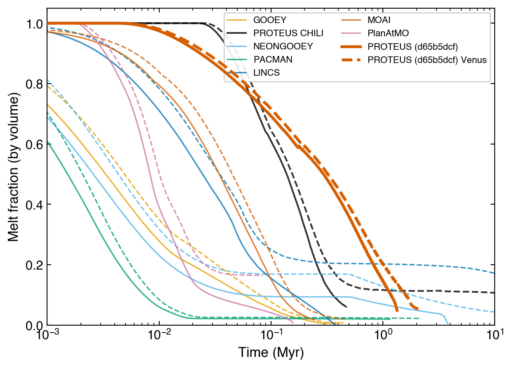{ width="100%" }
  <figcaption><strong>Figure 1.</strong> Melt fraction vs time for the CHILI Nominal Earth (solid lines) and Nominal Venus (dashed lines) cases. All seven models start fully molten and solidify within 0.1 to 4 Myr for Earth. Venus solidifies later due to higher instellation at 0.723 AU. PROTEUS predicts solidification at 1.34 Myr for Earth and 2.22 Myr for Venus, within the model ensemble range.</figcaption>
</figure>

## Solidification milestones

<figure markdown="span">
  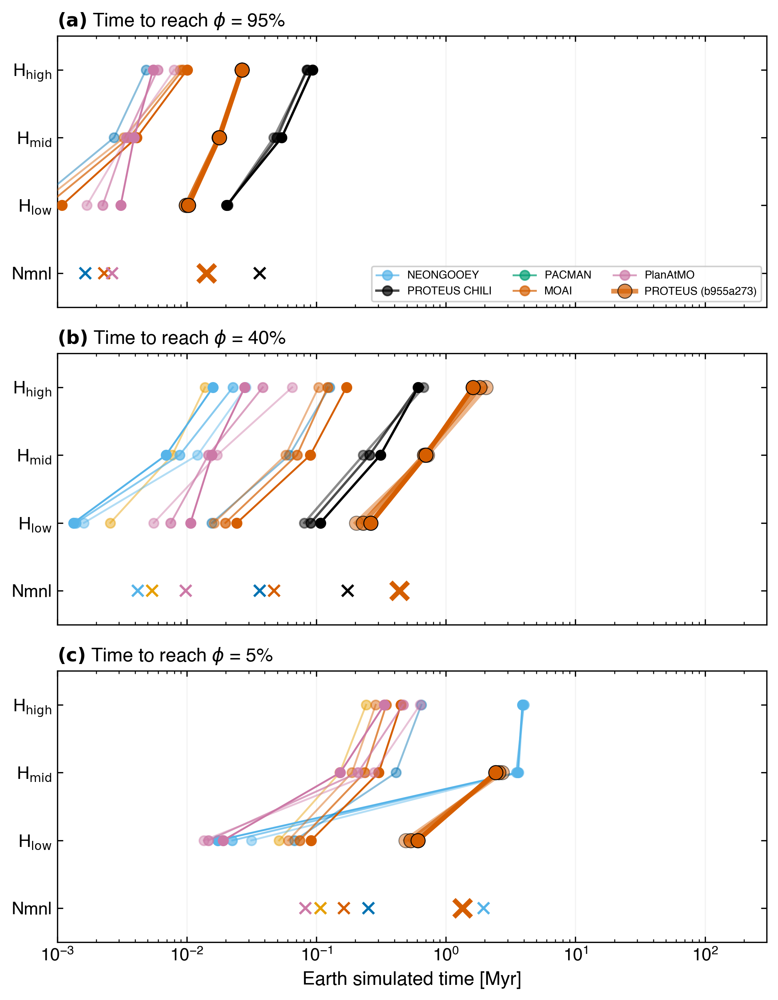{ width="100%" }
  <figcaption><strong>Figure 2.</strong> Time to reach melt fraction milestones for all Earth scenarios. (a) 95%, (b) 40%, (c) 5% melt fraction. The y-axis spans H inventories from the Nominal case (bottom) to H<sub>high</sub> (10 EO, top). C inventory is encoded as marker opacity (light = C<sub>low</sub>, medium = C<sub>mid</sub>, dark = C<sub>high</sub>). Connected scatter points trace the three H levels for each model at a given C level. The current PROTEUS run (vermillion, thick lines, black-edged markers) stands out from the CHILI intercomparison ensemble. Nominal Earth cases appear as crosses at the bottom of each panel.</figcaption>
</figure>

## Atmospheric composition

<figure markdown="span">
  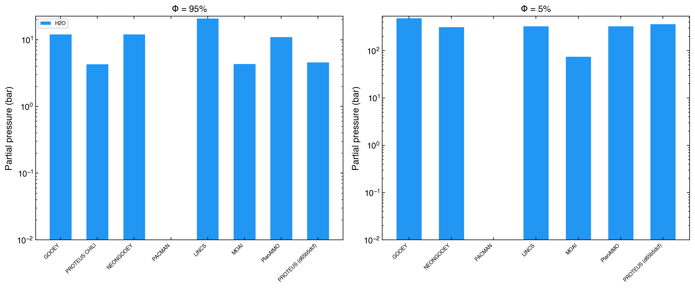{ width="100%" }
  <figcaption><strong>Figure 3.</strong> Atmospheric compositions for the Nominal Earth case at (a) 95% and (b) 5% melt fraction. Stacked bars show gas partial pressures [bar] for each model; grey stars mark surface temperature (right axis). The current PROTEUS run (vermillion label, black-edged bar) is placed next to the original CHILI submission for direct comparison. At 95% melt fraction, atmospheres are CO<sub>2</sub>-dominated; by 5%, H<sub>2</sub>O has exsolved from the crystallizing mantle and dominates at ~368 bar for PROTEUS. Both panels share the same y-axis range to highlight the pressure increase during solidification.</figcaption>
</figure>

## H and C mass budgets

<figure markdown="span">
  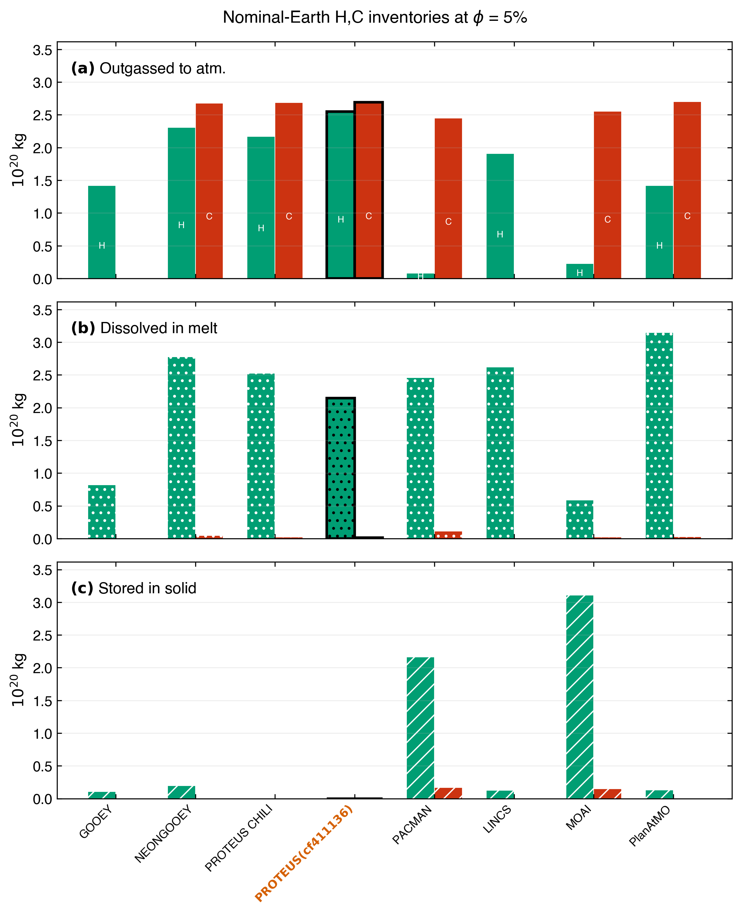{ width="100%" }
  <figcaption><strong>Figure 4.</strong> Hydrogen (green) and carbon (red) mass budgets at 5% melt fraction, distributed across three reservoirs: (a) outgassed to atmosphere, (b, dotted) dissolved in the remnant magma ocean, (c, hatched) stored in solidified mantle. The current PROTEUS run (vermillion label, black-edged bars) is placed next to the original CHILI submission. GOOEY and LINCS do not simulate carbon. MOAI and PACMAN store significant H in the solid mantle, while most other models retain H in the atmosphere or melt.</figcaption>
</figure>

## Venus atmospheric composition

<figure markdown="span">
  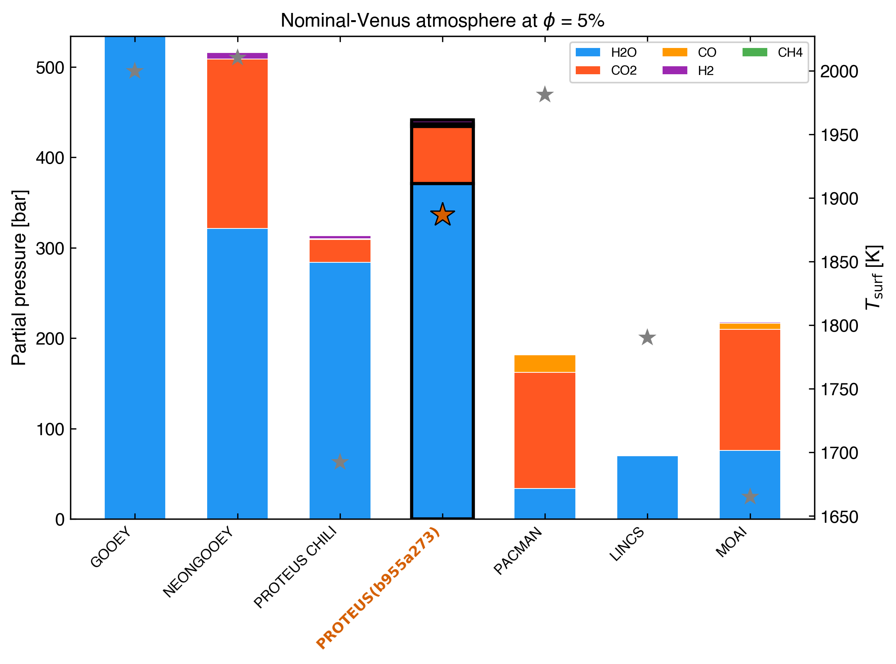{ width="100%" }
  <figcaption><strong>Figure 5.</strong> Atmospheric composition for the Nominal Venus case at 5% melt fraction. Stacked bars show gas partial pressures [bar]; grey stars mark surface temperature (right axis). The current PROTEUS run (vermillion label, black-edged bar) is placed next to the submitted PROTEUS CHILI result. The current run predicts ~397 bar H<sub>2</sub>O and ~62 bar CO<sub>2</sub> near solidification, for a total surface pressure of ~467 bar.</figcaption>
</figure>

## Oxygen fugacity

<figure markdown="span">
  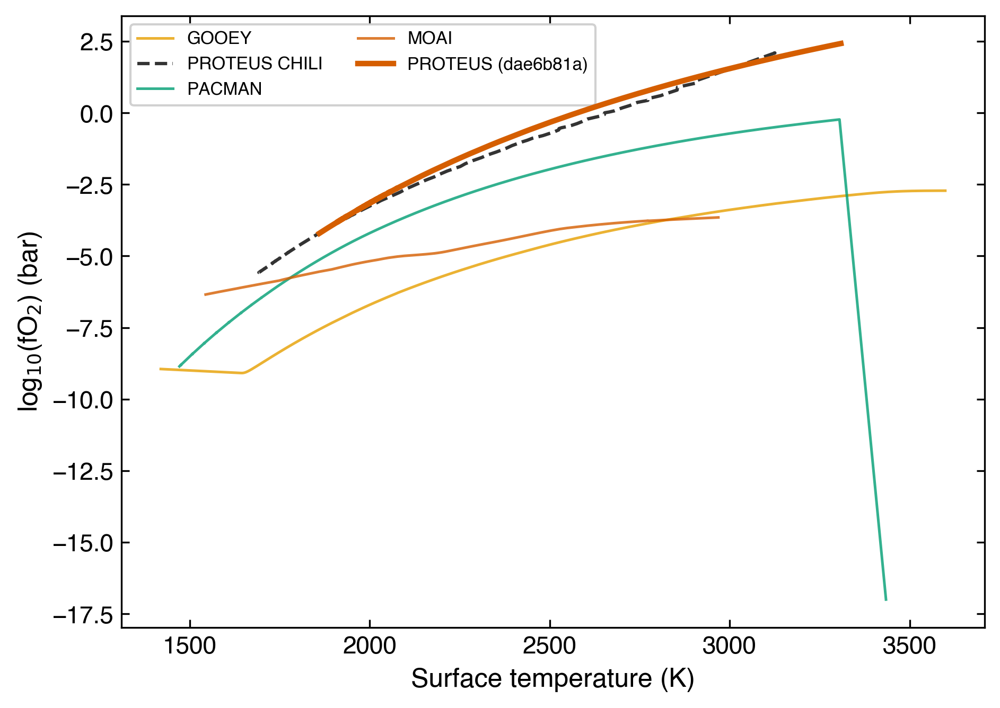{ width="100%" }
  <figcaption><strong>Figure 6.</strong> Oxygen fugacity from each model's Nominal Venus simulation, plotted as a function of degassing temperature. (a) Absolute fO<sub>2</sub> compared to the iron-wustite buffer parameterizations of Fischer et al. (2011, dotted) and O'Neill & Eggins (2002, dashed). (b) Relative fO<sub>2</sub> as delta-IW referenced to O'Neill+02. Circular markers indicate 5% melt fraction. The current PROTEUS run (vermillion, thick line, black-edged marker) tracks along IW+4 as prescribed by the CHILI protocol.</figcaption>
</figure>

## Volatile retention

<figure markdown="span">
  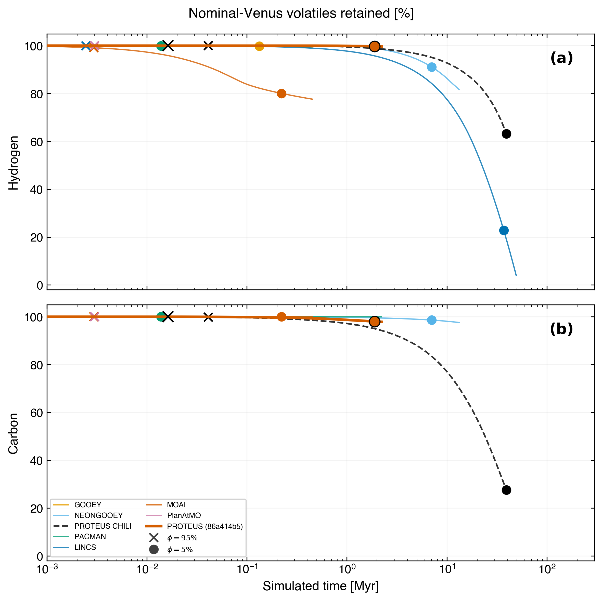{ width="100%" }
  <figcaption><strong>Figure 7.</strong> Relative amounts of the initial (a) hydrogen and (b) carbon inventories retained in the Nominal Venus case as a function of simulation time, with atoms lost from the planet by hydrodynamic escape. Crosses mark 95% melt fraction and circles mark 5% melt fraction. The submitted PROTEUS CHILI run (black dashed) extends to ~39 Myr and retains 63% of its hydrogen and 28% of its carbon by the time it reaches 5% melt fraction. The current PROTEUS run (vermillion, labelled with its git commit SHA) stops at solidification near 2.2 Myr, before hydrodynamic escape becomes significant, and so retains 99.7% of its hydrogen and 97.9% of its carbon.</figcaption>
</figure>

## Outgoing longwave radiation

<figure markdown="span">
  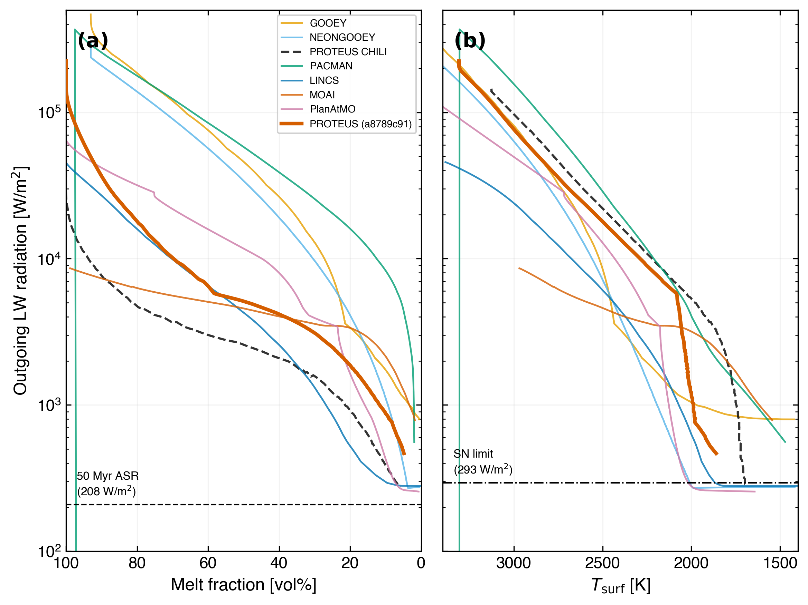{ width="100%" }
  <figcaption><strong>Figure 8.</strong> Outgoing longwave radiation flux from Nominal Earth, plotted as a function of (a) melt fraction and (b) surface temperature. In panel (a) the dashed line marks the absorbed stellar radiation (ASR = 208 W/m<sup>2</sup>) at 50 Myr stellar age with the CHILI protocol parameters. In panel (b) the dash-dot line marks the Simpson-Nakajima steam runaway limit (293 W/m<sup>2</sup>; Nakajima et al. 1992). OLR controls the cooling rate; PROTEUS OLR decreases from ~2 x 10<sup>5</sup> W/m<sup>2</sup> at full melt to ~466 W/m<sup>2</sup> at solidification.</figcaption>
</figure>

## Geodynamics diagnostics

<figure markdown="span">
  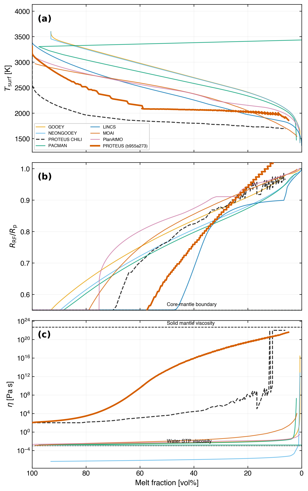{ width="100%" }
  <figcaption><strong>Figure 9.</strong> Geodynamics diagnostics as functions of melt fraction for the Nominal Earth case. (a) Surface temperature. (b) Rheological front radius in megameters; the dashed line marks the PROTEUS core-mantle boundary at 3.39 Mm (R<sub>core</sub>/R<sub>p</sub> = 0.49). (c) Effective mantle viscosity; the dashed line marks solid Earth mantle viscosity (5 x 10<sup>22</sup> Pa s), and the dotted line marks water STP viscosity (10<sup>-3</sup> Pa s). Current PROTEUS values are extracted from Aragog interior profiles at each timestep.</figcaption>
</figure>

## Surface pressure evolution

<figure markdown="span">
  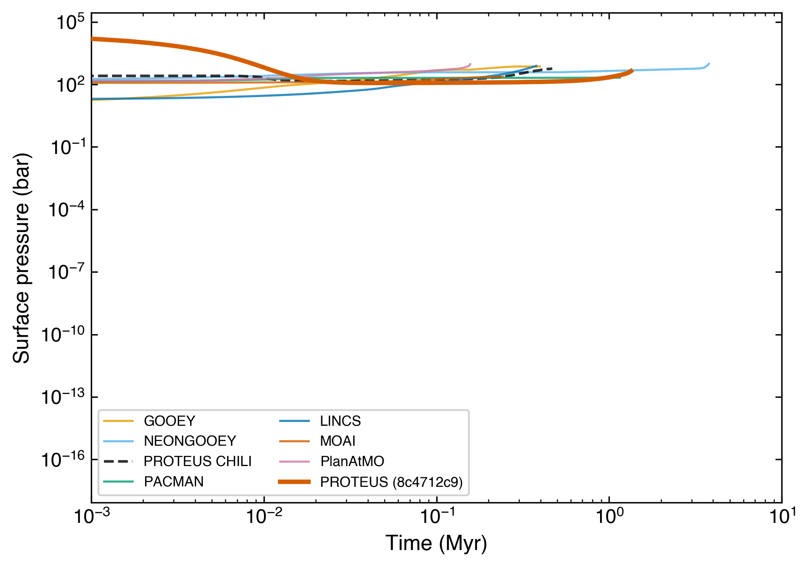{ width="100%" }
  <figcaption><strong>Figure 10.</strong> Surface pressure vs time for all models. The current PROTEUS run starts near 2x10<sup>4</sup> bar during the brief fully molten phase. This early peak is almost entirely molecular oxygen. CALLIOPE, the outgassing and gas-speciation module, solves the equilibrium atmospheric composition at the imposed oxygen fugacity, and because O<sub>2</sub> is one of the equilibrium species its partial pressure equals that fugacity. The CHILI protocol pins fO<sub>2</sub> at IW+4, and the iron-wustite buffer is steeply temperature-dependent, so at the magma temperature of the fully molten surface (~4290 K) it places fO<sub>2</sub>, and hence pO<sub>2</sub>, near 2x10<sup>4</sup> bar, about 99.6% of the total surface pressure. The magnitude comes from two compounding factors: the +4 dex offset multiplies the buffer value by 10<sup>4</sup>, and the high temperature already raises the iron-wustite fO<sub>2</sub> itself to a few bar. As the surface cools below ~3000 K the buffer falls by several orders of magnitude, oxygen becomes negligible, and the pressure drops to a minimum of ~117 bar set by CO<sub>2</sub> partitioning before rising to ~438 bar at solidification as H<sub>2</sub>O exsolves from the crystallizing mantle. The submitted PROTEUS CHILI run reaches a cooler molten surface (~3126 K) where the same IW+4 buffer gives only ~124 bar of O<sub>2</sub>, so no comparable spike appears. The early-time offset between the two PROTEUS curves is therefore set by the magma temperature at which CALLIOPE evaluates the buffer, not by which species are counted. Other models differ in the timing and magnitude of the pressure evolution, reflecting their volatile solubility and oxygen treatments.</figcaption>
</figure>

## Earth volatile grid

The CHILI Earth grid varies H and C inventories across 9
combinations to explore how volatile budgets control solidification
timescale:

| | C$_\mathrm{low}$ (1.36$\times$10$^{20}$ kg) | C$_\mathrm{mid}$ (2.73$\times$10$^{20}$ kg) | C$_\mathrm{high}$ (5.44$\times$10$^{20}$ kg) |
|---|---|---|---|
| **H$_\mathrm{low}$** (1.6$\times$10$^{20}$ kg) | 1 EO, low C | 1 EO, mid C | 1 EO, high C |
| **H$_\mathrm{mid}$** (7.8$\times$10$^{20}$ kg) | 5 EO, low C | 5 EO, mid C | 5 EO, high C |
| **H$_\mathrm{high}$** (16.0$\times$10$^{20}$ kg) | 10 EO, low C | 10 EO, mid C | 10 EO, high C |

Grid configs are in `input/tutorials/chili_grid/`. Run all 9 cases:

```bash
for cfg in input/tutorials/chili_grid/*.toml; do
    name=$(basename "$cfg" .toml)
    outdir="output/chili_grid_earth_${name#earth_}"
    mkdir -p "$outdir"
    nohup proteus start --offline -c "$cfg" \
        > "/tmp/proteus_grid_${name}.log" 2>&1 & disown
done
```

Check status of running grid cases:

```bash
for d in output/chili_grid_earth_*/; do
    printf "%-40s %s\n" "$(basename $d)" "$(cat $d/status 2>/dev/null || echo 'not started')"
done
```

!!! warning "Runtime"
    Low-H cases finish in ~1 hour. Mid-H cases take ~3-5 hours. High-H
    cases (10 Earth oceans) may take 12+ hours because the thick steam
    atmosphere reduces OLR to a few hundred W m$^{-2}$ in the late
    mushy zone.

### Grid results

Solidification times for the completed grid cases:

| | C$_\mathrm{low}$ | C$_\mathrm{mid}$ | C$_\mathrm{high}$ |
|---|---|---|---|
| **H$_\mathrm{low}$** (1 EO) | 0.49 Myr | 0.53 Myr | 0.61 Myr |
| **H$_\mathrm{mid}$** (5 EO) | 2.72 Myr | 2.55 Myr | 2.42 Myr |
| **H$_\mathrm{high}$** (10 EO) | 8.85 Myr | 8.45 Myr | 7.78 Myr |

Hydrogen inventory is the primary control on solidification timescale:
a ~5x increase in H budget (1 to 5 EO) delays solidification by a
factor of ~5, and a further 2x increase (5 to 10 EO) adds another
factor of ~3 (2.5 to 8.5 Myr). The carbon effect is secondary and
non-monotonic. At low H, more CO$_2$ adds greenhouse opacity and
slows cooling (0.49 to 0.61 Myr). At mid and high H, the effect
reverses: more CO$_2$ raises P$_\mathrm{surf}$, which via Henry's
law enhances H$_2$O dissolution in the silicate melt, reducing the
atmospheric H$_2$O greenhouse and allowing higher OLR (2.72 to
2.42 Myr at mid-H; 8.85 to 7.78 Myr at high-H).

<figure markdown="span">
  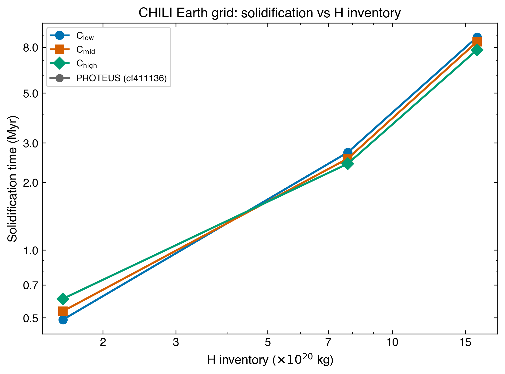{ width="80%" }
  <figcaption><strong>Figure 11.</strong> Solidification time of the current PROTEUS grid runs (solid lines, filled markers) as a function of hydrogen inventory for the three carbon levels. Where the submitted PROTEUS CHILI grid runs reach 5% melt by volume they are overlaid as dashed lines with open markers; the runs archived in the comparison repository stop just above that threshold, so no submitted points appear here. The near-linear scaling on the log-log axes reflects the blanketing effect of the steam atmosphere on OLR. The carbon-inventory dependence reverses sign between low-H and high-H cases (see text).</figcaption>
</figure>

## Current PROTEUS configuration vs the CHILI submission

Every figure shows two PROTEUS curves, and the gap between them is itself
informative because the two come from different model configurations. The
protocol fixes the inputs that both share: a bulk-silicate-Earth
composition, oxygen fugacity at IW+4, a Bond albedo of 0.1, and a 50 Myr
stellar age[^cite-lichtenberg2026]. What differs is the interior machinery.

The PROTEUS results submitted to the intercomparison were computed with an
earlier version of PROTEUS, not the configuration documented here. That
version used **SPIDER** for the interior thermal evolution and an
Adams-Williamson integration for the interior structure. See Lichtenberg
et al. (2026)[^cite-lichtenberg2026] and Nicholls et al. (2026, in
prep.)[^cite-nicholls2026] for further details.

The configuration documented on this page uses **Aragog** for the
interior thermal evolution and **Zalmoxis** for the interior structure.
Aragog advances the same magma ocean in a temperature-pressure
formulation, and Zalmoxis solves the layered interior structure (mass,
radius, density profile, and core-mantle-boundary radius) directly rather
than from the Adams-Williamson approximation.

## Takeaways

Earth and Venus begin from the same fully molten state and diverge as they
cool. Across the model ensemble both solidify on million-year timescales,
with Venus lagging Earth because its higher instellation slows radiative
cooling, and the spread between codes at any given moment reflects genuine
differences in how each treats atmospheric opacity, volatile partitioning,
and interior convection. PROTEUS captures this evolution by coupling a
radiative-convective atmosphere, equilibrium outgassing, and a 1D interior
solver, advancing the magma ocean from melt through solidification while
tracking the volatiles exchanged between the mantle and the atmosphere.

The point of this tutorial is to place the current PROTEUS against that
published ensemble on demand. The comparison figures are regenerated from
your own checkout and labelled with its git commit, so re-running the
plotting command benchmarks whatever version of PROTEUS you are running
against the fixed literature values from the CHILI papers. It is therefore
an always-current intercomparison: a quick way to confirm that a new
PROTEUS release still reproduces the established Earth and Venus
solidification behaviour, and to see where it sits relative to the other
community codes.

---

**See also:** [Earth analogue](earth_analogue.md) | [Model description](../Explanations/model.md) | [Output format](../Reference/output.md)

[^cite-lichtenberg2026]: Lichtenberg, T., Schaefer, L., Krissansen-Totton, J., et al., *[Coupled atmospHere Interior modeL Intercomparison (CHILI): Protocol Version 1.0](https://doi.org/10.3847/PSJ/ae593b)*, The Planetary Science Journal, 7, 108, 2026. [SciX](https://scixplorer.org/abs/2026PSJ.....7..108L/abstract).

[^cite-nicholls2026]: Nicholls, H. et al., *Coupled atmospHere Interior modeL Intercomparison (CHILI). I. Evolutionary Modelling: Primordial Magma Oceans of Earth and Venus*, in preparation, 2026.
