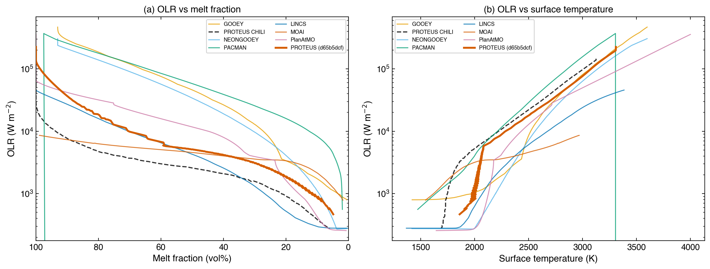
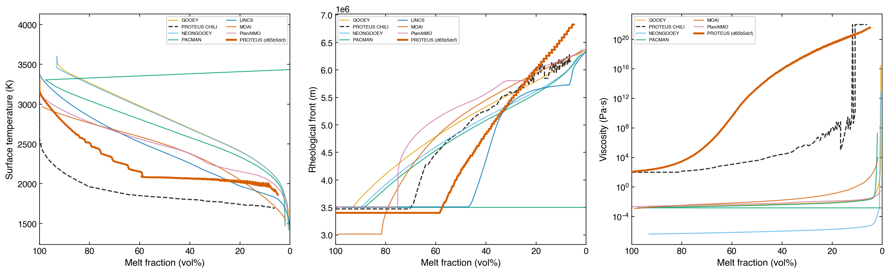

# CHILI intercomparison

The CHILI (Coupled atmosHere Interior modeL Intercomparison) is a
community benchmark for magma ocean evolution
codes[^cite-lichtenberg2026]. This tutorial reproduces the CHILI test
suite with PROTEUS and compares results against six other coupled
atmosphere-interior models: GOOEY, NEONGOOEY, PACMAN, LINCS, MOAI,
and PlanAtMO[^cite-nicholls2026].

## Overview

The CHILI intercomparison defines three solar system test cases:

| Case | Planet | Key difference from Earth |
|------|--------|--------------------------|
| Nominal Earth | 1 M$_\oplus$ at 1 AU | Baseline case |
| Nominal Venus | 0.815 M$_\oplus$ at 0.723 AU | Higher instellation |
| Earth grid | 3 $\times$ 3 H/C inventory variations | Volatile sensitivity |

All cases start fully molten at 50 Myr stellar age with BSE composition,
fO$_2$ = IW+4, and Bond albedo = 0.1. Simulations run until the melt
fraction drops below 5%.

## Prerequisites

- Full PROTEUS installation (see [Installation](../How-to/installation.md))
- AGNI, SOCRATES, and all reference data
- `git` (to clone the CHILI comparison data)
- Allow 1-3 hours per run (Earth ~1.5 hr, Venus ~3 hr)

## Step 1: Run the nominal cases

```bash
conda activate proteus

# Earth (see also the Earth analogue tutorial for detailed analysis)
nohup proteus start --offline -c input/tutorials/tutorial_earth.toml \
    > output/tutorial_earth/launch.log 2>&1 & disown

# Venus
nohup proteus start --offline -c input/tutorials/tutorial_venus.toml \
    > output/tutorial_venus/launch.log 2>&1 & disown
```

## Step 2: Download comparison data

Clone the CHILI repository to access results from the other codes:

```bash
git clone https://github.com/projectcuisines/chili.git /tmp/chili
```

## Step 3: Generate comparison plots

```bash
python tools/plot_chili_comparison.py \
    --proteus-earth output/tutorial_earth/ \
    --proteus-venus output/tutorial_venus/ \
    --chili-repo /tmp/chili \
    --output output_files/chili_plots/
```

All plots use the Wong colorblind-friendly palette. The previous PROTEUS
submission to the CHILI intercomparison appears as a dashed black line
("PROTEUS CHILI"), while the current PROTEUS run appears in vermillion
with the git commit SHA in the legend.

## Melt fraction evolution (Fig. 1)

<figure markdown="span">
  { width="100%" }
  <figcaption>Melt fraction vs time for the CHILI Nominal Earth (solid lines) and Nominal Venus (dashed lines) cases. All seven models start fully molten and solidify within 0.1 to 4 Myr for Earth. Venus solidifies later due to higher instellation at 0.723 AU. PROTEUS predicts solidification at 1.34 Myr for Earth and 2.22 Myr for Venus, within the model ensemble range. The spread among models reflects differences in atmospheric opacity, mantle convection treatment, and volatile partitioning.</figcaption>
</figure>

## Solidification milestones (Fig. 2)

<figure markdown="span">
  { width="100%" }
  <figcaption>Time to reach melt fraction milestones (95%, 40%, and 5%) for the Nominal Earth case. Each line connects the three milestones for one model. PROTEUS (vermillion squares) reaches 95% at 14 kyr, 40% at 434 kyr, and 5% at 1.34 Myr. The spread across models is roughly one order of magnitude at each milestone.</figcaption>
</figure>

## Atmospheric composition (Fig. 3)

<figure markdown="span">
  { width="100%" }
  <figcaption>Atmospheric partial pressures at two solidification stages for the Nominal Earth case. Left: at 95% melt fraction (early). Right: at 5% melt fraction (solidification). Bars show partial pressures of H<sub>2</sub>O, CO<sub>2</sub>, CO, H<sub>2</sub>, CH<sub>4</sub>, and other species. At early times, CO<sub>2</sub> dominates for PROTEUS. At solidification, H<sub>2</sub>O has exsolved from the mantle and dominates the atmosphere at ~360 bar.</figcaption>
</figure>

## H and C mass budgets (Fig. 4)

<figure markdown="span">
  { width="100%" }
  <figcaption>Hydrogen (left) and carbon (right) mass budgets at solidification, partitioned into atmosphere, melt, and solid reservoirs. For PROTEUS, most hydrogen resides in the atmosphere at solidification (the melt reservoir is nearly empty), while carbon is split between atmosphere and solid mantle. Models that track fewer volatile species (e.g. GOOEY reports no carbon) show gaps.</figcaption>
</figure>

## fO$_2$ vs degassing temperature (Fig. 6)

<figure markdown="span">
  { width="100%" }
  <figcaption>Oxygen fugacity vs surface temperature during magma ocean evolution. PROTEUS tracks along the IW+4 buffer (Fischer et al. 2011 parameterization) as specified by the CHILI protocol. The absolute fO<sub>2</sub> decreases with temperature following the thermodynamic IW equilibrium. Models that track photochemical oxygen evolution show departures from the prescribed buffer at low temperatures.</figcaption>
</figure>

## Outgoing longwave radiation (Fig. 7)

<figure markdown="span">
  { width="100%" }
  <figcaption>Outgoing longwave radiation (OLR) as a function of melt fraction (left) and surface temperature (right) for the Nominal Earth case. OLR controls the cooling rate: higher OLR means faster solidification. PROTEUS shows a monotonic decrease in OLR with decreasing melt fraction, from ~2 x 10<sup>5</sup> W m<sup>-2</sup> at full melt to ~240 W m<sup>-2</sup> at solidification. The OLR-temperature relationship reveals differences in atmospheric opacity treatment across models.</figcaption>
</figure>

## Geodynamics diagnostics (Fig. 8)

<figure markdown="span">
  { width="100%" }
  <figcaption>Surface temperature (left), rheological front radius (center), and mantle viscosity (right) as functions of melt fraction. The rheological front is the radius where the local melt fraction crosses the critical value of 0.4, marking the transition from convective melt to viscous solid. It propagates outward from the CMB as solidification proceeds. PROTEUS rheological front and viscosity are extracted from the Aragog interior profiles at each timestep.</figcaption>
</figure>

## Surface pressure evolution

<figure markdown="span">
  { width="100%" }
  <figcaption>Surface pressure vs time for all models. PROTEUS surface pressure evolves from ~80 bar initially to ~430 bar at solidification for the Earth case, driven by H<sub>2</sub>O exsolution from the crystallizing mantle. Models differ in the timing and magnitude of the pressure increase, reflecting different volatile solubility treatments.</figcaption>
</figure>

## Earth volatile grid (optional)

The full CHILI Earth grid varies H and C inventories across 9
combinations:

| | C$_\mathrm{low}$ (1.36$\times$10$^{20}$ kg) | C$_\mathrm{mid}$ (2.73$\times$10$^{20}$ kg) | C$_\mathrm{high}$ (5.44$\times$10$^{20}$ kg) |
|---|---|---|---|
| **H$_\mathrm{low}$** (1.6$\times$10$^{20}$ kg) | 0.5 EO, low C | 0.5 EO, mid C | 0.5 EO, high C |
| **H$_\mathrm{mid}$** (7.8$\times$10$^{20}$ kg) | 5 EO, low C | 5 EO, mid C | 5 EO, high C |
| **H$_\mathrm{high}$** (16.0$\times$10$^{20}$ kg) | 10 EO, low C | 10 EO, mid C | 10 EO, high C |

Grid configs are in `input/tutorials/chili_grid/`. Run all 9 cases:

```bash
for cfg in input/tutorials/chili_grid/*.toml; do
    nohup proteus start --offline -c "$cfg" \
        > "output/$(basename $cfg .toml)/launch.log" 2>&1 & disown
done
```

Low-H cases solidify in ~0.5 Myr; high-H cases take several Myr due
to thicker, more opaque atmospheres that slow radiative cooling.

## Key findings

1. **Earth solidifies within 4 Myr across all models**, consistent with
   geological constraints from the oldest zircons. PROTEUS predicts
   1.34 Myr.

2. **Venus solidifies ~50-70% slower than Earth** due to the higher
   instellation at 0.723 AU. PROTEUS predicts 2.22 Myr for Venus vs
   1.34 Myr for Earth.

3. **Cooling timescales correlate with hydrogen inventory**: higher H
   budgets produce thicker, more opaque steam atmospheres that slow
   radiative cooling. The low-H grid cases solidify in ~0.5 Myr, while
   the high-H cases take several Myr.

4. **Model differences arise from**: gas chemistry (which species are
   tracked and whether equilibrium or kinetic), volatile partitioning
   (solubility laws), radiative transfer (correlated-k vs grey), mantle
   convection (mixing length vs parameterized), and melting curve
   prescriptions.

---

**See also:** [Earth analogue](earth_analogue.md) | [Model description](../Explanations/model.md) | [Output format](../Reference/output.md)

[^cite-lichtenberg2026]: Lichtenberg, T., Schaefer, L., Krissansen-Totton, J., et al., *[Coupled atmosHere Interior modeL Intercomparison (CHILI): Protocol Version 1.0](https://doi.org/10.3847/PSJ/ae593b)*, The Planetary Science Journal, 7, 108, 2026. [SciX](https://scixplorer.org/abs/2026PSJ.....7..108L/abstract).

[^cite-nicholls2026]: Nicholls, H. et al., *Coupled atmosHere Interior modeL Intercomparison (CHILI). I. Evolutionary Modelling of the Inner Solar System*, in preparation, 2026.
