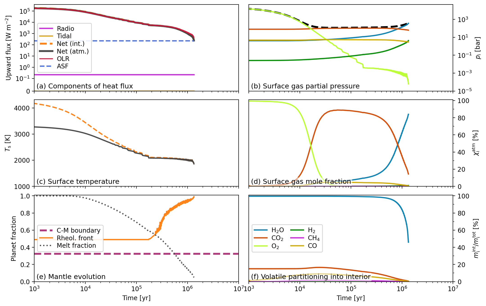
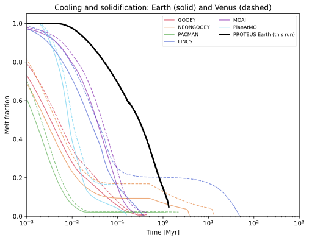
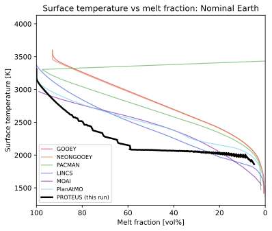

# Earth analogue

This tutorial simulates the thermal and atmospheric evolution of an
Earth-mass planet at 1 AU from a Sun-like star, reproducing the nominal
Earth case from the CHILI intercomparison[^cite-lichtenberg2026].

It uses the production-quality module combination:
[Aragog](https://proteus-framework.org/aragog/) (interior energetics),
[Zalmoxis](https://proteus-framework.org/Zalmoxis/) (interior structure),
[CALLIOPE](https://proteus-framework.org/CALLIOPE/) (outgassing), and
[AGNI](https://www.h-nicholls.space/AGNI/) (atmosphere climate).

## Prerequisites

- Full PROTEUS installation with AGNI and SOCRATES compiled
- `FWL_DATA` and `RAD_DIR` environment variables set
- Spectral files downloaded (`proteus get spectral`)
- Solar spectrum downloaded (`proteus get stellar`)

## Physical setup

This case follows Table 2 of the CHILI protocol paper:

| Parameter | Value |
|-----------|-------|
| Planet mass | 1 M$_\oplus$ |
| Core radius fraction | 0.55 |
| Stellar mass | 1 M$_\odot$ |
| Starting stellar age | 50 Myr |
| Semi-major axis | 1 AU |
| Bond albedo | 0.1 |
| Oxygen fugacity | IW+4 |
| Hydrogen inventory | 4.7 $\times$ 10$^{20}$ kg (3 Earth oceans H$_2$O) |
| Carbon inventory | 2.73 $\times$ 10$^{20}$ kg (10$^{21}$ kg CO$_2$) |
| Initial thermal state | Fully molten (S = 3900 J/kg/K) |
| Termination | Melt fraction $\Phi$ < 5% |

The planet starts fully molten and cools through a magma ocean stage.
Volatiles partition between the atmosphere and silicate melt as the mantle
solidifies. The atmosphere is solved self-consistently at each timestep
using correlated-k radiative transfer (AGNI). Atmospheric escape is
energy-limited (ZEPHYRUS, 30% efficiency).

## Running the simulation

```bash
conda activate proteus
nohup proteus start --offline -c input/tutorial_earth.toml \
    > output/tutorial_earth/launch.log 2>&1 & disown
```

!!! warning "Runtime"
    This run takes 30 minutes to several hours depending on your machine.
    The initial Zalmoxis structure solve (~10-20 min) is the slowest phase.
    Monitor progress with `tail -f output/tutorial_earth/proteus_00.log`.

## Configuration

The config at `input/tutorial_earth.toml` sets:

- **Star**: Sun on Spada[^cite-spada2013] tracks starting at 50 Myr. The solar
  spectrum is used for radiative transfer. Stellar luminosity, radius, and
  XUV flux evolve with age.
- **Interior**: Aragog solves the mantle energy equation on an 80-node radial
  grid using SUNDIALS CVODE with JAX Jacobian. Zalmoxis computes the
  hydrostatic structure using PALEOS EOS tables.
- **Outgassing**: CALLIOPE partitions H$_2$O, CO$_2$, H$_2$, CH$_4$, and CO
  between atmosphere and melt at the fO$_2$ = IW+4 buffer.
- **Atmosphere**: AGNI solves the radiative-convective equilibrium with
  Dayspring 48-band correlated-k opacities, a conductive skin layer at the
  surface, and real-gas corrections.
- **Escape**: ZEPHYRUS computes energy-limited mass loss at 30% efficiency,
  distributing the bulk escape rate across elements proportionally.

## Expected output

The simulation should produce:

- **Solidification time**: ~1.3 Myr (consistent with CHILI models, 0.5-4 Myr range)
- **Surface temperature**: cooling from ~4300 K to ~1860 K (solidus)
- **Melt fraction**: decreasing from 1.0 to 0.05 (termination threshold)
- **Surface pressure**: evolving from ~280 bar at Phi = 0.95 to ~440 bar at solidification
- **Atmospheric composition**: H$_2$O/CO$_2$-dominated throughout

After the run completes, generate plots:

```bash
proteus plot -c input/tutorial_earth.toml all
```

<figure markdown="span">
  { width="100%" }
  <figcaption>Earth analogue tutorial output (log scale). (a) Heat fluxes:
  interior flux (F_int) and atmospheric outgoing flux (F_atm) track the
  cooling trajectory. (b) Surface partial pressures of outgassed species.
  (c) Melt fraction decreasing from 1.0 to 0.05 over 1.3 Myr. (d) Magma
  temperature cooling from ~4300 K to ~1860 K at solidification.</figcaption>
</figure>

## Comparison with CHILI models

The CHILI intercomparison compares PROTEUS against six other
atmosphere-interior evolution codes (GOOEY, NEONGOOEY, PACMAN,
LINCS, MOAI, PlanAtMO). For the nominal Earth case, all models
predict solidification within 4 Myr.

<figure markdown="span">
  { width="80%" }
  <figcaption>Melt fraction evolution for the CHILI Nominal Earth case.
  PROTEUS (black, thick) overlaid on six intercomparison models. Solid
  lines: Earth. All models predict solidification within 4 Myr.</figcaption>
</figure>

<figure markdown="span">
  { width="80%" }
  <figcaption>Surface temperature vs melt fraction for the CHILI Nominal
  Earth case. PROTEUS (black, thick) compared against six
  intercomparison models.</figcaption>
</figure>

For a detailed comparison including the Venus case and the
Earth volatile grid, see the
[CHILI intercomparison tutorial](chili_intercomparison.md).

## Things to try

- **Venus analogue**: change `planet.mass_tot = 0.815`,
  `orbit.semimajoraxis = 0.723` to simulate Venus. Expect longer
  solidification times due to higher instellation.
- **Volatile sensitivity**: vary `H_budget` between 1.6e20 and 1.6e21 kg
  to explore the effect of hydrogen inventory on cooling time.
- **Reduced mantle**: set `outgas.fO2_shift_IW = -2` to simulate a
  reduced mantle producing H$_2$-rich instead of H$_2$O-rich atmospheres.

---

**See also:** [Model description](../Explanations/model.md) | [Coupling loop](../Explanations/coupling_loop.md) | [Configuration reference](../Reference/config/params.md) | [Output format](../Reference/output.md)

[^cite-lichtenberg2026]: Lichtenberg, T., Schaefer, L., Krissansen-Totton, J., et al., *[Coupled atmosHere Interior modeL Intercomparison (CHILI): Protocol Version 1.0](https://doi.org/10.3847/PSJ/ae593b)*, The Planetary Science Journal, 7, 108, 2026. [SciX](https://scixplorer.org/abs/2026PSJ.....7..108L/abstract).

[^cite-spada2013]: Spada, F., Demarque, P., Kim, Y.C. & Sills, A., *[The radius discrepancy in low-mass stars: single versus binaries](https://doi.org/10.1088/0004-637X/776/2/87)*, The Astrophysical Journal, 776, 87, 2013. [SciX](https://scixplorer.org/abs/2013ApJ...776...87S/abstract).
