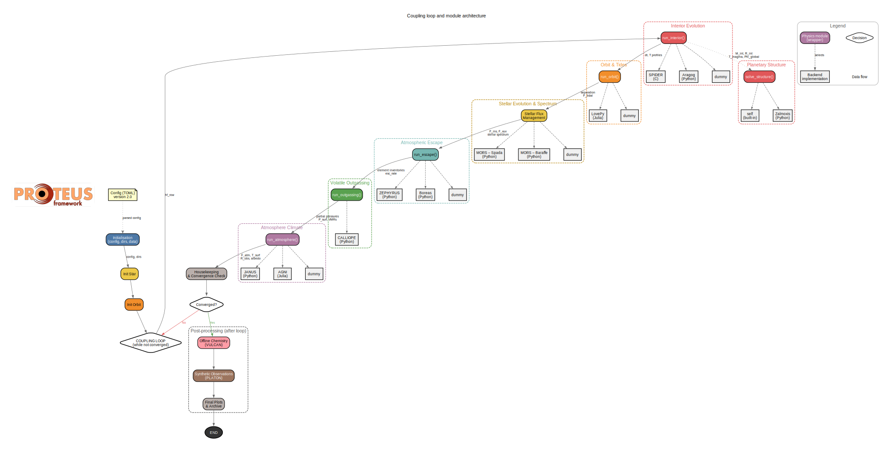

# Code Architecture

This page provides a high-level overview of the PROTEUS code architecture, the coupling loop that drives simulations, and the modular design that connects physics implementations. For a scientific description of the model, see the [Model description](model.md).

## Interactive Flowchart

The diagram below shows the full coupling loop and module architecture. **Click on any node** to navigate to the corresponding source file on GitHub. Solid arrows indicate execution flow; dashed arrows connect wrapper functions to their selectable backend implementations. Edge labels describe the key variables exchanged between modules.

  <object data="assets/proteus_flowchart.svg" type="image/svg+xml" style="max-width: 100%; height: auto;">
    
  </object>

<small><em>Regenerate this chart: <code>python tools/generate_flowchart.py --output-dir docs/assets</code></em></small>

## Core Design

PROTEUS is built around a single central class, `Proteus` (defined in `src/proteus/proteus.py`), which owns the simulation state and orchestrates all module calls. Configuration is parsed from a TOML file into an `attrs`-based `Config` object (`src/proteus/config/`), which validates constraints across modules at load time.

The simulation state is tracked via a *helpfile* — a flat dictionary (`hf_row`) for the current iteration and a Pandas DataFrame (`hf_all`) accumulating the full history. Every module reads from and writes into `hf_row`, which acts as the shared data bus between physics components.

## Coupling Loop

The `Proteus.start()` method executes the main time-stepping loop. After initialisation (directory setup, data download, stellar model preparation, orbital parameter setup), the loop repeats the following sequence each iteration:

1. **Interior evolution** — Advance the mantle/core thermal state by one time-step. Backends: SPIDER (C, entropy formalism), Aragog (Python, temperature formalism), or dummy.
2. **Planetary structure** — Recompute mass–radius relationship. Backends: built-in scaling or Zalmoxis.
3. **Orbit & tides** — Update orbital parameters, compute tidal heating rates and the Hill radius. Backends: LovePy (Julia) or dummy.
4. **Stellar flux management** — Update stellar luminosity, radius, and spectrum as a function of stellar age. Backends: MORS with Spada or Baraffe tracks, or dummy (fixed blackbody).
5. **Atmospheric escape** — Calculate bulk mass-loss rates and update elemental inventories. Backends: ZEPHYRUS, Boreas, or dummy.
6. **Outgassing** — Solve volatile speciation and surface partial pressures via thermodynamic equilibrium. Backend: CALLIOPE.
7. **Atmosphere climate** — Solve the radiative(-convective) energy balance to obtain the atmospheric thermal structure, OLR, and transit radius. Backends: JANUS (Python), AGNI (Julia), or dummy.
8. **Housekeeping & convergence** — Extend the helpfile, check termination criteria (solidification, energy balance, escape, maximum time/iterations), and optionally produce plots and archives.

The loop terminates when convergence criteria are satisfied for two consecutive iterations (strict mode) or once (non-strict mode). After exit, optional post-processing steps run: offline atmospheric chemistry (VULCAN) and synthetic observations (PLATON).

## Module Dispatch Pattern

Each physics domain follows the same wrapper pattern:

- A **wrapper function** in `<domain>/wrapper.py` provides the unified interface called by `Proteus.start()`.
- Inside the wrapper, a `match`/`if` block dispatches to the configured **backend** (e.g. `config.interior.module == 'aragog'`).
- Backend-specific code lives in dedicated files (e.g. `interior/aragog.py`, `interior/spider.py`).
- A **dummy** backend is available for most domains, providing simplified or parameterised physics for testing and debugging.

This pattern makes it straightforward to add new physics implementations: create a new backend file, add a dispatch branch in the wrapper, and extend the config schema.

## Key Source Directories

| Directory | Purpose |
|---|---|
| `src/proteus/proteus.py` | Core `Proteus` class and coupling loop |
| `src/proteus/config/` | TOML configuration parsing and validation |
| `src/proteus/interior/` | Interior evolution (SPIDER, Aragog, Zalmoxis) |
| `src/proteus/atmos_clim/` | Atmosphere climate (JANUS, AGNI) |
| `src/proteus/atmos_chem/` | Atmospheric chemistry (VULCAN) |
| `src/proteus/star/` | Stellar evolution and spectra (MORS) |
| `src/proteus/escape/` | Atmospheric escape (ZEPHYRUS, Boreas) |
| `src/proteus/outgas/` | Volatile outgassing (CALLIOPE) |
| `src/proteus/orbit/` | Orbital mechanics and tides (LovePy) |
| `src/proteus/observe/` | Synthetic observations (PLATON) |
| `src/proteus/utils/` | Shared utilities, constants, termination logic, plotting helpers |
| `src/proteus/plot/` | Plotting routines for simulation output |
| `src/proteus/grid/` | Parameter-grid management |
| `src/proteus/inference/` | Bayesian inference and optimisation |

## Data Flow Summary

All modules communicate through `hf_row`. The most important exchanged quantities are:

- **Interior → Atmosphere**: `T_magma`, `Phi_global` (melt fraction), `F_int` (interior heat flux)
- **Atmosphere → Interior**: `F_atm` (net atmospheric flux), `T_surf` (surface temperature)
- **Star → Atmosphere**: stellar spectrum (`wl`, `fl`), `F_ins` (instellation), `F_xuv`
- **Outgassing → Atmosphere**: partial pressures (`*_bar`), VMRs, `P_surf`
- **Escape → Outgassing**: updated elemental inventories (`*_kg_total`)
- **Orbit → All**: `separation`, `F_tidal`, `hill_radius`
