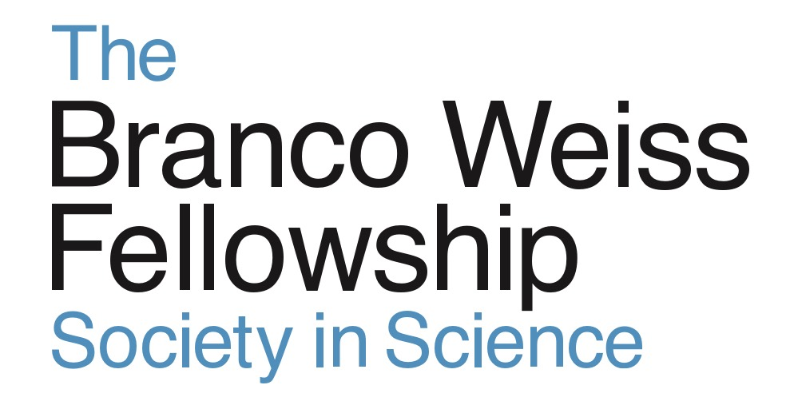
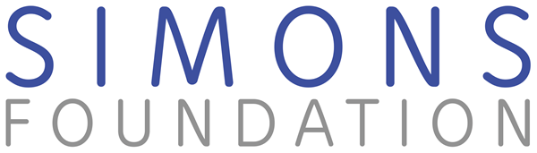

# PROTEUS Funding Sources

We are thankful for the continous support of the larger scientific community and funding by the public of fundamental research. The development of PROTEUS has been made possible by the invaluable support of the following organisations:

  

  

  

  

  

  

