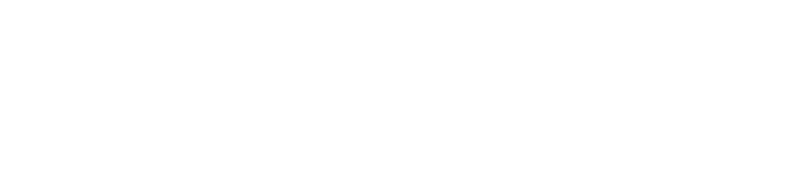
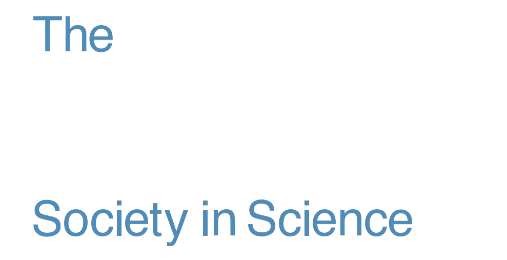
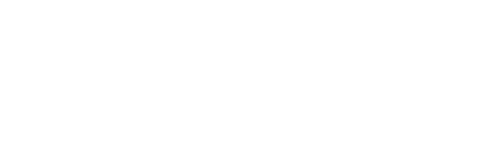

<h1>PROTEUS Funding Sources</h1>

  We are thankful for the continuous support of the larger scientific community
  and funding by the public of fundamental research. The development of PROTEUS
  has been made possible by the invaluable support of the following organisations:

