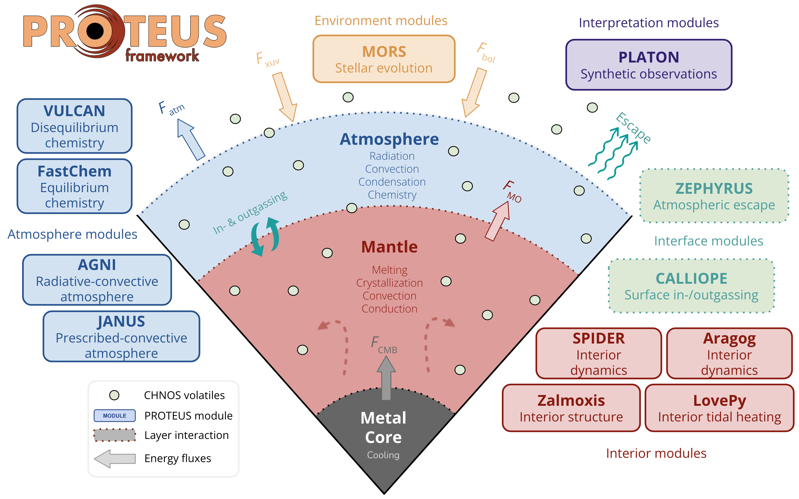

# PROTEUS Model Framework

## Overview

PROTEUS is a modular framework for simulating the time evolution of small (exo)planets. It is designed to be flexible, reflecting the broad diversity of planetary conditions already discovered, with the view of being updated to incorporate additional physics as the need arises. This approach stands in contrast to common monolithic models in the literature. PROTEUS is free and open-source, which permits external scrutiny of its workings. It is directly based upon the model of Lichtenberg et al. (2021) although the code has evolved substantially from that state.

## Design philosophy

George Box famously put that "all models are wrong, but some are useful". PROTEUS therefore leverages a modular and hierarchical modelling approach. Multiple independent models can fill the role of a given module, and each model can be used stand-alone. Hierarchical modelling allows inter-comparison of simple and complex models, taking advantage of the easy comprehension of the simple in order to diagnose and validate the qualitative behaviour of the complex. Simplified _dummy_ modules are not designed for quantitatively meaningful calculations, but only to qualitatively capture end-member behaviours.

## System architecture

Although PROTEUS aims to treat the problem of *planetary* evolution, it must necessarily also handle external processes which act upon the planet (e.g. tidal heating). The framework therefore models the combined system of a planet, its orbital mechanics, and the evolution of its host star. The planet itself is conceptually sub-divided into a vaporised *atmosphere* component above an *interior* component containing a silicate mantle and metallic core. PROTEUS facilitates communication between individual software *modules* which each implement a model for a specific part of the overall system. Conceptually, PROTEUS modules (e.g. the interior) are 'slots' which are filled by specific implementations: the 'models' (e.g. Aragog).

       
      <b>Schematic of PROTEUS components and corresponding modules.</b>  

### Module overview

| Module | Implementations | Role |
|--------|----------------|------|
| Interior | Aragog, SPIDER, dummy | Mantle/core thermal evolution |
| Atmosphere (climate) | AGNI, JANUS, dummy | Radiative-convective profile |
| Atmosphere (chemistry) | VULCAN, dummy | Chemical kinetics |
| Star | MORS, dummy | Stellar evolution |
| Escape | ZEPHYRUS, dummy | Atmospheric escape |
| Outgassing | CALLIOPE, dummy | Volatile exchange between interior and atmosphere |
| Orbit | Obliqua, dummy | Orbital evolution and tidal heating |

## Time evolution vs equilibrium

Only the interior and star modules have an explicit notion of time-evolution. All other modules are applied at equilibrium, such that the quantities calculated by these modules are effectively updated instantaneously at each time-step. This assumes that the physical processes handled by these equilibrium modules reach steady-state on time-scales shorter than the physics considered by interior and stellar evolution modules.

For further information on the model, see the [Bibliography](bibliography.md).
