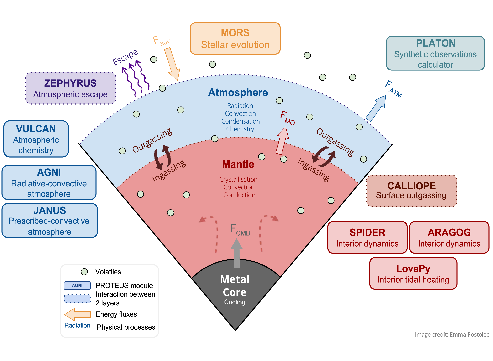

# Summary

[PROTEUS](https://github.com/FormingWorlds/PROTEUS) is a modular numerical framework designed to tackle the interdisciplinary challenge of understanding the coupled evolution of the atmospheres and interiors of rocky planets and exoplanets over geologic timescales. It iteratively couples the numerical solutions of interoperable physical and chemical modules, each of which are designed to describe a specific component of the planet and its environment. Processes considered are, for example, atmospheric radiative transfer, stellar evolution, volatile in- and outgassing, and mantle convection. By employing an evolutionary framework, PROTEUS is able to resolve how interior-atmosphere history leads to hysteresis in planetary composition, climate, and structure that steady-state approaches cannot disambiguate. Its modularity allows robust physical and numerical tests against known semi-analytic solutions and empirical evidence on the level of both individual processes and the interconnected planet system. The current primary use case of PROTEUS is the simulation of the coupled geophysical and climatic evolution of individual and ensembles of rocky (exo-)planets from their primordial magma ocean phase to either global energy balance equilibrium, mantle solidification, or complete atmospheric escape. Simulation results can be aimed at advancing our theoretical understanding of planetary evolution or be compared against current and future astronomical observations. Through its modular implementation, PROTEUS offers multiple avenues to extend its functionality and use-cases in the future, for example toward more volatile-rich planets, solid-state geodynamics, prebiotic and biotic chemistry, and statistical inference 'retrieval' methods.

# Background

Advances in astronomical instrumentation, such as the launch of the James Webb Space Telescope (JWST), now enable the spectral characterization of low-mass extrasolar planets, in particular so-called super-Earths and sub-Neptunes [@kempton24], which have no Solar System analogues. Many of these exoplanets orbit very close to their star, are highly irradiated, and have eccentric orbits that drive tidal heating [@zhu21]. These conditions create thermodynamic regimes that are potentially similar to those created by the climatic and geodynamic state of the primitive Earth after its formation that are likely universal to low-mass planets. The short period planet population therefore enables direct observational access to highly energetic phases of planetary evolution, for instance magma ocean stages and runaway greenhouse states. These extreme geodynamic and climatic regimes governed the early, formative, phases of the terrestrial planets, but are inaccessible to direct observation at present day in the Solar System [@lichtenberg23].

Characterizing the thermodynamic and climatic properties of these exoplanets in fully or partially molten regimes will yield critical insights on the conditions that governed the formation of the earliest atmospheres of the terrestrial planets and built the background environment of the origin of life as we know it [@lichtenberg25]. Resolving the physical origin of the diversity in the observed exoplanet population is central to predicting the initial, abiotic, landscape of terrestrial worlds. Achieving key insights in this direction will require contextual interpretation on the level of both individual planets and population-level trends, such as the radius valley or prevalence of secondary atmospheres on low-mass exoplanets. Only by enhancement of our understanding of the planetary context that frameworks like PROTEUS provide can we build up a quantitative picture of abiotic planetary processes that will allow the eventual robust identification of life on other worlds [@apai25; @seager2025].

# Statement of need

The atmospheric, surficial, and geologic conditions during magma ocean epochs arise from feedback between multiple coupled and non-linear processes, which include mantle melting and crystallization, geochemical evolution, outgassing, greenhouse forcing, condensation, and atmospheric escape [@lichtenberg23]. In- and outgassing of atmospheric volatiles and energy transfer through the planetary mantle and atmosphere create interconnected feedback loops that lead to hysteresis of the planetary climate and interior on billion-year timescales [@nicholls25c].

This emergent property of coupled interior-atmosphere systems is illustrated by the discussion surrounding the 'runaway greenhouse' climate state for Earth and Venus, and for extrasolar planets. If low-mass planets are modelled in a steady-state with a pre-exisiting water ocean and freely chosen atmospheric compositions [@yang13; @way16; @selsis23; @madhusudhan23], it is found that such planets can retain their water inventory and remain 'habitable' on geologic timescales. However, if modelled as starting in a hot magma ocean state, as predicted by planetary formation scenarios and supported by empirical evidence from the Solar System, these solutions are not recovered [@hamano13; @schaefer16; @kite20a; @kite20b; @lichtenberg21a; @dorn21; @shorttle24; @nicholls25c; @boer25]; instead long-lived magma oceans are found to be defining features of planetary evolution, in particular under the extreme stellar irradiation of the currently known exoplanet population [@lichtenberg25].

One key reason for this model divergence is the emerging feedback loop between molten mantle and atmosphere: atmospheric volatiles, including H$_2$O, N and S species, are highly soluble in magmatic fluids [@suer23; @sossi23; @schaefer16]. As a result, a planet's silicate mantle, when molten, acts as a significant sink of atmospheric volatiles. This mantle sink is selective, drawing volatiles out of the atmosphere according to their solubility in magmas [@dorn21; @shorttle24; @nicholls25c]. In this way, magma oceans change the energy transfer through the atmosphere by affecting its pressure, opacity, and scattering properties, in turn changing the heat loss or gain of the planet through secular cooling and stellar irradiation. Time-sensitive effects, such as continuing accretion [@itcovitz22; @lichtenberg22; @wogan24b], internal redox processes [@wordsworth18; @kite20b; @lichtenberg21b; @schaefer24], photoevaporation induced by the host star [@rogers21; @cherubim25], or mantle crystallisation [@schaefer_magma_2018], will affect the global planetary equilibrium over time.

Planets with similar atmospheric properties may thus harbour order of magnitude different bulk volatile fractions if their interior (core and mantle) phase state is different. This presents a critical degeneracy for astronomical observations aiming to infer compositional and thermodynamic properties of exoplanets from telescopic data. On the other hand, evolutionary hysteresis processes may contribute to resolving observational degeneracies: the magma solubilities of C, N and S species are highly sensitive to the compositional properties of the planetary mantle [@suer23; @lichtenberg21a; @shorttle24; @nicholls25a], hence planets with different geochemistries may be distinguished by matching astronomical observations with time-resolved solutions that connect geochemical with atmospheric considerations over geological timescales. Providing these geophysical and climatic predictions and enabling quantitative comparison with empirical data from exoplanet astronomy is the primary purpose of the PROTEUS framework in its present form.

# Framework & modularisation
Improved precision in analytical and observational methods, for example through high-resolution spectra and more precise masses and radii of exoplanets, motivates correspondingly more sophisticated physical and chemical models to interpret them. Life as a hypothesis of last resort [@sagan1993] demands abiotic models that capture the true diversity and evolutionary contingency of abiotic processes. Hence, we need to achieve a level of model complexity that is scalable to the data quality and the question being asked of the data. As modern research software environments grow correspondingly, they become more difficult to maintain and verify. With a growing user and developer base, sufficient documentation and tutorials become challenging to update on a continuously evolving basis.  From an organisational perspective, term-limited research projects and changing institutions of researchers present challenges for code consistency. The PROTEUS framework attempts to tackle these scientific, technical, and social challenges by modularising its software ecosystem: physical and chemical processes and sub-systems are isolated and maintained in separate `git` repositories, each with their own verification system through automated testing and documentation.

The description in this manuscript relates to PROTEUS version 25.07.31, however, we encourage the reader to refer to the [most up-to-date release version](https://github.com/FormingWorlds/PROTEUS/releases) at any time. PROTEUS uses [TOML](https://toml.io/en/) to structure its configuration files, providing a human-readable input format. Input parameters are verified, some are conditional to others. Most of the modules are Python packages and easy to install and use standalone via `pip`. PROTEUS provides functionality to run singular simulations and grids of parameter sweeps to enable exploration of parameter sensitivity and population studies. Larger input data files, such as tabulated equations of state, opacities, and stellar spectra, are stored at [Open Science Framework](https://osf.io) and [Zenodo](https://zenodo.org) and automatically downloaded and verified when the user runs the code for the first time. Installation, usage, configuration, and contributing information is outlined in the [Documentation](https://proteus-framework.org/proteus/). PROTEUS runs natively on Linux and MacOS computer systems, and has been tested to run on larger computer cluster architectures, interfacing with queuing managers, such as `slurm`.

From a software engineering perspective, PROTEUS aims to externalise all modelled physics and chemistry to interoperable modules. Some of the advantages of this approach are:

 - Modules can be updated and maintained independently. Each module is self-sufficient and can be executed standalone, which enhances developer experience and usability.
 - Modules can be combined in different ways to create different approaches, which enables the framework to be adapted to a wide range of research questions.
 - Modules can be exchanged with other modules to test the sensitivity of different approaches to the same problem, which enables a more robust understanding of the underlying physics and chemistry.

PROTEUS is thus in principle interoperable with a variety of external computer codes that fit into the framework designation. In some instances, this enables integration and extension of pre-existing codes, preventing researchers from continuously 'reinventing the wheel' of their scientific domain.

{width=95%}

\autoref{fig:schematic} shows the current state of the PROTEUS framework at the time of submission, including its ecosystem of modules, as previously introduced in @lichtenberg21a; @nicholls24; @nicholls25a; @nicholls25c. Several of the currently existing modules (in addition to the PROTEUS framework itself) have been developed from scratch for their primary use as module within PROTEUS. Other modules are specialised codes, which were originally developed standalone, and have been adapted and extended to work with the PROTEUS framework.

Modules are grouped into five main categories: (i) interior, (ii) atmosphere, (iii) interface, (iv) environment, and (v) interpretation.

Interior modules (i) compute the interior structure as well as the thermal and chemical evolution of the planetary mantle and core, such as energy transport, melting, and crystallization (red boxes in \autoref{fig:schematic}). These include:

  - Aragog and SPIDER [@bower18; @sastre25], which describe the interior heat transport of partially molten planets using a temperature and an entropy formalism, respectively.
  - LovePy [@hay19; @nicholls25c], which simulates mixed-phase tidal heating in the planetary mantle.
  - Zalmoxis [@pascal26], which calculates the interior (core and mantle) structure and gravity profile.

Atmosphere modules (ii) compute the energy balance and composition of the planetary atmosphere, including radiative transfer, and atmospheric chemistry (blue boxes in \autoref{fig:schematic}). These include:

  - AGNI [@nicholls25a; @nicholls25b], which describes the atmosphere energy balance using a radiative-convective model and surface reflection properties from laboratory data [@hammond25].
  - JANUS [@graham21; @graham22], which treats the atmosphere energy balance using a multicomponent non‐dilute pseudoadiabat.
  - SOCRATES [@manners2024fast], which calculates radiative fluxes from atmospheric temperature and composition.
  - FASTCHEM [@kitzmann24], which models equilibrium atmospheric chemistry; implemented as post-processing option.
  - VULCAN [@tsai17; @tsai21], which simulates disequilibrium atmospheric chemistry; implemented as post-processing option.

Interface modules (iii) compute exchange between two or more planetary layers, including surface-atmosphere interactions and mass loss to space (green boxes in \autoref{fig:schematic}). These include:

  - CALLIOPE [@bower22; @shorttle24; @nicholls25a], which simulates the redox-, temperature-, and pressure-controlled in- and outgassing of C-H-N-O-S volatile elements.
  - ZEPHYRUS [@postolec25], which calculates the escape of the atmosphere to space.

Environment modules (iv) compute the evolution of the host star, including its luminosity and spectral energy distribution (yellow boxes in \autoref{fig:schematic}):

 - MORS [@johstone21], which models the evolution of rotation, luminosity, and high energy emission of stars.

Interpretation modules (v) compute observational properties of the planet, such as emission and transmission spectra, planet-to-star contrast ratio, and bulk density (purple boxes in \autoref{fig:schematic}):

 - PLATON [@zhang19; @zhang20], which simulates synthetic telescopic observations of exoplanets; implemented as post-processing option.

While module categories (iv) and (v) so far only contain one module, we anticipate extending these categories in the future with capabilities related to orbital dynamics, accretion, and telescope simulators. All module repositories are linked to the central [PROTEUS framework repository](https://github.com/FormingWorlds/PROTEUS), which provides a single entry point for users to access the entire PROTEUS ecosystem.

# Discussion of similar codes

With the advent of increasing observational precision in exoplanet characterization, and the focus on smaller planets that approach Earth-like radii and densities, there has been increased development of coupled atmosphere-interior simulation codes. Our discussion here focusses specifically on the key traits of (a) time evolution of the planet, (b) coupling between the interior and atmosphere (i.e., a change in one system must dynamically affect other system properties), and (c) the planetary mantle and atmosphere must be described in some fashion that enables quantification of mantle crystallization timescales and changes in atmospheric pressure and/or composition. With this definition, a growing number of codes, mostly proprietary, have been developed over the past few years [@schaefer16; @hamano13; @bower22; @lichtenberg21a; @krissansentotton21; @tang24; @cherubim25; @barnes20; @kite20a; @maurice24; @lebrun13; @salvador17; @carone25; @farhat25; @sahu25]. The majority of these codes are built on the principles developed by @elkinstanton08, but each have their own unique implementations and methodologies.

It is critically important for the exploration of the exoplanet census and refined understanding of the deep history of the terrestrial planets that a variety of independent models are developed, optimally in an open source fashion, so that individual approaches can be compared against one another, and the community can learn from each other and thus produce better and more robust science. A detailed comparison with these codes would go beyond the scope of this article. Hence, we here limit our discussion to the traits that we believe are the unique capabilities and implementation aspects of PROTEUS. These are:

  - Its modularised approach, with the software engineering and technical advantages described above.
  - The ability to spatially model the planet (so far in 1-D) from the core-mantle boundary to the top of the atmosphere. Critically, this enables the quantification of thermal evolution scenarios, which depend on the energetics of the interior and atmosphere through the transport of material and energy by melt, solid, and gas phases.
  - The wide variety of geochemistries that can be modelled, which are expressed through the redox state at the mantle-atmosphere interface and planetary volatile content, and result in order-of-magnitude variations in atmospheric compositions, which are chemically and energetically self-consistently resolved in the atmospheric modules.
  - The dynamic resolution of interior and atmospheric energy transfers regimes: radiative and convective layers in the atmosphere; two-phase energy and compositional transfer in conductive and (turbulent) convective regimes of the mantle are resolved.
  - True multi-phase evolution of the mantle, where melt and solid phases are resolved on individual nodes, affecting energy transfer and chemical properties.
  - Interconnected atmospheric escape that couples to the planetary interior; i.e., the escaping reservoir is dynamically linked and/or disconnected from the volatile reservoir in the deep interior, depending on evolutionary state and redox properties.
  - Time-resolved evolution of the stellar spectrum and energy flux for a wide array of stellar types directly imprint on atmospheric energy transfer and escape.
  - Inclusion of equilibrium and disequilibrium chemistry in the atmosphere.
  - The inclusion of realistic, measured surface reflection properties for solid and molten surface conditions.
  - On-the-fly computation of observational properties, such as emission and transmission spectrum, planet-to-star contrast ratio, bulk density, and other observational properties of interest.
  - Automated testing of individual modules and the PROTEUS framework as a whole using the GitHub continuous integration platform.
  - A usable and growing set of documentation and tutorials.

# Verification & documentation

PROTEUS implements automated testing and documentation building practices. We use GitHub Actions to automatically run a suite of unit tests, each time code is committed to the public repository or a pull request is opened. The growing test base covers both individual modules within their respective repositories, as well as the PROTEUS framework as a whole. Tests are split into *numerical* tests, which ensure the numerical integrity, and *physical* tests, which compare the code against analytical and numerical results, and empirical data from the scientific literature. The documentation and tutorials for PROTEUS can be [accessed online](https://proteus-framework.org/proteus/).

# Acknowledgements

TL acknowledges support from the Netherlands eScience Center (PROTEUS project, NLESC.OEC.2023.017), the Branco Weiss Foundation, the Alfred P. Sloan Foundation (AEThER project, G202114194), and the United States National Aeronautic and Space Administration’s Nexus for Exoplanet System Science research coordination network (Alien Earths project, 80NSSC21K0593). RC and OS acknowledge support from the United Kingdom Science and Technology Facilities Council (grant numbers ST/Y509139/1 and UKRI1184).

# References
