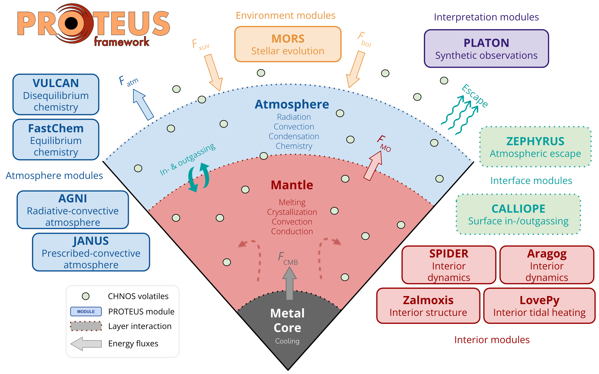

# PROTEUS submodules

Since PROTEUS is a modular simulation framework, modelling of physics is handled by various sub-modules, as shown in the module schematic below. The documentation for each submodule can be found in the sidebar.

 

       
      <b>Schematic of PROTEUS components and corresponding modules.</b>  

