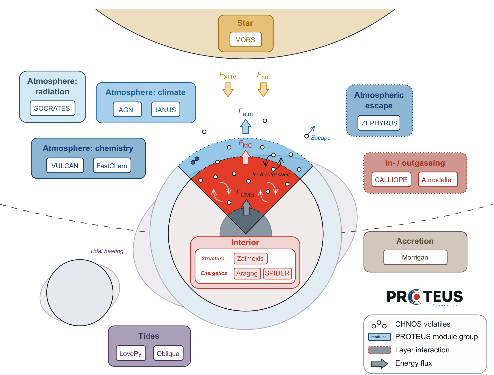

# Summary

[PROTEUS](https://github.com/FormingWorlds/PROTEUS) is an open-source framework that simulates how rocky planets, in the Solar System and beyond, evolve over geological time: from a molten magma ocean stage to a solidified mantle or a permanent magma ocean, with an atmosphere that is retained, transformed, or lost. It couples independent numerical modules, each describing one component of the planet system: interior structure and heat transport, atmospheric energy balance and chemistry, the exchange of volatile elements (such as hydrogen, carbon, and sulfur) between magma and atmosphere, atmospheric escape, stellar evolution, tidal heating, and accretion by giant impacts. A simulation advances these modules together in time, so that the state of each component feeds back on the others. Users configure a simulation through a single [TOML](https://toml.io/en/) file, run individual planets or grids of planets, and post-process the output into synthetic observations for comparison with telescope data. The framework is written in Python and is published on PyPI as `fwl-proteus`; the modules written in Julia, Fortran, and C are installed through helper scripts or the `proteus install-all` command. Documentation, tutorials, and an automated test suite accompany the code.

# Statement of need

Telescopes such as JWST now characterise the atmospheres of super-Earths and sub-Neptunes [@kempton24]. Many of these planets orbit close to their star, are strongly irradiated, and may host long-lived magma oceans. Such magma ocean conditions governed the early evolution of the terrestrial planets but are no longer observable in the Solar System [@lichtenberg23; @lichtenberg25]. Interpreting these observations requires models of how the interior, the atmosphere, and the host star shape a planet over billions of years.

The state of a planet during and after a magma ocean epoch arises from feedback between mantle melting and crystallisation, volatile dissolution in magma, outgassing, greenhouse forcing, and atmospheric escape. Steady-state models that assume a pre-existing water ocean and a chosen atmospheric composition predict that irradiated low-mass planets can remain temperate [@yang13; @way16; @selsis23; @madhusudhan23]. Models that start from a hot magma ocean, as planet formation predicts, do not recover these solutions; instead they find long-lived magma oceans beneath volatile-rich atmospheres whose composition depends on the redox state of the mantle [@hamano13; @schaefer16; @kite20a; @kite20b; @lichtenberg21a; @dorn21; @shorttle24; @nicholls25c; @boer25]. Because the molten mantle acts as a selective sink of volatiles [@suer23; @sossi23], planets with similar atmospheres today can hold bulk volatile inventories that differ by orders of magnitude.

PROTEUS is designed to trace this evolutionary history and its observable outcomes. It provides time-resolved predictions of the coupled geophysical, climatic, and observational properties of rocky planets, for individual targets and for population studies, and it is a testbed for the coupled physics itself. Its users are researchers in exoplanet astronomy, planetary science, and geophysics.

# State of the field

Several codes simulate the coupled interior-atmosphere evolution of rocky planets [@lebrun13; @hamano13; @schaefer16; @salvador17; @barnes20; @kite20a; @krissansentotton21; @lichtenberg21a; @bower22; @maurice24; @tang24; @carone25; @cherubim25; @farhat25; @sahu25], most of them building on the framework of @elkinstanton08. Most are not public, and each combines a fixed set of physical prescriptions in a single code base. VPLanet [@barnes20] is open source and modular, but describes the magma ocean and the atmosphere with parameterised box models rather than with spatially resolved solvers. Well-documented and tested open-source tools exist in neighbouring domains, for example Magrathea [@huang22] for static interior structure and MESA [@paxton11] for stellar and giant-planet evolution, but neither evolves a coupled mantle and atmosphere.

We built PROTEUS rather than extending one of the existing coupled codes because the scientific questions demand the ability to exchange model components: to compare two interior solvers or two outgassing models within otherwise identical simulations, and to add processes, such as tides or giant impacts, without rewriting the framework. To our knowledge, PROTEUS is the only open-source framework that combines a spatially resolved (1-D) description from the core-mantle boundary to the top of the atmosphere, with a mantle that tracks melt and solid phases on individual nodes, with redox-dependent outgassing of the C-H-N-O-S volatile elements resolved self-consistently in the atmospheric energy balance. It further couples atmospheric escape to the interior volatile reservoir, a time-evolving stellar spectrum and luminosity, tidal heating, orbital evolution, accretion by giant impacts, and synthetic observables computed from the evolved state. Several of its modules were adapted from pre-existing codes rather than rewritten, and each can be used standalone.

# Software design

The central design decision of PROTEUS is to externalise all physics and chemistry into modules kept in their own repositories, each with its own tests and documentation (\autoref{fig:schematic}). The framework itself holds the coupling loop, the configuration schema, the input and output layer, and the tooling for parameter grids and computer clusters. This choice trades a longer installation, more dependencies, data exchange across language boundaries, and operator-split time stepping between the modules against three benefits: modules are developed and verified independently, on the level of both the single process and the coupled system; modules with the same role can be exchanged to test the sensitivity of results to the modelling approach; and existing codes can be integrated instead of re-implemented. Most module roles also have a lightweight "dummy" implementation that runs in seconds, which keeps the coupled test suite fast and lets users isolate the effect of one physical component.

{width=95%}

Modules are grouped by role, following \autoref{fig:schematic}:

- Interior: [Zalmoxis](https://github.com/FormingWorlds/Zalmoxis) computes the interior structure and gravity profile; Aragog [@sastre26] and SPIDER [@bower18] solve the thermal evolution of the partially molten mantle in a temperature and an entropy formalism, respectively, and a boundary-layer model offers a fast alternative.
- Atmosphere: AGNI [@nicholls25a; @nicholls25b] and JANUS [@graham21; @graham22] solve the atmospheric energy balance, with radiative transfer from SOCRATES [@manners2024fast] and measured surface reflection properties [@hammond25]; VULCAN [@tsai17; @tsai21] provides disequilibrium chemistry, and FastChem [@kitzmann24] provides equilibrium chemistry within AGNI.
- Outgassing: CALLIOPE [@bower22; @shorttle24; @nicholls25a] and atmodeller [@bower25] compute the redox-, temperature-, and pressure-dependent in- and outgassing of C-H-N-O-S volatiles; LavAtmos [@vanbuchem23] optionally adds rock vapour.
- Escape: ZEPHYRUS [@postolec26a] computes energy-limited atmospheric escape.
- Star: MORS [@johnstone21] evolves the stellar luminosity and spectrum.
- Tides: LovePy [@hay19; @nicholls25c] and [Obliqua](https://github.com/FormingWorlds/Obliqua) compute tidal heating and orbital evolution.
- Accretion: [Morrigan](https://github.com/FormingWorlds/Morrigan) [@kimura25] grows the planet by giant impacts.
- Observation and inference: petitRADTRANS [@molliere19; @nasedkin24] generates synthetic transmission and emission spectra, and an inference module performs Bayesian retrievals on the evolutionary model [@nicholls26].

Simulations are configured in a validated TOML file. Large input data, such as equations of state, opacities, and stellar spectra, are downloaded and verified on first use from Zenodo and the Open Science Framework. Unit tests run on every commit and pull request through GitHub Actions, and physical tests compare the modules against analytical solutions and laboratory and observational data. This paper describes PROTEUS version XX.XX.XX; the [documentation](https://proteus-framework.org/PROTEUS/) covers installation, configuration, tutorials, and the validation of each module.

# Research impact statement

PROTEUS and its modules are the basis of a growing set of published studies by the development team and by collaborating observing programmes. Interior studies built on the framework have addressed magma ocean evolution at arbitrary redox state [@nicholls24], redox-dependent mantle melting [@sastre26], and the contraction of super-Earth interiors during crystallisation [@lichtenberg26]. Atmospheric studies cover convective shutdown in lava-planet atmospheres [@nicholls25a], the absence of a runaway greenhouse limit on lava planets [@boer25], outgassing versus escape on young planets [@postolec26a], and sulfur photochemistry as a tracer of mantle redox state [@panagiotou26]. Further work treats tidally sustained magma oceans in the L 98-59 system [@nicholls25c] and on the Hadean Earth [@vandijk26], the solidification shoreline of sub-Neptunes [@calder26], and evolutionary retrievals of exoplanet histories [@nicholls26]. PROTEUS has been used to predict the outcomes of JWST observing programmes for individual planets and for surveys, in collaboration with the observing teams [@postolec26b; @sastre26b]. More than 20 contributors have developed the framework openly on GitHub since 2018. Releases are tagged and published on PyPI, and the Forming Worlds Lab at the University of Groningen maintains the project together with the Netherlands eScience Center.

# AI usage disclosure

Generative AI tools assisted the development of PROTEUS and the preparation of this paper. We used GitHub Copilot (code completion, automated fixes, and agent-generated pull requests) and Claude Code (Anthropic; Claude Opus 4.6, Claude Sonnet 5, Claude Opus 5.5, and Claude Fable 5.1) to draft and refactor code, scaffold tests, write and revise documentation, and copy-edit this manuscript, and Gemini 3.1 Pro and Gemini 3.8 Flash (Google) to review code and documentation. The human authors reviewed, edited, and validated all AI-assisted output, made all design decisions, and are responsible for the content of the software and of this paper.

# Acknowledgements

TL acknowledges support from the Netherlands eScience Center (PROTEUS project, NLESC.OEC.2023.017), the Branco Weiss Foundation, the Alfred P. Sloan Foundation (AEThER project, G202114194), and the United States National Aeronautic and Space Administration's Nexus for Exoplanet System Science research coordination network (Alien Earths project, 80NSSC21K0593). RC and OS acknowledge support from the United Kingdom Science and Technology Facilities Council (grant numbers ST/Y509139/1 and UKRI1184).

# References
